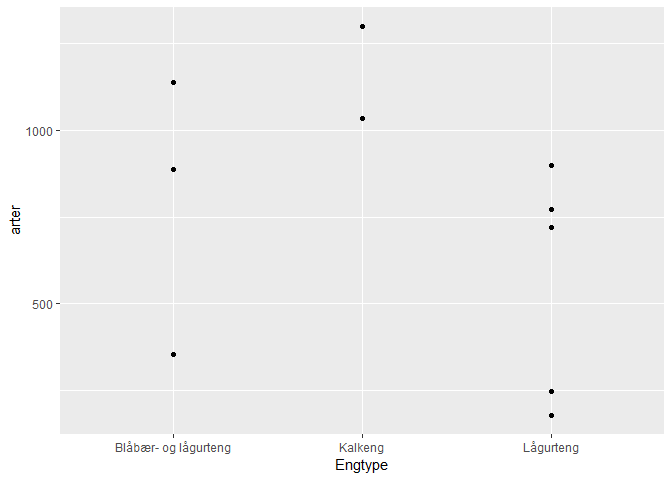
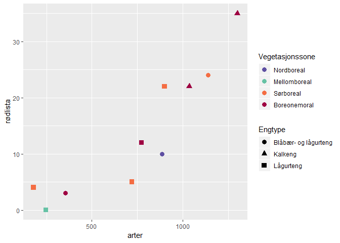
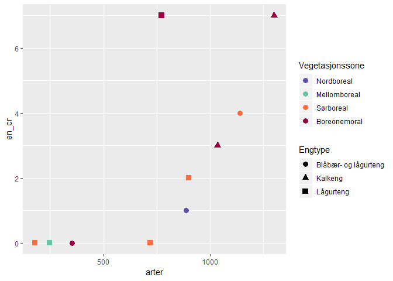
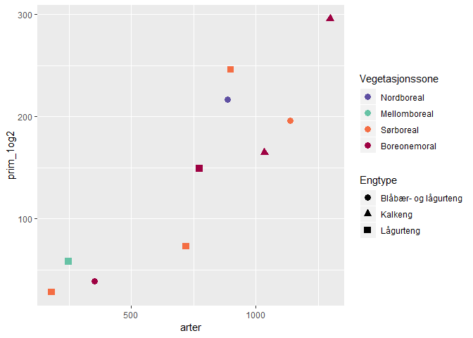
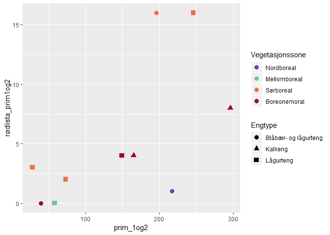
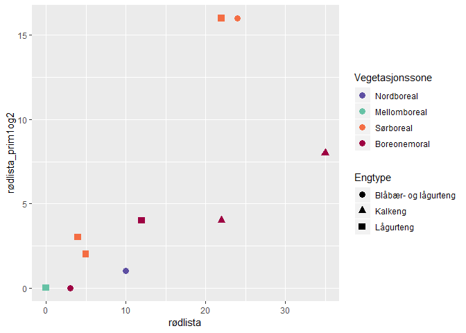
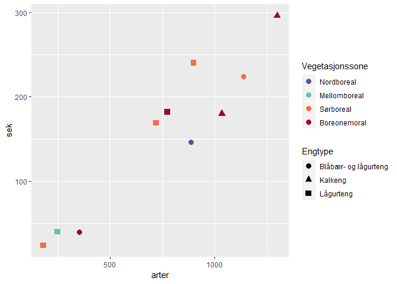
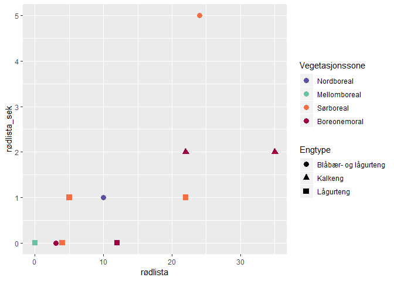

## Pakker

```r
library(readxl)
library(dplyr)
library(ggplot2)
library(scales)
```

## Data

```r
# dir("Input_data")

# Artsdata         
dat <- read_excel("Input_data/tilhørighet_insekter i slåttemark.xlsx")

dat <- dat %>%
  rename(Primær = `Tilhørighet (se kommentar)`,
         Pollinator = `Pollinator (ja (="x")/nei (tomt felt))`,
         Sekundær = `Sekundærhabitat (se kommentar)`) %>%
  mutate(Status = ifelse(is.na(Status2015), "-", Status2015),
         Status = factor(Status, levels = c("-", "DD", "NT", "VU", "EN", "CR"))
  )

# Lokalitetsdata         
dat2 <- read_excel("Input_data/Lokalitetsdata_insekter i slåttemark.xlsx") %>% 
  mutate(Vegetasjonssone = 
           factor(Vegetasjonssone, levels = c("Nordboreal", "Mellomboreal", "Sørboreal", "Boreonemoral")))
```

## Artsdata

```r
dat
```

```
## # A tibble: 2,421 x 10
##    Art   Primær Pollinator Sekundær Order Family Gruppe Status2015 X__1 
##    <chr> <chr>  <chr>      <chr>    <chr> <chr>  <chr>  <chr>      <chr>
##  1 Abax~ 4      <NA>       <NA>     Cole~ Carab~ Biller <NA>       <NA> 
##  2 Abia~ 3      x          <NA>     Hyme~ Cimbi~ Veps   <NA>       <NA> 
##  3 Abia~ 3      x          <NA>     Hyme~ Cimbi~ Veps   <NA>       <NA> 
##  4 Abro~ 3      x          <NA>     Lepi~ Noctu~ Somme~ <NA>       <NA> 
##  5 Acal~ 3      <NA>       <NA>     Hemi~ Tingi~ Nebbm~ <NA>       <NA> 
##  6 Acal~ 3      <NA>       <NA>     Hemi~ Tingi~ Nebbm~ <NA>       <NA> 
##  7 Acan~ 3      <NA>       <NA>     Hemi~ Acant~ Nebbm~ <NA>       <NA> 
##  8 Acan~ 3      <NA>       <NA>     Thys~ Phlae~ Trips  <NA>       Alle~
##  9 Acid~ 1b     x          <NA>     Dipt~ Tephr~ Tovin~ <NA>       <NA> 
## 10 Acid~ 4      <NA>       <NA>     Cole~ Staph~ Biller <NA>       <NA> 
## # ... with 2,411 more rows, and 1 more variable: Status <fct>
```

### Tabeller


```r
xtabs(~Primær + Status, dat)
```

```
##       Status
## Primær    -   DD   NT   VU   EN   CR
##     1b  198    0    9    5    5    0
##     2   129    0    4    3    1    0
##     3   878    1   16    8    4    1
##     4  1102    3   19    5    5    1
##     5    23    0    0    1    0    0
```


```r
xtabs(~addNA(Sekundær) + Status, dat)
```

```
##                Status
## addNA(Sekundær)    -   DD   NT   VU   EN   CR
##            A     146    0    3    0    0    0
##            B       1    0    0    0    0    0
##            F       6    0    0    0    0    0
##            F, A    0    0    0    1    0    0
##            L      55    0    0    0    0    0
##            M       6    0    0    0    0    0
##            S      32    0    1    1    0    0
##            V      82    0    3    2    2    0
##            <NA> 2002    4   41   18   13    2
```


## Lokalitetsdata


```r
# dat2

dat2 <- dat2 %>% 
  left_join(dat %>% select(Art, Primær, Sekundær, Status))
```

```
## Joining, by = "Art"
```

## Data på lokalitetsnivå  

```r
dat_meta <- dat2 %>%
  group_by(Lokalitet, Vegetasjonssone, Engtype, Felleoppsett) %>%
  summarise(arter = n(), 
            rødlista = sum(Status %in% c("NT", "VU", "EN", "CR")),
            en_cr = sum(Status %in% c("EN", "CR")),
            prim_1og2 = sum(Primær %in% c("1a","1b","2")),
            prim_1b = sum(Primær %in% c("1a","1b")),
            prim_2 = sum(Primær %in% c("2")),
            prim_3 = sum(Primær %in% c("3")),
            prim_4 = sum(Primær %in% c("4","5")),
            rødlista_prim1og2 = sum(Status %in% c("NT", "VU", "EN", "CR") & Primær %in% c("1a","1b","2")),
            sek = sum(!is.na(Sekundær)),
            rødlista_sek = sum(Status %in% c("NT", "VU", "EN", "CR") & !is.na(Sekundær))
  )
```

### Tabeller

```r
xtabs(~Vegetasjonssone + Engtype, dat_meta)
```

```
##                Engtype
## Vegetasjonssone Blåbær- og lågurteng Kalkeng Lågurteng
##    Nordboreal                      1       0         0
##    Mellomboreal                    0       0         1
##    Sørboreal                       1       0         3
##    Boreonemoral                    1       2         1
```

### Plott

```r
ggplot(dat_meta, aes(Engtype, arter)) +
  geom_point()
```

<!-- -->

### Rødlistearter vs totalt antall arter

```r
cols <- RColorBrewer::brewer.pal(11, "Spectral")[c(1,3,9,11)] %>% rev()

ggplot(dat_meta, aes(arter, rødlista, color = Vegetasjonssone, shape = Engtype)) +
  geom_point(size = rel(3)) +
  scale_color_manual(values = cols)
```

<!-- -->

```r
ggplot(dat_meta, aes(arter, en_cr, color = Vegetasjonssone, shape = Engtype)) +
  geom_point(size = rel(3)) +
  scale_color_manual(values = cols)
```

<!-- -->

### Engavhengige arter vs totalt antall arter  

```r
ggplot(dat_meta, aes(arter, prim_1og2, color = Vegetasjonssone, shape = Engtype)) +
  geom_point(size = rel(3)) +
  scale_color_manual(values = cols)
```

<!-- -->

### Engavhengige rødlistearter vs totalt engavhengige arter  

```r
ggplot(dat_meta, aes(prim_1og2, rødlista_prim1og2, color = Vegetasjonssone, shape = Engtype)) +
  geom_point(size = rel(3)) +
  scale_color_manual(values = cols)
```

<!-- -->

### Engavhengige rødlistearter vs totalt rødlistearter  

```r
ggplot(dat_meta, aes(rødlista, rødlista_prim1og2, color = Vegetasjonssone, shape = Engtype)) +
  geom_point(size = rel(3)) +
  scale_color_manual(values = cols)
```

<!-- -->

### Arter med sekundærkrav vs totalt antall arter  

```r
ggplot(dat_meta, aes(arter, sek, color = Vegetasjonssone, shape = Engtype)) +
  geom_point(size = rel(3)) +
  scale_color_manual(values = cols)
```

<!-- -->

### Rødlistearter med sekundærkrav vs totalt rødlistearter  

```r
ggplot(dat_meta, aes(rødlista, rødlista_sek, color = Vegetasjonssone, shape = Engtype)) +
  geom_point(size = rel(3)) +
  scale_color_manual(values = cols)
```

<!-- -->

