## Pakker

```r
library(readxl)
library(dplyr)
library(ggplot2)
library(scales)
library(treemapify)
```

## Data

```r
# dir("Input_data")

# Artsdata         
dat <- read_excel("Input_data/tilhørighet_insekter i slåttemark.xlsx")

dat <- dat %>%
  rename(Primær = `Tilhørighet (se kommentar)`,
         Pollinator = `Pollinator (ja (="x")/nei (tomt felt))`,
         Sekundær = `Sekundærhabitat (se kommentar)`) %>%
  mutate(Status = ifelse(is.na(Status2015), "-", Status2015),
         Status = factor(Status, levels = c("-", "DD", "NT", "VU", "EN", "CR"))
  )

# Lokalitetsdata         
dat2 <- read_excel("Input_data/Lokalitetsdata_insekter i slåttemark.xlsx") %>% 
  mutate(Vegetasjonssone = 
           factor(Vegetasjonssone, levels = c("Nordboreal", "Mellomboreal", "Sørboreal", "Boreonemoral")))
```

## Artsdata

```r
dat
```

<div data-pagedtable="false">
  <script data-pagedtable-source type="application/json">
{"columns":[{"label":["Art"],"name":[1],"type":["chr"],"align":["left"]},{"label":["Primær"],"name":[2],"type":["chr"],"align":["left"]},{"label":["Pollinator"],"name":[3],"type":["chr"],"align":["left"]},{"label":["Sekundær"],"name":[4],"type":["chr"],"align":["left"]},{"label":["Order"],"name":[5],"type":["chr"],"align":["left"]},{"label":["Family"],"name":[6],"type":["chr"],"align":["left"]},{"label":["Gruppe"],"name":[7],"type":["chr"],"align":["left"]},{"label":["Status2015"],"name":[8],"type":["chr"],"align":["left"]},{"label":["X__1"],"name":[9],"type":["chr"],"align":["left"]},{"label":["Status"],"name":[10],"type":["fctr"],"align":["left"]}],"data":[{"1":"Abax parallelepipedus","2":"4","3":"NA","4":"NA","5":"Coleoptera","6":"Carabidae","7":"Biller","8":"NA","9":"NA","10":"-"},{"1":"Abia aenea","2":"3","3":"x","4":"NA","5":"Hymenoptera","6":"Cimbicidae","7":"Veps","8":"NA","9":"NA","10":"-"},{"1":"Abia fasciata","2":"3","3":"x","4":"NA","5":"Hymenoptera","6":"Cimbicidae","7":"Veps","8":"NA","9":"NA","10":"-"},{"1":"Abrostola tripartita","2":"3","3":"x","4":"NA","5":"Lepidoptera","6":"Noctuidae","7":"Sommerfugler","8":"NA","9":"NA","10":"-"},{"1":"Acalypta carinata","2":"3","3":"NA","4":"NA","5":"Hemiptera","6":"Tingidae","7":"Nebbmunner","8":"NA","9":"NA","10":"-"},{"1":"Acalypta parvula","2":"3","3":"NA","4":"NA","5":"Hemiptera","6":"Tingidae","7":"Nebbmunner","8":"NA","9":"NA","10":"-"},{"1":"Acanthosoma haemorrhoidale","2":"3","3":"NA","4":"NA","5":"Hemiptera","6":"Acanthosomatidae","7":"Nebbmunner","8":"NA","9":"NA","10":"-"},{"1":"Acanthothrips nodicornis","2":"3","3":"NA","4":"NA","5":"Thysanoptera","6":"Phlaeothripidae","7":"Trips","8":"NA","9":"Alle trips er ukritisk gitt kategori 3, selv om noen av dem kanskje burde hatt 1 eller 2. Avventer tilbakemelding fra Kobro, som 14.V.2019 sa han skulle ta en titt på det, men siden har jeg ikke hørt noe. Purret ham 22.VIII.2019.","10":"-"},{"1":"Acidia cognata","2":"1b","3":"x","4":"NA","5":"Diptera","6":"Tephritidae","7":"Tovinger","8":"NA","9":"NA","10":"-"},{"1":"Acidota crenata","2":"4","3":"NA","4":"NA","5":"Coleoptera","6":"Staphylinidae","7":"Biller","8":"NA","9":"NA","10":"-"},{"1":"Acinia corniculata","2":"1b","3":"x","4":"NA","5":"Diptera","6":"Tephritidae","7":"Tovinger","8":"NA","9":"NA","10":"-"},{"1":"Acleris aspersana","2":"3","3":"NA","4":"NA","5":"Lepidoptera","6":"Tortricidae","7":"Sommerfugler","8":"NA","9":"NA","10":"-"},{"1":"Acleris effractana","2":"4","3":"NA","4":"NA","5":"Lepidoptera","6":"Tortricidae","7":"Sommerfugler","8":"NA","9":"NA","10":"-"},{"1":"Acleris holmiana","2":"4","3":"NA","4":"NA","5":"Lepidoptera","6":"Tortricidae","7":"Sommerfugler","8":"NA","9":"NA","10":"-"},{"1":"Acrocera orbiculus","2":"3","3":"NA","4":"NA","5":"Diptera","6":"Acroceridae","7":"Tovinger","8":"NA","9":"NA","10":"-"},{"1":"Acronicta rumicis","2":"3","3":"NA","4":"NA","5":"Lepidoptera","6":"Noctuidae","7":"Sommerfugler","8":"NA","9":"NA","10":"-"},{"1":"Acrostiba borealis","2":"4","3":"NA","4":"NA","5":"Coleoptera","6":"Staphylinidae","7":"Biller","8":"NA","9":"NA","10":"-"},{"1":"Acrotona fungi","2":"4","3":"NA","4":"NA","5":"Coleoptera","6":"Staphylinidae","7":"Biller","8":"NA","9":"NA","10":"-"},{"1":"Acrotona sylvicola","2":"4","3":"NA","4":"NA","5":"Coleoptera","6":"Staphylinidae","7":"Biller","8":"NA","9":"NA","10":"-"},{"1":"Acrotrichis cognata","2":"4","3":"NA","4":"NA","5":"Coleoptera","6":"Ptiliidae","7":"Biller","8":"NA","9":"NA","10":"-"},{"1":"Acrotrichis dispar","2":"4","3":"NA","4":"NA","5":"Coleoptera","6":"Ptiliidae","7":"Biller","8":"NA","9":"NA","10":"-"},{"1":"Acrotrichis sitkaensis","2":"4","3":"NA","4":"NA","5":"Coleoptera","6":"Ptiliidae","7":"Biller","8":"NA","9":"NA","10":"-"},{"1":"Actinotia polyodon","2":"1b","3":"x","4":"NA","5":"Lepidoptera","6":"Noctuidae","7":"Sommerfugler","8":"NA","9":"NA","10":"-"},{"1":"Adalia bipunctata","2":"4","3":"NA","4":"NA","5":"Coleoptera","6":"Coccinellidae","7":"Biller","8":"NA","9":"NA","10":"-"},{"1":"Adalia decempunctata","2":"4","3":"NA","4":"NA","5":"Coleoptera","6":"Coccinellidae","7":"Biller","8":"NA","9":"NA","10":"-"},{"1":"Adomerus biguttatus","2":"4","3":"NA","4":"NA","5":"Hemiptera","6":"Cydnidae","7":"Nebbmunner","8":"NA","9":"NA","10":"-"},{"1":"Adscita statices","2":"1b","3":"x","4":"NA","5":"Lepidoptera","6":"Zygaenidae","7":"Sommerfugler","8":"NA","9":"NA","10":"-"},{"1":"Aelia acuminata","2":"3","3":"NA","4":"NA","5":"Hemiptera","6":"Pentatomidae","7":"Nebbmunner","8":"NA","9":"NA","10":"-"},{"1":"Aenigmatias lubbockii","2":"4","3":"x","4":"NA","5":"Diptera","6":"Phoridae","7":"Tovinger","8":"NA","9":"NA","10":"-"},{"1":"Aeolothrips ericae","2":"3","3":"NA","4":"NA","5":"Thysanoptera","6":"Aeolothripidae","7":"Trips","8":"NA","9":"Alle trips er ukritisk gitt kategori 3, selv om noen av dem kanskje burde hatt 1 eller 2. Avventer tilbakemelding fra Kobro, som 14.V.2019 sa han skulle ta en titt på det, men siden har jeg ikke hørt noe. Purret ham 22.VIII.2019.","10":"-"},{"1":"Aeolothrips fasciatus","2":"3","3":"NA","4":"NA","5":"Thysanoptera","6":"Aeolothripidae","7":"Trips","8":"NA","9":"Alle trips er ukritisk gitt kategori 3, selv om noen av dem kanskje burde hatt 1 eller 2. Avventer tilbakemelding fra Kobro, som 14.V.2019 sa han skulle ta en titt på det, men siden har jeg ikke hørt noe. Purret ham 22.VIII.2019.","10":"-"},{"1":"Aeolothrips melaleucus","2":"3","3":"NA","4":"NA","5":"Thysanoptera","6":"Aeolothripidae","7":"Trips","8":"NA","9":"Alle trips er ukritisk gitt kategori 3, selv om noen av dem kanskje burde hatt 1 eller 2. Avventer tilbakemelding fra Kobro, som 14.V.2019 sa han skulle ta en titt på det, men siden har jeg ikke hørt noe. Purret ham 22.VIII.2019.","10":"-"},{"1":"Aeolothrips versicolor","2":"3","3":"NA","4":"NA","5":"Thysanoptera","6":"Aeolothripidae","7":"Trips","8":"NA","9":"Alle trips er ukritisk gitt kategori 3, selv om noen av dem kanskje burde hatt 1 eller 2. Avventer tilbakemelding fra Kobro, som 14.V.2019 sa han skulle ta en titt på det, men siden har jeg ikke hørt noe. Purret ham 22.VIII.2019.","10":"-"},{"1":"Aeolothrips vittatus","2":"3","3":"NA","4":"NA","5":"Thysanoptera","6":"Aeolothripidae","7":"Trips","8":"NA","9":"Alle trips er ukritisk gitt kategori 3, selv om noen av dem kanskje burde hatt 1 eller 2. Avventer tilbakemelding fra Kobro, som 14.V.2019 sa han skulle ta en titt på det, men siden har jeg ikke hørt noe. Purret ham 22.VIII.2019.","10":"-"},{"1":"Agabus bipustulatus","2":"4","3":"NA","4":"NA","5":"Coleoptera","6":"Dytiscidae","7":"Biller","8":"NA","9":"NA","10":"-"},{"1":"Agallia brachyptera","2":"3","3":"NA","4":"NA","5":"Hemiptera","6":"Cicadellidae","7":"Nebbmunner","8":"NA","9":"NA","10":"-"},{"1":"Agapetus ochripes","2":"4","3":"NA","4":"NA","5":"Trichoptera","6":"Glossosomatidae","7":"Døgnfluer, øyenstikkere, steinfluer, vårfluer","8":"NA","9":"NA","10":"-"},{"1":"Agathidium badium","2":"4","3":"NA","4":"NA","5":"Coleoptera","6":"Leiodidae","7":"Biller","8":"NA","9":"NA","10":"-"},{"1":"Agathidium rotundatum","2":"4","3":"NA","4":"NA","5":"Coleoptera","6":"Leiodidae","7":"Biller","8":"NA","9":"NA","10":"-"},{"1":"Agathomyia antennata","2":"4","3":"NA","4":"NA","5":"Diptera","6":"Platypezidae","7":"Tovinger","8":"NA","9":"NA","10":"-"},{"1":"Agenioideus cinctellus","2":"3","3":"NA","4":"NA","5":"Hymenoptera","6":"Pompilidae","7":"Veps","8":"NA","9":"NA","10":"-"},{"1":"Aglais io","2":"3","3":"x","4":"NA","5":"Lepidoptera","6":"Nymphalidae","7":"Sommerfugler","8":"NA","9":"NA","10":"-"},{"1":"Aglais urticae","2":"3","3":"x","4":"NA","5":"Lepidoptera","6":"Nymphalidae","7":"Sommerfugler","8":"NA","9":"NA","10":"-"},{"1":"Aglaostigma aucupariae","2":"1b","3":"NA","4":"NA","5":"Hymenoptera","6":"Tenthredinidae","7":"Veps","8":"NA","9":"NA","10":"-"},{"1":"Aglaostigma fulvipes","2":"1b","3":"NA","4":"NA","5":"Hymenoptera","6":"Tenthredinidae","7":"Veps","8":"NA","9":"NA","10":"-"},{"1":"Agriotes obscurus","2":"3","3":"NA","4":"A","5":"Coleoptera","6":"Elateridae","7":"Biller","8":"NA","9":"NA","10":"-"},{"1":"Agriphila inquinatella","2":"3","3":"NA","4":"NA","5":"Lepidoptera","6":"Crambidae","7":"Sommerfugler","8":"NA","9":"NA","10":"-"},{"1":"Agrochola litura","2":"4","3":"NA","4":"NA","5":"Lepidoptera","6":"Noctuidae","7":"Sommerfugler","8":"NA","9":"NA","10":"-"},{"1":"Agrotis exclamationis","2":"3","3":"x","4":"NA","5":"Lepidoptera","6":"Noctuidae","7":"Sommerfugler","8":"NA","9":"NA","10":"-"},{"1":"Agrypnia czerskyi","2":"4","3":"NA","4":"NA","5":"Trichoptera","6":"Phryganeidae","7":"Døgnfluer, øyenstikkere, steinfluer, vårfluer","8":"NA","9":"NA","10":"-"},{"1":"Agrypnus murinus","2":"3","3":"NA","4":"A","5":"Coleoptera","6":"Elateridae","7":"Biller","8":"NA","9":"NA","10":"-"},{"1":"Aguriahana stellulata","2":"4","3":"NA","4":"NA","5":"Hemiptera","6":"Cicadellidae","7":"Nebbmunner","8":"NA","9":"NA","10":"-"},{"1":"Alebra albostriella","2":"4","3":"NA","4":"NA","5":"Hemiptera","6":"Cicadellidae","7":"Nebbmunner","8":"NA","9":"NA","10":"-"},{"1":"Alebra wahlbergi","2":"4","3":"NA","4":"NA","5":"Hemiptera","6":"Cicadellidae","7":"Nebbmunner","8":"NA","9":"NA","10":"-"},{"1":"Aleochara bilineata","2":"4","3":"NA","4":"NA","5":"Coleoptera","6":"Staphylinidae","7":"Biller","8":"NA","9":"NA","10":"-"},{"1":"Aleochara brevipennis","2":"3","3":"NA","4":"M","5":"Coleoptera","6":"Staphylinidae","7":"Biller","8":"NA","9":"NA","10":"-"},{"1":"Aleochara curtula","2":"4","3":"NA","4":"NA","5":"Coleoptera","6":"Staphylinidae","7":"Biller","8":"NA","9":"NA","10":"-"},{"1":"Aleochara fumata","2":"4","3":"NA","4":"NA","5":"Coleoptera","6":"Staphylinidae","7":"Biller","8":"NA","9":"NA","10":"-"},{"1":"Aleochara lanuginosa","2":"4","3":"NA","4":"NA","5":"Coleoptera","6":"Staphylinidae","7":"Biller","8":"NA","9":"NA","10":"-"},{"1":"Aleochara villosa","2":"4","3":"NA","4":"NA","5":"Coleoptera","6":"Staphylinidae","7":"Biller","8":"NA","9":"NA","10":"-"},{"1":"Aleuropteryx loewii","2":"4","3":"NA","4":"NA","5":"Neuroptera","6":"Coniopterygidae","7":"Nebbfluer, kamelhalsfluer, mudderfluer, nettvinger","8":"NA","9":"NA","10":"-"},{"1":"Allantus basalis","2":"4","3":"NA","4":"NA","5":"Hymenoptera","6":"Tenthredinidae","7":"Veps","8":"NA","9":"NA","10":"-"},{"1":"Allantus caeatus","2":"3","3":"NA","4":"NA","5":"Hymenoptera","6":"Tenthredinidae","7":"Veps","8":"NA","9":"NA","10":"-"},{"1":"Allantus cinctus","2":"4","3":"NA","4":"NA","5":"Hymenoptera","6":"Tenthredinidae","7":"Veps","8":"NA","9":"NA","10":"-"},{"1":"Allantus cingulatus","2":"4","3":"NA","4":"NA","5":"Hymenoptera","6":"Tenthredinidae","7":"Veps","8":"NA","9":"NA","10":"-"},{"1":"Allantus rufocinctus","2":"4","3":"NA","4":"NA","5":"Hymenoptera","6":"Tenthredinidae","7":"Veps","8":"NA","9":"NA","10":"-"},{"1":"Allantus truncatus","2":"3","3":"NA","4":"NA","5":"Hymenoptera","6":"Tenthredinidae","7":"Veps","8":"NA","9":"NA","10":"-"},{"1":"Allophyes oxyacanthae","2":"4","3":"NA","4":"NA","5":"Lepidoptera","6":"Noctuidae","7":"Sommerfugler","8":"NA","9":"NA","10":"-"},{"1":"Allygidius commutatus","2":"4","3":"NA","4":"NA","5":"Hemiptera","6":"Cicadellidae","7":"Nebbmunner","8":"NA","9":"NA","10":"-"},{"1":"Allygus communis","2":"4","3":"NA","4":"NA","5":"Hemiptera","6":"Cicadellidae","7":"Nebbmunner","8":"NA","9":"NA","10":"-"},{"1":"Allygus mixtus","2":"4","3":"NA","4":"NA","5":"Hemiptera","6":"Cicadellidae","7":"Nebbmunner","8":"NA","9":"NA","10":"-"},{"1":"Alnetoidia alneti","2":"4","3":"NA","4":"NA","5":"Hemiptera","6":"Cicadellidae","7":"Nebbmunner","8":"NA","9":"NA","10":"-"},{"1":"Aloconota gregaria","2":"4","3":"NA","4":"NA","5":"Coleoptera","6":"Staphylinidae","7":"Biller","8":"NA","9":"NA","10":"-"},{"1":"Alosterna tabacicolor","2":"2","3":"x","4":"V","5":"Coleoptera","6":"Cerambycidae","7":"Biller","8":"NA","9":"NA","10":"-"},{"1":"Altica engstromi","2":"1b","3":"NA","4":"NA","5":"Coleoptera","6":"Chrysomelidae","7":"Biller","8":"NA","9":"NA","10":"-"},{"1":"Amara aenea","2":"3","3":"NA","4":"A","5":"Coleoptera","6":"Carabidae","7":"Biller","8":"NA","9":"NA","10":"-"},{"1":"Amara aulica","2":"3","3":"NA","4":"A","5":"Coleoptera","6":"Carabidae","7":"Biller","8":"NA","9":"NA","10":"-"},{"1":"Amara bifrons","2":"3","3":"NA","4":"A","5":"Coleoptera","6":"Carabidae","7":"Biller","8":"NA","9":"NA","10":"-"},{"1":"Amara communis","2":"3","3":"NA","4":"A","5":"Coleoptera","6":"Carabidae","7":"Biller","8":"NA","9":"NA","10":"-"},{"1":"Amara convexior","2":"3","3":"NA","4":"A","5":"Coleoptera","6":"Carabidae","7":"Biller","8":"NA","9":"NA","10":"-"},{"1":"Amara eurynota","2":"3","3":"NA","4":"A","5":"Coleoptera","6":"Carabidae","7":"Biller","8":"NA","9":"NA","10":"-"},{"1":"Amara familiaris","2":"3","3":"NA","4":"A","5":"Coleoptera","6":"Carabidae","7":"Biller","8":"NA","9":"NA","10":"-"},{"1":"Amara lunicollis","2":"3","3":"NA","4":"A","5":"Coleoptera","6":"Carabidae","7":"Biller","8":"NA","9":"NA","10":"-"},{"1":"Amara nitida","2":"3","3":"NA","4":"A","5":"Coleoptera","6":"Carabidae","7":"Biller","8":"NA","9":"NA","10":"-"},{"1":"Amara ovata","2":"3","3":"NA","4":"A","5":"Coleoptera","6":"Carabidae","7":"Biller","8":"NA","9":"NA","10":"-"},{"1":"Amara plebeja","2":"3","3":"NA","4":"A","5":"Coleoptera","6":"Carabidae","7":"Biller","8":"NA","9":"NA","10":"-"},{"1":"Amauronematus schlueteri","2":"4","3":"NA","4":"NA","5":"Hymenoptera","6":"Tenthredinidae","7":"Veps","8":"NA","9":"NA","10":"-"},{"1":"Amauronematus variator","2":"4","3":"NA","4":"NA","5":"Hymenoptera","6":"Tenthredinidae","7":"Veps","8":"NA","9":"NA","10":"-"},{"1":"Ametastegia carpini","2":"1b","3":"NA","4":"NA","5":"Hymenoptera","6":"Tenthredinidae","7":"Veps","8":"NA","9":"NA","10":"-"},{"1":"Ametastegia equiseti","2":"3","3":"NA","4":"NA","5":"Hymenoptera","6":"Tenthredinidae","7":"Veps","8":"NA","9":"NA","10":"-"},{"1":"Ametastegia glabrata","2":"3","3":"NA","4":"NA","5":"Hymenoptera","6":"Tenthredinidae","7":"Veps","8":"NA","9":"NA","10":"-"},{"1":"Ametastegia pallipes","2":"1b","3":"NA","4":"NA","5":"Hymenoptera","6":"Tenthredinidae","7":"Veps","8":"NA","9":"NA","10":"-"},{"1":"Ametastegia tenera","2":"1b","3":"NA","4":"NA","5":"Hymenoptera","6":"Tenthredinidae","7":"Veps","8":"NA","9":"NA","10":"-"},{"1":"Amischa analis","2":"3","3":"NA","4":"A","5":"Coleoptera","6":"Staphylinidae","7":"Biller","8":"NA","9":"NA","10":"-"},{"1":"Amischa bifoveolata","2":"3","3":"NA","4":"A","5":"Coleoptera","6":"Staphylinidae","7":"Biller","8":"NA","9":"NA","10":"-"},{"1":"Amischa nigrofusca","2":"3","3":"NA","4":"A","5":"Coleoptera","6":"Staphylinidae","7":"Biller","8":"NA","9":"NA","10":"-"},{"1":"Ampedus balteatus","2":"4","3":"NA","4":"NA","5":"Coleoptera","6":"Elateridae","7":"Biller","8":"NA","9":"NA","10":"-"},{"1":"Ampedus nigrinus","2":"4","3":"NA","4":"NA","5":"Coleoptera","6":"Elateridae","7":"Biller","8":"NA","9":"NA","10":"-"},{"1":"Ampedus pomorum","2":"4","3":"NA","4":"NA","5":"Coleoptera","6":"Elateridae","7":"Biller","8":"NA","9":"NA","10":"-"},{"1":"Ampedus tristis","2":"4","3":"NA","4":"NA","5":"Coleoptera","6":"Elateridae","7":"Biller","8":"NA","9":"NA","10":"-"},{"1":"Amphigerontia bifasciata","2":"4","3":"NA","4":"NA","5":"Psocodea","6":"Psocidae","7":"Støvlus","8":"NA","9":"NA","10":"-"},{"1":"Amphinemura standfussi","2":"4","3":"NA","4":"NA","5":"Plecoptera","6":"Nemouridae","7":"Døgnfluer, øyenstikkere, steinfluer, vårfluer","8":"NA","9":"NA","10":"-"},{"1":"Amphinemura sulcicollis","2":"4","3":"NA","4":"NA","5":"Plecoptera","6":"Nemouridae","7":"Døgnfluer, øyenstikkere, steinfluer, vårfluer","8":"NA","9":"NA","10":"-"},{"1":"Amphipogon flavum","2":"3","3":"x","4":"NA","5":"Diptera","6":"Piophilidae","7":"Tovinger","8":"NA","9":"NA","10":"-"},{"1":"Amphipyra pyramidea","2":"4","3":"x","4":"NA","5":"Lepidoptera","6":"Noctuidae","7":"Sommerfugler","8":"NA","9":"NA","10":"-"},{"1":"Anacaena globulus","2":"4","3":"NA","4":"NA","5":"Coleoptera","6":"Hydrophilidae","7":"Biller","8":"NA","9":"NA","10":"-"},{"1":"Anacaena lutescens","2":"4","3":"NA","4":"NA","5":"Coleoptera","6":"Hydrophilidae","7":"Biller","8":"NA","9":"NA","10":"-"},{"1":"Anaceratagallia ribauti","2":"4","3":"NA","4":"NA","5":"Hemiptera","6":"Cicadellidae","7":"Nebbmunner","8":"NA","9":"NA","10":"-"},{"1":"Anaceratagallia venosa","2":"3","3":"NA","4":"NA","5":"Hemiptera","6":"Cicadellidae","7":"Nebbmunner","8":"NA","9":"NA","10":"-"},{"1":"Anania funebris","2":"1b","3":"x","4":"NA","5":"Lepidoptera","6":"Crambidae","7":"Sommerfugler","8":"NA","9":"NA","10":"-"},{"1":"Anaphothrips obscurus","2":"3","3":"NA","4":"NA","5":"Thysanoptera","6":"Thripidae","7":"Trips","8":"NA","9":"Alle trips er ukritisk gitt kategori 3, selv om noen av dem kanskje burde hatt 1 eller 2. Avventer tilbakemelding fra Kobro, som 14.V.2019 sa han skulle ta en titt på det, men siden har jeg ikke hørt noe. Purret ham 22.VIII.2019.","10":"-"},{"1":"Anasimyia lineata","2":"2","3":"x","4":"F","5":"Diptera","6":"Syrphidae","7":"Tovinger","8":"NA","9":"NA","10":"-"},{"1":"Anaspis bohemica","2":"3","3":"x","4":"V","5":"Coleoptera","6":"Scraptiidae","7":"Biller","8":"NA","9":"NA","10":"-"},{"1":"Anaspis flava","2":"3","3":"x","4":"V","5":"Coleoptera","6":"Scraptiidae","7":"Biller","8":"NA","9":"NA","10":"-"},{"1":"Anaspis frontalis","2":"3","3":"x","4":"V","5":"Coleoptera","6":"Scraptiidae","7":"Biller","8":"NA","9":"NA","10":"-"},{"1":"Anaspis marginicollis","2":"3","3":"x","4":"V","5":"Coleoptera","6":"Scraptiidae","7":"Biller","8":"NA","9":"NA","10":"-"},{"1":"Anaspis rufilabris","2":"3","3":"x","4":"V","5":"Coleoptera","6":"Scraptiidae","7":"Biller","8":"NA","9":"NA","10":"-"},{"1":"Anaspis thoracica","2":"3","3":"x","4":"V","5":"Coleoptera","6":"Scraptiidae","7":"Biller","8":"NA","9":"NA","10":"-"},{"1":"Anastrangalia sanguinolenta","2":"2","3":"x","4":"V","5":"Coleoptera","6":"Cerambycidae","7":"Biller","8":"NA","9":"NA","10":"-"},{"1":"Anatella flavomaculata","2":"4","3":"NA","4":"NA","5":"Diptera","6":"Mycetophilidae","7":"Tovinger","8":"NA","9":"NA","10":"-"},{"1":"Ancistrocerus nigricornis","2":"3","3":"x","4":"NA","5":"Hymenoptera","6":"Vespidae","7":"Veps","8":"NA","9":"NA","10":"-"},{"1":"Ancistrocerus parietum","2":"3","3":"x","4":"NA","5":"Hymenoptera","6":"Vespidae","7":"Veps","8":"NA","9":"NA","10":"-"},{"1":"Ancistrocerus quadratus","2":"3","3":"x","4":"NA","5":"Hymenoptera","6":"Vespidae","7":"Veps","8":"NA","9":"NA","10":"-"},{"1":"Ancistrocerus trifasciatus","2":"3","3":"x","4":"NA","5":"Hymenoptera","6":"Vespidae","7":"Veps","8":"NA","9":"NA","10":"-"},{"1":"Ancylis badiana","2":"1b","3":"NA","4":"NA","5":"Lepidoptera","6":"Tortricidae","7":"Sommerfugler","8":"NA","9":"NA","10":"-"},{"1":"Andrena bicolor","2":"2","3":"x","4":"S","5":"Hymenoptera","6":"Andrenidae","7":"Veps","8":"NA","9":"NA","10":"-"},{"1":"Andrena cineraria","2":"2","3":"x","4":"S","5":"Hymenoptera","6":"Andrenidae","7":"Veps","8":"NA","9":"NA","10":"-"},{"1":"Andrena fucata","2":"2","3":"x","4":"S","5":"Hymenoptera","6":"Andrenidae","7":"Veps","8":"NA","9":"NA","10":"-"},{"1":"Andrena fulvago","2":"2","3":"x","4":"S","5":"Hymenoptera","6":"Andrenidae","7":"Veps","8":"VU","9":"NA","10":"VU"},{"1":"Andrena haemorrhoa","2":"2","3":"x","4":"S","5":"Hymenoptera","6":"Andrenidae","7":"Veps","8":"NA","9":"NA","10":"-"},{"1":"Andrena helvola","2":"2","3":"x","4":"S","5":"Hymenoptera","6":"Andrenidae","7":"Veps","8":"NA","9":"NA","10":"-"},{"1":"Andrena lathyri","2":"2","3":"x","4":"S","5":"Hymenoptera","6":"Andrenidae","7":"Veps","8":"NA","9":"NA","10":"-"},{"1":"Andrena minutula","2":"2","3":"x","4":"S","5":"Hymenoptera","6":"Andrenidae","7":"Veps","8":"NA","9":"NA","10":"-"},{"1":"Andrena ruficrus","2":"2","3":"x","4":"S","5":"Hymenoptera","6":"Andrenidae","7":"Veps","8":"NA","9":"NA","10":"-"},{"1":"Andrena semilaevis","2":"2","3":"x","4":"S","5":"Hymenoptera","6":"Andrenidae","7":"Veps","8":"NA","9":"NA","10":"-"},{"1":"Andrena subopaca","2":"2","3":"x","4":"S","5":"Hymenoptera","6":"Andrenidae","7":"Veps","8":"NA","9":"NA","10":"-"},{"1":"Andrena wilkella","2":"2","3":"x","4":"S","5":"Hymenoptera","6":"Andrenidae","7":"Veps","8":"NA","9":"NA","10":"-"},{"1":"Aneugmenus temporalis","2":"4","3":"NA","4":"NA","5":"Hymenoptera","6":"Tenthredinidae","7":"Veps","8":"NA","9":"NA","10":"-"},{"1":"Anisandrus dispar","2":"4","3":"NA","4":"NA","5":"Coleoptera","6":"Curculionidae","7":"Biller","8":"NA","9":"NA","10":"-"},{"1":"Anobium punctatum","2":"4","3":"NA","4":"NA","5":"Coleoptera","6":"Ptinidae","7":"Biller","8":"NA","9":"NA","10":"-"},{"1":"Anomoia permunda","2":"1b","3":"x","4":"NA","5":"Diptera","6":"Tephritidae","7":"Tovinger","8":"NA","9":"NA","10":"-"},{"1":"Anoplius nigerrimus","2":"3","3":"NA","4":"NA","5":"Hymenoptera","6":"Pompilidae","7":"Veps","8":"NA","9":"NA","10":"-"},{"1":"Anoplius viaticus","2":"3","3":"NA","4":"NA","5":"Hymenoptera","6":"Pompilidae","7":"Veps","8":"NA","9":"NA","10":"-"},{"1":"Anoplotrupes stercorosus","2":"4","3":"NA","4":"NA","5":"Coleoptera","6":"Geotrupidae","7":"Biller","8":"NA","9":"NA","10":"-"},{"1":"Anoplus plantaris","2":"4","3":"NA","4":"NA","5":"Coleoptera","6":"Curculionidae","7":"Biller","8":"NA","9":"NA","10":"-"},{"1":"Anoplus roboris","2":"4","3":"NA","4":"NA","5":"Coleoptera","6":"Curculionidae","7":"Biller","8":"NA","9":"NA","10":"-"},{"1":"Anoscopus albifrons","2":"4","3":"NA","4":"NA","5":"Hemiptera","6":"Cicadellidae","7":"Nebbmunner","8":"NA","9":"NA","10":"-"},{"1":"Anoscopus flavostriatus","2":"3","3":"NA","4":"NA","5":"Hemiptera","6":"Cicadellidae","7":"Nebbmunner","8":"NA","9":"NA","10":"-"},{"1":"Anostirus castaneus","2":"4","3":"NA","4":"NA","5":"Coleoptera","6":"Elateridae","7":"Biller","8":"NA","9":"NA","10":"-"},{"1":"Anotylus rugosus","2":"4","3":"NA","4":"NA","5":"Coleoptera","6":"Staphylinidae","7":"Biller","8":"NA","9":"NA","10":"-"},{"1":"Anteon arcuatum","2":"3","3":"NA","4":"NA","5":"Hymenoptera","6":"Dryinidae","7":"Veps","8":"NT","9":"NA","10":"NT"},{"1":"Anteon ephippiger","2":"3","3":"NA","4":"NA","5":"Hymenoptera","6":"Dryinidae","7":"Veps","8":"NT","9":"NA","10":"NT"},{"1":"Anteon exiguum","2":"3","3":"NA","4":"NA","5":"Hymenoptera","6":"Dryinidae","7":"Veps","8":"NA","9":"NA","10":"-"},{"1":"Anteon flavicorne","2":"3","3":"NA","4":"NA","5":"Hymenoptera","6":"Dryinidae","7":"Veps","8":"NA","9":"NA","10":"-"},{"1":"Anteon fulviventre","2":"3","3":"NA","4":"NA","5":"Hymenoptera","6":"Dryinidae","7":"Veps","8":"NA","9":"NA","10":"-"},{"1":"Anteon gaullei","2":"3","3":"NA","4":"NA","5":"Hymenoptera","6":"Dryinidae","7":"Veps","8":"NA","9":"NA","10":"-"},{"1":"Anteon pubicorne","2":"3","3":"NA","4":"NA","5":"Hymenoptera","6":"Dryinidae","7":"Veps","8":"NA","9":"NA","10":"-"},{"1":"Anteon tripartitum","2":"3","3":"NA","4":"NA","5":"Hymenoptera","6":"Dryinidae","7":"Veps","8":"NA","9":"NA","10":"-"},{"1":"Anthaxia godeti","2":"3","3":"x","4":"V","5":"Coleoptera","6":"Buprestidae","7":"Biller","8":"NA","9":"NA","10":"-"},{"1":"Anthaxia morio","2":"3","3":"x","4":"V","5":"Coleoptera","6":"Buprestidae","7":"Biller","8":"NA","9":"NA","10":"-"},{"1":"Antherophagus pallens","2":"3","3":"NA","4":"A","5":"Coleoptera","6":"Cryptophagidae","7":"Biller","8":"NA","9":"NA","10":"-"},{"1":"Anthidium punctatum","2":"2","3":"x","4":"V","5":"Hymenoptera","6":"Megachilidae","7":"Veps","8":"NA","9":"NA","10":"-"},{"1":"Anthobium atrocephalum","2":"4","3":"NA","4":"NA","5":"Coleoptera","6":"Staphylinidae","7":"Biller","8":"NA","9":"NA","10":"-"},{"1":"Anthobium melanocephalum","2":"4","3":"NA","4":"NA","5":"Coleoptera","6":"Staphylinidae","7":"Biller","8":"NA","9":"NA","10":"-"},{"1":"Anthobium unicolor","2":"4","3":"NA","4":"NA","5":"Coleoptera","6":"Staphylinidae","7":"Biller","8":"NA","9":"NA","10":"-"},{"1":"Anthocharis cardamines","2":"3","3":"x","4":"NA","5":"Lepidoptera","6":"Pieridae","7":"Sommerfugler","8":"NA","9":"NA","10":"-"},{"1":"Anthocomus equestris","2":"4","3":"NA","4":"NA","5":"Coleoptera","6":"Malachiidae","7":"Biller","8":"NA","9":"NA","10":"-"},{"1":"Anthocomus rufus","2":"4","3":"NA","4":"NA","5":"Coleoptera","6":"Malachiidae","7":"Biller","8":"NA","9":"NA","10":"-"},{"1":"Anthomyia procellaris","2":"3","3":"NA","4":"NA","5":"Diptera","6":"Anthomyiidae","7":"Tovinger","8":"NA","9":"NA","10":"-"},{"1":"Anthonomus brunnipennis","2":"4","3":"NA","4":"NA","5":"Coleoptera","6":"Curculionidae","7":"Biller","8":"NA","9":"NA","10":"-"},{"1":"Anthonomus conspersus","2":"4","3":"NA","4":"NA","5":"Coleoptera","6":"Curculionidae","7":"Biller","8":"NA","9":"NA","10":"-"},{"1":"Anthonomus rectirostris","2":"4","3":"NA","4":"NA","5":"Coleoptera","6":"Curculionidae","7":"Biller","8":"NA","9":"NA","10":"-"},{"1":"Anthonomus rubi","2":"4","3":"NA","4":"NA","5":"Coleoptera","6":"Curculionidae","7":"Biller","8":"NA","9":"NA","10":"-"},{"1":"Anthonomus undulatus","2":"4","3":"NA","4":"NA","5":"Coleoptera","6":"Curculionidae","7":"Biller","8":"DD","9":"NA","10":"DD"},{"1":"Anthophagus alpinus","2":"3","3":"NA","4":"V","5":"Coleoptera","6":"Staphylinidae","7":"Biller","8":"NA","9":"NA","10":"-"},{"1":"Anthophagus caraboides","2":"4","3":"NA","4":"NA","5":"Coleoptera","6":"Staphylinidae","7":"Biller","8":"NA","9":"NA","10":"-"},{"1":"Anthophagus omalinus","2":"4","3":"NA","4":"NA","5":"Coleoptera","6":"Staphylinidae","7":"Biller","8":"NA","9":"NA","10":"-"},{"1":"Anthrenus museorum","2":"3","3":"x","4":"A","5":"Coleoptera","6":"Dermestidae","7":"Biller","8":"NA","9":"NA","10":"-"},{"1":"Anthribus nebulosus","2":"4","3":"NA","4":"NA","5":"Coleoptera","6":"Anthribidae","7":"Biller","8":"NA","9":"NA","10":"-"},{"1":"Antitype chi","2":"3","3":"NA","4":"NA","5":"Lepidoptera","6":"Noctuidae","7":"Sommerfugler","8":"NA","9":"NA","10":"-"},{"1":"Apamea crenata","2":"3","3":"NA","4":"NA","5":"Lepidoptera","6":"Noctuidae","7":"Sommerfugler","8":"NA","9":"NA","10":"-"},{"1":"Apamea illyria","2":"3","3":"NA","4":"NA","5":"Lepidoptera","6":"Noctuidae","7":"Sommerfugler","8":"NA","9":"NA","10":"-"},{"1":"Apamea lateritia","2":"3","3":"NA","4":"NA","5":"Lepidoptera","6":"Noctuidae","7":"Sommerfugler","8":"NA","9":"NA","10":"-"},{"1":"Apamea lithoxylaea","2":"3","3":"NA","4":"NA","5":"Lepidoptera","6":"Noctuidae","7":"Sommerfugler","8":"NT","9":"NA","10":"NT"},{"1":"Apamea monoglypha","2":"3","3":"NA","4":"NA","5":"Lepidoptera","6":"Noctuidae","7":"Sommerfugler","8":"NA","9":"NA","10":"-"},{"1":"Apamea remissa","2":"3","3":"NA","4":"NA","5":"Lepidoptera","6":"Noctuidae","7":"Sommerfugler","8":"NA","9":"NA","10":"-"},{"1":"Apamea sublustris","2":"3","3":"NA","4":"NA","5":"Lepidoptera","6":"Noctuidae","7":"Sommerfugler","8":"NA","9":"NA","10":"-"},{"1":"Apethymus apicalis","2":"4","3":"NA","4":"NA","5":"Hymenoptera","6":"Tenthredinidae","7":"Veps","8":"NT","9":"NA","10":"NT"},{"1":"Aphalara exilis","2":"2","3":"NA","4":"V","5":"Hemiptera","6":"Psyllidae","7":"Nebbmunner","8":"NA","9":"NA","10":"-"},{"1":"Aphalara pauli","2":"3","3":"NA","4":"NA","5":"Hemiptera","6":"Psyllidae","7":"Nebbmunner","8":"NA","9":"NA","10":"-"},{"1":"Aphantopus hyperantus","2":"3","3":"x","4":"NA","5":"Lepidoptera","6":"Nymphalidae","7":"Sommerfugler","8":"NA","9":"NA","10":"-"},{"1":"Aphelopus atratus","2":"3","3":"NA","4":"NA","5":"Hymenoptera","6":"Dryinidae","7":"Veps","8":"NA","9":"NA","10":"-"},{"1":"Aphelopus camus","2":"3","3":"NA","4":"NA","5":"Hymenoptera","6":"Dryinidae","7":"Veps","8":"NA","9":"NA","10":"-"},{"1":"Aphelopus melaleucus","2":"3","3":"NA","4":"NA","5":"Hymenoptera","6":"Dryinidae","7":"Veps","8":"NA","9":"NA","10":"-"},{"1":"Aphelopus querceus","2":"3","3":"NA","4":"NA","5":"Hymenoptera","6":"Dryinidae","7":"Veps","8":"NA","9":"NA","10":"-"},{"1":"Aphidecta obliterata","2":"4","3":"NA","4":"NA","5":"Coleoptera","6":"Coccinellidae","7":"Biller","8":"NA","9":"NA","10":"-"},{"1":"Aphodius depressus","2":"4","3":"NA","4":"NA","5":"Coleoptera","6":"Scarabaeidae","7":"Biller","8":"NA","9":"NA","10":"-"},{"1":"Aphodius fasciatus","2":"4","3":"NA","4":"NA","5":"Coleoptera","6":"Scarabaeidae","7":"Biller","8":"NA","9":"NA","10":"-"},{"1":"Aphodius lapponum","2":"4","3":"NA","4":"NA","5":"Coleoptera","6":"Scarabaeidae","7":"Biller","8":"NA","9":"NA","10":"-"},{"1":"Aphodius rufipes","2":"4","3":"NA","4":"NA","5":"Coleoptera","6":"Scarabaeidae","7":"Biller","8":"NA","9":"NA","10":"-"},{"1":"Aphrodes diminuta","2":"4","3":"NA","4":"NA","5":"Hemiptera","6":"Cicadellidae","7":"Nebbmunner","8":"NA","9":"NA","10":"-"},{"1":"Aphrodes makarovi","2":"1b","3":"NA","4":"NA","5":"Hemiptera","6":"Cicadellidae","7":"Nebbmunner","8":"NA","9":"NA","10":"-"},{"1":"Aphrophora alni","2":"3","3":"NA","4":"NA","5":"Hemiptera","6":"Aphrophoridae","7":"Nebbmunner","8":"NA","9":"NA","10":"-"},{"1":"Aphthona atrocaerulea","2":"3","3":"NA","4":"L","5":"Coleoptera","6":"Chrysomelidae","7":"Biller","8":"NA","9":"NA","10":"-"},{"1":"Aphthona euphorbiae","2":"3","3":"NA","4":"L","5":"Coleoptera","6":"Chrysomelidae","7":"Biller","8":"NA","9":"NA","10":"-"},{"1":"Aphthona pallida","2":"1b","3":"NA","4":"NA","5":"Coleoptera","6":"Chrysomelidae","7":"Biller","8":"NT","9":"NA","10":"NT"},{"1":"Apion cruentatum","2":"1b","3":"NA","4":"NA","5":"Coleoptera","6":"Apionidae","7":"Biller","8":"NA","9":"NA","10":"-"},{"1":"Apis mellifera","2":"2","3":"x","4":"A","5":"Hymenoptera","6":"Apidae","7":"Veps","8":"NA","9":"NA","10":"-"},{"1":"Aptinothrips stylifer","2":"3","3":"NA","4":"NA","5":"Thysanoptera","6":"Thripidae","7":"Trips","8":"NA","9":"Alle trips er ukritisk gitt kategori 3, selv om noen av dem kanskje burde hatt 1 eller 2. Avventer tilbakemelding fra Kobro, som 14.V.2019 sa han skulle ta en titt på det, men siden har jeg ikke hørt noe. Purret ham 22.VIII.2019.","10":"-"},{"1":"Arachnospila abnormis","2":"3","3":"NA","4":"NA","5":"Hymenoptera","6":"Pompilidae","7":"Veps","8":"NA","9":"NA","10":"-"},{"1":"Arachnospila anceps","2":"3","3":"NA","4":"NA","5":"Hymenoptera","6":"Pompilidae","7":"Veps","8":"NA","9":"NA","10":"-"},{"1":"Arachnospila fumipennis","2":"3","3":"NA","4":"NA","5":"Hymenoptera","6":"Pompilidae","7":"Veps","8":"NA","9":"NA","10":"-"},{"1":"Arachnospila minutula","2":"3","3":"NA","4":"NA","5":"Hymenoptera","6":"Pompilidae","7":"Veps","8":"NT","9":"NA","10":"NT"},{"1":"Arachnospila spissa","2":"3","3":"NA","4":"NA","5":"Hymenoptera","6":"Pompilidae","7":"Veps","8":"NA","9":"NA","10":"-"},{"1":"Aradus cinnamomeus","2":"3","3":"NA","4":"NA","5":"Hemiptera","6":"Aradidae","7":"Nebbmunner","8":"NA","9":"NA","10":"-"},{"1":"Aradus depressus","2":"4","3":"NA","4":"NA","5":"Hemiptera","6":"Aradidae","7":"Nebbmunner","8":"NA","9":"NA","10":"-"},{"1":"Arboridia erecta","2":"4","3":"NA","4":"NA","5":"Hemiptera","6":"Cicadellidae","7":"Nebbmunner","8":"EN","9":"NA","10":"EN"},{"1":"Arboridia parvula","2":"4","3":"NA","4":"NA","5":"Hemiptera","6":"Cicadellidae","7":"Nebbmunner","8":"NA","9":"NA","10":"-"},{"1":"Arboridia pusilla","2":"3","3":"NA","4":"NA","5":"Hemiptera","6":"Cicadellidae","7":"Nebbmunner","8":"VU","9":"NA","10":"VU"},{"1":"Archarius pyrrhoceras","2":"4","3":"NA","4":"NA","5":"Coleoptera","6":"Curculionidae","7":"Biller","8":"NA","9":"NA","10":"-"},{"1":"Archarius salicivorus","2":"4","3":"NA","4":"NA","5":"Coleoptera","6":"Curculionidae","7":"Biller","8":"NA","9":"NA","10":"-"},{"1":"Archips podana","2":"4","3":"NA","4":"NA","5":"Lepidoptera","6":"Tortricidae","7":"Sommerfugler","8":"NA","9":"NA","10":"-"},{"1":"Arctophila bombiformis","2":"2","3":"x","4":"V","5":"Diptera","6":"Syrphidae","7":"Tovinger","8":"VU","9":"NA","10":"VU"},{"1":"Ardis pallipes","2":"4","3":"NA","4":"NA","5":"Hymenoptera","6":"Tenthredinidae","7":"Veps","8":"NA","9":"NA","10":"-"},{"1":"Arge ciliaris","2":"2","3":"x","4":"A","5":"Hymenoptera","6":"Argidae","7":"Veps","8":"NA","9":"NA","10":"-"},{"1":"Arge cyanocrocea","2":"2","3":"x","4":"L","5":"Hymenoptera","6":"Argidae","7":"Veps","8":"NA","9":"NA","10":"-"},{"1":"Arge expansa","2":"2","3":"x","4":"L","5":"Hymenoptera","6":"Argidae","7":"Veps","8":"NA","9":"NA","10":"-"},{"1":"Arge fuscipes","2":"2","3":"x","4":"L","5":"Hymenoptera","6":"Argidae","7":"Veps","8":"NA","9":"NA","10":"-"},{"1":"Arge nigripes","2":"2","3":"x","4":"L","5":"Hymenoptera","6":"Argidae","7":"Veps","8":"NA","9":"NA","10":"-"},{"1":"Arge ochropus","2":"2","3":"x","4":"L","5":"Hymenoptera","6":"Argidae","7":"Veps","8":"NA","9":"NA","10":"-"},{"1":"Arge ustulata","2":"2","3":"x","4":"L","5":"Hymenoptera","6":"Argidae","7":"Veps","8":"NA","9":"NA","10":"-"},{"1":"Argogorytes mystaceus","2":"3","3":"x","4":"NA","5":"Hymenoptera","6":"Crabronidae","7":"Veps","8":"NA","9":"NA","10":"-"},{"1":"Argynnis adippe","2":"3","3":"x","4":"NA","5":"Lepidoptera","6":"Nymphalidae","7":"Sommerfugler","8":"NA","9":"NA","10":"-"},{"1":"Argynnis aglaja","2":"3","3":"x","4":"NA","5":"Lepidoptera","6":"Nymphalidae","7":"Sommerfugler","8":"NA","9":"NA","10":"-"},{"1":"Argynnis paphia","2":"3","3":"x","4":"NA","5":"Lepidoptera","6":"Nymphalidae","7":"Sommerfugler","8":"NA","9":"NA","10":"-"},{"1":"Argyresthia goedartella","2":"4","3":"NA","4":"NA","5":"Lepidoptera","6":"Argyresthiidae","7":"Sommerfugler","8":"NA","9":"NA","10":"-"},{"1":"Aricia artaxerxes","2":"1b","3":"x","4":"NA","5":"Lepidoptera","6":"Lycaenidae","7":"Sommerfugler","8":"NA","9":"NA","10":"-"},{"1":"Arpedium quadrum","2":"4","3":"NA","4":"NA","5":"Coleoptera","6":"Staphylinidae","7":"Biller","8":"NA","9":"NA","10":"-"},{"1":"Arthaldeus pascuellus","2":"4","3":"NA","4":"NA","5":"Hemiptera","6":"Cicadellidae","7":"Nebbmunner","8":"NA","9":"NA","10":"-"},{"1":"Aspidiphorus orbiculatus","2":"4","3":"NA","4":"NA","5":"Coleoptera","6":"Sphindidae","7":"Biller","8":"NA","9":"NA","10":"-"},{"1":"Astata boops","2":"3","3":"x","4":"NA","5":"Hymenoptera","6":"Crabronidae","7":"Veps","8":"NA","9":"NA","10":"-"},{"1":"Athalia circularis","2":"3","3":"x","4":"NA","5":"Hymenoptera","6":"Tenthredinidae","7":"Veps","8":"NA","9":"NA","10":"-"},{"1":"Athalia cordata","2":"3","3":"x","4":"NA","5":"Hymenoptera","6":"Tenthredinidae","7":"Veps","8":"NA","9":"NA","10":"-"},{"1":"Athalia liberta","2":"3","3":"x","4":"NA","5":"Hymenoptera","6":"Tenthredinidae","7":"Veps","8":"NA","9":"NA","10":"-"},{"1":"Athalia rosae","2":"3","3":"x","4":"NA","5":"Hymenoptera","6":"Tenthredinidae","7":"Veps","8":"NA","9":"NA","10":"-"},{"1":"Atheroides serrulatus","2":"1b","3":"NA","4":"NA","5":"Hemiptera","6":"Aphididae","7":"Nebbmunner","8":"NA","9":"NA","10":"-"},{"1":"Atheta atramentaria","2":"3","3":"NA","4":"A","5":"Coleoptera","6":"Staphylinidae","7":"Biller","8":"NA","9":"NA","10":"-"},{"1":"Atheta benickiella","2":"4","3":"NA","4":"NA","5":"Coleoptera","6":"Staphylinidae","7":"Biller","8":"NA","9":"NA","10":"-"},{"1":"Atheta celata","2":"4","3":"NA","4":"NA","5":"Coleoptera","6":"Staphylinidae","7":"Biller","8":"NA","9":"NA","10":"-"},{"1":"Atheta cinnamoptera","2":"4","3":"NA","4":"NA","5":"Coleoptera","6":"Staphylinidae","7":"Biller","8":"NA","9":"NA","10":"-"},{"1":"Atheta crassicornis","2":"4","3":"NA","4":"NA","5":"Coleoptera","6":"Staphylinidae","7":"Biller","8":"NA","9":"NA","10":"-"},{"1":"Atheta ebenina","2":"4","3":"NA","4":"NA","5":"Coleoptera","6":"Staphylinidae","7":"Biller","8":"NA","9":"NA","10":"-"},{"1":"Atheta excellens","2":"4","3":"NA","4":"NA","5":"Coleoptera","6":"Staphylinidae","7":"Biller","8":"NA","9":"NA","10":"-"},{"1":"Atheta fungicola","2":"4","3":"NA","4":"NA","5":"Coleoptera","6":"Staphylinidae","7":"Biller","8":"NA","9":"NA","10":"-"},{"1":"Atheta gagatina","2":"4","3":"NA","4":"NA","5":"Coleoptera","6":"Staphylinidae","7":"Biller","8":"NA","9":"NA","10":"-"},{"1":"Atheta graminicola","2":"4","3":"NA","4":"NA","5":"Coleoptera","6":"Staphylinidae","7":"Biller","8":"NA","9":"NA","10":"-"},{"1":"Atheta heymesi","2":"4","3":"NA","4":"NA","5":"Coleoptera","6":"Staphylinidae","7":"Biller","8":"NA","9":"NA","10":"-"},{"1":"Atheta intermedia","2":"4","3":"NA","4":"NA","5":"Coleoptera","6":"Staphylinidae","7":"Biller","8":"NA","9":"NA","10":"-"},{"1":"Atheta laticollis","2":"4","3":"NA","4":"NA","5":"Coleoptera","6":"Staphylinidae","7":"Biller","8":"NA","9":"NA","10":"-"},{"1":"Atheta macrocera","2":"4","3":"NA","4":"NA","5":"Coleoptera","6":"Staphylinidae","7":"Biller","8":"NA","9":"NA","10":"-"},{"1":"Atheta melanaria","2":"4","3":"NA","4":"NA","5":"Coleoptera","6":"Staphylinidae","7":"Biller","8":"NA","9":"NA","10":"-"},{"1":"Atheta monticola","2":"4","3":"NA","4":"NA","5":"Coleoptera","6":"Staphylinidae","7":"Biller","8":"NA","9":"NA","10":"-"},{"1":"Atheta nesslingi","2":"4","3":"NA","4":"NA","5":"Coleoptera","6":"Staphylinidae","7":"Biller","8":"NA","9":"NA","10":"-"},{"1":"Atheta nigripes","2":"4","3":"NA","4":"NA","5":"Coleoptera","6":"Staphylinidae","7":"Biller","8":"NA","9":"NA","10":"-"},{"1":"Atheta pallidicornis","2":"4","3":"NA","4":"NA","5":"Coleoptera","6":"Staphylinidae","7":"Biller","8":"NA","9":"NA","10":"-"},{"1":"Atheta procera","2":"4","3":"NA","4":"NA","5":"Coleoptera","6":"Staphylinidae","7":"Biller","8":"NA","9":"NA","10":"-"},{"1":"Atheta scapularis","2":"4","3":"NA","4":"NA","5":"Coleoptera","6":"Staphylinidae","7":"Biller","8":"NA","9":"NA","10":"-"},{"1":"Atheta sordidula","2":"4","3":"NA","4":"NA","5":"Coleoptera","6":"Staphylinidae","7":"Biller","8":"NA","9":"NA","10":"-"},{"1":"Atheta subtilis","2":"4","3":"NA","4":"NA","5":"Coleoptera","6":"Staphylinidae","7":"Biller","8":"NA","9":"NA","10":"-"},{"1":"Atheta vaga","2":"4","3":"NA","4":"NA","5":"Coleoptera","6":"Staphylinidae","7":"Biller","8":"NA","9":"NA","10":"-"},{"1":"Atheta xanthopus","2":"4","3":"NA","4":"NA","5":"Coleoptera","6":"Staphylinidae","7":"Biller","8":"NA","9":"NA","10":"-"},{"1":"Atheta zosterae","2":"4","3":"NA","4":"NA","5":"Coleoptera","6":"Staphylinidae","7":"Biller","8":"NA","9":"NA","10":"-"},{"1":"Athous haemorrhoidalis","2":"4","3":"NA","4":"NA","5":"Coleoptera","6":"Elateridae","7":"Biller","8":"NA","9":"NA","10":"-"},{"1":"Athous subfuscus","2":"4","3":"NA","4":"NA","5":"Coleoptera","6":"Elateridae","7":"Biller","8":"NA","9":"NA","10":"-"},{"1":"Athous vittatus","2":"4","3":"NA","4":"NA","5":"Coleoptera","6":"Elateridae","7":"Biller","8":"NA","9":"NA","10":"-"},{"1":"Athysanus quadrum","2":"4","3":"NA","4":"NA","5":"Hemiptera","6":"Cicadellidae","7":"Nebbmunner","8":"VU","9":"NA","10":"VU"},{"1":"Atomaria atricapilla","2":"4","3":"NA","4":"NA","5":"Coleoptera","6":"Cryptophagidae","7":"Biller","8":"NA","9":"NA","10":"-"},{"1":"Atomaria diluta","2":"4","3":"NA","4":"NA","5":"Coleoptera","6":"Cryptophagidae","7":"Biller","8":"NA","9":"NA","10":"-"},{"1":"Atomaria fuscata","2":"4","3":"NA","4":"NA","5":"Coleoptera","6":"Cryptophagidae","7":"Biller","8":"NA","9":"NA","10":"-"},{"1":"Atomaria lewisi","2":"4","3":"NA","4":"NA","5":"Coleoptera","6":"Cryptophagidae","7":"Biller","8":"NA","9":"NA","10":"-"},{"1":"Atomaria nigrirostris","2":"4","3":"NA","4":"NA","5":"Coleoptera","6":"Cryptophagidae","7":"Biller","8":"NA","9":"NA","10":"-"},{"1":"Atomaria nitidula","2":"4","3":"NA","4":"NA","5":"Coleoptera","6":"Cryptophagidae","7":"Biller","8":"NA","9":"NA","10":"-"},{"1":"Atomaria rubella","2":"4","3":"NA","4":"NA","5":"Coleoptera","6":"Cryptophagidae","7":"Biller","8":"NA","9":"NA","10":"-"},{"1":"Atomaria testacea","2":"4","3":"NA","4":"NA","5":"Coleoptera","6":"Cryptophagidae","7":"Biller","8":"NA","9":"NA","10":"-"},{"1":"Atomaria turgida","2":"4","3":"NA","4":"NA","5":"Coleoptera","6":"Cryptophagidae","7":"Biller","8":"NA","9":"NA","10":"-"},{"1":"Atrecus longiceps","2":"4","3":"NA","4":"NA","5":"Coleoptera","6":"Staphylinidae","7":"Biller","8":"NA","9":"NA","10":"-"},{"1":"Atrecus pilicornis","2":"4","3":"NA","4":"NA","5":"Coleoptera","6":"Staphylinidae","7":"Biller","8":"NA","9":"NA","10":"-"},{"1":"Auplopus carbonarius","2":"3","3":"NA","4":"NA","5":"Hymenoptera","6":"Pompilidae","7":"Veps","8":"NA","9":"NA","10":"-"},{"1":"Autalia puncticollis","2":"4","3":"NA","4":"NA","5":"Coleoptera","6":"Staphylinidae","7":"Biller","8":"NA","9":"NA","10":"-"},{"1":"Autalia rivularis","2":"4","3":"NA","4":"NA","5":"Coleoptera","6":"Staphylinidae","7":"Biller","8":"NA","9":"NA","10":"-"},{"1":"Autographa gamma","2":"3","3":"x","4":"NA","5":"Lepidoptera","6":"Noctuidae","7":"Sommerfugler","8":"NA","9":"NA","10":"-"},{"1":"Autographa pulchrina","2":"3","3":"x","4":"NA","5":"Lepidoptera","6":"Noctuidae","7":"Sommerfugler","8":"NA","9":"NA","10":"-"},{"1":"Baccha elongata","2":"1b","3":"x","4":"NA","5":"Diptera","6":"Syrphidae","7":"Tovinger","8":"NA","9":"NA","10":"-"},{"1":"Bactericera curvatinervis","2":"4","3":"NA","4":"NA","5":"Hemiptera","6":"Triozidae","7":"Nebbmunner","8":"NA","9":"NA","10":"-"},{"1":"Bactericera femoralis","2":"3","3":"NA","4":"NA","5":"Hemiptera","6":"Triozidae","7":"Nebbmunner","8":"NA","9":"NA","10":"-"},{"1":"Bactericera striola","2":"4","3":"NA","4":"NA","5":"Hemiptera","6":"Triozidae","7":"Nebbmunner","8":"NA","9":"NA","10":"-"},{"1":"Badister bullatus","2":"3","3":"NA","4":"A","5":"Coleoptera","6":"Carabidae","7":"Biller","8":"NA","9":"NA","10":"-"},{"1":"Baetis liebenauae","2":"4","3":"NA","4":"NA","5":"Ephemeroptera","6":"Baetidae","7":"Døgnfluer, øyenstikkere, steinfluer, vårfluer","8":"NA","9":"NA","10":"-"},{"1":"Baetis muticus","2":"4","3":"NA","4":"NA","5":"Ephemeroptera","6":"Baetidae","7":"Døgnfluer, øyenstikkere, steinfluer, vårfluer","8":"NA","9":"NA","10":"-"},{"1":"Balclutha punctata","2":"3","3":"NA","4":"NA","5":"Hemiptera","6":"Cicadellidae","7":"Nebbmunner","8":"NA","9":"NA","10":"-"},{"1":"Barynotus moerens","2":"3","3":"NA","4":"L","5":"Coleoptera","6":"Curculionidae","7":"Biller","8":"NA","9":"NA","10":"-"},{"1":"Barynotus squamosus","2":"3","3":"NA","4":"L","5":"Coleoptera","6":"Curculionidae","7":"Biller","8":"NA","9":"NA","10":"-"},{"1":"Batophila rubi","2":"3","3":"NA","4":"L","5":"Coleoptera","6":"Chrysomelidae","7":"Biller","8":"NA","9":"NA","10":"-"},{"1":"Belothrips acuminatus","2":"3","3":"NA","4":"NA","5":"Thysanoptera","6":"Thripidae","7":"Trips","8":"NA","9":"Alle trips er ukritisk gitt kategori 3, selv om noen av dem kanskje burde hatt 1 eller 2. Avventer tilbakemelding fra Kobro, som 14.V.2019 sa han skulle ta en titt på det, men siden har jeg ikke hørt noe. Purret ham 22.VIII.2019.","10":"-"},{"1":"Bembidion guttula","2":"4","3":"NA","4":"NA","5":"Coleoptera","6":"Carabidae","7":"Biller","8":"NA","9":"NA","10":"-"},{"1":"Bembidion lampros","2":"3","3":"NA","4":"A","5":"Coleoptera","6":"Carabidae","7":"Biller","8":"NA","9":"NA","10":"-"},{"1":"Bembidion mannerheimii","2":"4","3":"NA","4":"NA","5":"Coleoptera","6":"Carabidae","7":"Biller","8":"NA","9":"NA","10":"-"},{"1":"Beraea pullata","2":"4","3":"NA","4":"NA","5":"Trichoptera","6":"Beraeidae","7":"Døgnfluer, øyenstikkere, steinfluer, vårfluer","8":"NA","9":"NA","10":"-"},{"1":"Beris chalybata","2":"2","3":"x","4":"V","5":"Diptera","6":"Stratiomyidae","7":"Tovinger","8":"NA","9":"NA","10":"-"},{"1":"Beris clavipes","2":"2","3":"x","4":"V","5":"Diptera","6":"Stratiomyidae","7":"Tovinger","8":"NA","9":"NA","10":"-"},{"1":"Beris morrisii","2":"2","3":"x","4":"V","5":"Diptera","6":"Stratiomyidae","7":"Tovinger","8":"NT","9":"NA","10":"NT"},{"1":"Bertkauia lucifuga","2":"4","3":"NA","4":"NA","5":"Psocodea","6":"Epipsocidae","7":"Støvlus","8":"NA","9":"NA","10":"-"},{"1":"Bethylus fuscicornis","2":"5","3":"NA","4":"NA","5":"Hymenoptera","6":"Bethylidae","7":"Veps","8":"NA","9":"NA","10":"-"},{"1":"Betulapion simile","2":"4","3":"NA","4":"NA","5":"Coleoptera","6":"Apionidae","7":"Biller","8":"NA","9":"NA","10":"-"},{"1":"Bibio brunnipes","2":"3","3":"x","4":"NA","5":"Diptera","6":"Bibionidae","7":"Tovinger","8":"NA","9":"NA","10":"-"},{"1":"Bibio johannis","2":"3","3":"x","4":"NA","5":"Diptera","6":"Bibionidae","7":"Tovinger","8":"NA","9":"NA","10":"-"},{"1":"Bibio lepidus","2":"3","3":"x","4":"NA","5":"Diptera","6":"Bibionidae","7":"Tovinger","8":"NA","9":"NA","10":"-"},{"1":"Bibio nigriventris","2":"3","3":"x","4":"NA","5":"Diptera","6":"Bibionidae","7":"Tovinger","8":"NA","9":"NA","10":"-"},{"1":"Bibio pomonae","2":"3","3":"x","4":"NA","5":"Diptera","6":"Bibionidae","7":"Tovinger","8":"NA","9":"NA","10":"-"},{"1":"Bibio varipes","2":"3","3":"x","4":"NA","5":"Diptera","6":"Bibionidae","7":"Tovinger","8":"NA","9":"NA","10":"-"},{"1":"Bicellaria austriaca","2":"4","3":"NA","4":"NA","5":"Diptera","6":"Hybotidae","7":"Tovinger","8":"NA","9":"NA","10":"-"},{"1":"Bicellaria intermedia","2":"4","3":"NA","4":"NA","5":"Diptera","6":"Hybotidae","7":"Tovinger","8":"NA","9":"NA","10":"-"},{"1":"Bicellaria pilosa","2":"3","3":"x","4":"NA","5":"Diptera","6":"Hybotidae","7":"Tovinger","8":"NA","9":"NA","10":"-"},{"1":"Birka cinereipes","2":"3","3":"NA","4":"NA","5":"Hymenoptera","6":"Tenthredinidae","7":"Veps","8":"NA","9":"NA","10":"-"},{"1":"Bisnius fimetarius","2":"4","3":"NA","4":"NA","5":"Coleoptera","6":"Staphylinidae","7":"Biller","8":"NA","9":"NA","10":"-"},{"1":"Blennocampa phyllocolpa","2":"4","3":"NA","4":"NA","5":"Hymenoptera","6":"Tenthredinidae","7":"Veps","8":"NA","9":"NA","10":"-"},{"1":"Blepharidopterus angulatus","2":"4","3":"NA","4":"NA","5":"Hemiptera","6":"Miridae","7":"Nebbmunner","8":"NA","9":"NA","10":"-"},{"1":"Blera fallax","2":"3","3":"x","4":"V","5":"Diptera","6":"Syrphidae","7":"Tovinger","8":"NA","9":"NA","10":"-"},{"1":"Boletina gripha","2":"4","3":"NA","4":"NA","5":"Diptera","6":"Mycetophilidae","7":"Tovinger","8":"NA","9":"NA","10":"-"},{"1":"Boletina trivittata","2":"4","3":"NA","4":"NA","5":"Diptera","6":"Mycetophilidae","7":"Tovinger","8":"NA","9":"NA","10":"-"},{"1":"Bolitobius cingulatus","2":"4","3":"NA","4":"NA","5":"Coleoptera","6":"Staphylinidae","7":"Biller","8":"NA","9":"NA","10":"-"},{"1":"Bolitophila pseudohybrida","2":"4","3":"NA","4":"NA","5":"Diptera","6":"Bolitophilidae","7":"Tovinger","8":"NA","9":"NA","10":"-"},{"1":"Boloria selene","2":"3","3":"x","4":"NA","5":"Lepidoptera","6":"Nymphalidae","7":"Sommerfugler","8":"NA","9":"NA","10":"-"},{"1":"Bolothrips dentipes","2":"3","3":"NA","4":"NA","5":"Thysanoptera","6":"Phlaeothripidae","7":"Trips","8":"NA","9":"Alle trips er ukritisk gitt kategori 3, selv om noen av dem kanskje burde hatt 1 eller 2. Avventer tilbakemelding fra Kobro, som 14.V.2019 sa han skulle ta en titt på det, men siden har jeg ikke hørt noe. Purret ham 22.VIII.2019.","10":"-"},{"1":"Bombus alpinus","2":"2","3":"x","4":"A","5":"Hymenoptera","6":"Apidae","7":"Veps","8":"NA","9":"NA","10":"-"},{"1":"Bombus balteatus","2":"2","3":"x","4":"A","5":"Hymenoptera","6":"Apidae","7":"Veps","8":"NA","9":"NA","10":"-"},{"1":"Bombus bohemicus","2":"2","3":"x","4":"A","5":"Hymenoptera","6":"Apidae","7":"Veps","8":"NA","9":"NA","10":"-"},{"1":"Bombus campestris","2":"2","3":"x","4":"A","5":"Hymenoptera","6":"Apidae","7":"Veps","8":"NA","9":"NA","10":"-"},{"1":"Bombus consobrinus","2":"2","3":"x","4":"A","5":"Hymenoptera","6":"Apidae","7":"Veps","8":"NA","9":"NA","10":"-"},{"1":"Bombus cryptarum","2":"2","3":"x","4":"A","5":"Hymenoptera","6":"Apidae","7":"Veps","8":"NA","9":"NA","10":"-"},{"1":"Bombus hortorum","2":"2","3":"x","4":"A","5":"Hymenoptera","6":"Apidae","7":"Veps","8":"NA","9":"NA","10":"-"},{"1":"Bombus humilis","2":"2","3":"x","4":"A","5":"Hymenoptera","6":"Apidae","7":"Veps","8":"NA","9":"NA","10":"-"},{"1":"Bombus hypnorum","2":"2","3":"x","4":"A","5":"Hymenoptera","6":"Apidae","7":"Veps","8":"NA","9":"NA","10":"-"},{"1":"Bombus jonellus","2":"2","3":"x","4":"A","5":"Hymenoptera","6":"Apidae","7":"Veps","8":"NA","9":"NA","10":"-"},{"1":"Bombus lapidarius","2":"2","3":"x","4":"A","5":"Hymenoptera","6":"Apidae","7":"Veps","8":"NA","9":"NA","10":"-"},{"1":"Bombus lapponicus","2":"2","3":"x","4":"A","5":"Hymenoptera","6":"Apidae","7":"Veps","8":"NA","9":"NA","10":"-"},{"1":"Bombus lucorum","2":"2","3":"x","4":"A","5":"Hymenoptera","6":"Apidae","7":"Veps","8":"NA","9":"NA","10":"-"},{"1":"Bombus magnus","2":"2","3":"x","4":"A","5":"Hymenoptera","6":"Apidae","7":"Veps","8":"NA","9":"NA","10":"-"},{"1":"Bombus monticola","2":"2","3":"x","4":"A","5":"Hymenoptera","6":"Apidae","7":"Veps","8":"NA","9":"NA","10":"-"},{"1":"Bombus norvegicus","2":"2","3":"x","4":"A","5":"Hymenoptera","6":"Apidae","7":"Veps","8":"NA","9":"NA","10":"-"},{"1":"Bombus pascuorum","2":"2","3":"x","4":"A","5":"Hymenoptera","6":"Apidae","7":"Veps","8":"NA","9":"NA","10":"-"},{"1":"Bombus pratorum","2":"2","3":"x","4":"A","5":"Hymenoptera","6":"Apidae","7":"Veps","8":"NA","9":"NA","10":"-"},{"1":"Bombus ruderarius","2":"2","3":"x","4":"A","5":"Hymenoptera","6":"Apidae","7":"Veps","8":"NT","9":"NA","10":"NT"},{"1":"Bombus rupestris","2":"2","3":"x","4":"A","5":"Hymenoptera","6":"Apidae","7":"Veps","8":"NA","9":"NA","10":"-"},{"1":"Bombus soroeensis","2":"2","3":"x","4":"A","5":"Hymenoptera","6":"Apidae","7":"Veps","8":"NA","9":"NA","10":"-"},{"1":"Bombus sylvarum","2":"2","3":"x","4":"A","5":"Hymenoptera","6":"Apidae","7":"Veps","8":"NA","9":"NA","10":"-"},{"1":"Bombus sylvestris","2":"2","3":"x","4":"A","5":"Hymenoptera","6":"Apidae","7":"Veps","8":"NA","9":"NA","10":"-"},{"1":"Bombus terrestris","2":"2","3":"x","4":"A","5":"Hymenoptera","6":"Apidae","7":"Veps","8":"NA","9":"NA","10":"-"},{"1":"Bombus wurflenii","2":"2","3":"x","4":"A","5":"Hymenoptera","6":"Apidae","7":"Veps","8":"NA","9":"NA","10":"-"},{"1":"Bombylius major","2":"3","3":"NA","4":"NA","5":"Diptera","6":"Bombyliidae","7":"Tovinger","8":"NA","9":"NA","10":"-"},{"1":"Borophaga agilis","2":"4","3":"x","4":"NA","5":"Diptera","6":"Phoridae","7":"Tovinger","8":"NA","9":"NA","10":"-"},{"1":"Borophaga carinifrons","2":"4","3":"x","4":"NA","5":"Diptera","6":"Phoridae","7":"Tovinger","8":"NA","9":"NA","10":"-"},{"1":"Borophaga incrassata","2":"4","3":"x","4":"NA","5":"Diptera","6":"Phoridae","7":"Tovinger","8":"NA","9":"NA","10":"-"},{"1":"Brachonyx pineti","2":"4","3":"NA","4":"NA","5":"Coleoptera","6":"Curculionidae","7":"Biller","8":"NA","9":"NA","10":"-"},{"1":"Brachyderes incanus","2":"4","3":"NA","4":"NA","5":"Coleoptera","6":"Curculionidae","7":"Biller","8":"NA","9":"NA","10":"-"},{"1":"Brachyopa pilosa","2":"4","3":"x","4":"V","5":"Diptera","6":"Syrphidae","7":"Tovinger","8":"EN","9":"NA","10":"EN"},{"1":"Brachypalpoides lentus","2":"3","3":"x","4":"V","5":"Diptera","6":"Syrphidae","7":"Tovinger","8":"NA","9":"NA","10":"-"},{"1":"Brachypalpus laphriformis","2":"3","3":"x","4":"V","5":"Diptera","6":"Syrphidae","7":"Tovinger","8":"NA","9":"NA","10":"-"},{"1":"Brachyptera risi","2":"4","3":"NA","4":"NA","5":"Plecoptera","6":"Brachypterinae","7":"Døgnfluer, øyenstikkere, steinfluer, vårfluer","8":"NA","9":"NA","10":"-"},{"1":"Brachypterolus linariae","2":"2","3":"NA","4":"A","5":"Coleoptera","6":"Kateretidae","7":"Biller","8":"NA","9":"NA","10":"-"},{"1":"Brachypterus urticae","2":"2","3":"NA","4":"A","5":"Coleoptera","6":"Kateretidae","7":"Biller","8":"NA","9":"NA","10":"-"},{"1":"Brachysomus echinatus","2":"3","3":"NA","4":"L","5":"Coleoptera","6":"Curculionidae","7":"Biller","8":"NA","9":"NA","10":"-"},{"1":"Bradycellus ruficollis","2":"4","3":"NA","4":"NA","5":"Coleoptera","6":"Carabidae","7":"Biller","8":"NA","9":"NA","10":"-"},{"1":"Bradysia affinis","2":"3","3":"NA","4":"NA","5":"Diptera","6":"Sciaridae","7":"Tovinger","8":"NA","9":"NA","10":"-"},{"1":"Bradysia alpicola","2":"3","3":"NA","4":"NA","5":"Diptera","6":"Sciaridae","7":"Tovinger","8":"NA","9":"NA","10":"-"},{"1":"Bradysia aprica","2":"4","3":"NA","4":"NA","5":"Diptera","6":"Sciaridae","7":"Tovinger","8":"NA","9":"NA","10":"-"},{"1":"Bradysia ascenda","2":"4","3":"NA","4":"NA","5":"Diptera","6":"Sciaridae","7":"Tovinger","8":"NA","9":"NA","10":"-"},{"1":"Bradysia bicolor","2":"3","3":"NA","4":"NA","5":"Diptera","6":"Sciaridae","7":"Tovinger","8":"NA","9":"NA","10":"-"},{"1":"Bradysia brevispina","2":"4","3":"NA","4":"NA","5":"Diptera","6":"Sciaridae","7":"Tovinger","8":"NA","9":"NA","10":"-"},{"1":"Bradysia edwardsi","2":"3","3":"NA","4":"NA","5":"Diptera","6":"Sciaridae","7":"Tovinger","8":"NA","9":"NA","10":"-"},{"1":"Bradysia excelsa","2":"3","3":"NA","4":"NA","5":"Diptera","6":"Sciaridae","7":"Tovinger","8":"NA","9":"NA","10":"-"},{"1":"Bradysia fenestralis","2":"3","3":"NA","4":"NA","5":"Diptera","6":"Sciaridae","7":"Tovinger","8":"NA","9":"NA","10":"-"},{"1":"Bradysia flavipila","2":"4","3":"NA","4":"NA","5":"Diptera","6":"Sciaridae","7":"Tovinger","8":"NA","9":"NA","10":"-"},{"1":"Bradysia forficulata","2":"4","3":"NA","4":"NA","5":"Diptera","6":"Sciaridae","7":"Tovinger","8":"NA","9":"NA","10":"-"},{"1":"Bradysia fungicola","2":"3","3":"NA","4":"NA","5":"Diptera","6":"Sciaridae","7":"Tovinger","8":"NA","9":"NA","10":"-"},{"1":"Bradysia giraudii","2":"3","3":"NA","4":"NA","5":"Diptera","6":"Sciaridae","7":"Tovinger","8":"NA","9":"NA","10":"-"},{"1":"Bradysia impatiens","2":"3","3":"NA","4":"NA","5":"Diptera","6":"Sciaridae","7":"Tovinger","8":"NA","9":"NA","10":"-"},{"1":"Bradysia iridipennis","2":"4","3":"NA","4":"NA","5":"Diptera","6":"Sciaridae","7":"Tovinger","8":"NA","9":"NA","10":"-"},{"1":"Bradysia lapponica","2":"4","3":"NA","4":"NA","5":"Diptera","6":"Sciaridae","7":"Tovinger","8":"NA","9":"NA","10":"-"},{"1":"Bradysia lembkei","2":"3","3":"NA","4":"NA","5":"Diptera","6":"Sciaridae","7":"Tovinger","8":"NA","9":"NA","10":"-"},{"1":"Bradysia nervosa","2":"4","3":"NA","4":"NA","5":"Diptera","6":"Sciaridae","7":"Tovinger","8":"NA","9":"NA","10":"-"},{"1":"Bradysia nocturna","2":"3","3":"NA","4":"NA","5":"Diptera","6":"Sciaridae","7":"Tovinger","8":"NA","9":"NA","10":"-"},{"1":"Bradysia pilistriata","2":"3","3":"NA","4":"NA","5":"Diptera","6":"Sciaridae","7":"Tovinger","8":"NA","9":"NA","10":"-"},{"1":"Bradysia placida","2":"3","3":"NA","4":"NA","5":"Diptera","6":"Sciaridae","7":"Tovinger","8":"NA","9":"NA","10":"-"},{"1":"Bradysia reflexa","2":"3","3":"NA","4":"NA","5":"Diptera","6":"Sciaridae","7":"Tovinger","8":"NA","9":"NA","10":"-"},{"1":"Bradysia rufescens","2":"4","3":"NA","4":"NA","5":"Diptera","6":"Sciaridae","7":"Tovinger","8":"NA","9":"NA","10":"-"},{"1":"Bradysia scabricornis","2":"3","3":"NA","4":"NA","5":"Diptera","6":"Sciaridae","7":"Tovinger","8":"NA","9":"NA","10":"-"},{"1":"Bradysia subrufescens","2":"3","3":"NA","4":"NA","5":"Diptera","6":"Sciaridae","7":"Tovinger","8":"NA","9":"NA","10":"-"},{"1":"Bradysia tilicola","2":"3","3":"NA","4":"NA","5":"Diptera","6":"Sciaridae","7":"Tovinger","8":"NA","9":"NA","10":"-"},{"1":"Bradysia trivittata","2":"3","3":"NA","4":"NA","5":"Diptera","6":"Sciaridae","7":"Tovinger","8":"NA","9":"NA","10":"-"},{"1":"Bradysia vagans","2":"3","3":"NA","4":"NA","5":"Diptera","6":"Sciaridae","7":"Tovinger","8":"NA","9":"NA","10":"-"},{"1":"Brevicornu boreale","2":"4","3":"NA","4":"NA","5":"Diptera","6":"Mycetophilidae","7":"Tovinger","8":"NA","9":"NA","10":"-"},{"1":"Bromius obscurus","2":"3","3":"NA","4":"L","5":"Coleoptera","6":"Chrysomelidae","7":"Biller","8":"NA","9":"NA","10":"-"},{"1":"Bruchus affinis","2":"2","3":"x","4":"A","5":"Coleoptera","6":"Chrysomelidae","7":"Biller","8":"NA","9":"NA","10":"-"},{"1":"Bruchus atomarius","2":"2","3":"x","4":"A","5":"Coleoptera","6":"Chrysomelidae","7":"Biller","8":"NA","9":"NA","10":"-"},{"1":"Bruchus loti","2":"2","3":"x","4":"A","5":"Coleoptera","6":"Chrysomelidae","7":"Biller","8":"NA","9":"NA","10":"-"},{"1":"Bryaxis bulbifer","2":"4","3":"NA","4":"NA","5":"Coleoptera","6":"Staphylinidae","7":"Biller","8":"NA","9":"NA","10":"-"},{"1":"Bryaxis curtisii","2":"4","3":"NA","4":"NA","5":"Coleoptera","6":"Staphylinidae","7":"Biller","8":"NA","9":"NA","10":"-"},{"1":"Bucculatrix thoracella","2":"4","3":"NA","4":"NA","5":"Lepidoptera","6":"Bucculatricidae","7":"Sommerfugler","8":"NA","9":"NA","10":"-"},{"1":"Byrrhus pilula","2":"3","3":"NA","4":"A","5":"Coleoptera","6":"Byrrhidae","7":"Biller","8":"NA","9":"NA","10":"-"},{"1":"Byturus ochraceus","2":"3","3":"x","4":"A","5":"Coleoptera","6":"Byturidae","7":"Biller","8":"NA","9":"NA","10":"-"},{"1":"Byturus tomentosus","2":"3","3":"x","4":"A","5":"Coleoptera","6":"Byturidae","7":"Biller","8":"NA","9":"NA","10":"-"},{"1":"Cacopsylla pruni","2":"4","3":"NA","4":"NA","5":"Hemiptera","6":"Psyllidae","7":"Nebbmunner","8":"NA","9":"NA","10":"-"},{"1":"Calameuta filiformis","2":"1b","3":"x","4":"NA","5":"Hymenoptera","6":"Cephidae","7":"Veps","8":"NA","9":"NA","10":"-"},{"1":"Calameuta pallipes","2":"1b","3":"x","4":"NA","5":"Hymenoptera","6":"Cephidae","7":"Veps","8":"NA","9":"NA","10":"-"},{"1":"Calathus fuscipes","2":"3","3":"NA","4":"A","5":"Coleoptera","6":"Carabidae","7":"Biller","8":"NA","9":"NA","10":"-"},{"1":"Calathus melanocephalus","2":"3","3":"NA","4":"A","5":"Coleoptera","6":"Carabidae","7":"Biller","8":"NA","9":"NA","10":"-"},{"1":"Calathus micropterus","2":"3","3":"NA","4":"A","5":"Coleoptera","6":"Carabidae","7":"Biller","8":"NA","9":"NA","10":"-"},{"1":"Caliroa annulipes","2":"4","3":"NA","4":"NA","5":"Hymenoptera","6":"Tenthredinidae","7":"Veps","8":"NA","9":"NA","10":"-"},{"1":"Caliroa cerasi","2":"4","3":"NA","4":"NA","5":"Hymenoptera","6":"Tenthredinidae","7":"Veps","8":"NA","9":"NA","10":"-"},{"1":"Caliroa cothurnata","2":"4","3":"NA","4":"NA","5":"Hymenoptera","6":"Tenthredinidae","7":"Veps","8":"NA","9":"NA","10":"-"},{"1":"Callicerus obscurus","2":"4","3":"NA","4":"NA","5":"Coleoptera","6":"Staphylinidae","7":"Biller","8":"NA","9":"NA","10":"-"},{"1":"Callophrys rubi","2":"3","3":"x","4":"NA","5":"Lepidoptera","6":"Lycaenidae","7":"Sommerfugler","8":"NA","9":"NA","10":"-"},{"1":"Calobata petronella","2":"4","3":"NA","4":"NA","5":"Diptera","6":"Micropezidae","7":"Tovinger","8":"NA","9":"NA","10":"-"},{"1":"Caloptilia stigmatella","2":"4","3":"NA","4":"NA","5":"Lepidoptera","6":"Gracillariidae","7":"Sommerfugler","8":"NA","9":"NA","10":"-"},{"1":"Calopus serraticornis","2":"4","3":"NA","4":"NA","5":"Coleoptera","6":"Oedemeridae","7":"Biller","8":"NA","9":"NA","10":"-"},{"1":"Calvia quatuordecimguttata","2":"3","3":"NA","4":"A","5":"Coleoptera","6":"Coccinellidae","7":"Biller","8":"NA","9":"NA","10":"-"},{"1":"Camponotus herculeanus","2":"3","3":"NA","4":"NA","5":"Hymenoptera","6":"Formicidae","7":"Veps","8":"NA","9":"NA","10":"-"},{"1":"Camponotus ligniperda","2":"3","3":"NA","4":"NA","5":"Hymenoptera","6":"Formicidae","7":"Veps","8":"NA","9":"NA","10":"-"},{"1":"Camptochaeta austriaca","2":"4","3":"NA","4":"NA","5":"Diptera","6":"Sciaridae","7":"Tovinger","8":"NA","9":"NA","10":"-"},{"1":"Camptochaeta camptochaeta","2":"4","3":"NA","4":"NA","5":"Diptera","6":"Sciaridae","7":"Tovinger","8":"NA","9":"NA","10":"-"},{"1":"Camptochaeta hirtula","2":"4","3":"NA","4":"NA","5":"Diptera","6":"Sciaridae","7":"Tovinger","8":"NA","9":"NA","10":"-"},{"1":"Camptochaeta xystica","2":"4","3":"NA","4":"NA","5":"Diptera","6":"Sciaridae","7":"Tovinger","8":"NA","9":"NA","10":"-"},{"1":"Camptogramma bilineata","2":"3","3":"x","4":"NA","5":"Lepidoptera","6":"Geometridae","7":"Sommerfugler","8":"NA","9":"NA","10":"-"},{"1":"Campyloneura virgula","2":"4","3":"NA","4":"NA","5":"Hemiptera","6":"Miridae","7":"Nebbmunner","8":"NA","9":"NA","10":"-"},{"1":"Campylosteira verna","2":"4","3":"NA","4":"NA","5":"Hemiptera","6":"Tingidae","7":"Nebbmunner","8":"NT","9":"NA","10":"NT"},{"1":"Cantharis figurata","2":"3","3":"NA","4":"A","5":"Coleoptera","6":"Cantharidae","7":"Biller","8":"NA","9":"NA","10":"-"},{"1":"Cantharis fusca","2":"3","3":"NA","4":"A","5":"Coleoptera","6":"Cantharidae","7":"Biller","8":"NA","9":"NA","10":"-"},{"1":"Cantharis livida","2":"3","3":"NA","4":"A","5":"Coleoptera","6":"Cantharidae","7":"Biller","8":"NA","9":"NA","10":"-"},{"1":"Cantharis nigricans","2":"3","3":"NA","4":"A","5":"Coleoptera","6":"Cantharidae","7":"Biller","8":"NA","9":"NA","10":"-"},{"1":"Cantharis obscura","2":"3","3":"NA","4":"A","5":"Coleoptera","6":"Cantharidae","7":"Biller","8":"NA","9":"NA","10":"-"},{"1":"Cantharis paludosa","2":"4","3":"NA","4":"NA","5":"Coleoptera","6":"Cantharidae","7":"Biller","8":"NA","9":"NA","10":"-"},{"1":"Cantharis pellucida","2":"3","3":"NA","4":"A","5":"Coleoptera","6":"Cantharidae","7":"Biller","8":"NA","9":"NA","10":"-"},{"1":"Cantharis rustica","2":"3","3":"NA","4":"A","5":"Coleoptera","6":"Cantharidae","7":"Biller","8":"NA","9":"NA","10":"-"},{"1":"Capsus ater","2":"3","3":"NA","4":"NA","5":"Hemiptera","6":"Miridae","7":"Nebbmunner","8":"NA","9":"NA","10":"-"},{"1":"Carabus cancellatus","2":"3","3":"NA","4":"A","5":"Coleoptera","6":"Carabidae","7":"Biller","8":"NT","9":"NA","10":"NT"},{"1":"Carabus coriaceus","2":"3","3":"NA","4":"A","5":"Coleoptera","6":"Carabidae","7":"Biller","8":"NA","9":"NA","10":"-"},{"1":"Carabus hortensis","2":"3","3":"NA","4":"A","5":"Coleoptera","6":"Carabidae","7":"Biller","8":"NA","9":"NA","10":"-"},{"1":"Carabus nemoralis","2":"3","3":"NA","4":"A","5":"Coleoptera","6":"Carabidae","7":"Biller","8":"NA","9":"NA","10":"-"},{"1":"Carabus problematicus","2":"4","3":"NA","4":"NA","5":"Coleoptera","6":"Carabidae","7":"Biller","8":"NA","9":"NA","10":"-"},{"1":"Carabus violaceus","2":"3","3":"NA","4":"A","5":"Coleoptera","6":"Carabidae","7":"Biller","8":"NA","9":"NA","10":"-"},{"1":"Carcina quercana","2":"4","3":"NA","4":"NA","5":"Lepidoptera","6":"Depressariidae","7":"Sommerfugler","8":"NA","9":"NA","10":"-"},{"1":"Carpelimus corticinus","2":"4","3":"NA","4":"NA","5":"Coleoptera","6":"Staphylinidae","7":"Biller","8":"NA","9":"NA","10":"-"},{"1":"Carpelimus pusillus","2":"4","3":"NA","4":"NA","5":"Coleoptera","6":"Staphylinidae","7":"Biller","8":"NA","9":"NA","10":"-"},{"1":"Carpophilus marginellus","2":"4","3":"NA","4":"NA","5":"Coleoptera","6":"Nitidulidae","7":"Biller","8":"NA","9":"NA","10":"-"},{"1":"Carterocephalus palaemon","2":"3","3":"x","4":"NA","5":"Lepidoptera","6":"Hesperiidae","7":"Sommerfugler","8":"NA","9":"NA","10":"-"},{"1":"Carterocephalus silvicola","2":"3","3":"x","4":"NA","5":"Lepidoptera","6":"Hesperiidae","7":"Sommerfugler","8":"NT","9":"NA","10":"NT"},{"1":"Cartodere nodifer","2":"4","3":"NA","4":"NA","5":"Coleoptera","6":"Latridiidae","7":"Biller","8":"NA","9":"NA","10":"-"},{"1":"Cassida denticollis","2":"1b","3":"NA","4":"NA","5":"Coleoptera","6":"Chrysomelidae","7":"Biller","8":"NA","9":"NA","10":"-"},{"1":"Cassida sanguinolenta","2":"1b","3":"NA","4":"NA","5":"Coleoptera","6":"Chrysomelidae","7":"Biller","8":"NT","9":"NA","10":"NT"},{"1":"Cassida sanguinosa","2":"1b","3":"NA","4":"NA","5":"Coleoptera","6":"Chrysomelidae","7":"Biller","8":"EN","9":"NA","10":"EN"},{"1":"Cassida vibex","2":"1b","3":"NA","4":"NA","5":"Coleoptera","6":"Chrysomelidae","7":"Biller","8":"EN","9":"NA","10":"EN"},{"1":"Catapion meieri","2":"1b","3":"NA","4":"NA","5":"Coleoptera","6":"Apionidae","7":"Biller","8":"NA","9":"NA","10":"-"},{"1":"Catapion seniculus","2":"1b","3":"NA","4":"NA","5":"Coleoptera","6":"Apionidae","7":"Biller","8":"NA","9":"NA","10":"-"},{"1":"Catarhoe cuculata","2":"3","3":"NA","4":"NA","5":"Lepidoptera","6":"Geometridae","7":"Sommerfugler","8":"NA","9":"NA","10":"-"},{"1":"Cathormiocerus aristatus","2":"1b","3":"NA","4":"NA","5":"Coleoptera","6":"Curculionidae","7":"Biller","8":"VU","9":"NA","10":"VU"},{"1":"Catops fuliginosus","2":"4","3":"NA","4":"NA","5":"Coleoptera","6":"Leiodidae","7":"Biller","8":"NA","9":"NA","10":"-"},{"1":"Catops nigricans","2":"4","3":"NA","4":"NA","5":"Coleoptera","6":"Leiodidae","7":"Biller","8":"NA","9":"NA","10":"-"},{"1":"Catops nigrita","2":"4","3":"NA","4":"NA","5":"Coleoptera","6":"Leiodidae","7":"Biller","8":"NA","9":"NA","10":"-"},{"1":"Catops westi","2":"4","3":"NA","4":"NA","5":"Coleoptera","6":"Leiodidae","7":"Biller","8":"NA","9":"NA","10":"-"},{"1":"Catoptria pinella","2":"3","3":"x","4":"NA","5":"Lepidoptera","6":"Crambidae","7":"Sommerfugler","8":"NA","9":"NA","10":"-"},{"1":"Celastrina argiolus","2":"4","3":"x","4":"NA","5":"Lepidoptera","6":"Lycaenidae","7":"Sommerfugler","8":"NA","9":"NA","10":"-"},{"1":"Centrotus cornutus","2":"3","3":"NA","4":"NA","5":"Hemiptera","6":"Membracidae","7":"Nebbmunner","8":"NA","9":"NA","10":"-"},{"1":"Cephaia arvensis","2":"4","3":"NA","4":"NA","5":"Hymenoptera","6":"Pamphiliidae\\r\\n","7":"Veps","8":"NA","9":"NA","10":"-"},{"1":"Cephalonomia formiciformis","2":"5","3":"NA","4":"NA","5":"Hymenoptera","6":"Bethylidae","7":"Veps","8":"NA","9":"NA","10":"-"},{"1":"Cephalops varipes","2":"4","3":"NA","4":"NA","5":"Diptera","6":"Pipunculidae","7":"Tovinger","8":"NA","9":"NA","10":"-"},{"1":"Cephalothrips monilicornis","2":"3","3":"NA","4":"NA","5":"Thysanoptera","6":"Phlaeothripidae","7":"Trips","8":"NA","9":"Alle trips er ukritisk gitt kategori 3, selv om noen av dem kanskje burde hatt 1 eller 2. Avventer tilbakemelding fra Kobro, som 14.V.2019 sa han skulle ta en titt på det, men siden har jeg ikke hørt noe. Purret ham 22.VIII.2019.","10":"-"},{"1":"Cephus spinipes","2":"1b","3":"x","4":"NA","5":"Hymenoptera","6":"Cephidae","7":"Veps","8":"NA","9":"NA","10":"-"},{"1":"Cerapteryx graminis","2":"3","3":"x","4":"NA","5":"Lepidoptera","6":"Noctuidae","7":"Sommerfugler","8":"NA","9":"NA","10":"-"},{"1":"Ceratina cyanea","2":"2","3":"x","4":"V","5":"Hymenoptera","6":"Apidae","7":"Veps","8":"NA","9":"NA","10":"-"},{"1":"Ceratocombus coleoptratus","2":"4","3":"NA","4":"NA","5":"Hemiptera","6":"Ceratocombidae","7":"Nebbmunner","8":"NA","9":"NA","10":"-"},{"1":"Cercyon impressus","2":"4","3":"NA","4":"NA","5":"Coleoptera","6":"Hydrophilidae","7":"Biller","8":"NA","9":"NA","10":"-"},{"1":"Cercyon lateralis","2":"4","3":"NA","4":"NA","5":"Coleoptera","6":"Hydrophilidae","7":"Biller","8":"NA","9":"NA","10":"-"},{"1":"Cercyon pygmaeus","2":"4","3":"NA","4":"NA","5":"Coleoptera","6":"Hydrophilidae","7":"Biller","8":"NA","9":"NA","10":"-"},{"1":"Cerobasis guestfalica","2":"4","3":"NA","4":"NA","5":"Psocodea","6":"Trogiidae","7":"Støvlus","8":"NA","9":"NA","10":"-"},{"1":"Cerylon ferrugineum","2":"4","3":"NA","4":"NA","5":"Coleoptera","6":"Cerylonidae","7":"Biller","8":"NA","9":"NA","10":"-"},{"1":"Cerylon histeroides","2":"4","3":"NA","4":"NA","5":"Coleoptera","6":"Cerylonidae","7":"Biller","8":"NA","9":"NA","10":"-"},{"1":"Cetema elongatum","2":"3","3":"NA","4":"NA","5":"Diptera","6":"Chloropidae","7":"Tovinger","8":"NA","9":"NA","10":"-"},{"1":"Cetonia aurata","2":"3","3":"x","4":"V","5":"Coleoptera","6":"Scarabaeidae","7":"Biller","8":"NA","9":"NA","10":"-"},{"1":"Ceutorhynchus cochleariae","2":"4","3":"NA","4":"NA","5":"Coleoptera","6":"Curculionidae","7":"Biller","8":"NA","9":"NA","10":"-"},{"1":"Ceutorhynchus erysimi","2":"3","3":"NA","4":"L","5":"Coleoptera","6":"Curculionidae","7":"Biller","8":"NA","9":"NA","10":"-"},{"1":"Ceutorhynchus pallipes","2":"3","3":"NA","4":"L","5":"Coleoptera","6":"Curculionidae","7":"Biller","8":"NA","9":"NA","10":"-"},{"1":"Ceutorhynchus typhae","2":"3","3":"NA","4":"L","5":"Coleoptera","6":"Curculionidae","7":"Biller","8":"NA","9":"NA","10":"-"},{"1":"Chaetocnema hortensis","2":"3","3":"NA","4":"L","5":"Coleoptera","6":"Chrysomelidae","7":"Biller","8":"NA","9":"NA","10":"-"},{"1":"Chaetocnema picipes","2":"3","3":"NA","4":"L","5":"Coleoptera","6":"Chrysomelidae","7":"Biller","8":"NA","9":"NA","10":"-"},{"1":"Chaetorellia jaceae","2":"1b","3":"x","4":"NA","5":"Diptera","6":"Tephritidae","7":"Tovinger","8":"NA","9":"NA","10":"-"},{"1":"Chalcosyrphus nemorum","2":"3","3":"x","4":"NA","5":"Diptera","6":"Syrphidae","7":"Tovinger","8":"NA","9":"NA","10":"-"},{"1":"Chalcosyrphus valgus","2":"3","3":"x","4":"NA","5":"Diptera","6":"Syrphidae","7":"Tovinger","8":"NA","9":"NA","10":"-"},{"1":"Chamaepsylla hartigii","2":"4","3":"NA","4":"NA","5":"Hemiptera","6":"Psyllidae","7":"Nebbmunner","8":"NA","9":"NA","10":"-"},{"1":"Charanyca ferruginea","2":"3","3":"NA","4":"NA","5":"Lepidoptera","6":"Noctuidae","7":"Sommerfugler","8":"NA","9":"NA","10":"-"},{"1":"Chartoscirta cincta","2":"4","3":"NA","4":"NA","5":"Hemiptera","6":"Saldidae","7":"Nebbmunner","8":"NA","9":"NA","10":"-"},{"1":"Cheilosia flavipes","2":"1b","3":"x","4":"NA","5":"Diptera","6":"Syrphidae","7":"Tovinger","8":"NA","9":"NA","10":"-"},{"1":"Cheilosia gigantea","2":"3","3":"x","4":"NA","5":"Diptera","6":"Syrphidae","7":"Tovinger","8":"NA","9":"NA","10":"-"},{"1":"Cheilosia latifrons","2":"1b","3":"x","4":"NA","5":"Diptera","6":"Syrphidae","7":"Tovinger","8":"NA","9":"NA","10":"-"},{"1":"Cheilosia longula","2":"1b","3":"x","4":"NA","5":"Diptera","6":"Syrphidae","7":"Tovinger","8":"NA","9":"NA","10":"-"},{"1":"Cheilosia mutabilis","2":"1b","3":"x","4":"NA","5":"Diptera","6":"Syrphidae","7":"Tovinger","8":"NA","9":"NA","10":"-"},{"1":"Cheilosia pagana","2":"1b","3":"x","4":"NA","5":"Diptera","6":"Syrphidae","7":"Tovinger","8":"NA","9":"NA","10":"-"},{"1":"Cheilosia scutellata","2":"1b","3":"x","4":"NA","5":"Diptera","6":"Syrphidae","7":"Tovinger","8":"NA","9":"NA","10":"-"},{"1":"Cheilosia semifasciata","2":"1b","3":"x","4":"NA","5":"Diptera","6":"Syrphidae","7":"Tovinger","8":"NA","9":"NA","10":"-"},{"1":"Cheilosia sootryeni","2":"3","3":"x","4":"NA","5":"Diptera","6":"Syrphidae","7":"Tovinger","8":"NA","9":"NA","10":"-"},{"1":"Cheilosia velutina","2":"1b","3":"x","4":"NA","5":"Diptera","6":"Syrphidae","7":"Tovinger","8":"NA","9":"NA","10":"-"},{"1":"Cheilosia vernalis","2":"1b","3":"x","4":"NA","5":"Diptera","6":"Syrphidae","7":"Tovinger","8":"NA","9":"NA","10":"-"},{"1":"Cheilosia vicina","2":"1b","3":"x","4":"NA","5":"Diptera","6":"Syrphidae","7":"Tovinger","8":"NA","9":"NA","10":"-"},{"1":"Cheilotrichia cinerascens","2":"3","3":"NA","4":"NA","5":"Diptera","6":"Limoniidae","7":"Tovinger","8":"NA","9":"NA","10":"-"},{"1":"Cheilotrichia neglecta","2":"3","3":"NA","4":"NA","5":"Diptera","6":"Limoniidae","7":"Tovinger","8":"NA","9":"NA","10":"-"},{"1":"Chelidura guentheri","2":"3","3":"NA","4":"NA","5":"Dermaptera","6":"Forficulidae","7":"Rettvinger, kakerlakker, saksedyr","8":"NA","9":"NA","10":"-"},{"1":"Chelipoda albiseta","2":"3","3":"x","4":"NA","5":"Diptera","6":"Empididae","7":"Tovinger","8":"NA","9":"NA","10":"-"},{"1":"Chelostoma florisomne","2":"2","3":"x","4":"V","5":"Hymenoptera","6":"Megachilidae","7":"Veps","8":"NA","9":"NA","10":"-"},{"1":"Chersotis cuprea","2":"1b","3":"x","4":"NA","5":"Lepidoptera","6":"Noctuidae","7":"Sommerfugler","8":"NA","9":"NA","10":"-"},{"1":"Chetostoma stackelbergi","2":"1b","3":"x","4":"NA","5":"Diptera","6":"Tephritidae","7":"Tovinger","8":"NA","9":"NA","10":"-"},{"1":"Chiasmia clathrata","2":"1b","3":"x","4":"NA","5":"Lepidoptera","6":"Geometridae","7":"Sommerfugler","8":"NA","9":"NA","10":"-"},{"1":"Chilocorus renipustulatus","2":"4","3":"NA","4":"NA","5":"Coleoptera","6":"Coccinellidae","7":"Biller","8":"NA","9":"NA","10":"-"},{"1":"Chionea araneoides","2":"3","3":"x","4":"NA","5":"Diptera","6":"Limoniidae","7":"Tovinger","8":"NA","9":"NA","10":"-"},{"1":"Chirothrips hamatus","2":"3","3":"NA","4":"NA","5":"Thysanoptera","6":"Thripidae","7":"Trips","8":"NA","9":"Alle trips er ukritisk gitt kategori 3, selv om noen av dem kanskje burde hatt 1 eller 2. Avventer tilbakemelding fra Kobro, som 14.V.2019 sa han skulle ta en titt på det, men siden har jeg ikke hørt noe. Purret ham 22.VIII.2019.","10":"-"},{"1":"Chirothrips manicatus","2":"3","3":"NA","4":"NA","5":"Thysanoptera","6":"Thripidae","7":"Trips","8":"NA","9":"Alle trips er ukritisk gitt kategori 3, selv om noen av dem kanskje burde hatt 1 eller 2. Avventer tilbakemelding fra Kobro, som 14.V.2019 sa han skulle ta en titt på det, men siden har jeg ikke hørt noe. Purret ham 22.VIII.2019.","10":"-"},{"1":"Chloriona vasconica","2":"4","3":"NA","4":"NA","5":"Hemiptera","6":"Delphacidae","7":"Nebbmunner","8":"NA","9":"NA","10":"-"},{"1":"Chloromyia formosa","2":"2","3":"x","4":"V","5":"Diptera","6":"Stratiomyidae","7":"Tovinger","8":"NA","9":"NA","10":"-"},{"1":"Chlorops pumilionis","2":"3","3":"NA","4":"NA","5":"Diptera","6":"Chloropidae","7":"Tovinger","8":"NA","9":"NA","10":"-"},{"1":"Choerades femorata","2":"4","3":"NA","4":"V","5":"Diptera","6":"Asilidae","7":"Tovinger","8":"NA","9":"NA","10":"-"},{"1":"Choerades marginata","2":"4","3":"NA","4":"V","5":"Diptera","6":"Asilidae","7":"Tovinger","8":"NA","9":"NA","10":"-"},{"1":"Choleva angustata","2":"5","3":"NA","4":"NA","5":"Coleoptera","6":"Leiodidae","7":"Biller","8":"NA","9":"NA","10":"-"},{"1":"Chorthippus biguttulus","2":"1b","3":"NA","4":"NA","5":"Orthoptera","6":"Acrididae","7":"Rettvinger, kakerlakker, saksedyr","8":"NA","9":"NA","10":"-"},{"1":"Chorthippus brunneus","2":"3","3":"NA","4":"NA","5":"Orthoptera","6":"Acrididae","7":"Rettvinger, kakerlakker, saksedyr","8":"NA","9":"NA","10":"-"},{"1":"Chorthippus parallelus","2":"1b","3":"NA","4":"NA","5":"Orthoptera","6":"Acrididae","7":"Rettvinger, kakerlakker, saksedyr","8":"NA","9":"NA","10":"-"},{"1":"Chrysanthia geniculata","2":"2","3":"x","4":"V","5":"Coleoptera","6":"Oedemeridae","7":"Biller","8":"NA","9":"NA","10":"-"},{"1":"Chrysanthia viridissima","2":"2","3":"x","4":"V","5":"Coleoptera","6":"Oedemeridae","7":"Biller","8":"NA","9":"NA","10":"-"},{"1":"Chrysoclista lathamella","2":"4","3":"NA","4":"NA","5":"Lepidoptera","6":"Parametriotidae","7":"Sommerfugler","8":"EN","9":"NA","10":"EN"},{"1":"Chrysolina geminata","2":"1b","3":"NA","4":"NA","5":"Coleoptera","6":"Chrysomelidae","7":"Biller","8":"NA","9":"NA","10":"-"},{"1":"Chrysolina marginata","2":"1b","3":"NA","4":"NA","5":"Coleoptera","6":"Chrysomelidae","7":"Biller","8":"NA","9":"NA","10":"-"},{"1":"Chrysolina staphylaea","2":"1b","3":"NA","4":"NA","5":"Coleoptera","6":"Chrysomelidae","7":"Biller","8":"NA","9":"NA","10":"-"},{"1":"Chrysolina varians","2":"1b","3":"NA","4":"NA","5":"Coleoptera","6":"Chrysomelidae","7":"Biller","8":"NA","9":"NA","10":"-"},{"1":"Chrysopa perla","2":"4","3":"NA","4":"NA","5":"Neuroptera","6":"Chrysopidae","7":"Nebbfluer, kamelhalsfluer, mudderfluer, nettvinger","8":"NA","9":"NA","10":"-"},{"1":"Chrysoperla carnea","2":"4","3":"NA","4":"NA","5":"Neuroptera","6":"Chrysopidae","7":"Nebbfluer, kamelhalsfluer, mudderfluer, nettvinger","8":"NA","9":"NA","10":"-"},{"1":"Chrysops divaricatus","2":"4","3":"NA","4":"NA","5":"Diptera","6":"Tabanidae","7":"Tovinger","8":"NA","9":"NA","10":"-"},{"1":"Chrysops nigripes","2":"4","3":"NA","4":"NA","5":"Diptera","6":"Tabanidae","7":"Tovinger","8":"NA","9":"NA","10":"-"},{"1":"Chrysops relictus","2":"4","3":"NA","4":"NA","5":"Diptera","6":"Tabanidae","7":"Tovinger","8":"NA","9":"NA","10":"-"},{"1":"Chrysoteuchia culmella","2":"3","3":"NA","4":"NA","5":"Lepidoptera","6":"Crambidae","7":"Sommerfugler","8":"NA","9":"NA","10":"-"},{"1":"Chrysotimus flaviventris","2":"3","3":"NA","4":"NA","5":"Diptera","6":"Dolichopodidae","7":"Tovinger","8":"NA","9":"NA","10":"-"},{"1":"Chrysotimus molliculus","2":"3","3":"NA","4":"NA","5":"Diptera","6":"Dolichopodidae","7":"Tovinger","8":"NA","9":"NA","10":"-"},{"1":"Chrysotoxum arcuatum","2":"2","3":"x","4":"A","5":"Diptera","6":"Syrphidae","7":"Tovinger","8":"NA","9":"NA","10":"-"},{"1":"Chrysotoxum bicinctum","2":"2","3":"x","4":"A","5":"Diptera","6":"Syrphidae","7":"Tovinger","8":"NA","9":"NA","10":"-"},{"1":"Chrysotoxum fasciatum","2":"3","3":"x","4":"NA","5":"Diptera","6":"Syrphidae","7":"Tovinger","8":"NA","9":"NA","10":"-"},{"1":"Chrysotoxum fasciolatum","2":"2","3":"x","4":"A","5":"Diptera","6":"Syrphidae","7":"Tovinger","8":"NA","9":"NA","10":"-"},{"1":"Chrysotoxum vernale","2":"3","3":"x","4":"NA","5":"Diptera","6":"Syrphidae","7":"Tovinger","8":"EN","9":"NA","10":"EN"},{"1":"Chrysotus gramineus","2":"3","3":"NA","4":"NA","5":"Diptera","6":"Dolichopodidae","7":"Tovinger","8":"NA","9":"NA","10":"-"},{"1":"Chrysotus neglectus","2":"3","3":"NA","4":"NA","5":"Diptera","6":"Dolichopodidae","7":"Tovinger","8":"NA","9":"NA","10":"-"},{"1":"Chrysura hirsuta","2":"3","3":"NA","4":"NA","5":"Hymenoptera","6":"Chrysididae","7":"Veps","8":"NA","9":"NA","10":"-"},{"1":"Cicadella viridis","2":"4","3":"NA","4":"NA","5":"Hemiptera","6":"Cicadellidae","7":"Nebbmunner","8":"NA","9":"NA","10":"-"},{"1":"Cicadula persimilis","2":"3","3":"NA","4":"NA","5":"Hemiptera","6":"Cicadellidae","7":"Nebbmunner","8":"NA","9":"NA","10":"-"},{"1":"Cicadula quadrinotata","2":"4","3":"NA","4":"NA","5":"Hemiptera","6":"Cicadellidae","7":"Nebbmunner","8":"NA","9":"NA","10":"-"},{"1":"Cimberis attelaboides","2":"4","3":"NA","4":"NA","5":"Coleoptera","6":"Nemonychidae","7":"Biller","8":"NA","9":"NA","10":"-"},{"1":"Cionus hortulanus","2":"3","3":"NA","4":"L","5":"Coleoptera","6":"Curculionidae","7":"Biller","8":"NA","9":"NA","10":"-"},{"1":"Cirrhia icteritia","2":"4","3":"NA","4":"NA","5":"Lepidoptera","6":"Noctuidae","7":"Sommerfugler","8":"NA","9":"NA","10":"-"},{"1":"Cis boleti","2":"4","3":"NA","4":"NA","5":"Coleoptera","6":"Ciidae","7":"Biller","8":"NA","9":"NA","10":"-"},{"1":"Cis micans","2":"4","3":"NA","4":"NA","5":"Coleoptera","6":"Ciidae","7":"Biller","8":"NA","9":"NA","10":"-"},{"1":"Cixidia lapponica","2":"4","3":"NA","4":"NA","5":"Hemiptera","6":"Achilidae","7":"Nebbmunner","8":"NT","9":"NA","10":"NT"},{"1":"Cixius cunicularius","2":"4","3":"NA","4":"NA","5":"Hemiptera","6":"Cixiidae","7":"Nebbmunner","8":"NA","9":"NA","10":"-"},{"1":"Cixius distinguendus","2":"4","3":"NA","4":"NA","5":"Hemiptera","6":"Cixiidae","7":"Nebbmunner","8":"NA","9":"NA","10":"-"},{"1":"Cixius nervosus","2":"4","3":"NA","4":"NA","5":"Hemiptera","6":"Cixiidae","7":"Nebbmunner","8":"NA","9":"NA","10":"-"},{"1":"Cixius similis","2":"4","3":"NA","4":"NA","5":"Hemiptera","6":"Cixiidae","7":"Nebbmunner","8":"NA","9":"NA","10":"-"},{"1":"Cladius compressicornis","2":"4","3":"NA","4":"NA","5":"Hymenoptera","6":"Tenthredinidae","7":"Veps","8":"NA","9":"NA","10":"-"},{"1":"Cladius pectinicornis","2":"4","3":"NA","4":"NA","5":"Hymenoptera","6":"Tenthredinidae","7":"Veps","8":"NA","9":"NA","10":"-"},{"1":"Claremontia alternipes","2":"3","3":"NA","4":"NA","5":"Hymenoptera","6":"Tenthredinidae","7":"Veps","8":"NA","9":"NA","10":"-"},{"1":"Claremontia brevicornis","2":"3","3":"NA","4":"NA","5":"Hymenoptera","6":"Tenthredinidae","7":"Veps","8":"NA","9":"NA","10":"-"},{"1":"Claremontia tenuicornis","2":"3","3":"NA","4":"NA","5":"Hymenoptera","6":"Tenthredinidae","7":"Veps","8":"NA","9":"NA","10":"-"},{"1":"Claremontia uncta","2":"3","3":"NA","4":"NA","5":"Hymenoptera","6":"Tenthredinidae","7":"Veps","8":"NA","9":"NA","10":"-"},{"1":"Claustropyga acanthostyla","2":"4","3":"NA","4":"NA","5":"Diptera","6":"Sciaridae","7":"Tovinger","8":"NA","9":"NA","10":"-"},{"1":"Claustropyga brevichaeta","2":"4","3":"NA","4":"NA","5":"Diptera","6":"Sciaridae","7":"Tovinger","8":"NA","9":"NA","10":"-"},{"1":"Claustropyga clausa","2":"4","3":"NA","4":"NA","5":"Diptera","6":"Sciaridae","7":"Tovinger","8":"NA","9":"NA","10":"-"},{"1":"Claustropyga heteroclausa","2":"4","3":"NA","4":"NA","5":"Diptera","6":"Sciaridae","7":"Tovinger","8":"NA","9":"NA","10":"-"},{"1":"Claustropyga refrigerata","2":"4","3":"NA","4":"NA","5":"Diptera","6":"Sciaridae","7":"Tovinger","8":"NA","9":"NA","10":"-"},{"1":"Claustropyga subcorticis","2":"4","3":"NA","4":"NA","5":"Diptera","6":"Sciaridae","7":"Tovinger","8":"NA","9":"NA","10":"-"},{"1":"Cleptes semiauratus","2":"3","3":"NA","4":"NA","5":"Hymenoptera","6":"Chrysididae","7":"Veps","8":"NA","9":"NA","10":"-"},{"1":"Clivina fossor","2":"3","3":"NA","4":"A","5":"Coleoptera","6":"Carabidae","7":"Biller","8":"NA","9":"NA","10":"-"},{"1":"Cloeon inscriptum","2":"4","3":"NA","4":"NA","5":"Ephemeroptera","6":"Baetidae","7":"Døgnfluer, øyenstikkere, steinfluer, vårfluer","8":"NA","9":"NA","10":"-"},{"1":"Clytocerus ocellaris","2":"4","3":"NA","4":"NA","5":"Diptera","6":"Psychodidae","7":"Tovinger","8":"NA","9":"NA","10":"-"},{"1":"Clytus arietis","2":"4","3":"NA","4":"NA","5":"Coleoptera","6":"Cerambycidae","7":"Biller","8":"NA","9":"NA","10":"-"},{"1":"Coccinella hieroglyphica","2":"4","3":"NA","4":"NA","5":"Coleoptera","6":"Coccinellidae","7":"Biller","8":"NA","9":"NA","10":"-"},{"1":"Coccinella magnifica","2":"4","3":"NA","4":"NA","5":"Coleoptera","6":"Coccinellidae","7":"Biller","8":"NA","9":"NA","10":"-"},{"1":"Coccinella septempunctata","2":"3","3":"NA","4":"A","5":"Coleoptera","6":"Coccinellidae","7":"Biller","8":"NA","9":"NA","10":"-"},{"1":"Coccinula quatuordecimpustulata","2":"4","3":"NA","4":"NA","5":"Coleoptera","6":"Coccinellidae","7":"Biller","8":"NA","9":"NA","10":"-"},{"1":"Coelichneumon impressor","2":"5","3":"NA","4":"NA","5":"Hymenoptera","6":"Ichneumonidae","7":"Veps","8":"NA","9":"NA","10":"-"},{"1":"Coeliodinus rubicundus","2":"4","3":"NA","4":"NA","5":"Coleoptera","6":"Curculionidae","7":"Biller","8":"NA","9":"NA","10":"-"},{"1":"Coenagrion hastulatum","2":"3","3":"NA","4":"NA","5":"Odonata","6":"Coenagrionidae","7":"Døgnfluer, øyenstikkere, steinfluer, vårfluer","8":"NA","9":"NA","10":"-"},{"1":"Coenagrion puella","2":"3","3":"NA","4":"NA","5":"Odonata","6":"Coenagrionidae","7":"Døgnfluer, øyenstikkere, steinfluer, vårfluer","8":"NA","9":"NA","10":"-"},{"1":"Coenonympha arcania","2":"3","3":"x","4":"NA","5":"Lepidoptera","6":"Nymphalidae","7":"Sommerfugler","8":"NA","9":"NA","10":"-"},{"1":"Coenonympha pamphilus","2":"1b","3":"x","4":"NA","5":"Lepidoptera","6":"Nymphalidae","7":"Sommerfugler","8":"NA","9":"NA","10":"-"},{"1":"Colenis immunda","2":"4","3":"NA","4":"NA","5":"Coleoptera","6":"Leiodidae","7":"Biller","8":"NA","9":"NA","10":"-"},{"1":"Coleophora deauratella","2":"4","3":"NA","4":"NA","5":"Lepidoptera","6":"Coleophoridae","7":"Sommerfugler","8":"NA","9":"NA","10":"-"},{"1":"Colletes daviesanus","2":"2","3":"x","4":"S","5":"Hymenoptera","6":"Colletidae","7":"Veps","8":"NA","9":"NA","10":"-"},{"1":"Colletes floralis","2":"2","3":"x","4":"S","5":"Hymenoptera","6":"Colletidae","7":"Veps","8":"NA","9":"NA","10":"-"},{"1":"Colostygia pectinataria","2":"3","3":"NA","4":"NA","5":"Lepidoptera","6":"Geometridae","7":"Sommerfugler","8":"NA","9":"NA","10":"-"},{"1":"Coniopteryx pygmaea","2":"4","3":"NA","4":"NA","5":"Neuroptera","6":"Coniopterygidae","7":"Nebbfluer, kamelhalsfluer, mudderfluer, nettvinger","8":"NA","9":"NA","10":"-"},{"1":"Coniopteryx tineiformis","2":"4","3":"NA","4":"NA","5":"Neuroptera","6":"Coniopterygidae","7":"Nebbfluer, kamelhalsfluer, mudderfluer, nettvinger","8":"NA","9":"NA","10":"-"},{"1":"Conops flavipes","2":"3","3":"NA","4":"NA","5":"Diptera","6":"Conopidae","7":"Tovinger","8":"NA","9":"NA","10":"-"},{"1":"Conops vesicularis","2":"3","3":"NA","4":"NA","5":"Diptera","6":"Conopidae","7":"Tovinger","8":"NA","9":"NA","10":"-"},{"1":"Copromyza stercoraria","2":"4","3":"NA","4":"NA","5":"Diptera","6":"Sphaeroceridae","7":"Tovinger","8":"NA","9":"NA","10":"-"},{"1":"Cordilura albipes","2":"3","3":"x","4":"NA","5":"Diptera","6":"Scathophagidae","7":"Tovinger","8":"NA","9":"NA","10":"-"},{"1":"Cordyla fusca","2":"4","3":"NA","4":"NA","5":"Diptera","6":"Mycetophilidae","7":"Tovinger","8":"NA","9":"NA","10":"-"},{"1":"Cordylepherus viridis","2":"2","3":"x","4":"V","5":"Coleoptera","6":"Malachiidae","7":"Biller","8":"NA","9":"NA","10":"-"},{"1":"Coreus marginatus","2":"4","3":"NA","4":"NA","5":"Hemiptera","6":"Coreidae","7":"Nebbmunner","8":"NA","9":"NA","10":"-"},{"1":"Corizus hyoscyami","2":"3","3":"NA","4":"NA","5":"Hemiptera","6":"Rhopalidae","7":"Nebbmunner","8":"NA","9":"NA","10":"-"},{"1":"Corticaria impressa","2":"4","3":"NA","4":"NA","5":"Coleoptera","6":"Latridiidae","7":"Biller","8":"NA","9":"NA","10":"-"},{"1":"Corticaria longicollis","2":"4","3":"NA","4":"NA","5":"Coleoptera","6":"Latridiidae","7":"Biller","8":"NA","9":"NA","10":"-"},{"1":"Corticaria longicornis","2":"4","3":"NA","4":"NA","5":"Coleoptera","6":"Latridiidae","7":"Biller","8":"NA","9":"NA","10":"-"},{"1":"Corticaria rubripes","2":"4","3":"NA","4":"NA","5":"Coleoptera","6":"Latridiidae","7":"Biller","8":"NA","9":"NA","10":"-"},{"1":"Corticarina minuta","2":"3","3":"NA","4":"A","5":"Coleoptera","6":"Latridiidae","7":"Biller","8":"NA","9":"NA","10":"-"},{"1":"Corticarina parvula","2":"3","3":"NA","4":"A","5":"Coleoptera","6":"Latridiidae","7":"Biller","8":"NA","9":"NA","10":"-"},{"1":"Corticarina similata","2":"3","3":"NA","4":"A","5":"Coleoptera","6":"Latridiidae","7":"Biller","8":"NA","9":"NA","10":"-"},{"1":"Corticeus linearis","2":"4","3":"NA","4":"NA","5":"Coleoptera","6":"Tenebrionidae","7":"Biller","8":"NA","9":"NA","10":"-"},{"1":"Cortinicara gibbosa","2":"3","3":"NA","4":"A","5":"Coleoptera","6":"Latridiidae","7":"Biller","8":"NA","9":"NA","10":"-"},{"1":"Corynis obscura","2":"1b","3":"x","4":"NA","5":"Hymenoptera","6":"Cimbicidae","7":"Veps","8":"NA","9":"NA","10":"-"},{"1":"Corynoptera anae","2":"3","3":"NA","4":"NA","5":"Diptera","6":"Sciaridae","7":"Tovinger","8":"NA","9":"NA","10":"-"},{"1":"Corynoptera blanda","2":"4","3":"NA","4":"NA","5":"Diptera","6":"Sciaridae","7":"Tovinger","8":"NA","9":"NA","10":"-"},{"1":"Corynoptera boletiphaga","2":"3","3":"NA","4":"NA","5":"Diptera","6":"Sciaridae","7":"Tovinger","8":"NA","9":"NA","10":"-"},{"1":"Corynoptera cavipes","2":"3","3":"NA","4":"NA","5":"Diptera","6":"Sciaridae","7":"Tovinger","8":"NA","9":"NA","10":"-"},{"1":"Corynoptera compressa","2":"3","3":"NA","4":"NA","5":"Diptera","6":"Sciaridae","7":"Tovinger","8":"NA","9":"NA","10":"-"},{"1":"Corynoptera crassistylata","2":"3","3":"NA","4":"NA","5":"Diptera","6":"Sciaridae","7":"Tovinger","8":"NA","9":"NA","10":"-"},{"1":"Corynoptera dentata","2":"3","3":"NA","4":"NA","5":"Diptera","6":"Sciaridae","7":"Tovinger","8":"NA","9":"NA","10":"-"},{"1":"Corynoptera flavicauda","2":"3","3":"NA","4":"NA","5":"Diptera","6":"Sciaridae","7":"Tovinger","8":"NA","9":"NA","10":"-"},{"1":"Corynoptera forcipata","2":"3","3":"NA","4":"NA","5":"Diptera","6":"Sciaridae","7":"Tovinger","8":"NA","9":"NA","10":"-"},{"1":"Corynoptera luteofusca","2":"3","3":"NA","4":"NA","5":"Diptera","6":"Sciaridae","7":"Tovinger","8":"NA","9":"NA","10":"-"},{"1":"Corynoptera melanochaeta","2":"3","3":"NA","4":"NA","5":"Diptera","6":"Sciaridae","7":"Tovinger","8":"NA","9":"NA","10":"-"},{"1":"Corynoptera membranigera","2":"3","3":"NA","4":"NA","5":"Diptera","6":"Sciaridae","7":"Tovinger","8":"NA","9":"NA","10":"-"},{"1":"Corynoptera montana","2":"3","3":"NA","4":"NA","5":"Diptera","6":"Sciaridae","7":"Tovinger","8":"NA","9":"NA","10":"-"},{"1":"Corynoptera piceiphila","2":"3","3":"NA","4":"NA","5":"Diptera","6":"Sciaridae","7":"Tovinger","8":"NA","9":"NA","10":"-"},{"1":"Corynoptera piniphila","2":"3","3":"NA","4":"NA","5":"Diptera","6":"Sciaridae","7":"Tovinger","8":"NA","9":"NA","10":"-"},{"1":"Corynoptera postglobiformis","2":"3","3":"NA","4":"NA","5":"Diptera","6":"Sciaridae","7":"Tovinger","8":"NA","9":"NA","10":"-"},{"1":"Corynoptera saccata","2":"3","3":"NA","4":"NA","5":"Diptera","6":"Sciaridae","7":"Tovinger","8":"NA","9":"NA","10":"-"},{"1":"Corynoptera saetistyla","2":"3","3":"NA","4":"NA","5":"Diptera","6":"Sciaridae","7":"Tovinger","8":"NA","9":"NA","10":"-"},{"1":"Corynoptera spinifera","2":"3","3":"NA","4":"NA","5":"Diptera","6":"Sciaridae","7":"Tovinger","8":"NA","9":"NA","10":"-"},{"1":"Corynoptera subdentata","2":"4","3":"NA","4":"NA","5":"Diptera","6":"Sciaridae","7":"Tovinger","8":"NA","9":"NA","10":"-"},{"1":"Corynoptera subtilis","2":"4","3":"NA","4":"NA","5":"Diptera","6":"Sciaridae","7":"Tovinger","8":"NA","9":"NA","10":"-"},{"1":"Corynoptera tetrachaeta","2":"3","3":"NA","4":"NA","5":"Diptera","6":"Sciaridae","7":"Tovinger","8":"NA","9":"NA","10":"-"},{"1":"Corynoptera unidentata","2":"3","3":"NA","4":"NA","5":"Diptera","6":"Sciaridae","7":"Tovinger","8":"NA","9":"NA","10":"-"},{"1":"Crabro cribrarius","2":"3","3":"x","4":"NA","5":"Hymenoptera","6":"Crabronidae","7":"Veps","8":"NA","9":"NA","10":"-"},{"1":"Crambus ericella","2":"1b","3":"NA","4":"NA","5":"Lepidoptera","6":"Crambidae","7":"Sommerfugler","8":"NA","9":"NA","10":"-"},{"1":"Cratyna falcata","2":"4","3":"NA","4":"NA","5":"Diptera","6":"Sciaridae","7":"Tovinger","8":"NA","9":"NA","10":"-"},{"1":"Cratyna nobilis","2":"3","3":"NA","4":"NA","5":"Diptera","6":"Sciaridae","7":"Tovinger","8":"NA","9":"NA","10":"-"},{"1":"Cratyna prima","2":"3","3":"NA","4":"NA","5":"Diptera","6":"Sciaridae","7":"Tovinger","8":"NA","9":"NA","10":"-"},{"1":"Cratyna vagabunda","2":"3","3":"NA","4":"NA","5":"Diptera","6":"Sciaridae","7":"Tovinger","8":"NA","9":"NA","10":"-"},{"1":"Crepidodera aurata","2":"4","3":"NA","4":"NA","5":"Coleoptera","6":"Chrysomelidae","7":"Biller","8":"NA","9":"NA","10":"-"},{"1":"Crepidodera fulvicornis","2":"4","3":"NA","4":"NA","5":"Coleoptera","6":"Chrysomelidae","7":"Biller","8":"NA","9":"NA","10":"-"},{"1":"Criomorphus albomarginatus","2":"3","3":"NA","4":"NA","5":"Hemiptera","6":"Delphacidae","7":"Nebbmunner","8":"NA","9":"NA","10":"-"},{"1":"Criorhina asilica","2":"2","3":"x","4":"V","5":"Diptera","6":"Syrphidae","7":"Tovinger","8":"NA","9":"NA","10":"-"},{"1":"Crossocerus annulipes","2":"3","3":"NA","4":"NA","5":"Hymenoptera","6":"Crabronidae","7":"Veps","8":"NA","9":"NA","10":"-"},{"1":"Crossocerus capitosus","2":"3","3":"NA","4":"NA","5":"Hymenoptera","6":"Crabronidae","7":"Veps","8":"NA","9":"NA","10":"-"},{"1":"Crossocerus cetratus","2":"3","3":"NA","4":"NA","5":"Hymenoptera","6":"Crabronidae","7":"Veps","8":"NA","9":"NA","10":"-"},{"1":"Crossocerus congener","2":"3","3":"NA","4":"NA","5":"Hymenoptera","6":"Crabronidae","7":"Veps","8":"VU","9":"NA","10":"VU"},{"1":"Crossocerus dimidiatus","2":"3","3":"NA","4":"NA","5":"Hymenoptera","6":"Crabronidae","7":"Veps","8":"NA","9":"NA","10":"-"},{"1":"Crossocerus distinguendus","2":"3","3":"NA","4":"NA","5":"Hymenoptera","6":"Crabronidae","7":"Veps","8":"NA","9":"NA","10":"-"},{"1":"Crossocerus elongatulus","2":"3","3":"NA","4":"NA","5":"Hymenoptera","6":"Crabronidae","7":"Veps","8":"NA","9":"NA","10":"-"},{"1":"Crossocerus megacephalus","2":"3","3":"NA","4":"NA","5":"Hymenoptera","6":"Crabronidae","7":"Veps","8":"NA","9":"NA","10":"-"},{"1":"Crossocerus ovalis","2":"3","3":"NA","4":"NA","5":"Hymenoptera","6":"Crabronidae","7":"Veps","8":"NA","9":"NA","10":"-"},{"1":"Crossocerus podagricus","2":"3","3":"NA","4":"NA","5":"Hymenoptera","6":"Crabronidae","7":"Veps","8":"NA","9":"NA","10":"-"},{"1":"Crossocerus styrius","2":"3","3":"NA","4":"NA","5":"Hymenoptera","6":"Crabronidae","7":"Veps","8":"NT","9":"NA","10":"NT"},{"1":"Crossocerus tarsatus","2":"3","3":"NA","4":"NA","5":"Hymenoptera","6":"Crabronidae","7":"Veps","8":"NA","9":"NA","10":"-"},{"1":"Crossocerus varus","2":"3","3":"NA","4":"NA","5":"Hymenoptera","6":"Crabronidae","7":"Veps","8":"NA","9":"NA","10":"-"},{"1":"Crypsedra gemmea","2":"3","3":"NA","4":"NA","5":"Lepidoptera","6":"Noctuidae","7":"Sommerfugler","8":"NA","9":"NA","10":"-"},{"1":"Crypteria limnophiloides","2":"3","3":"NA","4":"NA","5":"Diptera","6":"Limoniidae","7":"Tovinger","8":"NA","9":"NA","10":"-"},{"1":"Cryptocephalus hypochoeridis","2":"1b","3":"NA","4":"NA","5":"Coleoptera","6":"Chrysomelidae","7":"Biller","8":"VU","9":"NA","10":"VU"},{"1":"Cryptocephalus labiatus","2":"4","3":"NA","4":"NA","5":"Coleoptera","6":"Chrysomelidae","7":"Biller","8":"NA","9":"NA","10":"-"},{"1":"Cryptocephalus moraei","2":"1b","3":"NA","4":"NA","5":"Coleoptera","6":"Chrysomelidae","7":"Biller","8":"NA","9":"NA","10":"-"},{"1":"Cryptocephalus sericeus","2":"1b","3":"NA","4":"NA","5":"Coleoptera","6":"Chrysomelidae","7":"Biller","8":"NT","9":"NA","10":"NT"},{"1":"Cryptophagus acutangulus","2":"4","3":"NA","4":"NA","5":"Coleoptera","6":"Cryptophagidae","7":"Biller","8":"NA","9":"NA","10":"-"},{"1":"Cryptophagus badius","2":"4","3":"NA","4":"NA","5":"Coleoptera","6":"Cryptophagidae","7":"Biller","8":"NA","9":"NA","10":"-"},{"1":"Cryptophagus denticulatus","2":"4","3":"NA","4":"NA","5":"Coleoptera","6":"Cryptophagidae","7":"Biller","8":"NA","9":"NA","10":"-"},{"1":"Cryptophagus dorsalis","2":"4","3":"NA","4":"NA","5":"Coleoptera","6":"Cryptophagidae","7":"Biller","8":"NA","9":"NA","10":"-"},{"1":"Cryptophagus lapponicus","2":"4","3":"NA","4":"NA","5":"Coleoptera","6":"Cryptophagidae","7":"Biller","8":"NA","9":"NA","10":"-"},{"1":"Cryptophagus populi","2":"4","3":"NA","4":"NA","5":"Coleoptera","6":"Cryptophagidae","7":"Biller","8":"NA","9":"NA","10":"-"},{"1":"Cryptophagus pubescens","2":"4","3":"NA","4":"NA","5":"Coleoptera","6":"Cryptophagidae","7":"Biller","8":"NA","9":"NA","10":"-"},{"1":"Cryptophagus punctipennis","2":"4","3":"NA","4":"NA","5":"Coleoptera","6":"Cryptophagidae","7":"Biller","8":"NA","9":"NA","10":"-"},{"1":"Cryptophagus scanicus","2":"4","3":"NA","4":"NA","5":"Coleoptera","6":"Cryptophagidae","7":"Biller","8":"NA","9":"NA","10":"-"},{"1":"Cryptophagus scutellatus","2":"4","3":"NA","4":"NA","5":"Coleoptera","6":"Cryptophagidae","7":"Biller","8":"NA","9":"NA","10":"-"},{"1":"Cryptophagus setulosus","2":"4","3":"NA","4":"NA","5":"Coleoptera","6":"Cryptophagidae","7":"Biller","8":"NA","9":"NA","10":"-"},{"1":"Cryptopleurum minutum","2":"4","3":"NA","4":"NA","5":"Coleoptera","6":"Hydrophilidae","7":"Biller","8":"NA","9":"NA","10":"-"},{"1":"Crypturgus cinereus","2":"4","3":"NA","4":"NA","5":"Coleoptera","6":"Curculionidae","7":"Biller","8":"NA","9":"NA","10":"-"},{"1":"Crypturgus subcribrosus","2":"4","3":"NA","4":"NA","5":"Coleoptera","6":"Curculionidae","7":"Biller","8":"NA","9":"NA","10":"-"},{"1":"Ctenicera pectinicornis","2":"3","3":"NA","4":"L","5":"Coleoptera","6":"Elateridae","7":"Biller","8":"NA","9":"NA","10":"-"},{"1":"Ctenichneumon divisorius","2":"5","3":"NA","4":"NA","5":"Hymenoptera","6":"Ichneumonidae","7":"Veps","8":"NA","9":"NA","10":"-"},{"1":"Ctenophora nigriceps","2":"4","3":"NA","4":"NA","5":"Diptera","6":"Tipulidae","7":"Tovinger","8":"NA","9":"NA","10":"-"},{"1":"Ctenophthalmus agyrtes","2":"4","3":"NA","4":"NA","5":"Siphonaptera","6":"Ctenophthalmidae","7":"Børstehaler, hoppebørstehaler, lopper og lus","8":"NA","9":"NA","10":"-"},{"1":"Ctenosciara hyalipennis","2":"3","3":"NA","4":"NA","5":"Diptera","6":"Sciaridae","7":"Tovinger","8":"NA","9":"NA","10":"-"},{"1":"Cuneopalpus cyanops","2":"4","3":"NA","4":"NA","5":"Psocodea","6":"Elipsocidae","7":"Støvlus","8":"NA","9":"NA","10":"-"},{"1":"Cupido minimus","2":"1b","3":"x","4":"NA","5":"Lepidoptera","6":"Lycaenidae","7":"Sommerfugler","8":"NA","9":"NA","10":"-"},{"1":"Curculio betulae","2":"4","3":"NA","4":"NA","5":"Coleoptera","6":"Curculionidae","7":"Biller","8":"NA","9":"NA","10":"-"},{"1":"Curculio nucum","2":"4","3":"NA","4":"NA","5":"Coleoptera","6":"Curculionidae","7":"Biller","8":"NA","9":"NA","10":"-"},{"1":"Curtimorda maculosa","2":"4","3":"NA","4":"NA","5":"Coleoptera","6":"Mordellidae","7":"Biller","8":"NA","9":"NA","10":"-"},{"1":"Cyanapion afer","2":"1b","3":"NA","4":"NA","5":"Coleoptera","6":"Apionidae","7":"Biller","8":"NA","9":"NA","10":"-"},{"1":"Cyanapion spencii","2":"1b","3":"NA","4":"NA","5":"Coleoptera","6":"Apionidae","7":"Biller","8":"NA","9":"NA","10":"-"},{"1":"Cyaniris semiargus","2":"1b","3":"x","4":"NA","5":"Lepidoptera","6":"Lycaenidae","7":"Sommerfugler","8":"NA","9":"NA","10":"-"},{"1":"Cybocephalus politus","2":"4","3":"NA","4":"NA","5":"Coleoptera","6":"Nitidulidae","7":"Biller","8":"NA","9":"NA","10":"-"},{"1":"Cychramus luteus","2":"3","3":"x","4":"A","5":"Coleoptera","6":"Nitidulidae","7":"Biller","8":"NA","9":"NA","10":"-"},{"1":"Cychramus variegatus","2":"4","3":"NA","4":"NA","5":"Coleoptera","6":"Nitidulidae","7":"Biller","8":"NA","9":"NA","10":"-"},{"1":"Cychrus caraboides","2":"4","3":"NA","4":"NA","5":"Coleoptera","6":"Carabidae","7":"Biller","8":"NA","9":"NA","10":"-"},{"1":"Cylindromyia brassicaria","2":"4","3":"NA","4":"NA","5":"Diptera","6":"Tachinidae","7":"Tovinger","8":"NA","9":"NA","10":"-"},{"1":"Cylindromyia interrupta","2":"4","3":"NA","4":"NA","5":"Diptera","6":"Tachinidae","7":"Tovinger","8":"NA","9":"NA","10":"-"},{"1":"Cylindrotoma distinctissima","2":"3","3":"NA","4":"NA","5":"Diptera","6":"Cylindrotomidae","7":"Tovinger","8":"NA","9":"NA","10":"-"},{"1":"Cymus glandicolor","2":"4","3":"NA","4":"NA","5":"Hemiptera","6":"Lygaeidae","7":"Nebbmunner","8":"NA","9":"NA","10":"-"},{"1":"Cynomya mortuorum","2":"3","3":"x","4":"NA","5":"Diptera","6":"Calliphoridae","7":"Tovinger","8":"NA","9":"NA","10":"-"},{"1":"Cypha laeviuscula","2":"4","3":"NA","4":"NA","5":"Coleoptera","6":"Staphylinidae","7":"Biller","8":"NA","9":"NA","10":"-"},{"1":"Cyphon coarctatus","2":"4","3":"NA","4":"NA","5":"Coleoptera","6":"Scirtidae","7":"Biller","8":"NA","9":"NA","10":"-"},{"1":"Cyphon kongsbergensis","2":"4","3":"NA","4":"NA","5":"Coleoptera","6":"Scirtidae","7":"Biller","8":"NA","9":"NA","10":"-"},{"1":"Cyphon laevipennis","2":"4","3":"NA","4":"NA","5":"Coleoptera","6":"Scirtidae","7":"Biller","8":"NA","9":"NA","10":"-"},{"1":"Cyphon ochraceus","2":"4","3":"NA","4":"NA","5":"Coleoptera","6":"Scirtidae","7":"Biller","8":"NA","9":"NA","10":"-"},{"1":"Cyphon padi","2":"4","3":"NA","4":"NA","5":"Coleoptera","6":"Scirtidae","7":"Biller","8":"NA","9":"NA","10":"-"},{"1":"Cyphon palustris","2":"4","3":"NA","4":"NA","5":"Coleoptera","6":"Scirtidae","7":"Biller","8":"NA","9":"NA","10":"-"},{"1":"Cyphon pubescens","2":"4","3":"NA","4":"NA","5":"Coleoptera","6":"Scirtidae","7":"Biller","8":"NA","9":"NA","10":"-"},{"1":"Cyphon punctipennis","2":"4","3":"NA","4":"NA","5":"Coleoptera","6":"Scirtidae","7":"Biller","8":"NA","9":"NA","10":"-"},{"1":"Cyphon variabilis","2":"4","3":"NA","4":"NA","5":"Coleoptera","6":"Scirtidae","7":"Biller","8":"NA","9":"NA","10":"-"},{"1":"Cyphostethus tristriatus","2":"4","3":"NA","4":"NA","5":"Hemiptera","6":"Acanthosomatidae","7":"Nebbmunner","8":"NA","9":"NA","10":"-"},{"1":"Dacne bipustulata","2":"4","3":"NA","4":"NA","5":"Coleoptera","6":"Erotylidae","7":"Biller","8":"NA","9":"NA","10":"-"},{"1":"Dalopius marginatus","2":"3","3":"NA","4":"L","5":"Coleoptera","6":"Elateridae","7":"Biller","8":"NA","9":"NA","10":"-"},{"1":"Dascillus cervinus","2":"4","3":"NA","4":"NA","5":"Coleoptera","6":"Dascillidae","7":"Biller","8":"NA","9":"NA","10":"-"},{"1":"Dasineura rosae","2":"3","3":"x","4":"NA","5":"Diptera","6":"Cecidomyiidae","7":"Tovinger","8":"NA","9":"NA","10":"-"},{"1":"Dasypolia templi","2":"3","3":"NA","4":"NA","5":"Lepidoptera","6":"Noctuidae","7":"Sommerfugler","8":"NA","9":"NA","10":"-"},{"1":"Dasysyrphus albostriatus","2":"3","3":"x","4":"NA","5":"Diptera","6":"Syrphidae","7":"Tovinger","8":"NA","9":"NA","10":"-"},{"1":"Dasysyrphus friuliensis","2":"3","3":"x","4":"NA","5":"Diptera","6":"Syrphidae","7":"Tovinger","8":"NA","9":"NA","10":"-"},{"1":"Dasysyrphus hilaris","2":"3","3":"x","4":"L","5":"Diptera","6":"Syrphidae","7":"Tovinger","8":"NA","9":"NA","10":"-"},{"1":"Dasysyrphus pinastri","2":"3","3":"x","4":"L","5":"Diptera","6":"Syrphidae","7":"Tovinger","8":"NA","9":"NA","10":"-"},{"1":"Dasysyrphus tricinctus","2":"3","3":"x","4":"L","5":"Diptera","6":"Syrphidae","7":"Tovinger","8":"NA","9":"NA","10":"-"},{"1":"Dasysyrphus venustus","2":"3","3":"x","4":"L","5":"Diptera","6":"Syrphidae","7":"Tovinger","8":"NA","9":"NA","10":"-"},{"1":"Dasytes niger","2":"3","3":"x","4":"V","5":"Coleoptera","6":"Dasytidae","7":"Biller","8":"NA","9":"NA","10":"-"},{"1":"Dasytes obscurus","2":"3","3":"NA","4":"V","5":"Coleoptera","6":"Dasytidae","7":"Biller","8":"NA","9":"NA","10":"-"},{"1":"Dasytes plumbeus","2":"3","3":"x","4":"V","5":"Coleoptera","6":"Dasytidae","7":"Biller","8":"NA","9":"NA","10":"-"},{"1":"Decticus verrucivorus","2":"1b","3":"NA","4":"NA","5":"Orthoptera","6":"Tettigoniidae","7":"Rettvinger, kakerlakker, saksedyr","8":"NT","9":"NA","10":"NT"},{"1":"Deilephila porcellus","2":"3","3":"x","4":"NA","5":"Lepidoptera","6":"Sphingidae","7":"Sommerfugler","8":"NA","9":"NA","10":"-"},{"1":"Deliphrum tectum","2":"4","3":"NA","4":"NA","5":"Coleoptera","6":"Staphylinidae","7":"Biller","8":"NA","9":"NA","10":"-"},{"1":"Delphacinus mesomelas","2":"1b","3":"NA","4":"NA","5":"Hemiptera","6":"Delphacidae","7":"Nebbmunner","8":"NA","9":"NA","10":"-"},{"1":"Deltocephalus pulicaris","2":"1b","3":"NA","4":"NA","5":"Hemiptera","6":"Cicadellidae","7":"Nebbmunner","8":"NA","9":"NA","10":"-"},{"1":"Deltote pygarga","2":"3","3":"NA","4":"NA","5":"Lepidoptera","6":"Noctuidae","7":"Sommerfugler","8":"NA","9":"NA","10":"-"},{"1":"Dendrothrips degeeri","2":"3","3":"NA","4":"NA","5":"Thysanoptera","6":"Thripidae","7":"Trips","8":"NA","9":"Alle trips er ukritisk gitt kategori 3, selv om noen av dem kanskje burde hatt 1 eller 2. Avventer tilbakemelding fra Kobro, som 14.V.2019 sa han skulle ta en titt på det, men siden har jeg ikke hørt noe. Purret ham 22.VIII.2019.","10":"-"},{"1":"Dendrothrips saltatrix","2":"3","3":"NA","4":"NA","5":"Thysanoptera","6":"Thripidae","7":"Trips","8":"NA","9":"Alle trips er ukritisk gitt kategori 3, selv om noen av dem kanskje burde hatt 1 eller 2. Avventer tilbakemelding fra Kobro, som 14.V.2019 sa han skulle ta en titt på det, men siden har jeg ikke hørt noe. Purret ham 22.VIII.2019.","10":"-"},{"1":"Denticollis linearis","2":"4","3":"NA","4":"NA","5":"Coleoptera","6":"Elateridae","7":"Biller","8":"NA","9":"NA","10":"-"},{"1":"Deraeocoris lutescens","2":"4","3":"NA","4":"NA","5":"Hemiptera","6":"Miridae","7":"Nebbmunner","8":"NA","9":"NA","10":"-"},{"1":"Derephysia foliacea","2":"3","3":"NA","4":"NA","5":"Hemiptera","6":"Tingidae","7":"Nebbmunner","8":"NA","9":"NA","10":"-"},{"1":"Dexiogyia forticornis","2":"4","3":"NA","4":"NA","5":"Coleoptera","6":"Staphylinidae","7":"Biller","8":"NA","9":"NA","10":"-"},{"1":"Diachrysia chrysitis","2":"3","3":"x","4":"NA","5":"Lepidoptera","6":"Noctuidae","7":"Sommerfugler","8":"NA","9":"NA","10":"-"},{"1":"Diarsia mendica","2":"3","3":"x","4":"NA","5":"Lepidoptera","6":"Noctuidae","7":"Sommerfugler","8":"NA","9":"NA","10":"-"},{"1":"Dicheirotrichus placidus","2":"3","3":"NA","4":"A","5":"Coleoptera","6":"Carabidae","7":"Biller","8":"NA","9":"NA","10":"-"},{"1":"Dichetophora finlandica","2":"4","3":"NA","4":"NA","5":"Diptera","6":"Sciomyzidae","7":"Tovinger","8":"NA","9":"NA","10":"-"},{"1":"Dichrorampha petiverella","2":"1b","3":"NA","4":"NA","5":"Lepidoptera","6":"Tortricidae","7":"Sommerfugler","8":"NA","9":"NA","10":"-"},{"1":"Dicranomyia frontalis","2":"3","3":"NA","4":"NA","5":"Diptera","6":"Limoniidae","7":"Tovinger","8":"NA","9":"NA","10":"-"},{"1":"Dicranomyia modesta","2":"3","3":"NA","4":"NA","5":"Diptera","6":"Limoniidae","7":"Tovinger","8":"NA","9":"NA","10":"-"},{"1":"Dicranomyia sera","2":"3","3":"NA","4":"NA","5":"Diptera","6":"Limoniidae","7":"Tovinger","8":"NA","9":"NA","10":"-"},{"1":"Dicranophragma separatum","2":"3","3":"NA","4":"NA","5":"Diptera","6":"Limoniidae","7":"Tovinger","8":"NA","9":"NA","10":"-"},{"1":"Dicranota subtilis","2":"3","3":"x","4":"NA","5":"Diptera","6":"Pediciidae","7":"Tovinger","8":"NA","9":"NA","10":"-"},{"1":"Dicranotropis hamata","2":"3","3":"NA","4":"NA","5":"Hemiptera","6":"Delphacidae","7":"Nebbmunner","8":"NA","9":"NA","10":"-"},{"1":"Dictenidia bimaculata","2":"4","3":"NA","4":"NA","5":"Diptera","6":"Tipulidae","7":"Tovinger","8":"NA","9":"NA","10":"-"},{"1":"Dicyphus stachydis","2":"4","3":"NA","4":"NA","5":"Hemiptera","6":"Miridae","7":"Nebbmunner","8":"NA","9":"NA","10":"-"},{"1":"Didea fasciata","2":"3","3":"x","4":"L","5":"Diptera","6":"Syrphidae","7":"Tovinger","8":"NA","9":"NA","10":"-"},{"1":"Didea intermedia","2":"3","3":"x","4":"L","5":"Diptera","6":"Syrphidae","7":"Tovinger","8":"NA","9":"NA","10":"-"},{"1":"Didysmachus picipes","2":"4","3":"NA","4":"NA","5":"Diptera","6":"Asilidae","7":"Tovinger","8":"NA","9":"NA","10":"-"},{"1":"Dilophus febrilis","2":"3","3":"x","4":"NA","5":"Diptera","6":"Bibionidae","7":"Tovinger","8":"NA","9":"NA","10":"-"},{"1":"Dinaraea aequata","2":"4","3":"NA","4":"NA","5":"Coleoptera","6":"Staphylinidae","7":"Biller","8":"NA","9":"NA","10":"-"},{"1":"Dinaraea angustula","2":"3","3":"NA","4":"M","5":"Coleoptera","6":"Staphylinidae","7":"Biller","8":"NA","9":"NA","10":"-"},{"1":"Dineura virididorsata","2":"4","3":"NA","4":"NA","5":"Hymenoptera","6":"Tenthredinidae","7":"Veps","8":"NA","9":"NA","10":"-"},{"1":"Dinoptera collaris","2":"2","3":"x","4":"V","5":"Coleoptera","6":"Cerambycidae","7":"Biller","8":"NA","9":"NA","10":"-"},{"1":"Dioctria atricapilla","2":"4","3":"NA","4":"NA","5":"Diptera","6":"Asilidae","7":"Tovinger","8":"NT","9":"NA","10":"NT"},{"1":"Dioctria hyalipennis","2":"3","3":"NA","4":"NA","5":"Diptera","6":"Asilidae","7":"Tovinger","8":"NA","9":"NA","10":"-"},{"1":"Dioctria rufipes","2":"3","3":"NA","4":"NA","5":"Diptera","6":"Asilidae","7":"Tovinger","8":"NA","9":"NA","10":"-"},{"1":"Diogma glabrata","2":"3","3":"NA","4":"F","5":"Diptera","6":"Cylindrotomidae","7":"Tovinger","8":"NA","9":"NA","10":"-"},{"1":"Diplocolenus bohemani","2":"3","3":"NA","4":"NA","5":"Hemiptera","6":"Cicadellidae","7":"Nebbmunner","8":"NA","9":"NA","10":"-"},{"1":"Diplonevra abbreviata","2":"4","3":"x","4":"NA","5":"Diptera","6":"Phoridae","7":"Tovinger","8":"NA","9":"NA","10":"-"},{"1":"Diplonevra pilosella","2":"4","3":"x","4":"NA","5":"Diptera","6":"Phoridae","7":"Tovinger","8":"NA","9":"NA","10":"-"},{"1":"Dipogon bifasciatus","2":"3","3":"NA","4":"NA","5":"Hymenoptera","6":"Pompilidae","7":"Veps","8":"NA","9":"NA","10":"-"},{"1":"Dipogon subintermedius","2":"3","3":"NA","4":"NA","5":"Hymenoptera","6":"Pompilidae","7":"Veps","8":"NA","9":"NA","10":"-"},{"1":"Dipogon variegatus","2":"3","3":"NA","4":"NA","5":"Hymenoptera","6":"Pompilidae","7":"Veps","8":"NA","9":"NA","10":"-"},{"1":"Discobola annulata","2":"3","3":"NA","4":"NA","5":"Diptera","6":"Limoniidae","7":"Tovinger","8":"NA","9":"NA","10":"-"},{"1":"Dissoleucas niveirostris","2":"4","3":"NA","4":"NA","5":"Coleoptera","6":"Anthribidae","7":"Biller","8":"NA","9":"NA","10":"-"},{"1":"Dolerus aeneus","2":"3","3":"NA","4":"NA","5":"Hymenoptera","6":"Tenthredinidae","7":"Veps","8":"NA","9":"NA","10":"-"},{"1":"Dolerus eversmanni","2":"4","3":"NA","4":"NA","5":"Hymenoptera","6":"Tenthredinidae","7":"Veps","8":"NA","9":"NA","10":"-"},{"1":"Dolerus gonager","2":"3","3":"NA","4":"NA","5":"Hymenoptera","6":"Tenthredinidae","7":"Veps","8":"NA","9":"NA","10":"-"},{"1":"Dolerus liogaster","2":"3","3":"NA","4":"NA","5":"Hymenoptera","6":"Tenthredinidae","7":"Veps","8":"NA","9":"NA","10":"-"},{"1":"Dolerus niger","2":"3","3":"NA","4":"NA","5":"Hymenoptera","6":"Tenthredinidae","7":"Veps","8":"NA","9":"NA","10":"-"},{"1":"Dolerus nitens","2":"3","3":"NA","4":"NA","5":"Hymenoptera","6":"Tenthredinidae","7":"Veps","8":"NA","9":"NA","10":"-"},{"1":"Dolerus picipes","2":"3","3":"NA","4":"NA","5":"Hymenoptera","6":"Tenthredinidae","7":"Veps","8":"NA","9":"NA","10":"-"},{"1":"Dolerus schmidti","2":"3","3":"NA","4":"NA","5":"Hymenoptera","6":"Tenthredinidae","7":"Veps","8":"NA","9":"NA","10":"-"},{"1":"Dolerus vestigialis","2":"4","3":"NA","4":"NA","5":"Hymenoptera","6":"Tenthredinidae","7":"Veps","8":"NA","9":"NA","10":"-"},{"1":"Dolichocephala irrorata","2":"3","3":"x","4":"NA","5":"Diptera","6":"Empididae","7":"Tovinger","8":"NA","9":"NA","10":"-"},{"1":"Dolichopus nigricornis","2":"3","3":"NA","4":"NA","5":"Diptera","6":"Dolichopodidae","7":"Tovinger","8":"NA","9":"NA","10":"-"},{"1":"Dolichopus plumipes","2":"3","3":"NA","4":"NA","5":"Diptera","6":"Dolichopodidae","7":"Tovinger","8":"NA","9":"NA","10":"-"},{"1":"Dolichopus ungulatus","2":"3","3":"NA","4":"NA","5":"Diptera","6":"Dolichopodidae","7":"Tovinger","8":"NA","9":"NA","10":"-"},{"1":"Dolichosoma lineare","2":"3","3":"x","4":"A","5":"Coleoptera","6":"Dasytidae","7":"Biller","8":"NA","9":"NA","10":"-"},{"1":"Dolichovespula adulterina","2":"3","3":"x","4":"NA","5":"Hymenoptera","6":"Vespidae","7":"Veps","8":"NA","9":"NA","10":"-"},{"1":"Dolichovespula media","2":"3","3":"x","4":"NA","5":"Hymenoptera","6":"Vespidae","7":"Veps","8":"NA","9":"NA","10":"-"},{"1":"Dolichovespula norwegica","2":"3","3":"x","4":"NA","5":"Hymenoptera","6":"Vespidae","7":"Veps","8":"NA","9":"NA","10":"-"},{"1":"Dolichovespula omissa","2":"3","3":"x","4":"NA","5":"Hymenoptera","6":"Vespidae","7":"Veps","8":"NA","9":"NA","10":"-"},{"1":"Dolichovespula saxonica","2":"3","3":"x","4":"NA","5":"Hymenoptera","6":"Vespidae","7":"Veps","8":"NA","9":"NA","10":"-"},{"1":"Dolichovespula sylvestris","2":"3","3":"x","4":"NA","5":"Hymenoptera","6":"Vespidae","7":"Veps","8":"NA","9":"NA","10":"-"},{"1":"Dolichurus corniculus","2":"3","3":"NA","4":"NA","5":"Hymenoptera","6":"Ampulicidae","7":"Veps","8":"NA","9":"NA","10":"-"},{"1":"Doliotettix lunulatus","2":"3","3":"NA","4":"NA","5":"Hemiptera","6":"Cicadellidae","7":"Nebbmunner","8":"NA","9":"NA","10":"-"},{"1":"Dolycoris baccarum","2":"4","3":"NA","4":"NA","5":"Hemiptera","6":"Pentatomidae","7":"Nebbmunner","8":"NA","9":"NA","10":"-"},{"1":"Doratura stylata","2":"3","3":"NA","4":"NA","5":"Hemiptera","6":"Cicadellidae","7":"Nebbmunner","8":"NA","9":"NA","10":"-"},{"1":"Dorcatoma dresdensis","2":"4","3":"NA","4":"NA","5":"Coleoptera","6":"Ptinidae","7":"Biller","8":"NA","9":"NA","10":"-"},{"1":"Dorytomus rufatus","2":"4","3":"NA","4":"NA","5":"Coleoptera","6":"Curculionidae","7":"Biller","8":"NA","9":"NA","10":"-"},{"1":"Dorytomus taeniatus","2":"4","3":"NA","4":"NA","5":"Coleoptera","6":"Curculionidae","7":"Biller","8":"NA","9":"NA","10":"-"},{"1":"Dorytomus tortrix","2":"4","3":"NA","4":"NA","5":"Coleoptera","6":"Curculionidae","7":"Biller","8":"NA","9":"NA","10":"-"},{"1":"Drapetis ephippiata","2":"4","3":"NA","4":"NA","5":"Diptera","6":"Hybotidae","7":"Tovinger","8":"NA","9":"NA","10":"-"},{"1":"Drapetis parilis","2":"4","3":"NA","4":"NA","5":"Diptera","6":"Hybotidae","7":"Tovinger","8":"NA","9":"NA","10":"-"},{"1":"Drepanepteryx phalaenoides","2":"4","3":"NA","4":"NA","5":"Neuroptera","6":"Hemerobiidae","7":"Nebbfluer, kamelhalsfluer, mudderfluer, nettvinger","8":"NA","9":"NA","10":"-"},{"1":"Drilus concolor","2":"3","3":"NA","4":"A","5":"Coleoptera","6":"Drilidae","7":"Biller","8":"NT","9":"NA","10":"NT"},{"1":"Dromaeolus barnabita","2":"4","3":"NA","4":"NA","5":"Coleoptera","6":"Eucnemidae","7":"Biller","8":"CR","9":"NA","10":"CR"},{"1":"Dromius quadrimaculatus","2":"4","3":"NA","4":"NA","5":"Coleoptera","6":"Carabidae","7":"Biller","8":"NA","9":"NA","10":"-"},{"1":"Drusilla canaliculata","2":"4","3":"NA","4":"NA","5":"Coleoptera","6":"Staphylinidae","7":"Biller","8":"NA","9":"NA","10":"-"},{"1":"Drymus brunneus","2":"4","3":"NA","4":"NA","5":"Hemiptera","6":"Lygaeidae","7":"Nebbmunner","8":"NA","9":"NA","10":"-"},{"1":"Drymus ryeii","2":"4","3":"NA","4":"NA","5":"Hemiptera","6":"Lygaeidae","7":"Nebbmunner","8":"NA","9":"NA","10":"-"},{"1":"Dryophilus pusillus","2":"4","3":"NA","4":"NA","5":"Coleoptera","6":"Ptinidae","7":"Biller","8":"NA","9":"NA","10":"-"},{"1":"Dufourea dentiventris","2":"2","3":"x","4":"S","5":"Hymenoptera","6":"Halictidae","7":"Veps","8":"NT","9":"NA","10":"NT"},{"1":"Ectemnius borealis","2":"3","3":"x","4":"NA","5":"Hymenoptera","6":"Crabronidae","7":"Veps","8":"NA","9":"NA","10":"-"},{"1":"Ectemnius cavifrons","2":"3","3":"x","4":"NA","5":"Hymenoptera","6":"Crabronidae","7":"Veps","8":"NA","9":"NA","10":"-"},{"1":"Ectemnius cephalotes","2":"3","3":"x","4":"NA","5":"Hymenoptera","6":"Crabronidae","7":"Veps","8":"NA","9":"NA","10":"-"},{"1":"Ectemnius dives","2":"3","3":"x","4":"NA","5":"Hymenoptera","6":"Crabronidae","7":"Veps","8":"NA","9":"NA","10":"-"},{"1":"Ectemnius lapidarius","2":"3","3":"x","4":"NA","5":"Hymenoptera","6":"Crabronidae","7":"Veps","8":"NA","9":"NA","10":"-"},{"1":"Ectobius lapponicus","2":"3","3":"NA","4":"NA","5":"Blattodea","6":"Blattellidae","7":"Rettvinger, kakerlakker, saksedyr","8":"NA","9":"NA","10":"-"},{"1":"Edwardsiana alnicola","2":"4","3":"NA","4":"NA","5":"Hemiptera","6":"Cicadellidae","7":"Nebbmunner","8":"NA","9":"NA","10":"-"},{"1":"Edwardsiana bergmani","2":"4","3":"NA","4":"NA","5":"Hemiptera","6":"Cicadellidae","7":"Nebbmunner","8":"NA","9":"NA","10":"-"},{"1":"Edwardsiana crataegi","2":"4","3":"NA","4":"NA","5":"Hemiptera","6":"Cicadellidae","7":"Nebbmunner","8":"NA","9":"NA","10":"-"},{"1":"Edwardsiana frustrator","2":"4","3":"NA","4":"NA","5":"Hemiptera","6":"Cicadellidae","7":"Nebbmunner","8":"NA","9":"NA","10":"-"},{"1":"Edwardsiana geometrica","2":"4","3":"NA","4":"NA","5":"Hemiptera","6":"Cicadellidae","7":"Nebbmunner","8":"NA","9":"NA","10":"-"},{"1":"Edwardsiana ishidai","2":"4","3":"NA","4":"NA","5":"Hemiptera","6":"Cicadellidae","7":"Nebbmunner","8":"NA","9":"NA","10":"-"},{"1":"Edwardsiana prunicola","2":"4","3":"NA","4":"NA","5":"Hemiptera","6":"Cicadellidae","7":"Nebbmunner","8":"NA","9":"NA","10":"-"},{"1":"Edwardsiana rosae","2":"3","3":"NA","4":"V","5":"Hemiptera","6":"Cicadellidae","7":"Nebbmunner","8":"NA","9":"NA","10":"-"},{"1":"Edwardsiana sociabilis","2":"3","3":"NA","4":"NA","5":"Hemiptera","6":"Cicadellidae","7":"Nebbmunner","8":"NA","9":"NA","10":"-"},{"1":"Eilema complana","2":"4","3":"x","4":"NA","5":"Lepidoptera","6":"Erebidae","7":"Sommerfugler","8":"NA","9":"NA","10":"-"},{"1":"Eilema lurideola","2":"4","3":"x","4":"NA","5":"Lepidoptera","6":"Erebidae","7":"Sommerfugler","8":"NA","9":"NA","10":"-"},{"1":"Eilema lutarella","2":"4","3":"x","4":"NA","5":"Lepidoptera","6":"Erebidae","7":"Sommerfugler","8":"NA","9":"NA","10":"-"},{"1":"Elachiptera tuberculifera","2":"3","3":"NA","4":"NA","5":"Diptera","6":"Chloropidae","7":"Tovinger","8":"NA","9":"NA","10":"-"},{"1":"Elachista bisulcella","2":"3","3":"NA","4":"NA","5":"Lepidoptera","6":"Elachistidae","7":"Sommerfugler","8":"VU","9":"NA","10":"VU"},{"1":"Elachista diederichsiella","2":"3","3":"NA","4":"NA","5":"Lepidoptera","6":"Elachistidae","7":"Sommerfugler","8":"NA","9":"NA","10":"-"},{"1":"Elasmostethus interstinctus","2":"4","3":"NA","4":"NA","5":"Hemiptera","6":"Acanthosomatidae","7":"Nebbmunner","8":"NA","9":"NA","10":"-"},{"1":"Elasmucha grisea","2":"4","3":"NA","4":"NA","5":"Hemiptera","6":"Acanthosomatidae","7":"Nebbmunner","8":"NA","9":"NA","10":"-"},{"1":"Elateroides dermestoides","2":"4","3":"NA","4":"NA","5":"Coleoptera","6":"Lymexylidae","7":"Biller","8":"NA","9":"NA","10":"-"},{"1":"Elenchus tenuicornis","2":"3","3":"NA","4":"NA","5":"Strepsiptera","6":"Elenchidae","7":"Viftevinger","8":"NA","9":"NA","10":"-"},{"1":"Elgiva cucularia","2":"4","3":"NA","4":"NA","5":"Diptera","6":"Sciomyzidae","7":"Tovinger","8":"NA","9":"NA","10":"-"},{"1":"Elipsocus abdominalis","2":"4","3":"NA","4":"NA","5":"Psocodea","6":"Elipsocidae","7":"Støvlus","8":"NA","9":"NA","10":"-"},{"1":"Elipsocus hyalinus","2":"4","3":"NA","4":"NA","5":"Psocodea","6":"Elipsocidae","7":"Støvlus","8":"NA","9":"NA","10":"-"},{"1":"Elipsocus moebiusi","2":"4","3":"NA","4":"NA","5":"Psocodea","6":"Elipsocidae","7":"Støvlus","8":"NA","9":"NA","10":"-"},{"1":"Elipsocus pumilis","2":"4","3":"NA","4":"NA","5":"Psocodea","6":"Elipsocidae","7":"Støvlus","8":"NA","9":"NA","10":"-"},{"1":"Elodes minuta","2":"4","3":"NA","4":"NA","5":"Coleoptera","6":"Scirtidae","7":"Biller","8":"NA","9":"NA","10":"-"},{"1":"Elodes pseudominuta","2":"4","3":"NA","4":"NA","5":"Coleoptera","6":"Scirtidae","7":"Biller","8":"NA","9":"NA","10":"-"},{"1":"Eloeophila maculata","2":"3","3":"x","4":"NA","5":"Diptera","6":"Limoniidae","7":"Tovinger","8":"NA","9":"NA","10":"-"},{"1":"Elymana kozhevnikovi","2":"4","3":"NA","4":"NA","5":"Hemiptera","6":"Cicadellidae","7":"Nebbmunner","8":"NA","9":"NA","10":"-"},{"1":"Elymana sulphurella","2":"3","3":"NA","4":"NA","5":"Hemiptera","6":"Cicadellidae","7":"Nebbmunner","8":"NA","9":"NA","10":"-"},{"1":"Ematurga atomaria","2":"4","3":"NA","4":"NA","5":"Lepidoptera","6":"Geometridae","7":"Sommerfugler","8":"NA","9":"NA","10":"-"},{"1":"Emelyanoviana mollicula","2":"3","3":"NA","4":"NA","5":"Hemiptera","6":"Cicadellidae","7":"Nebbmunner","8":"NA","9":"NA","10":"-"},{"1":"Empis aestiva","2":"3","3":"x","4":"NA","5":"Diptera","6":"Empididae","7":"Tovinger","8":"NA","9":"NA","10":"-"},{"1":"Empis albinervis","2":"3","3":"x","4":"NA","5":"Diptera","6":"Empididae","7":"Tovinger","8":"NA","9":"NA","10":"-"},{"1":"Empis livida","2":"3","3":"x","4":"NA","5":"Diptera","6":"Empididae","7":"Tovinger","8":"NA","9":"NA","10":"-"},{"1":"Empis pennipes","2":"3","3":"x","4":"NA","5":"Diptera","6":"Empididae","7":"Tovinger","8":"NA","9":"NA","10":"-"},{"1":"Empis stercorea","2":"3","3":"x","4":"NA","5":"Diptera","6":"Empididae","7":"Tovinger","8":"NA","9":"NA","10":"-"},{"1":"Empis tessellata","2":"3","3":"x","4":"NA","5":"Diptera","6":"Empididae","7":"Tovinger","8":"NA","9":"NA","10":"-"},{"1":"Empis trigramma","2":"3","3":"x","4":"NA","5":"Diptera","6":"Empididae","7":"Tovinger","8":"NA","9":"NA","10":"-"},{"1":"Empoasca decipiens","2":"3","3":"NA","4":"NA","5":"Hemiptera","6":"Cicadellidae","7":"Nebbmunner","8":"NA","9":"NA","10":"-"},{"1":"Empoasca kontkaneni","2":"4","3":"NA","4":"NA","5":"Hemiptera","6":"Cicadellidae","7":"Nebbmunner","8":"NA","9":"NA","10":"-"},{"1":"Empoasca pteridis","2":"3","3":"NA","4":"NA","5":"Hemiptera","6":"Cicadellidae","7":"Nebbmunner","8":"NA","9":"NA","10":"-"},{"1":"Empoasca vitis","2":"3","3":"NA","4":"NA","5":"Hemiptera","6":"Cicadellidae","7":"Nebbmunner","8":"NA","9":"NA","10":"-"},{"1":"Empria alector","2":"4","3":"NA","4":"NA","5":"Hymenoptera","6":"Tenthredinidae","7":"Veps","8":"NA","9":"NA","10":"-"},{"1":"Empria excisa","2":"1b","3":"NA","4":"NA","5":"Hymenoptera","6":"Tenthredinidae","7":"Veps","8":"EN","9":"NA","10":"EN"},{"1":"Empria minuta","2":"3","3":"NA","4":"NA","5":"Hymenoptera","6":"Tenthredinidae","7":"Veps","8":"NA","9":"NA","10":"-"},{"1":"Empria pallimacula","2":"3","3":"NA","4":"NA","5":"Hymenoptera","6":"Tenthredinidae","7":"Veps","8":"NA","9":"NA","10":"-"},{"1":"Empria parvula","2":"3","3":"NA","4":"NA","5":"Hymenoptera","6":"Tenthredinidae","7":"Veps","8":"NA","9":"NA","10":"-"},{"1":"Empria sexpunctata","2":"3","3":"NA","4":"NA","5":"Hymenoptera","6":"Tenthredinidae","7":"Veps","8":"NA","9":"NA","10":"-"},{"1":"Empria tridens","2":"3","3":"NA","4":"NA","5":"Hymenoptera","6":"Tenthredinidae","7":"Veps","8":"NA","9":"NA","10":"-"},{"1":"Endelomyia aethiops","2":"4","3":"NA","4":"NA","5":"Hymenoptera","6":"Tenthredinidae","7":"Veps","8":"NA","9":"NA","10":"-"},{"1":"Enderleinella obsoleta","2":"4","3":"NA","4":"NA","5":"Psocodea","6":"Caeciliusidae","7":"Støvlus","8":"NA","9":"NA","10":"-"},{"1":"Endomychus coccineus","2":"4","3":"NA","4":"NA","5":"Coleoptera","6":"Endomychidae","7":"Biller","8":"NA","9":"NA","10":"-"},{"1":"Enicmus histrio","2":"4","3":"NA","4":"NA","5":"Coleoptera","6":"Latridiidae","7":"Biller","8":"NA","9":"NA","10":"-"},{"1":"Enicmus rugosus","2":"4","3":"NA","4":"NA","5":"Coleoptera","6":"Latridiidae","7":"Biller","8":"NA","9":"NA","10":"-"},{"1":"Enicmus testaceus","2":"4","3":"NA","4":"NA","5":"Coleoptera","6":"Latridiidae","7":"Biller","8":"NA","9":"NA","10":"-"},{"1":"Enicmus transversus","2":"4","3":"NA","4":"NA","5":"Coleoptera","6":"Latridiidae","7":"Biller","8":"NA","9":"NA","10":"-"},{"1":"Enochrus coarctatus","2":"4","3":"NA","4":"NA","5":"Coleoptera","6":"Hydrophilidae","7":"Biller","8":"NA","9":"NA","10":"-"},{"1":"Ephemerella ignita","2":"4","3":"NA","4":"NA","5":"Ephemeroptera","6":"Ephemerellidae","7":"Døgnfluer, øyenstikkere, steinfluer, vårfluer","8":"NA","9":"NA","10":"-"},{"1":"Epidapus gracilis","2":"3","3":"NA","4":"NA","5":"Diptera","6":"Sciaridae","7":"Tovinger","8":"NA","9":"NA","10":"-"},{"1":"Epidapus microthorax","2":"3","3":"NA","4":"NA","5":"Diptera","6":"Sciaridae","7":"Tovinger","8":"NA","9":"NA","10":"-"},{"1":"Epidapus schillei","2":"3","3":"NA","4":"NA","5":"Diptera","6":"Sciaridae","7":"Tovinger","8":"NA","9":"NA","10":"-"},{"1":"Epinotia ramella","2":"4","3":"NA","4":"NA","5":"Lepidoptera","6":"Tortricidae","7":"Sommerfugler","8":"NA","9":"NA","10":"-"},{"1":"Epione repandaria","2":"4","3":"NA","4":"NA","5":"Lepidoptera","6":"Geometridae","7":"Sommerfugler","8":"NA","9":"NA","10":"-"},{"1":"Epione vespertaria","2":"4","3":"NA","4":"NA","5":"Lepidoptera","6":"Geometridae","7":"Sommerfugler","8":"NA","9":"NA","10":"-"},{"1":"Epiphragma ocellare","2":"3","3":"NA","4":"NA","5":"Diptera","6":"Limoniidae","7":"Tovinger","8":"NA","9":"NA","10":"-"},{"1":"Epirrhoe rivata","2":"3","3":"NA","4":"NA","5":"Lepidoptera","6":"Geometridae","7":"Sommerfugler","8":"NA","9":"NA","10":"-"},{"1":"Epistrophe eligans","2":"3","3":"x","4":"L","5":"Diptera","6":"Syrphidae","7":"Tovinger","8":"NA","9":"NA","10":"-"},{"1":"Epistrophe flava","2":"3","3":"x","4":"L","5":"Diptera","6":"Syrphidae","7":"Tovinger","8":"NA","9":"NA","10":"-"},{"1":"Epistrophe grossulariae","2":"3","3":"x","4":"L","5":"Diptera","6":"Syrphidae","7":"Tovinger","8":"NA","9":"NA","10":"-"},{"1":"Epistrophe melanostoma","2":"3","3":"x","4":"L","5":"Diptera","6":"Syrphidae","7":"Tovinger","8":"NA","9":"NA","10":"-"},{"1":"Epistrophe nitidicollis","2":"3","3":"x","4":"L","5":"Diptera","6":"Syrphidae","7":"Tovinger","8":"NA","9":"NA","10":"-"},{"1":"Episyrphus balteatus","2":"3","3":"x","4":"L","5":"Diptera","6":"Syrphidae","7":"Tovinger","8":"NA","9":"NA","10":"-"},{"1":"Epuraea aestiva","2":"3","3":"x","4":"V","5":"Coleoptera","6":"Nitidulidae","7":"Biller","8":"NA","9":"NA","10":"-"},{"1":"Epuraea biguttata","2":"4","3":"NA","4":"NA","5":"Coleoptera","6":"Nitidulidae","7":"Biller","8":"NA","9":"NA","10":"-"},{"1":"Epuraea marseuli","2":"4","3":"NA","4":"NA","5":"Coleoptera","6":"Nitidulidae","7":"Biller","8":"NA","9":"NA","10":"-"},{"1":"Epuraea melanocephala","2":"3","3":"x","4":"V","5":"Coleoptera","6":"Nitidulidae","7":"Biller","8":"NA","9":"NA","10":"-"},{"1":"Epuraea pygmaea","2":"4","3":"NA","4":"NA","5":"Coleoptera","6":"Nitidulidae","7":"Biller","8":"NA","9":"NA","10":"-"},{"1":"Erebia ligea","2":"3","3":"x","4":"NA","5":"Lepidoptera","6":"Nymphalidae","7":"Sommerfugler","8":"NA","9":"NA","10":"-"},{"1":"Eremocoris abietis","2":"4","3":"NA","4":"NA","5":"Hemiptera","6":"Lygaeidae","7":"Nebbmunner","8":"NA","9":"NA","10":"-"},{"1":"Eriocampa ovata","2":"4","3":"NA","4":"NA","5":"Hymenoptera","6":"Tenthredinidae","7":"Veps","8":"NA","9":"NA","10":"-"},{"1":"Erioconopa trivialis","2":"3","3":"NA","4":"NA","5":"Diptera","6":"Limoniidae","7":"Tovinger","8":"NA","9":"NA","10":"-"},{"1":"Erioptera divisa","2":"3","3":"NA","4":"NA","5":"Diptera","6":"Limoniidae","7":"Tovinger","8":"NA","9":"NA","10":"-"},{"1":"Erioptera flavata","2":"3","3":"NA","4":"NA","5":"Diptera","6":"Limoniidae","7":"Tovinger","8":"NA","9":"NA","10":"-"},{"1":"Erioptera lutea","2":"3","3":"NA","4":"NA","5":"Diptera","6":"Limoniidae","7":"Tovinger","8":"NA","9":"NA","10":"-"},{"1":"Eriothrix rufomaculata","2":"4","3":"NA","4":"NA","5":"Diptera","6":"Tachinidae","7":"Tovinger","8":"NA","9":"NA","10":"-"},{"1":"Eriozona syrphoides","2":"3","3":"x","4":"L","5":"Diptera","6":"Syrphidae","7":"Tovinger","8":"NA","9":"NA","10":"-"},{"1":"Eristalis anthophorina","2":"3","3":"x","4":"NA","5":"Diptera","6":"Syrphidae","7":"Tovinger","8":"NA","9":"NA","10":"-"},{"1":"Eristalis arbustorum","2":"3","3":"x","4":"NA","5":"Diptera","6":"Syrphidae","7":"Tovinger","8":"NA","9":"NA","10":"-"},{"1":"Eristalis intricaria","2":"3","3":"x","4":"F","5":"Diptera","6":"Syrphidae","7":"Tovinger","8":"NA","9":"NA","10":"-"},{"1":"Eristalis nemorum","2":"3","3":"x","4":"F","5":"Diptera","6":"Syrphidae","7":"Tovinger","8":"NA","9":"NA","10":"-"},{"1":"Eristalis rupium","2":"3","3":"x","4":"F","5":"Diptera","6":"Syrphidae","7":"Tovinger","8":"NA","9":"NA","10":"-"},{"1":"Ernobius abietinus","2":"4","3":"NA","4":"NA","5":"Coleoptera","6":"Ptinidae","7":"Biller","8":"NA","9":"NA","10":"-"},{"1":"Ernobius mollis","2":"4","3":"NA","4":"NA","5":"Coleoptera","6":"Ptinidae","7":"Biller","8":"NA","9":"NA","10":"-"},{"1":"Ernoporus tiliae","2":"4","3":"NA","4":"NA","5":"Coleoptera","6":"Curculionidae","7":"Biller","8":"NA","9":"NA","10":"-"},{"1":"Erynnis tages","2":"1b","3":"x","4":"NA","5":"Lepidoptera","6":"Hesperiidae","7":"Sommerfugler","8":"NA","9":"NA","10":"-"},{"1":"Eucera longicornis","2":"2","3":"x","4":"A","5":"Hymenoptera","6":"Apidae","7":"Veps","8":"NA","9":"NA","10":"-"},{"1":"Euclidia glyphica","2":"1b","3":"x","4":"NA","5":"Lepidoptera","6":"Erebidae","7":"Sommerfugler","8":"NA","9":"NA","10":"-"},{"1":"Euclidia mi","2":"1b","3":"x","4":"NA","5":"Lepidoptera","6":"Erebidae","7":"Sommerfugler","8":"NA","9":"NA","10":"-"},{"1":"Eucnecosum brachypterum","2":"4","3":"NA","4":"NA","5":"Coleoptera","6":"Staphylinidae","7":"Biller","8":"NA","9":"NA","10":"-"},{"1":"Eumedonia eumedon","2":"1b","3":"x","4":"NA","5":"Lepidoptera","6":"Lycaenidae","7":"Sommerfugler","8":"NA","9":"NA","10":"-"},{"1":"Eumenes coronatus","2":"3","3":"x","4":"NA","5":"Hymenoptera","6":"Vespidae","7":"Veps","8":"NA","9":"NA","10":"-"},{"1":"Eumenes pedunculatus","2":"3","3":"x","4":"NA","5":"Hymenoptera","6":"Vespidae","7":"Veps","8":"NA","9":"NA","10":"-"},{"1":"Eumerus flavitarsis","2":"2","3":"x","4":"F, A","5":"Diptera","6":"Syrphidae","7":"Tovinger","8":"VU","9":"NA","10":"VU"},{"1":"Eumerus funeralis","2":"3","3":"x","4":"NA","5":"Diptera","6":"Syrphidae","7":"Tovinger","8":"NA","9":"NA","10":"-"},{"1":"Eumerus ornatus","2":"3","3":"x","4":"NA","5":"Diptera","6":"Syrphidae","7":"Tovinger","8":"EN","9":"NA","10":"EN"},{"1":"Eupelix cuspidata","2":"3","3":"NA","4":"NA","5":"Hemiptera","6":"Cicadellidae","7":"Nebbmunner","8":"NA","9":"NA","10":"-"},{"1":"Eupeodes bucculatus","2":"3","3":"x","4":"NA","5":"Diptera","6":"Syrphidae","7":"Tovinger","8":"NA","9":"NA","10":"-"},{"1":"Eupeodes corollae","2":"1b","3":"x","4":"NA","5":"Diptera","6":"Syrphidae","7":"Tovinger","8":"NA","9":"NA","10":"-"},{"1":"Eupeodes latifasciatus","2":"1b","3":"x","4":"NA","5":"Diptera","6":"Syrphidae","7":"Tovinger","8":"NA","9":"NA","10":"-"},{"1":"Eupeodes lundbecki","2":"1b","3":"x","4":"NA","5":"Diptera","6":"Syrphidae","7":"Tovinger","8":"NA","9":"NA","10":"-"},{"1":"Eupeodes nielseni","2":"4","3":"NA","4":"L","5":"Diptera","6":"Syrphidae","7":"Tovinger","8":"NA","9":"NA","10":"-"},{"1":"Eupeodes nitens","2":"4","3":"NA","4":"L","5":"Diptera","6":"Syrphidae","7":"Tovinger","8":"NA","9":"NA","10":"-"},{"1":"Euphylidorea phaeostigma","2":"3","3":"NA","4":"NA","5":"Diptera","6":"Limoniidae","7":"Tovinger","8":"NA","9":"NA","10":"-"},{"1":"Euplectus brunneus","2":"4","3":"NA","4":"NA","5":"Coleoptera","6":"Staphylinidae","7":"Biller","8":"NA","9":"NA","10":"-"},{"1":"Eupsilia transversa","2":"4","3":"NA","4":"NA","5":"Lepidoptera","6":"Noctuidae","7":"Sommerfugler","8":"NA","9":"NA","10":"-"},{"1":"Eupteryx atropunctata","2":"4","3":"NA","4":"NA","5":"Hemiptera","6":"Cicadellidae","7":"Nebbmunner","8":"NA","9":"NA","10":"-"},{"1":"Eupteryx aurata","2":"3","3":"NA","4":"NA","5":"Hemiptera","6":"Cicadellidae","7":"Nebbmunner","8":"NA","9":"NA","10":"-"},{"1":"Eupteryx curtisii","2":"3","3":"NA","4":"V","5":"Hemiptera","6":"Cicadellidae","7":"Nebbmunner","8":"NA","9":"NA","10":"-"},{"1":"Eupteryx cyclops","2":"4","3":"NA","4":"NA","5":"Hemiptera","6":"Cicadellidae","7":"Nebbmunner","8":"NA","9":"NA","10":"-"},{"1":"Eupteryx notata","2":"1b","3":"NA","4":"NA","5":"Hemiptera","6":"Cicadellidae","7":"Nebbmunner","8":"NA","9":"NA","10":"-"},{"1":"Eupteryx signatipennis","2":"4","3":"NA","4":"NA","5":"Hemiptera","6":"Cicadellidae","7":"Nebbmunner","8":"NA","9":"NA","10":"-"},{"1":"Eupteryx stachydearum","2":"4","3":"NA","4":"NA","5":"Hemiptera","6":"Cicadellidae","7":"Nebbmunner","8":"NA","9":"NA","10":"-"},{"1":"Eupteryx urticae","2":"3","3":"NA","4":"NA","5":"Hemiptera","6":"Cicadellidae","7":"Nebbmunner","8":"NA","9":"NA","10":"-"},{"1":"Eupteryx vittata","2":"4","3":"NA","4":"NA","5":"Hemiptera","6":"Cicadellidae","7":"Nebbmunner","8":"NA","9":"NA","10":"-"},{"1":"Eurhadina concinna","2":"4","3":"NA","4":"NA","5":"Hemiptera","6":"Cicadellidae","7":"Nebbmunner","8":"NA","9":"NA","10":"-"},{"1":"Eurhadina pulchella","2":"4","3":"NA","4":"NA","5":"Hemiptera","6":"Cicadellidae","7":"Nebbmunner","8":"NA","9":"NA","10":"-"},{"1":"Eurydema oleracea","2":"4","3":"NA","4":"NA","5":"Hemiptera","6":"Pentatomidae","7":"Nebbmunner","8":"NA","9":"NA","10":"-"},{"1":"Euryporus picipes","2":"4","3":"NA","4":"NA","5":"Coleoptera","6":"Staphylinidae","7":"Biller","8":"NA","9":"NA","10":"-"},{"1":"Eusphalerum luteum","2":"3","3":"x","4":"A","5":"Coleoptera","6":"Staphylinidae","7":"Biller","8":"NA","9":"NA","10":"-"},{"1":"Eusphalerum minutum","2":"3","3":"x","4":"A","5":"Coleoptera","6":"Staphylinidae","7":"Biller","8":"NA","9":"NA","10":"-"},{"1":"Eusphalerum sorbi","2":"3","3":"x","4":"A","5":"Coleoptera","6":"Staphylinidae","7":"Biller","8":"NA","9":"NA","10":"-"},{"1":"Euspilapteryx auroguttella","2":"1b","3":"NA","4":"NA","5":"Lepidoptera","6":"Gracillariidae","7":"Sommerfugler","8":"NA","9":"NA","10":"-"},{"1":"Eutheia scydmaenoides","2":"4","3":"NA","4":"NA","5":"Coleoptera","6":"Staphylinidae","7":"Biller","8":"NA","9":"NA","10":"-"},{"1":"Euthycera chaerophylli","2":"4","3":"NA","4":"NA","5":"Diptera","6":"Sciomyzidae","7":"Tovinger","8":"NA","9":"NA","10":"-"},{"1":"Euthyneura myrtilli","2":"4","3":"NA","4":"NA","5":"Diptera","6":"Hybotidae","7":"Tovinger","8":"NA","9":"NA","10":"-"},{"1":"Eutomostethus ephippium","2":"1b","3":"NA","4":"NA","5":"Hymenoptera","6":"Tenthredinidae","7":"Veps","8":"NA","9":"NA","10":"-"},{"1":"Eutrichapion ervi","2":"1b","3":"NA","4":"NA","5":"Coleoptera","6":"Apionidae","7":"Biller","8":"NA","9":"NA","10":"-"},{"1":"Eutrichapion viciae","2":"1b","3":"NA","4":"NA","5":"Coleoptera","6":"Apionidae","7":"Biller","8":"NA","9":"NA","10":"-"},{"1":"Euxoa recussa","2":"3","3":"x","4":"NA","5":"Lepidoptera","6":"Noctuidae","7":"Sommerfugler","8":"NA","9":"NA","10":"-"},{"1":"Evacanthus interruptus","2":"3","3":"NA","4":"NA","5":"Hemiptera","6":"Cicadellidae","7":"Nebbmunner","8":"NA","9":"NA","10":"-"},{"1":"Evagetes sahlbergi","2":"3","3":"NA","4":"NA","5":"Hymenoptera","6":"Pompilidae","7":"Veps","8":"NA","9":"NA","10":"-"},{"1":"Exechia seriata","2":"4","3":"NA","4":"NA","5":"Diptera","6":"Mycetophilidae","7":"Tovinger","8":"NA","9":"NA","10":"-"},{"1":"Exomias pellucidus","2":"3","3":"NA","4":"L","5":"Coleoptera","6":"Curculionidae","7":"Biller","8":"NA","9":"NA","10":"-"},{"1":"Fagisyrphus cinctus","2":"4","3":"x","4":"L","5":"Diptera","6":"Syrphidae","7":"Tovinger","8":"NA","9":"NA","10":"-"},{"1":"Fagocyba cruenta","2":"4","3":"NA","4":"NA","5":"Hemiptera","6":"Cicadellidae","7":"Nebbmunner","8":"NA","9":"NA","10":"-"},{"1":"Fenusa pumila","2":"4","3":"NA","4":"NA","5":"Hymenoptera","6":"Tenthredinidae","7":"Veps","8":"NA","9":"NA","10":"-"},{"1":"Ferdinandea cuprea","2":"4","3":"NA","4":"V","5":"Diptera","6":"Syrphidae","7":"Tovinger","8":"NA","9":"NA","10":"-"},{"1":"Ferdinandea ruficornis","2":"4","3":"NA","4":"V","5":"Diptera","6":"Syrphidae","7":"Tovinger","8":"VU","9":"NA","10":"VU"},{"1":"Forcipata citrinella","2":"4","3":"NA","4":"NA","5":"Hemiptera","6":"Cicadellidae","7":"Nebbmunner","8":"NA","9":"NA","10":"-"},{"1":"Forficula auricularia","2":"3","3":"NA","4":"NA","5":"Dermaptera","6":"Forficulidae","7":"Rettvinger, kakerlakker, saksedyr","8":"NA","9":"NA","10":"-"},{"1":"Formica aquilonia","2":"3","3":"x","4":"NA","5":"Hymenoptera","6":"Formicidae","7":"Veps","8":"NA","9":"NA","10":"-"},{"1":"Formica exsecta","2":"3","3":"x","4":"NA","5":"Hymenoptera","6":"Formicidae","7":"Veps","8":"NA","9":"NA","10":"-"},{"1":"Formica fusca","2":"3","3":"x","4":"NA","5":"Hymenoptera","6":"Formicidae","7":"Veps","8":"NA","9":"NA","10":"-"},{"1":"Formica lemani","2":"3","3":"x","4":"NA","5":"Hymenoptera","6":"Formicidae","7":"Veps","8":"NA","9":"NA","10":"-"},{"1":"Formica lugubris","2":"3","3":"x","4":"NA","5":"Hymenoptera","6":"Formicidae","7":"Veps","8":"NA","9":"NA","10":"-"},{"1":"Formica polyctena","2":"3","3":"x","4":"NA","5":"Hymenoptera","6":"Formicidae","7":"Veps","8":"NA","9":"NA","10":"-"},{"1":"Formica pratensis","2":"3","3":"x","4":"NA","5":"Hymenoptera","6":"Formicidae","7":"Veps","8":"NA","9":"NA","10":"-"},{"1":"Formica rufa","2":"3","3":"x","4":"NA","5":"Hymenoptera","6":"Formicidae","7":"Veps","8":"NA","9":"NA","10":"-"},{"1":"Formica sanguinea","2":"3","3":"x","4":"NA","5":"Hymenoptera","6":"Formicidae","7":"Veps","8":"NA","9":"NA","10":"-"},{"1":"Formica truncorum","2":"3","3":"x","4":"NA","5":"Hymenoptera","6":"Formicidae","7":"Veps","8":"NA","9":"NA","10":"-"},{"1":"Formicoxenus nitidulus","2":"3","3":"NA","4":"NA","5":"Hymenoptera","6":"Formicidae","7":"Veps","8":"NA","9":"NA","10":"-"},{"1":"Frankliniella intonsa","2":"3","3":"NA","4":"NA","5":"Thysanoptera","6":"Thripidae","7":"Trips","8":"NA","9":"Alle trips er ukritisk gitt kategori 3, selv om noen av dem kanskje burde hatt 1 eller 2. Avventer tilbakemelding fra Kobro, som 14.V.2019 sa han skulle ta en titt på det, men siden har jeg ikke hørt noe. Purret ham 22.VIII.2019.","10":"-"},{"1":"Frankliniella tenuicornis","2":"3","3":"NA","4":"NA","5":"Thysanoptera","6":"Thripidae","7":"Trips","8":"NA","9":"Alle trips er ukritisk gitt kategori 3, selv om noen av dem kanskje burde hatt 1 eller 2. Avventer tilbakemelding fra Kobro, som 14.V.2019 sa han skulle ta en titt på det, men siden har jeg ikke hørt noe. Purret ham 22.VIII.2019.","10":"-"},{"1":"Gabrius appendiculatus","2":"4","3":"NA","4":"NA","5":"Coleoptera","6":"Staphylinidae","7":"Biller","8":"NA","9":"NA","10":"-"},{"1":"Gabrius osseticus","2":"4","3":"NA","4":"NA","5":"Coleoptera","6":"Staphylinidae","7":"Biller","8":"NA","9":"NA","10":"-"},{"1":"Galeatus spinifrons","2":"3","3":"NA","4":"NA","5":"Hemiptera","6":"Tingidae","7":"Nebbmunner","8":"CR","9":"NA","10":"CR"},{"1":"Galeruca pomonae","2":"1b","3":"NA","4":"NA","5":"Coleoptera","6":"Chrysomelidae","7":"Biller","8":"VU","9":"NA","10":"VU"},{"1":"Galeruca tanaceti","2":"1b","3":"NA","4":"NA","5":"Coleoptera","6":"Chrysomelidae","7":"Biller","8":"NA","9":"NA","10":"-"},{"1":"Galerucella tenella","2":"4","3":"NA","4":"NA","5":"Coleoptera","6":"Chrysomelidae","7":"Biller","8":"NA","9":"NA","10":"-"},{"1":"Gampsocera numerata","2":"3","3":"NA","4":"NA","5":"Diptera","6":"Chloropidae","7":"Tovinger","8":"NA","9":"NA","10":"-"},{"1":"Gastrodes abietum","2":"4","3":"NA","4":"NA","5":"Hemiptera","6":"Lygaeidae","7":"Nebbmunner","8":"NA","9":"NA","10":"-"},{"1":"Gastrodes grossipes","2":"4","3":"NA","4":"NA","5":"Hemiptera","6":"Lygaeidae","7":"Nebbmunner","8":"NA","9":"NA","10":"-"},{"1":"Gastrophysa viridula","2":"1b","3":"NA","4":"NA","5":"Coleoptera","6":"Chrysomelidae","7":"Biller","8":"NA","9":"NA","10":"-"},{"1":"Gaurotes virginea","2":"2","3":"x","4":"V","5":"Coleoptera","6":"Cerambycidae","7":"Biller","8":"NA","9":"NA","10":"-"},{"1":"Geomyza tripunctata","2":"3","3":"NA","4":"NA","5":"Diptera","6":"Opomyzidae","7":"Tovinger","8":"NA","9":"NA","10":"-"},{"1":"Geostiba circellaris","2":"4","3":"NA","4":"NA","5":"Coleoptera","6":"Staphylinidae","7":"Biller","8":"NA","9":"NA","10":"-"},{"1":"Glaucopsyche alexis","2":"1b","3":"x","4":"NA","5":"Lepidoptera","6":"Lycaenidae","7":"Sommerfugler","8":"NT","9":"NA","10":"NT"},{"1":"Glischrochilus hortensis","2":"4","3":"NA","4":"NA","5":"Coleoptera","6":"Nitidulidae","7":"Biller","8":"NA","9":"NA","10":"-"},{"1":"Glischrochilus quadripunctatus","2":"4","3":"NA","4":"NA","5":"Coleoptera","6":"Nitidulidae","7":"Biller","8":"NA","9":"NA","10":"-"},{"1":"Globiceps flavomaculatus","2":"3","3":"NA","4":"NA","5":"Hemiptera","6":"Miridae","7":"Nebbmunner","8":"NA","9":"NA","10":"-"},{"1":"Globiceps fulvicollis","2":"4","3":"NA","4":"NA","5":"Hemiptera","6":"Miridae","7":"Nebbmunner","8":"NA","9":"NA","10":"-"},{"1":"Glocianus punctiger","2":"1b","3":"NA","4":"NA","5":"Coleoptera","6":"Curculionidae","7":"Biller","8":"NA","9":"NA","10":"-"},{"1":"Glyphotaelius pellucidus","2":"4","3":"NA","4":"NA","5":"Trichoptera","6":"Limnephilidae","7":"Døgnfluer, øyenstikkere, steinfluer, vårfluer","8":"NA","9":"NA","10":"-"},{"1":"Gomphocerippus rufus","2":"3","3":"NA","4":"NA","5":"Orthoptera","6":"Acrididae","7":"Rettvinger, kakerlakker, saksedyr","8":"NA","9":"NA","10":"-"},{"1":"Gonatopus helleni","2":"5","3":"NA","4":"NA","5":"Hymenoptera","6":"Dryinidae","7":"Veps","8":"NA","9":"NA","10":"-"},{"1":"Gonatopus pedestris","2":"5","3":"NA","4":"NA","5":"Hymenoptera","6":"Dryinidae","7":"Veps","8":"VU","9":"NA","10":"VU"},{"1":"Gonepteryx rhamni","2":"3","3":"x","4":"NA","5":"Lepidoptera","6":"Pieridae","7":"Sommerfugler","8":"NA","9":"NA","10":"-"},{"1":"Gonioctena decemnotata","2":"4","3":"NA","4":"NA","5":"Coleoptera","6":"Chrysomelidae","7":"Biller","8":"NA","9":"NA","10":"-"},{"1":"Gonioctena pallida","2":"4","3":"NA","4":"NA","5":"Coleoptera","6":"Chrysomelidae","7":"Biller","8":"NA","9":"NA","10":"-"},{"1":"Goniozus distigmus","2":"5","3":"NA","4":"NA","5":"Hymenoptera","6":"Bethylidae","7":"Veps","8":"NA","9":"NA","10":"-"},{"1":"Gonomyia simplex","2":"3","3":"NA","4":"NA","5":"Diptera","6":"Limoniidae","7":"Tovinger","8":"NA","9":"NA","10":"-"},{"1":"Gorytes laticinctus","2":"3","3":"x","4":"NA","5":"Hymenoptera","6":"Crabronidae","7":"Veps","8":"NA","9":"NA","10":"-"},{"1":"Gorytes quadrifasciatus","2":"3","3":"x","4":"NA","5":"Hymenoptera","6":"Crabronidae","7":"Veps","8":"NA","9":"NA","10":"-"},{"1":"Grammoptera ruficornis","2":"2","3":"x","4":"V","5":"Coleoptera","6":"Cerambycidae","7":"Biller","8":"NA","9":"NA","10":"-"},{"1":"Grapholita jungiella","2":"1b","3":"NA","4":"NA","5":"Lepidoptera","6":"Tortricidae","7":"Sommerfugler","8":"NA","9":"NA","10":"-"},{"1":"Graphomya maculata","2":"4","3":"NA","4":"NA","5":"Diptera","6":"Muscidae","7":"Tovinger","8":"NA","9":"NA","10":"-"},{"1":"Graphopsocus cruciatus","2":"4","3":"NA","4":"NA","5":"Psocodea","6":"Stenopsocidae","7":"Støvlus","8":"NA","9":"NA","10":"-"},{"1":"Grypotes puncticollis","2":"4","3":"NA","4":"NA","5":"Hemiptera","6":"Cicadellidae","7":"Nebbmunner","8":"NA","9":"NA","10":"-"},{"1":"Gymnetron melanarium","2":"1b","3":"NA","4":"NA","5":"Coleoptera","6":"Curculionidae","7":"Biller","8":"NA","9":"NA","10":"-"},{"1":"Gymnosoma rotundatum","2":"4","3":"NA","4":"NA","5":"Diptera","6":"Tachinidae","7":"Tovinger","8":"NA","9":"NA","10":"-"},{"1":"Gyrohypnus angustatus","2":"4","3":"NA","4":"NA","5":"Coleoptera","6":"Staphylinidae","7":"Biller","8":"NA","9":"NA","10":"-"},{"1":"Habroloma nanum","2":"1b","3":"NA","4":"NA","5":"Coleoptera","6":"Buprestidae","7":"Biller","8":"NA","9":"NA","10":"-"},{"1":"Hada plebeja","2":"1b","3":"x","4":"NA","5":"Lepidoptera","6":"Noctuidae","7":"Sommerfugler","8":"NA","9":"NA","10":"-"},{"1":"Hadena confusa","2":"1b","3":"NA","4":"NA","5":"Lepidoptera","6":"Noctuidae","7":"Sommerfugler","8":"NA","9":"NA","10":"-"},{"1":"Hadrobregmus pertinax","2":"4","3":"NA","4":"NA","5":"Coleoptera","6":"Ptinidae","7":"Biller","8":"NA","9":"NA","10":"-"},{"1":"Haematopota pluvialis","2":"4","3":"NA","4":"NA","5":"Diptera","6":"Tabanidae","7":"Tovinger","8":"NA","9":"NA","10":"-"},{"1":"Halesus tesselatus","2":"4","3":"NA","4":"NA","5":"Trichoptera","6":"Limnephilidae","7":"Døgnfluer, øyenstikkere, steinfluer, vårfluer","8":"NA","9":"NA","10":"-"},{"1":"Halictus rubicundus","2":"2","3":"x","4":"S","5":"Hymenoptera","6":"Halictidae","7":"Veps","8":"NA","9":"NA","10":"-"},{"1":"Halictus tumulorum","2":"2","3":"x","4":"S","5":"Hymenoptera","6":"Halictidae","7":"Veps","8":"NA","9":"NA","10":"-"},{"1":"Halidamia affinis","2":"1b","3":"NA","4":"NA","5":"Hymenoptera","6":"Tenthredinidae","7":"Veps","8":"NA","9":"NA","10":"-"},{"1":"Hallodapus rufescens","2":"3","3":"NA","4":"NA","5":"Hemiptera","6":"Miridae","7":"Nebbmunner","8":"NA","9":"NA","10":"-"},{"1":"Hallomenus axillaris","2":"4","3":"NA","4":"NA","5":"Coleoptera","6":"Tetratomidae","7":"Biller","8":"NT","9":"NA","10":"NT"},{"1":"Halticus apterus","2":"4","3":"NA","4":"NA","5":"Hemiptera","6":"Miridae","7":"Nebbmunner","8":"NA","9":"NA","10":"-"},{"1":"Halyzia sedecimguttata","2":"4","3":"NA","4":"NA","5":"Coleoptera","6":"Coccinellidae","7":"Biller","8":"NA","9":"NA","10":"-"},{"1":"Haploglossa marginalis","2":"4","3":"NA","4":"NA","5":"Coleoptera","6":"Staphylinidae","7":"Biller","8":"NA","9":"NA","10":"-"},{"1":"Haploglossa villosula","2":"4","3":"NA","4":"NA","5":"Coleoptera","6":"Staphylinidae","7":"Biller","8":"NA","9":"NA","10":"-"},{"1":"Haplothrips aculeatus","2":"3","3":"NA","4":"NA","5":"Thysanoptera","6":"Phlaeothripidae","7":"Trips","8":"NA","9":"Alle trips er ukritisk gitt kategori 3, selv om noen av dem kanskje burde hatt 1 eller 2. Avventer tilbakemelding fra Kobro, som 14.V.2019 sa han skulle ta en titt på det, men siden har jeg ikke hørt noe. Purret ham 22.VIII.2019.","10":"-"},{"1":"Haplothrips hukkineni","2":"3","3":"NA","4":"NA","5":"Thysanoptera","6":"Phlaeothripidae","7":"Trips","8":"NA","9":"Alle trips er ukritisk gitt kategori 3, selv om noen av dem kanskje burde hatt 1 eller 2. Avventer tilbakemelding fra Kobro, som 14.V.2019 sa han skulle ta en titt på det, men siden har jeg ikke hørt noe. Purret ham 22.VIII.2019.","10":"-"},{"1":"Haplothrips kurdjumovi","2":"3","3":"NA","4":"NA","5":"Thysanoptera","6":"Phlaeothripidae","7":"Trips","8":"NA","9":"Alle trips er ukritisk gitt kategori 3, selv om noen av dem kanskje burde hatt 1 eller 2. Avventer tilbakemelding fra Kobro, som 14.V.2019 sa han skulle ta en titt på det, men siden har jeg ikke hørt noe. Purret ham 22.VIII.2019.","10":"-"},{"1":"Haplothrips leucanthemi","2":"3","3":"NA","4":"NA","5":"Thysanoptera","6":"Phlaeothripidae","7":"Trips","8":"NA","9":"Alle trips er ukritisk gitt kategori 3, selv om noen av dem kanskje burde hatt 1 eller 2. Avventer tilbakemelding fra Kobro, som 14.V.2019 sa han skulle ta en titt på det, men siden har jeg ikke hørt noe. Purret ham 22.VIII.2019.","10":"-"},{"1":"Haplothrips phyllophilus","2":"3","3":"NA","4":"NA","5":"Thysanoptera","6":"Phlaeothripidae","7":"Trips","8":"NA","9":"Alle trips er ukritisk gitt kategori 3, selv om noen av dem kanskje burde hatt 1 eller 2. Avventer tilbakemelding fra Kobro, som 14.V.2019 sa han skulle ta en titt på det, men siden har jeg ikke hørt noe. Purret ham 22.VIII.2019.","10":"-"},{"1":"Harmonia axyridis","2":"4","3":"NA","4":"NA","5":"Coleoptera","6":"Coccinellidae","7":"Biller","8":"NA","9":"NA","10":"-"},{"1":"Harpalus laevipes","2":"3","3":"NA","4":"A","5":"Coleoptera","6":"Carabidae","7":"Biller","8":"NA","9":"NA","10":"-"},{"1":"Harpalus latus","2":"3","3":"NA","4":"A","5":"Coleoptera","6":"Carabidae","7":"Biller","8":"NA","9":"NA","10":"-"},{"1":"Harpalus rufipes","2":"3","3":"NA","4":"A","5":"Coleoptera","6":"Carabidae","7":"Biller","8":"NA","9":"NA","10":"-"},{"1":"Harpocera thoracica","2":"4","3":"NA","4":"NA","5":"Hemiptera","6":"Miridae","7":"Nebbmunner","8":"NA","9":"NA","10":"-"},{"1":"Heleodromia immaculata","2":"3","3":"x","4":"NA","5":"Diptera","6":"Empididae","7":"Tovinger","8":"NA","9":"NA","10":"-"},{"1":"Helicoconis lutea","2":"4","3":"NA","4":"NA","5":"Neuroptera","6":"Coniopterygidae","7":"Nebbfluer, kamelhalsfluer, mudderfluer, nettvinger","8":"NA","9":"NA","10":"-"},{"1":"Helina vicina","2":"4","3":"NA","4":"NA","5":"Diptera","6":"Muscidae","7":"Tovinger","8":"NA","9":"NA","10":"-"},{"1":"Helius flavus","2":"3","3":"NA","4":"NA","5":"Diptera","6":"Limoniidae","7":"Tovinger","8":"NA","9":"NA","10":"-"},{"1":"Hellinsia didactylites","2":"1b","3":"x","4":"NA","5":"Lepidoptera","6":"Pterophoridae","7":"Sommerfugler","8":"NA","9":"NA","10":"-"},{"1":"Hellinsia tephradactyla","2":"1b","3":"x","4":"NA","5":"Lepidoptera","6":"Pterophoridae","7":"Sommerfugler","8":"NA","9":"NA","10":"-"},{"1":"Helophilus pendulus","2":"2","3":"x","4":"F","5":"Diptera","6":"Syrphidae","7":"Tovinger","8":"NA","9":"NA","10":"-"},{"1":"Helophorus brevipalpis","2":"4","3":"NA","4":"NA","5":"Coleoptera","6":"Helophoridae","7":"Biller","8":"NA","9":"NA","10":"-"},{"1":"Helophorus flavipes","2":"4","3":"NA","4":"NA","5":"Coleoptera","6":"Helophoridae","7":"Biller","8":"NA","9":"NA","10":"-"},{"1":"Hemaris fuciformis","2":"2","3":"x","4":"S","5":"Lepidoptera","6":"Sphingidae","7":"Sommerfugler","8":"NA","9":"NA","10":"-"},{"1":"Hemaris tityus","2":"1b","3":"x","4":"NA","5":"Lepidoptera","6":"Sphingidae","7":"Sommerfugler","8":"NA","9":"NA","10":"-"},{"1":"Hemerobius humulinus","2":"4","3":"NA","4":"NA","5":"Neuroptera","6":"Hemerobiidae","7":"Nebbfluer, kamelhalsfluer, mudderfluer, nettvinger","8":"NA","9":"NA","10":"-"},{"1":"Hemerobius lutescens","2":"4","3":"NA","4":"NA","5":"Neuroptera","6":"Hemerobiidae","7":"Nebbfluer, kamelhalsfluer, mudderfluer, nettvinger","8":"NA","9":"NA","10":"-"},{"1":"Hemerobius marginatus","2":"4","3":"NA","4":"NA","5":"Neuroptera","6":"Hemerobiidae","7":"Nebbfluer, kamelhalsfluer, mudderfluer, nettvinger","8":"NA","9":"NA","10":"-"},{"1":"Hemerobius nitidulus","2":"4","3":"NA","4":"NA","5":"Neuroptera","6":"Hemerobiidae","7":"Nebbfluer, kamelhalsfluer, mudderfluer, nettvinger","8":"NA","9":"NA","10":"-"},{"1":"Hemerobius perelegans","2":"4","3":"NA","4":"NA","5":"Neuroptera","6":"Hemerobiidae","7":"Nebbfluer, kamelhalsfluer, mudderfluer, nettvinger","8":"NA","9":"NA","10":"-"},{"1":"Hemerobius pini","2":"4","3":"NA","4":"NA","5":"Neuroptera","6":"Hemerobiidae","7":"Nebbfluer, kamelhalsfluer, mudderfluer, nettvinger","8":"NA","9":"NA","10":"-"},{"1":"Hemerobius simulans","2":"4","3":"NA","4":"NA","5":"Neuroptera","6":"Hemerobiidae","7":"Nebbfluer, kamelhalsfluer, mudderfluer, nettvinger","8":"NA","9":"NA","10":"-"},{"1":"Hemerobius stigma","2":"4","3":"NA","4":"NA","5":"Neuroptera","6":"Hemerobiidae","7":"Nebbfluer, kamelhalsfluer, mudderfluer, nettvinger","8":"NA","9":"NA","10":"-"},{"1":"Hemianaphothrips articulosus","2":"3","3":"NA","4":"NA","5":"Thysanoptera","6":"Thripidae","7":"Trips","8":"NA","9":"Alle trips er ukritisk gitt kategori 3, selv om noen av dem kanskje burde hatt 1 eller 2. Avventer tilbakemelding fra Kobro, som 14.V.2019 sa han skulle ta en titt på det, men siden har jeg ikke hørt noe. Purret ham 22.VIII.2019.","10":"-"},{"1":"Hemicrepidius hirtus","2":"4","3":"NA","4":"NA","5":"Coleoptera","6":"Elateridae","7":"Biller","8":"NA","9":"NA","10":"-"},{"1":"Hemicrepidius niger","2":"4","3":"NA","4":"NA","5":"Coleoptera","6":"Elateridae","7":"Biller","8":"NA","9":"NA","10":"-"},{"1":"Hepialus humuli","2":"3","3":"NA","4":"NA","5":"Lepidoptera","6":"Hepialidae","7":"Sommerfugler","8":"NA","9":"NA","10":"-"},{"1":"Heptatoma pellucens","2":"4","3":"NA","4":"NA","5":"Diptera","6":"Tabanidae","7":"Tovinger","8":"NA","9":"NA","10":"-"},{"1":"Herina frondescentiae","2":"1b","3":"x","4":"NA","5":"Diptera","6":"Ulidiidae","7":"Tovinger","8":"NA","9":"NA","10":"-"},{"1":"Hesium domino","2":"3","3":"NA","4":"NA","5":"Hemiptera","6":"Cicadellidae","7":"Nebbmunner","8":"NA","9":"NA","10":"-"},{"1":"Heterhelus scutellaris","2":"2","3":"x","4":"A","5":"Coleoptera","6":"Kateretidae","7":"Biller","8":"NA","9":"NA","10":"-"},{"1":"Heterothops stiglundbergi","2":"4","3":"NA","4":"NA","5":"Coleoptera","6":"Staphylinidae","7":"Biller","8":"NA","9":"NA","10":"-"},{"1":"Hilara abdominalis","2":"3","3":"x","4":"NA","5":"Diptera","6":"Empididae","7":"Tovinger","8":"NA","9":"NA","10":"-"},{"1":"Hilara clavipes","2":"3","3":"x","4":"NA","5":"Diptera","6":"Empididae","7":"Tovinger","8":"NA","9":"NA","10":"-"},{"1":"Hilara griseola","2":"3","3":"x","4":"NA","5":"Diptera","6":"Empididae","7":"Tovinger","8":"NA","9":"NA","10":"-"},{"1":"Hilara intermedia","2":"3","3":"x","4":"NA","5":"Diptera","6":"Empididae","7":"Tovinger","8":"NA","9":"NA","10":"-"},{"1":"Hilara interstincta","2":"3","3":"x","4":"NA","5":"Diptera","6":"Empididae","7":"Tovinger","8":"NA","9":"NA","10":"-"},{"1":"Hilara litorea","2":"3","3":"x","4":"NA","5":"Diptera","6":"Empididae","7":"Tovinger","8":"NA","9":"NA","10":"-"},{"1":"Hipparchia semele","2":"4","3":"x","4":"NA","5":"Lepidoptera","6":"Nymphalidae","7":"Sommerfugler","8":"NA","9":"NA","10":"-"},{"1":"Hister unicolor","2":"4","3":"NA","4":"NA","5":"Coleoptera","6":"Histeridae","7":"Biller","8":"NA","9":"NA","10":"-"},{"1":"Holcostethus strictus vernalis","2":"3","3":"NA","4":"NA","5":"Hemiptera","6":"Pentatomidae","7":"Nebbmunner","8":"NA","9":"NA","10":"-"},{"1":"Holobus flavicornis","2":"3","3":"NA","4":"M","5":"Coleoptera","6":"Staphylinidae","7":"Biller","8":"NA","9":"NA","10":"-"},{"1":"Holocentropus dubius","2":"4","3":"NA","4":"NA","5":"Trichoptera","6":"Polycentropodidae","7":"Døgnfluer, øyenstikkere, steinfluer, vårfluer","8":"NA","9":"NA","10":"-"},{"1":"Hoplandrothrips bidens","2":"3","3":"NA","4":"NA","5":"Thysanoptera","6":"Phlaeothripidae","7":"Trips","8":"NA","9":"Alle trips er ukritisk gitt kategori 3, selv om noen av dem kanskje burde hatt 1 eller 2. Avventer tilbakemelding fra Kobro, som 14.V.2019 sa han skulle ta en titt på det, men siden har jeg ikke hørt noe. Purret ham 22.VIII.2019.","10":"-"},{"1":"Hoplocampa chrysorrhoea","2":"4","3":"NA","4":"NA","5":"Hymenoptera","6":"Tenthredinidae","7":"Veps","8":"NA","9":"NA","10":"-"},{"1":"Hoplodrina octogenaria","2":"1b","3":"NA","4":"NA","5":"Lepidoptera","6":"Noctuidae","7":"Sommerfugler","8":"NA","9":"NA","10":"-"},{"1":"Hoplothrips carpathicus","2":"3","3":"NA","4":"NA","5":"Thysanoptera","6":"Phlaeothripidae","7":"Trips","8":"NA","9":"Alle trips er ukritisk gitt kategori 3, selv om noen av dem kanskje burde hatt 1 eller 2. Avventer tilbakemelding fra Kobro, som 14.V.2019 sa han skulle ta en titt på det, men siden har jeg ikke hørt noe. Purret ham 22.VIII.2019.","10":"-"},{"1":"Hoplothrips corticis","2":"3","3":"NA","4":"NA","5":"Thysanoptera","6":"Phlaeothripidae","7":"Trips","8":"NA","9":"Alle trips er ukritisk gitt kategori 3, selv om noen av dem kanskje burde hatt 1 eller 2. Avventer tilbakemelding fra Kobro, som 14.V.2019 sa han skulle ta en titt på det, men siden har jeg ikke hørt noe. Purret ham 22.VIII.2019.","10":"-"},{"1":"Hoplothrips pedicularius","2":"3","3":"NA","4":"NA","5":"Thysanoptera","6":"Phlaeothripidae","7":"Trips","8":"NA","9":"Alle trips er ukritisk gitt kategori 3, selv om noen av dem kanskje burde hatt 1 eller 2. Avventer tilbakemelding fra Kobro, som 14.V.2019 sa han skulle ta en titt på det, men siden har jeg ikke hørt noe. Purret ham 22.VIII.2019.","10":"-"},{"1":"Hybomitra nitidifrons confiformis","2":"4","3":"NA","4":"NA","5":"Diptera","6":"Tabanidae","7":"Tovinger","8":"NA","9":"NA","10":"-"},{"1":"Hybomitra tarandina","2":"4","3":"NA","4":"NA","5":"Diptera","6":"Tabanidae","7":"Tovinger","8":"NA","9":"NA","10":"-"},{"1":"Hybos culiciformis","2":"4","3":"NA","4":"NA","5":"Diptera","6":"Hybotidae","7":"Tovinger","8":"NA","9":"NA","10":"-"},{"1":"Hybos femoratus","2":"4","3":"NA","4":"NA","5":"Diptera","6":"Hybotidae","7":"Tovinger","8":"NA","9":"NA","10":"-"},{"1":"Hybos grossipes","2":"4","3":"NA","4":"NA","5":"Diptera","6":"Hybotidae","7":"Tovinger","8":"NA","9":"NA","10":"-"},{"1":"Hydria cervinalis","2":"4","3":"NA","4":"NA","5":"Lepidoptera","6":"Geometridae","7":"Sommerfugler","8":"NA","9":"NA","10":"-"},{"1":"Hydria undulata","2":"4","3":"NA","4":"NA","5":"Lepidoptera","6":"Geometridae","7":"Sommerfugler","8":"NA","9":"NA","10":"-"},{"1":"Hydropsyche siltalai","2":"4","3":"NA","4":"NA","5":"Trichoptera","6":"Hydropsychidae","7":"Døgnfluer, øyenstikkere, steinfluer, vårfluer","8":"NA","9":"NA","10":"-"},{"1":"Hylaeus brevicornis","2":"2","3":"x","4":"V","5":"Hymenoptera","6":"Colletidae","7":"Veps","8":"NA","9":"NA","10":"-"},{"1":"Hylaeus communis","2":"2","3":"x","4":"V","5":"Hymenoptera","6":"Colletidae","7":"Veps","8":"NA","9":"NA","10":"-"},{"1":"Hylaeus confusus","2":"2","3":"x","4":"V","5":"Hymenoptera","6":"Colletidae","7":"Veps","8":"NA","9":"NA","10":"-"},{"1":"Hylaeus hyalinatus","2":"2","3":"x","4":"V","5":"Hymenoptera","6":"Colletidae","7":"Veps","8":"NA","9":"NA","10":"-"},{"1":"Hylaeus incongruus","2":"2","3":"x","4":"V","5":"Hymenoptera","6":"Colletidae","7":"Veps","8":"NT","9":"NA","10":"NT"},{"1":"Hylaeus rinki","2":"2","3":"x","4":"V","5":"Hymenoptera","6":"Colletidae","7":"Veps","8":"NA","9":"NA","10":"-"},{"1":"Hylastes brunneus","2":"4","3":"NA","4":"NA","5":"Coleoptera","6":"Curculionidae","7":"Biller","8":"NA","9":"NA","10":"-"},{"1":"Hylastes cunicularius","2":"4","3":"NA","4":"NA","5":"Coleoptera","6":"Curculionidae","7":"Biller","8":"NA","9":"NA","10":"-"},{"1":"Hyledelphax elegantula","2":"4","3":"NA","4":"NA","5":"Hemiptera","6":"Delphacidae","7":"Nebbmunner","8":"NA","9":"NA","10":"-"},{"1":"Hylesinus varius","2":"4","3":"NA","4":"NA","5":"Coleoptera","6":"Curculionidae","7":"Biller","8":"NA","9":"NA","10":"-"},{"1":"Hylis cariniceps","2":"4","3":"NA","4":"NA","5":"Coleoptera","6":"Eucnemidae","7":"Biller","8":"NT","9":"NA","10":"NT"},{"1":"Hylis procerulus","2":"4","3":"NA","4":"NA","5":"Coleoptera","6":"Eucnemidae","7":"Biller","8":"VU","9":"NA","10":"VU"},{"1":"Hylobius abietis","2":"4","3":"NA","4":"NA","5":"Coleoptera","6":"Curculionidae","7":"Biller","8":"NA","9":"NA","10":"-"},{"1":"Hylurgops palliatus","2":"4","3":"NA","4":"NA","5":"Coleoptera","6":"Curculionidae","7":"Biller","8":"NA","9":"NA","10":"-"},{"1":"Hypena proboscidalis","2":"3","3":"NA","4":"NA","5":"Lepidoptera","6":"Erebidae","7":"Sommerfugler","8":"NA","9":"NA","10":"-"},{"1":"Hypera diversipunctata","2":"1b","3":"NA","4":"NA","5":"Coleoptera","6":"Curculionidae","7":"Biller","8":"NA","9":"NA","10":"-"},{"1":"Hypera meles","2":"1b","3":"NA","4":"NA","5":"Coleoptera","6":"Curculionidae","7":"Biller","8":"NA","9":"NA","10":"-"},{"1":"Hypera miles","2":"1b","3":"NA","4":"NA","5":"Coleoptera","6":"Curculionidae","7":"Biller","8":"NA","9":"NA","10":"-"},{"1":"Hypera nigrirostris","2":"1b","3":"NA","4":"NA","5":"Coleoptera","6":"Curculionidae","7":"Biller","8":"NA","9":"NA","10":"-"},{"1":"Hypercallia citrinalis","2":"1b","3":"NA","4":"NA","5":"Lepidoptera","6":"Depressariidae","7":"Sommerfugler","8":"VU","9":"NA","10":"VU"},{"1":"Hyperlasion wasmanni","2":"3","3":"NA","4":"NA","5":"Diptera","6":"Sciaridae","7":"Tovinger","8":"NA","9":"NA","10":"-"},{"1":"Hypsopygia costalis","2":"4","3":"NA","4":"NA","5":"Lepidoptera","6":"Pyralidae","7":"Sommerfugler","8":"NA","9":"NA","10":"-"},{"1":"Ichneumon gracilentus","2":"5","3":"NA","4":"NA","5":"Hymenoptera","6":"Ichneumonidae","7":"Veps","8":"NA","9":"NA","10":"-"},{"1":"Ichneumon insidiosus","2":"5","3":"NA","4":"NA","5":"Hymenoptera","6":"Ichneumonidae","7":"Veps","8":"NA","9":"NA","10":"-"},{"1":"Ichneumon sculpturatus","2":"5","3":"NA","4":"NA","5":"Hymenoptera","6":"Ichneumonidae","7":"Veps","8":"NA","9":"NA","10":"-"},{"1":"Idaea muricata","2":"3","3":"NA","4":"NA","5":"Lepidoptera","6":"Geometridae","7":"Sommerfugler","8":"NT","9":"NA","10":"NT"},{"1":"Idiodonus cruentatus","2":"4","3":"NA","4":"NA","5":"Hemiptera","6":"Cicadellidae","7":"Nebbmunner","8":"NA","9":"NA","10":"-"},{"1":"Ilyobates bennetti","2":"3","3":"NA","4":"A","5":"Coleoptera","6":"Staphylinidae","7":"Biller","8":"NA","9":"NA","10":"-"},{"1":"Ilyobates nigricollis","2":"3","3":"NA","4":"A","5":"Coleoptera","6":"Staphylinidae","7":"Biller","8":"NA","9":"NA","10":"-"},{"1":"Involvulus cupreus","2":"4","3":"NA","4":"NA","5":"Coleoptera","6":"Rhynchitidae","7":"Biller","8":"NA","9":"NA","10":"-"},{"1":"Ischiolepta pusilla","2":"4","3":"NA","4":"NA","5":"Diptera","6":"Sphaeroceridae","7":"Tovinger","8":"NA","9":"NA","10":"-"},{"1":"Ischnopterapion loti","2":"1b","3":"NA","4":"NA","5":"Coleoptera","6":"Apionidae","7":"Biller","8":"NA","9":"NA","10":"-"},{"1":"Ischnopterapion virens","2":"1b","3":"NA","4":"NA","5":"Coleoptera","6":"Apionidae","7":"Biller","8":"NA","9":"NA","10":"-"},{"1":"Ischnosoma splendidum","2":"4","3":"NA","4":"NA","5":"Coleoptera","6":"Staphylinidae","7":"Biller","8":"NA","9":"NA","10":"-"},{"1":"Isomira murina","2":"2","3":"x","4":"V","5":"Coleoptera","6":"Tenebrionidae","7":"Biller","8":"NA","9":"NA","10":"-"},{"1":"Isoperla grammatica","2":"4","3":"NA","4":"NA","5":"Plecoptera","6":"Perlodidae","7":"Døgnfluer, øyenstikkere, steinfluer, vårfluer","8":"NA","9":"NA","10":"-"},{"1":"Issoria lathonia","2":"1b","3":"x","4":"NA","5":"Lepidoptera","6":"Nymphalidae","7":"Sommerfugler","8":"NA","9":"NA","10":"-"},{"1":"Issus muscaeformis","2":"4","3":"NA","4":"NA","5":"Hemiptera","6":"Issidae","7":"Nebbmunner","8":"NA","9":"NA","10":"-"},{"1":"Iteaphila macquarti","2":"3","3":"x","4":"NA","5":"Diptera","6":"Empididae","7":"Tovinger","8":"NA","9":"NA","10":"-"},{"1":"Ithytrichia lamellaris","2":"4","3":"NA","4":"NA","5":"Trichoptera","6":"Hydroptilidae","7":"Døgnfluer, øyenstikkere, steinfluer, vårfluer","8":"NA","9":"NA","10":"-"},{"1":"Jaapiella veronicae","2":"3","3":"x","4":"NA","5":"Diptera","6":"Cecidomyiidae","7":"Tovinger","8":"NA","9":"NA","10":"-"},{"1":"Jassargus alpinus","2":"3","3":"NA","4":"NA","5":"Hemiptera","6":"Cicadellidae","7":"Nebbmunner","8":"NA","9":"NA","10":"-"},{"1":"Jassargus flori","2":"3","3":"NA","4":"NA","5":"Hemiptera","6":"Cicadellidae","7":"Nebbmunner","8":"NA","9":"NA","10":"-"},{"1":"Jassargus pseudocellaris","2":"3","3":"NA","4":"NA","5":"Hemiptera","6":"Cicadellidae","7":"Nebbmunner","8":"NA","9":"NA","10":"-"},{"1":"Jassidophaga villosa","2":"4","3":"NA","4":"NA","5":"Diptera","6":"Pipunculidae","7":"Tovinger","8":"NA","9":"NA","10":"-"},{"1":"Javesella dubia","2":"3","3":"NA","4":"NA","5":"Hemiptera","6":"Delphacidae","7":"Nebbmunner","8":"NA","9":"NA","10":"-"},{"1":"Javesella forcipata","2":"3","3":"NA","4":"NA","5":"Hemiptera","6":"Delphacidae","7":"Nebbmunner","8":"NA","9":"NA","10":"-"},{"1":"Javesella obscurella","2":"3","3":"NA","4":"NA","5":"Hemiptera","6":"Delphacidae","7":"Nebbmunner","8":"NA","9":"NA","10":"-"},{"1":"Javesella pellucida","2":"1b","3":"NA","4":"NA","5":"Hemiptera","6":"Delphacidae","7":"Nebbmunner","8":"NA","9":"NA","10":"-"},{"1":"Kelisia guttula","2":"3","3":"NA","4":"NA","5":"Hemiptera","6":"Delphacidae","7":"Nebbmunner","8":"NA","9":"NA","10":"-"},{"1":"Kelisia pallidula","2":"4","3":"NA","4":"NA","5":"Hemiptera","6":"Delphacidae","7":"Nebbmunner","8":"NA","9":"NA","10":"-"},{"1":"Kleidocerys resedae","2":"4","3":"NA","4":"NA","5":"Hemiptera","6":"Lygaeidae","7":"Nebbmunner","8":"NA","9":"NA","10":"-"},{"1":"Kolbia quisquiliarum","2":"4","3":"NA","4":"NA","5":"Psocodea","6":"Amphipsocidae","7":"Støvlus","8":"NA","9":"NA","10":"-"},{"1":"Korscheltellus fusconebulosa","2":"3","3":"NA","4":"NA","5":"Lepidoptera","6":"Hepialidae","7":"Sommerfugler","8":"NA","9":"NA","10":"-"},{"1":"Kybos butleri","2":"4","3":"NA","4":"NA","5":"Hemiptera","6":"Cicadellidae","7":"Nebbmunner","8":"NA","9":"NA","10":"-"},{"1":"Kybos lindbergi","2":"4","3":"NA","4":"NA","5":"Hemiptera","6":"Cicadellidae","7":"Nebbmunner","8":"NA","9":"NA","10":"-"},{"1":"Kybos smaragdula","2":"4","3":"NA","4":"NA","5":"Hemiptera","6":"Cicadellidae","7":"Nebbmunner","8":"NA","9":"NA","10":"-"},{"1":"Kybos strigilifer","2":"4","3":"NA","4":"NA","5":"Hemiptera","6":"Cicadellidae","7":"Nebbmunner","8":"NA","9":"NA","10":"-"},{"1":"Lacanobia oleracea","2":"3","3":"NA","4":"NA","5":"Lepidoptera","6":"Noctuidae","7":"Sommerfugler","8":"NA","9":"NA","10":"-"},{"1":"Lacanobia thalassina","2":"3","3":"NA","4":"NA","5":"Lepidoptera","6":"Noctuidae","7":"Sommerfugler","8":"NA","9":"NA","10":"-"},{"1":"Lachesilla pedicularia","2":"4","3":"NA","4":"NA","5":"Psocodea","6":"Lachesillidae","7":"Støvlus","8":"NA","9":"NA","10":"-"},{"1":"Lachesilla quercus","2":"4","3":"NA","4":"NA","5":"Psocodea","6":"Lachesillidae","7":"Støvlus","8":"NA","9":"NA","10":"-"},{"1":"Lachnus roboris","2":"4","3":"NA","4":"NA","5":"Hemiptera","6":"Aphididae","7":"Nebbmunner","8":"NA","9":"NA","10":"-"},{"1":"Laelius femoralis","2":"5","3":"NA","4":"NA","5":"Hymenoptera","6":"Bethylidae","7":"Veps","8":"NA","9":"NA","10":"-"},{"1":"Laelius fumimarginalis","2":"5","3":"NA","4":"NA","5":"Hymenoptera","6":"Bethylidae","7":"Veps","8":"NA","9":"NA","10":"-"},{"1":"Lagria hirta","2":"4","3":"NA","4":"NA","5":"Coleoptera","6":"Tenebrionidae","7":"Biller","8":"NA","9":"NA","10":"-"},{"1":"Lampronia rupella","2":"4","3":"NA","4":"NA","5":"Lepidoptera","6":"Prodoxidae","7":"Sommerfugler","8":"NA","9":"NA","10":"-"},{"1":"Lampyris noctiluca","2":"3","3":"NA","4":"A","5":"Coleoptera","6":"Lampyridae","7":"Biller","8":"NA","9":"NA","10":"-"},{"1":"Laphria flava","2":"4","3":"NA","4":"V","5":"Diptera","6":"Asilidae","7":"Tovinger","8":"NA","9":"NA","10":"-"},{"1":"Lasioglossum albipes","2":"2","3":"x","4":"S","5":"Hymenoptera","6":"Halictidae","7":"Veps","8":"NA","9":"NA","10":"-"},{"1":"Lasioglossum caeatum","2":"2","3":"x","4":"S","5":"Hymenoptera","6":"Halictidae","7":"Veps","8":"NA","9":"NA","10":"-"},{"1":"Lasioglossum fratellum","2":"2","3":"x","4":"S","5":"Hymenoptera","6":"Halictidae","7":"Veps","8":"NA","9":"NA","10":"-"},{"1":"Lasioglossum leucopus","2":"2","3":"x","4":"S","5":"Hymenoptera","6":"Halictidae","7":"Veps","8":"NA","9":"NA","10":"-"},{"1":"Lasioglossum morio","2":"2","3":"x","4":"S","5":"Hymenoptera","6":"Halictidae","7":"Veps","8":"NA","9":"NA","10":"-"},{"1":"Lasioglossum villosulum","2":"2","3":"x","4":"S","5":"Hymenoptera","6":"Halictidae","7":"Veps","8":"NA","9":"NA","10":"-"},{"1":"Lasiommata maera","2":"3","3":"x","4":"NA","5":"Lepidoptera","6":"Nymphalidae","7":"Sommerfugler","8":"NA","9":"NA","10":"-"},{"1":"Lasiommata megera","2":"3","3":"x","4":"NA","5":"Lepidoptera","6":"Nymphalidae","7":"Sommerfugler","8":"NA","9":"NA","10":"-"},{"1":"Lasiommata petropolitana","2":"3","3":"x","4":"NA","5":"Lepidoptera","6":"Nymphalidae","7":"Sommerfugler","8":"NA","9":"NA","10":"-"},{"1":"Lasius bicornis","2":"3","3":"NA","4":"NA","5":"Hymenoptera","6":"Formicidae","7":"Veps","8":"VU","9":"NA","10":"VU"},{"1":"Lasius brunneus","2":"3","3":"NA","4":"NA","5":"Hymenoptera","6":"Formicidae","7":"Veps","8":"NA","9":"NA","10":"-"},{"1":"Lasius flavus","2":"3","3":"NA","4":"NA","5":"Hymenoptera","6":"Formicidae","7":"Veps","8":"NA","9":"NA","10":"-"},{"1":"Lasius niger","2":"3","3":"NA","4":"NA","5":"Hymenoptera","6":"Formicidae","7":"Veps","8":"NA","9":"NA","10":"-"},{"1":"Lasius platythorax","2":"3","3":"NA","4":"NA","5":"Hymenoptera","6":"Formicidae","7":"Veps","8":"NA","9":"NA","10":"-"},{"1":"Lasius umbratus","2":"3","3":"NA","4":"NA","5":"Hymenoptera","6":"Formicidae","7":"Veps","8":"NA","9":"NA","10":"-"},{"1":"Lathrobium fulvipenne","2":"3","3":"NA","4":"A","5":"Coleoptera","6":"Staphylinidae","7":"Biller","8":"NA","9":"NA","10":"-"},{"1":"Lathrobium geminum","2":"3","3":"NA","4":"A","5":"Coleoptera","6":"Staphylinidae","7":"Biller","8":"NA","9":"NA","10":"-"},{"1":"Latridius minutus","2":"4","3":"NA","4":"NA","5":"Coleoptera","6":"Latridiidae","7":"Biller","8":"NA","9":"NA","10":"-"},{"1":"Lebia cruxminor","2":"2","3":"NA","4":"A","5":"Coleoptera","6":"Carabidae","7":"Biller","8":"NA","9":"NA","10":"-"},{"1":"Leia bilineata","2":"4","3":"NA","4":"NA","5":"Diptera","6":"Mycetophilidae","7":"Tovinger","8":"NA","9":"NA","10":"-"},{"1":"Leia subfasciata","2":"4","3":"NA","4":"NA","5":"Diptera","6":"Mycetophilidae","7":"Tovinger","8":"NA","9":"NA","10":"-"},{"1":"Leia winthemii","2":"4","3":"NA","4":"NA","5":"Diptera","6":"Mycetophilidae","7":"Tovinger","8":"NA","9":"NA","10":"-"},{"1":"Leioderes kollari","2":"4","3":"NA","4":"NA","5":"Coleoptera","6":"Cerambycidae","7":"Biller","8":"VU","9":"NA","10":"VU"},{"1":"Leiodes ferruginea","2":"5","3":"NA","4":"NA","5":"Coleoptera","6":"Leiodidae","7":"Biller","8":"NA","9":"NA","10":"-"},{"1":"Leiodes obesa","2":"5","3":"NA","4":"NA","5":"Coleoptera","6":"Leiodidae","7":"Biller","8":"NA","9":"NA","10":"-"},{"1":"Leiodes triepkii","2":"5","3":"NA","4":"NA","5":"Coleoptera","6":"Leiodidae","7":"Biller","8":"NA","9":"NA","10":"-"},{"1":"Leiopus linnei","2":"4","3":"NA","4":"NA","5":"Coleoptera","6":"Cerambycidae","7":"Biller","8":"NA","9":"NA","10":"-"},{"1":"Leiosoma deflexum","2":"4","3":"NA","4":"NA","5":"Coleoptera","6":"Curculionidae","7":"Biller","8":"NA","9":"NA","10":"-"},{"1":"Lejogaster metallina","2":"3","3":"x","4":"NA","5":"Diptera","6":"Syrphidae","7":"Tovinger","8":"NA","9":"NA","10":"-"},{"1":"Lepidostoma hirtum","2":"4","3":"NA","4":"NA","5":"Trichoptera","6":"Lepidostomatidae","7":"Døgnfluer, øyenstikkere, steinfluer, vårfluer","8":"NA","9":"NA","10":"-"},{"1":"Leptarthrus brevirostris","2":"4","3":"NA","4":"NA","5":"Diptera","6":"Asilidae","7":"Tovinger","8":"EN","9":"NA","10":"EN"},{"1":"Leptidea sinapis","2":"3","3":"x","4":"NA","5":"Lepidoptera","6":"Pieridae","7":"Sommerfugler","8":"NA","9":"NA","10":"-"},{"1":"Leptogaster cylindrica","2":"4","3":"NA","4":"NA","5":"Diptera","6":"Asilidae","7":"Tovinger","8":"NA","9":"NA","10":"-"},{"1":"Leptogaster guttiventris","2":"4","3":"NA","4":"NA","5":"Diptera","6":"Asilidae","7":"Tovinger","8":"NA","9":"NA","10":"-"},{"1":"Leptopeza flavipes","2":"4","3":"NA","4":"NA","5":"Diptera","6":"Hybotidae","7":"Tovinger","8":"NA","9":"NA","10":"-"},{"1":"Leptophyes punctatissima","2":"3","3":"NA","4":"NA","5":"Orthoptera","6":"Phaneropteridae","7":"Rettvinger, kakerlakker, saksedyr","8":"NA","9":"NA","10":"-"},{"1":"Leptopterna dolabrata","2":"1b","3":"NA","4":"NA","5":"Hemiptera","6":"Miridae","7":"Nebbmunner","8":"NA","9":"NA","10":"-"},{"1":"Leptosciarella atricha","2":"3","3":"NA","4":"NA","5":"Diptera","6":"Sciaridae","7":"Tovinger","8":"NA","9":"NA","10":"-"},{"1":"Leptosciarella cerifera","2":"3","3":"NA","4":"NA","5":"Diptera","6":"Sciaridae","7":"Tovinger","8":"NA","9":"NA","10":"-"},{"1":"Leptosciarella fuscipalpa","2":"4","3":"NA","4":"NA","5":"Diptera","6":"Sciaridae","7":"Tovinger","8":"NA","9":"NA","10":"-"},{"1":"Leptosciarella hirtipennis","2":"4","3":"NA","4":"NA","5":"Diptera","6":"Sciaridae","7":"Tovinger","8":"NA","9":"NA","10":"-"},{"1":"Leptosciarella hispida","2":"4","3":"NA","4":"NA","5":"Diptera","6":"Sciaridae","7":"Tovinger","8":"NA","9":"NA","10":"-"},{"1":"Leptosciarella melanoma","2":"3","3":"NA","4":"NA","5":"Diptera","6":"Sciaridae","7":"Tovinger","8":"NA","9":"NA","10":"-"},{"1":"Leptosciarella nudinervis","2":"4","3":"NA","4":"NA","5":"Diptera","6":"Sciaridae","7":"Tovinger","8":"NA","9":"NA","10":"-"},{"1":"Leptosciarella renati","2":"3","3":"NA","4":"NA","5":"Diptera","6":"Sciaridae","7":"Tovinger","8":"NA","9":"NA","10":"-"},{"1":"Leptosciarella saltuum","2":"3","3":"NA","4":"NA","5":"Diptera","6":"Sciaridae","7":"Tovinger","8":"NA","9":"NA","10":"-"},{"1":"Leptosciarella scutellata","2":"3","3":"NA","4":"NA","5":"Diptera","6":"Sciaridae","7":"Tovinger","8":"NA","9":"NA","10":"-"},{"1":"Leptosciarella subpilosa","2":"3","3":"NA","4":"NA","5":"Diptera","6":"Sciaridae","7":"Tovinger","8":"NA","9":"NA","10":"-"},{"1":"Leptosciarella suecica","2":"3","3":"NA","4":"NA","5":"Diptera","6":"Sciaridae","7":"Tovinger","8":"NA","9":"NA","10":"-"},{"1":"Leptosciarella trochanterata","2":"3","3":"NA","4":"NA","5":"Diptera","6":"Sciaridae","7":"Tovinger","8":"NA","9":"NA","10":"-"},{"1":"Leptosciarella truncata","2":"4","3":"NA","4":"NA","5":"Diptera","6":"Sciaridae","7":"Tovinger","8":"NA","9":"NA","10":"-"},{"1":"Leptosciarella viatica","2":"4","3":"NA","4":"NA","5":"Diptera","6":"Sciaridae","7":"Tovinger","8":"NA","9":"NA","10":"-"},{"1":"Leptosciarella yerburyi","2":"3","3":"NA","4":"NA","5":"Diptera","6":"Sciaridae","7":"Tovinger","8":"NA","9":"NA","10":"-"},{"1":"Leptothorax acervorum","2":"3","3":"NA","4":"NA","5":"Hymenoptera","6":"Formicidae","7":"Veps","8":"NA","9":"NA","10":"-"},{"1":"Leptothorax gredleri","2":"3","3":"NA","4":"NA","5":"Hymenoptera","6":"Formicidae","7":"Veps","8":"VU","9":"NA","10":"VU"},{"1":"Leptothorax muscorum","2":"3","3":"NA","4":"NA","5":"Hymenoptera","6":"Formicidae","7":"Veps","8":"NA","9":"NA","10":"-"},{"1":"Leptura quadrifasciata","2":"2","3":"x","4":"V","5":"Coleoptera","6":"Cerambycidae","7":"Biller","8":"NA","9":"NA","10":"-"},{"1":"Leptusa norvegica","2":"4","3":"NA","4":"NA","5":"Coleoptera","6":"Staphylinidae","7":"Biller","8":"NA","9":"NA","10":"-"},{"1":"Leptusa pulchella","2":"4","3":"NA","4":"NA","5":"Coleoptera","6":"Staphylinidae","7":"Biller","8":"NA","9":"NA","10":"-"},{"1":"Leptusa ruficollis","2":"4","3":"NA","4":"NA","5":"Coleoptera","6":"Staphylinidae","7":"Biller","8":"NA","9":"NA","10":"-"},{"1":"Lepyronia coleoptrata","2":"2","3":"NA","4":"V","5":"Hemiptera","6":"Aphrophoridae","7":"Nebbmunner","8":"NA","9":"NA","10":"-"},{"1":"Lestes sponsa","2":"3","3":"NA","4":"NA","5":"Odonata","6":"Lestidae","7":"Døgnfluer, øyenstikkere, steinfluer, vårfluer","8":"NA","9":"NA","10":"-"},{"1":"Leucophenga maculata","2":"3","3":"x","4":"NA","5":"Diptera","6":"Drosophilidae","7":"Tovinger","8":"NA","9":"NA","10":"-"},{"1":"Leucorrhinia pectoralis","2":"3","3":"NA","4":"NA","5":"Odonata","6":"Libellulidae","7":"Døgnfluer, øyenstikkere, steinfluer, vårfluer","8":"NA","9":"NA","10":"-"},{"1":"Leucozona glaucia","2":"3","3":"x","4":"NA","5":"Diptera","6":"Syrphidae","7":"Tovinger","8":"NA","9":"NA","10":"-"},{"1":"Leucozona laternaria","2":"3","3":"x","4":"NA","5":"Diptera","6":"Syrphidae","7":"Tovinger","8":"NA","9":"NA","10":"-"},{"1":"Leucozona lucorum","2":"3","3":"x","4":"NA","5":"Diptera","6":"Syrphidae","7":"Tovinger","8":"NA","9":"NA","10":"-"},{"1":"Leuctra fusca","2":"4","3":"NA","4":"NA","5":"Plecoptera","6":"Leuctridae","7":"Døgnfluer, øyenstikkere, steinfluer, vårfluer","8":"NA","9":"NA","10":"-"},{"1":"Leuctra nigra","2":"4","3":"NA","4":"NA","5":"Plecoptera","6":"Leuctridae","7":"Døgnfluer, øyenstikkere, steinfluer, vårfluer","8":"NA","9":"NA","10":"-"},{"1":"Limnellia quadrata","2":"4","3":"NA","4":"NA","5":"Diptera","6":"Ephydridae","7":"Tovinger","8":"NA","9":"NA","10":"-"},{"1":"Limnephilus affinis","2":"4","3":"NA","4":"NA","5":"Trichoptera","6":"Limnephilidae","7":"Døgnfluer, øyenstikkere, steinfluer, vårfluer","8":"NA","9":"NA","10":"-"},{"1":"Limnephilus binotatus","2":"4","3":"NA","4":"NA","5":"Trichoptera","6":"Limnephilidae","7":"Døgnfluer, øyenstikkere, steinfluer, vårfluer","8":"NA","9":"NA","10":"-"},{"1":"Limnephilus centralis","2":"4","3":"NA","4":"NA","5":"Trichoptera","6":"Limnephilidae","7":"Døgnfluer, øyenstikkere, steinfluer, vårfluer","8":"NA","9":"NA","10":"-"},{"1":"Limnephilus flavicornis","2":"4","3":"NA","4":"NA","5":"Trichoptera","6":"Limnephilidae","7":"Døgnfluer, øyenstikkere, steinfluer, vårfluer","8":"NA","9":"NA","10":"-"},{"1":"Limnephilus sericeus","2":"4","3":"NA","4":"NA","5":"Trichoptera","6":"Limnephilidae","7":"Døgnfluer, øyenstikkere, steinfluer, vårfluer","8":"NA","9":"NA","10":"-"},{"1":"Limnephilus sparsus","2":"4","3":"NA","4":"NA","5":"Trichoptera","6":"Limnephilidae","7":"Døgnfluer, øyenstikkere, steinfluer, vårfluer","8":"NA","9":"NA","10":"-"},{"1":"Limnephilus stigma","2":"4","3":"NA","4":"NA","5":"Trichoptera","6":"Limnephilidae","7":"Døgnfluer, øyenstikkere, steinfluer, vårfluer","8":"NA","9":"NA","10":"-"},{"1":"Limnia unguicornis","2":"4","3":"NA","4":"NA","5":"Diptera","6":"Sciomyzidae","7":"Tovinger","8":"NA","9":"NA","10":"-"},{"1":"Limnius volckmari","2":"4","3":"NA","4":"NA","5":"Coleoptera","6":"Elmidae","7":"Biller","8":"NA","9":"NA","10":"-"},{"1":"Limobius borealis","2":"3","3":"NA","4":"L","5":"Coleoptera","6":"Curculionidae","7":"Biller","8":"NA","9":"NA","10":"-"},{"1":"Limonia flavipes","2":"3","3":"NA","4":"NA","5":"Diptera","6":"Limoniidae","7":"Tovinger","8":"NA","9":"NA","10":"-"},{"1":"Limonia nubeculosa","2":"3","3":"NA","4":"NA","5":"Diptera","6":"Limoniidae","7":"Tovinger","8":"NA","9":"NA","10":"-"},{"1":"Limonia phragmitidis","2":"3","3":"NA","4":"NA","5":"Diptera","6":"Limoniidae","7":"Tovinger","8":"NA","9":"NA","10":"-"},{"1":"Limonia trivittata","2":"3","3":"NA","4":"NA","5":"Diptera","6":"Limoniidae","7":"Tovinger","8":"NA","9":"NA","10":"-"},{"1":"Limotettix striola","2":"4","3":"NA","4":"NA","5":"Hemiptera","6":"Cicadellidae","7":"Nebbmunner","8":"NA","9":"NA","10":"-"},{"1":"Limothrips cerealium","2":"3","3":"NA","4":"NA","5":"Thysanoptera","6":"Thripidae","7":"Trips","8":"NA","9":"Alle trips er ukritisk gitt kategori 3, selv om noen av dem kanskje burde hatt 1 eller 2. Avventer tilbakemelding fra Kobro, som 14.V.2019 sa han skulle ta en titt på det, men siden har jeg ikke hørt noe. Purret ham 22.VIII.2019.","10":"-"},{"1":"Limothrips denticornis","2":"3","3":"NA","4":"NA","5":"Thysanoptera","6":"Thripidae","7":"Trips","8":"NA","9":"Alle trips er ukritisk gitt kategori 3, selv om noen av dem kanskje burde hatt 1 eller 2. Avventer tilbakemelding fra Kobro, som 14.V.2019 sa han skulle ta en titt på det, men siden har jeg ikke hørt noe. Purret ham 22.VIII.2019.","10":"-"},{"1":"Linnavuoriana intercedens","2":"4","3":"NA","4":"NA","5":"Hemiptera","6":"Cicadellidae","7":"Nebbmunner","8":"NA","9":"NA","10":"-"},{"1":"Linnavuoriana sexmaculata","2":"4","3":"NA","4":"NA","5":"Hemiptera","6":"Cicadellidae","7":"Nebbmunner","8":"NA","9":"NA","10":"-"},{"1":"Liogluta micans","2":"3","3":"NA","4":"A","5":"Coleoptera","6":"Staphylinidae","7":"Biller","8":"NA","9":"NA","10":"-"},{"1":"Liogluta microptera","2":"3","3":"NA","4":"A","5":"Coleoptera","6":"Staphylinidae","7":"Biller","8":"NA","9":"NA","10":"-"},{"1":"Liothrips vaneeckei","2":"3","3":"NA","4":"NA","5":"Thysanoptera","6":"Phlaeothripidae","7":"Trips","8":"NA","9":"Alle trips er ukritisk gitt kategori 3, selv om noen av dem kanskje burde hatt 1 eller 2. Avventer tilbakemelding fra Kobro, som 14.V.2019 sa han skulle ta en titt på det, men siden har jeg ikke hørt noe. Purret ham 22.VIII.2019.","10":"-"},{"1":"Lipoptena cervi","2":"4","3":"NA","4":"NA","5":"Diptera","6":"Hippoboscidae","7":"Tovinger","8":"NA","9":"NA","10":"-"},{"1":"Liposcelis silvarum","2":"4","3":"NA","4":"NA","5":"Psocodea","6":"Liposcelididae","7":"Støvlus","8":"NA","9":"NA","10":"-"},{"1":"Lissodema cursor","2":"4","3":"NA","4":"NA","5":"Coleoptera","6":"Salpingidae","7":"Biller","8":"NT","9":"NA","10":"NT"},{"1":"Litargus connexus","2":"4","3":"NA","4":"NA","5":"Coleoptera","6":"Mycetophagidae","7":"Biller","8":"NA","9":"NA","10":"-"},{"1":"Litoligia literosa","2":"3","3":"NA","4":"NA","5":"Lepidoptera","6":"Noctuidae","7":"Sommerfugler","8":"NA","9":"NA","10":"-"},{"1":"Lochmaea caprea","2":"4","3":"NA","4":"NA","5":"Coleoptera","6":"Chrysomelidae","7":"Biller","8":"NA","9":"NA","10":"-"},{"1":"Lochmaea suturalis","2":"4","3":"NA","4":"NA","5":"Coleoptera","6":"Chrysomelidae","7":"Biller","8":"NA","9":"NA","10":"-"},{"1":"Loensia fasciata","2":"4","3":"NA","4":"NA","5":"Psocodea","6":"Psocidae","7":"Støvlus","8":"NA","9":"NA","10":"-"},{"1":"Loensia pearmani","2":"4","3":"NA","4":"NA","5":"Psocodea","6":"Psocidae","7":"Støvlus","8":"NA","9":"NA","10":"-"},{"1":"Loensia variegata","2":"4","3":"NA","4":"NA","5":"Psocodea","6":"Psocidae","7":"Støvlus","8":"NA","9":"NA","10":"-"},{"1":"Lomographa temerata","2":"4","3":"NA","4":"NA","5":"Lepidoptera","6":"Geometridae","7":"Sommerfugler","8":"NA","9":"NA","10":"-"},{"1":"Lonchodryinus ruficornis","2":"5","3":"NA","4":"NA","5":"Hymenoptera","6":"Dryinidae","7":"Veps","8":"NA","9":"NA","10":"-"},{"1":"Lonchoptera bifurcata","2":"4","3":"NA","4":"NA","5":"Diptera","6":"Lonchopteridae","7":"Tovinger","8":"NA","9":"NA","10":"-"},{"1":"Longitarsus longiseta","2":"1b","3":"NA","4":"NA","5":"Coleoptera","6":"Chrysomelidae","7":"Biller","8":"NA","9":"NA","10":"-"},{"1":"Longitarsus luridus","2":"1b","3":"NA","4":"NA","5":"Coleoptera","6":"Chrysomelidae","7":"Biller","8":"NA","9":"NA","10":"-"},{"1":"Longitarsus melanocephalus","2":"1b","3":"NA","4":"NA","5":"Coleoptera","6":"Chrysomelidae","7":"Biller","8":"NA","9":"NA","10":"-"},{"1":"Longitarsus pratensis","2":"1b","3":"NA","4":"NA","5":"Coleoptera","6":"Chrysomelidae","7":"Biller","8":"NA","9":"NA","10":"-"},{"1":"Longitarsus rubiginosus","2":"4","3":"NA","4":"NA","5":"Coleoptera","6":"Chrysomelidae","7":"Biller","8":"NA","9":"NA","10":"-"},{"1":"Longitarsus succineus","2":"1b","3":"NA","4":"NA","5":"Coleoptera","6":"Chrysomelidae","7":"Biller","8":"NA","9":"NA","10":"-"},{"1":"Longitarsus tabidus","2":"3","3":"NA","4":"L","5":"Coleoptera","6":"Chrysomelidae","7":"Biller","8":"NA","9":"NA","10":"-"},{"1":"Lophosia fasciata","2":"4","3":"NA","4":"NA","5":"Diptera","6":"Tachinidae","7":"Tovinger","8":"NA","9":"NA","10":"-"},{"1":"Lordithon lunulatus","2":"4","3":"NA","4":"NA","5":"Coleoptera","6":"Staphylinidae","7":"Biller","8":"NA","9":"NA","10":"-"},{"1":"Lordithon thoracicus","2":"4","3":"NA","4":"NA","5":"Coleoptera","6":"Staphylinidae","7":"Biller","8":"NA","9":"NA","10":"-"},{"1":"Loricula elegantula","2":"4","3":"NA","4":"NA","5":"Hemiptera","6":"Microphysidae","7":"Nebbmunner","8":"NA","9":"NA","10":"-"},{"1":"Loxocera aristata","2":"3","3":"NA","4":"NA","5":"Diptera","6":"Psilidae","7":"Tovinger","8":"NA","9":"NA","10":"-"},{"1":"Loxocera fulviventris","2":"3","3":"NA","4":"NA","5":"Diptera","6":"Psilidae","7":"Tovinger","8":"NA","9":"NA","10":"-"},{"1":"Loxocera nigrifrons","2":"3","3":"NA","4":"NA","5":"Diptera","6":"Psilidae","7":"Tovinger","8":"NA","9":"NA","10":"-"},{"1":"Luperus flavipes","2":"4","3":"NA","4":"NA","5":"Coleoptera","6":"Chrysomelidae","7":"Biller","8":"NA","9":"NA","10":"-"},{"1":"Lycaena phlaeas","2":"1b","3":"x","4":"NA","5":"Lepidoptera","6":"Lycaenidae","7":"Sommerfugler","8":"NA","9":"NA","10":"-"},{"1":"Lycaena virgaureae","2":"1b","3":"x","4":"NA","5":"Lepidoptera","6":"Lycaenidae","7":"Sommerfugler","8":"NA","9":"NA","10":"-"},{"1":"Lyciella decempunctata","2":"4","3":"NA","4":"NA","5":"Diptera","6":"Lauxaniidae","7":"Tovinger","8":"NA","9":"NA","10":"-"},{"1":"Lycophotia porphyrea","2":"4","3":"NA","4":"NA","5":"Lepidoptera","6":"Noctuidae","7":"Sommerfugler","8":"NA","9":"NA","10":"-"},{"1":"Lycoriella aberrans","2":"3","3":"NA","4":"NA","5":"Diptera","6":"Sciaridae","7":"Tovinger","8":"NA","9":"NA","10":"-"},{"1":"Lycoriella brevipila","2":"3","3":"NA","4":"NA","5":"Diptera","6":"Sciaridae","7":"Tovinger","8":"NA","9":"NA","10":"-"},{"1":"Lycoriella micria","2":"3","3":"NA","4":"NA","5":"Diptera","6":"Sciaridae","7":"Tovinger","8":"NA","9":"NA","10":"-"},{"1":"Lycoriella sativae","2":"3","3":"NA","4":"NA","5":"Diptera","6":"Sciaridae","7":"Tovinger","8":"NA","9":"NA","10":"-"},{"1":"Lydina aenea","2":"4","3":"NA","4":"NA","5":"Diptera","6":"Tachinidae","7":"Tovinger","8":"NA","9":"NA","10":"-"},{"1":"Lygephila craccae","2":"1b","3":"NA","4":"NA","5":"Lepidoptera","6":"Erebidae","7":"Sommerfugler","8":"NA","9":"NA","10":"-"},{"1":"Lygephila viciae","2":"1b","3":"NA","4":"NA","5":"Lepidoptera","6":"Erebidae","7":"Sommerfugler","8":"NA","9":"NA","10":"-"},{"1":"Lygistopterus sanguineus","2":"4","3":"NA","4":"NA","5":"Coleoptera","6":"Lycidae","7":"Biller","8":"NA","9":"NA","10":"-"},{"1":"Lyonetia clerkella","2":"4","3":"NA","4":"NA","5":"Lepidoptera","6":"Lyonetiidae","7":"Sommerfugler","8":"NA","9":"NA","10":"-"},{"1":"Lyprocorrhe anceps","2":"4","3":"NA","4":"NA","5":"Coleoptera","6":"Staphylinidae","7":"Biller","8":"NA","9":"NA","10":"-"},{"1":"Lythraria salicariae","2":"4","3":"NA","4":"NA","5":"Coleoptera","6":"Chrysomelidae","7":"Biller","8":"NA","9":"NA","10":"-"},{"1":"Macrocera phalerata","2":"4","3":"x","4":"NA","5":"Diptera","6":"Keroplatidae","7":"Tovinger","8":"NA","9":"NA","10":"-"},{"1":"Macrocera zetterstedti","2":"4","3":"x","4":"NA","5":"Diptera","6":"Keroplatidae","7":"Tovinger","8":"NA","9":"NA","10":"-"},{"1":"Macrophya albipuncta","2":"1b","3":"NA","4":"NA","5":"Hymenoptera","6":"Tenthredinidae","7":"Veps","8":"NA","9":"NA","10":"-"},{"1":"Macrophya annulata","2":"1b","3":"NA","4":"NA","5":"Hymenoptera","6":"Tenthredinidae","7":"Veps","8":"NA","9":"NA","10":"-"},{"1":"Macrophya duodecimpunctata","2":"3","3":"NA","4":"NA","5":"Hymenoptera","6":"Tenthredinidae","7":"Veps","8":"NA","9":"NA","10":"-"},{"1":"Macrophya montana","2":"3","3":"x","4":"NA","5":"Hymenoptera","6":"Tenthredinidae","7":"Veps","8":"NA","9":"NA","10":"-"},{"1":"Macrophya punctumalbum","2":"4","3":"NA","4":"NA","5":"Hymenoptera","6":"Tenthredinidae","7":"Veps","8":"NT","9":"NA","10":"NT"},{"1":"Macrophya ribis","2":"4","3":"NA","4":"NA","5":"Hymenoptera","6":"Tenthredinidae","7":"Veps","8":"NA","9":"NA","10":"-"},{"1":"Macrophya sanguinolenta","2":"3","3":"NA","4":"NA","5":"Hymenoptera","6":"Tenthredinidae","7":"Veps","8":"NA","9":"NA","10":"-"},{"1":"Macrophya teutona","2":"3","3":"NA","4":"NA","5":"Hymenoptera","6":"Tenthredinidae","7":"Veps","8":"NA","9":"NA","10":"-"},{"1":"Macropsis fuscula","2":"4","3":"NA","4":"NA","5":"Hemiptera","6":"Cicadellidae","7":"Nebbmunner","8":"NA","9":"NA","10":"-"},{"1":"Macrorrhyncha flava","2":"4","3":"x","4":"NA","5":"Diptera","6":"Keroplatidae","7":"Tovinger","8":"NT","9":"NA","10":"NT"},{"1":"Macrosteles cristatus","2":"4","3":"NA","4":"NA","5":"Hemiptera","6":"Cicadellidae","7":"Nebbmunner","8":"NA","9":"NA","10":"-"},{"1":"Macrosteles laevis","2":"3","3":"NA","4":"NA","5":"Hemiptera","6":"Cicadellidae","7":"Nebbmunner","8":"NA","9":"NA","10":"-"},{"1":"Macrothylacia rubi","2":"4","3":"NA","4":"NA","5":"Lepidoptera","6":"Lasiocampidae","7":"Sommerfugler","8":"NA","9":"NA","10":"-"},{"1":"Magdalis armigera","2":"4","3":"NA","4":"NA","5":"Coleoptera","6":"Curculionidae","7":"Biller","8":"NA","9":"NA","10":"-"},{"1":"Magdalis carbonaria","2":"4","3":"NA","4":"NA","5":"Coleoptera","6":"Curculionidae","7":"Biller","8":"NA","9":"NA","10":"-"},{"1":"Magdalis duplicata","2":"4","3":"NA","4":"NA","5":"Coleoptera","6":"Curculionidae","7":"Biller","8":"NA","9":"NA","10":"-"},{"1":"Magdalis linearis","2":"4","3":"NA","4":"NA","5":"Coleoptera","6":"Curculionidae","7":"Biller","8":"NA","9":"NA","10":"-"},{"1":"Magdalis phlegmatica","2":"4","3":"NA","4":"NA","5":"Coleoptera","6":"Curculionidae","7":"Biller","8":"NA","9":"NA","10":"-"},{"1":"Magdalis ruficornis","2":"4","3":"NA","4":"NA","5":"Coleoptera","6":"Curculionidae","7":"Biller","8":"NA","9":"NA","10":"-"},{"1":"Magdalis violacea","2":"4","3":"NA","4":"NA","5":"Coleoptera","6":"Curculionidae","7":"Biller","8":"NA","9":"NA","10":"-"},{"1":"Malachius bipustulatus","2":"2","3":"x","4":"V","5":"Coleoptera","6":"Malachiidae","7":"Biller","8":"NA","9":"NA","10":"-"},{"1":"Malthinus biguttatus","2":"4","3":"NA","4":"NA","5":"Coleoptera","6":"Cantharidae","7":"Biller","8":"NA","9":"NA","10":"-"},{"1":"Malthinus flaveolus","2":"4","3":"NA","4":"NA","5":"Coleoptera","6":"Cantharidae","7":"Biller","8":"NA","9":"NA","10":"-"},{"1":"Malthodes brevicollis","2":"4","3":"NA","4":"NA","5":"Coleoptera","6":"Cantharidae","7":"Biller","8":"NA","9":"NA","10":"-"},{"1":"Malthodes crassicornis","2":"4","3":"NA","4":"NA","5":"Coleoptera","6":"Cantharidae","7":"Biller","8":"NA","9":"NA","10":"-"},{"1":"Malthodes fibulatus","2":"4","3":"NA","4":"NA","5":"Coleoptera","6":"Cantharidae","7":"Biller","8":"NA","9":"NA","10":"-"},{"1":"Malthodes flavoguttatus","2":"4","3":"NA","4":"NA","5":"Coleoptera","6":"Cantharidae","7":"Biller","8":"NA","9":"NA","10":"-"},{"1":"Malthodes fuscus","2":"4","3":"NA","4":"NA","5":"Coleoptera","6":"Cantharidae","7":"Biller","8":"NA","9":"NA","10":"-"},{"1":"Malthodes guttifer","2":"4","3":"NA","4":"NA","5":"Coleoptera","6":"Cantharidae","7":"Biller","8":"NA","9":"NA","10":"-"},{"1":"Malthodes marginatus","2":"4","3":"NA","4":"NA","5":"Coleoptera","6":"Cantharidae","7":"Biller","8":"NA","9":"NA","10":"-"},{"1":"Malthodes minimus","2":"4","3":"NA","4":"NA","5":"Coleoptera","6":"Cantharidae","7":"Biller","8":"NA","9":"NA","10":"-"},{"1":"Malthodes mysticus","2":"4","3":"NA","4":"NA","5":"Coleoptera","6":"Cantharidae","7":"Biller","8":"NA","9":"NA","10":"-"},{"1":"Malthodes pumilus","2":"4","3":"NA","4":"NA","5":"Coleoptera","6":"Cantharidae","7":"Biller","8":"NA","9":"NA","10":"-"},{"1":"Malthodes spathifer","2":"4","3":"NA","4":"NA","5":"Coleoptera","6":"Cantharidae","7":"Biller","8":"NA","9":"NA","10":"-"},{"1":"Margarinotus striola","2":"4","3":"NA","4":"NA","5":"Coleoptera","6":"Histeridae","7":"Biller","8":"NA","9":"NA","10":"-"},{"1":"Margarinotus striola succicola","2":"4","3":"NA","4":"NA","5":"Coleoptera","6":"Histeridae","7":"Biller","8":"NA","9":"NA","10":"-"},{"1":"Marietta picta","2":"5","3":"NA","4":"NA","5":"Hymenoptera","6":"Aphelinidae","7":"Veps","8":"NA","9":"NA","10":"-"},{"1":"Mecomma ambulans","2":"4","3":"NA","4":"NA","5":"Hemiptera","6":"Miridae","7":"Nebbmunner","8":"NA","9":"NA","10":"-"},{"1":"Mecomma dispar","2":"3","3":"NA","4":"NA","5":"Hemiptera","6":"Miridae","7":"Nebbmunner","8":"NA","9":"NA","10":"-"},{"1":"Medetera belgica","2":"3","3":"NA","4":"NA","5":"Diptera","6":"Dolichopodidae","7":"Tovinger","8":"NA","9":"NA","10":"-"},{"1":"Medetera betulae","2":"3","3":"NA","4":"NA","5":"Diptera","6":"Dolichopodidae","7":"Tovinger","8":"NA","9":"NA","10":"-"},{"1":"Medetera infumata","2":"3","3":"NA","4":"NA","5":"Diptera","6":"Dolichopodidae","7":"Tovinger","8":"NA","9":"NA","10":"-"},{"1":"Medetera jacula","2":"3","3":"NA","4":"NA","5":"Diptera","6":"Dolichopodidae","7":"Tovinger","8":"NA","9":"NA","10":"-"},{"1":"Medetera melancholica","2":"3","3":"NA","4":"NA","5":"Diptera","6":"Dolichopodidae","7":"Tovinger","8":"NA","9":"NA","10":"-"},{"1":"Medon fusculus","2":"4","3":"NA","4":"NA","5":"Coleoptera","6":"Staphylinidae","7":"Biller","8":"NA","9":"NA","10":"-"},{"1":"Megachile centuncularis","2":"2","3":"x","4":"V","5":"Hymenoptera","6":"Megachilidae","7":"Veps","8":"NA","9":"NA","10":"-"},{"1":"Megachile versicolor","2":"2","3":"x","4":"V","5":"Hymenoptera","6":"Megachilidae","7":"Veps","8":"NA","9":"NA","10":"-"},{"1":"Megachile willughbiella","2":"2","3":"x","4":"V","5":"Hymenoptera","6":"Megachilidae","7":"Veps","8":"NA","9":"NA","10":"-"},{"1":"Megalonotus antennatus","2":"3","3":"NA","4":"NA","5":"Hemiptera","6":"Lygaeidae","7":"Nebbmunner","8":"NT","9":"NA","10":"NT"},{"1":"Megalopelma nigroclavatum","2":"4","3":"NA","4":"NA","5":"Diptera","6":"Mycetophilidae","7":"Tovinger","8":"NA","9":"NA","10":"-"},{"1":"Megarthrus denticollis","2":"4","3":"NA","4":"NA","5":"Coleoptera","6":"Staphylinidae","7":"Biller","8":"NA","9":"NA","10":"-"},{"1":"Megarthrus depressus","2":"4","3":"NA","4":"NA","5":"Coleoptera","6":"Staphylinidae","7":"Biller","8":"NA","9":"NA","10":"-"},{"1":"Megarthrus prosseni","2":"4","3":"NA","4":"NA","5":"Coleoptera","6":"Staphylinidae","7":"Biller","8":"NA","9":"NA","10":"-"},{"1":"Megaselia ciliata","2":"4","3":"x","4":"NA","5":"Diptera","6":"Phoridae","7":"Tovinger","8":"NA","9":"NA","10":"-"},{"1":"Megaselia diversa","2":"4","3":"x","4":"NA","5":"Diptera","6":"Phoridae","7":"Tovinger","8":"NA","9":"NA","10":"-"},{"1":"Megaselia rufipes","2":"4","3":"x","4":"NA","5":"Diptera","6":"Phoridae","7":"Tovinger","8":"NA","9":"NA","10":"-"},{"1":"Megasternum concinnum","2":"4","3":"NA","4":"NA","5":"Coleoptera","6":"Hydrophilidae","7":"Biller","8":"NA","9":"NA","10":"-"},{"1":"Megasternum immaculatum","2":"4","3":"NA","4":"NA","5":"Coleoptera","6":"Hydrophilidae","7":"Biller","8":"NA","9":"NA","10":"-"},{"1":"Megasyrphus erraticus","2":"3","3":"x","4":"NA","5":"Diptera","6":"Syrphidae","7":"Tovinger","8":"NA","9":"NA","10":"-"},{"1":"Megathrips lativentris","2":"3","3":"NA","4":"NA","5":"Thysanoptera","6":"Phlaeothripidae","7":"Trips","8":"NA","9":"Alle trips er ukritisk gitt kategori 3, selv om noen av dem kanskje burde hatt 1 eller 2. Avventer tilbakemelding fra Kobro, som 14.V.2019 sa han skulle ta en titt på det, men siden har jeg ikke hørt noe. Purret ham 22.VIII.2019.","10":"-"},{"1":"Megophthalmus scanicus","2":"3","3":"NA","4":"NA","5":"Hemiptera","6":"Cicadellidae","7":"Nebbmunner","8":"NA","9":"NA","10":"-"},{"1":"Melangyna arctica","2":"3","3":"x","4":"NA","5":"Diptera","6":"Syrphidae","7":"Tovinger","8":"NA","9":"NA","10":"-"},{"1":"Melangyna lasiophthalma","2":"4","3":"x","4":"L","5":"Diptera","6":"Syrphidae","7":"Tovinger","8":"NA","9":"NA","10":"-"},{"1":"Melangyna umbellatarum","2":"4","3":"x","4":"L","5":"Diptera","6":"Syrphidae","7":"Tovinger","8":"NA","9":"NA","10":"-"},{"1":"Melanostoma mellinum","2":"3","3":"x","4":"NA","5":"Diptera","6":"Syrphidae","7":"Tovinger","8":"NA","9":"NA","10":"-"},{"1":"Melanostoma scalare","2":"3","3":"x","4":"NA","5":"Diptera","6":"Syrphidae","7":"Tovinger","8":"NA","9":"NA","10":"-"},{"1":"Melanotus castanipes","2":"4","3":"NA","4":"NA","5":"Coleoptera","6":"Elateridae","7":"Biller","8":"NA","9":"NA","10":"-"},{"1":"Melanotus villosus","2":"4","3":"NA","4":"NA","5":"Coleoptera","6":"Elateridae","7":"Biller","8":"NA","9":"NA","10":"-"},{"1":"Meligethes aeneus","2":"1b","3":"x","4":"NA","5":"Coleoptera","6":"Nitidulidae","7":"Biller","8":"NA","9":"NA","10":"-"},{"1":"Meligethes bidens","2":"1b","3":"x","4":"NA","5":"Coleoptera","6":"Nitidulidae","7":"Biller","8":"NA","9":"NA","10":"-"},{"1":"Meligethes carinulatus","2":"1b","3":"x","4":"NA","5":"Coleoptera","6":"Nitidulidae","7":"Biller","8":"NA","9":"NA","10":"-"},{"1":"Meligethes denticulatus","2":"1b","3":"x","4":"NA","5":"Coleoptera","6":"Nitidulidae","7":"Biller","8":"NA","9":"NA","10":"-"},{"1":"Meligethes flavimanus","2":"3","3":"NA","4":"A","5":"Coleoptera","6":"Nitidulidae","7":"Biller","8":"NA","9":"NA","10":"-"},{"1":"Meligethes planiusculus","2":"4","3":"NA","4":"NA","5":"Coleoptera","6":"Nitidulidae","7":"Biller","8":"NA","9":"NA","10":"-"},{"1":"Meligethes subrugosus","2":"1b","3":"NA","4":"NA","5":"Coleoptera","6":"Nitidulidae","7":"Biller","8":"NA","9":"NA","10":"-"},{"1":"Meligramma guttata","2":"2","3":"x","4":"L","5":"Diptera","6":"Syrphidae","7":"Tovinger","8":"NA","9":"NA","10":"-"},{"1":"Meligramma triangulifera","2":"2","3":"x","4":"L","5":"Diptera","6":"Syrphidae","7":"Tovinger","8":"NA","9":"NA","10":"-"},{"1":"Meliscaeva cinctella","2":"4","3":"x","4":"NA","5":"Diptera","6":"Syrphidae","7":"Tovinger","8":"NA","9":"NA","10":"-"},{"1":"Melitta haemorrhoidalis","2":"2","3":"x","4":"S","5":"Hymenoptera","6":"Melittidae","7":"Veps","8":"NA","9":"NA","10":"-"},{"1":"Mellinus arvensis","2":"2","3":"x","4":"S","5":"Hymenoptera","6":"Crabronidae","7":"Veps","8":"NA","9":"NA","10":"-"},{"1":"Meotica exilis","2":"4","3":"NA","4":"NA","5":"Coleoptera","6":"Staphylinidae","7":"Biller","8":"NA","9":"NA","10":"-"},{"1":"Merodon equestris","2":"4","3":"x","4":"NA","5":"Diptera","6":"Syrphidae","7":"Tovinger","8":"NA","9":"NA","10":"-"},{"1":"Mesapamea secalis","2":"3","3":"x","4":"NA","5":"Lepidoptera","6":"Noctuidae","7":"Sommerfugler","8":"NA","9":"NA","10":"-"},{"1":"Mesembrina mystacea","2":"4","3":"NA","4":"NA","5":"Diptera","6":"Muscidae","7":"Tovinger","8":"NA","9":"NA","10":"-"},{"1":"Mesopsocus helveticus","2":"4","3":"NA","4":"NA","5":"Psocodea","6":"Mesopsocidae","7":"Støvlus","8":"NA","9":"NA","10":"-"},{"1":"Mesopsocus immunis","2":"4","3":"NA","4":"NA","5":"Psocodea","6":"Mesopsocidae","7":"Støvlus","8":"NA","9":"NA","10":"-"},{"1":"Mesopsocus laticeps","2":"4","3":"NA","4":"NA","5":"Psocodea","6":"Mesopsocidae","7":"Støvlus","8":"NA","9":"NA","10":"-"},{"1":"Mesopsocus unipunctatus","2":"4","3":"NA","4":"NA","5":"Psocodea","6":"Mesopsocidae","7":"Støvlus","8":"NA","9":"NA","10":"-"},{"1":"Metalimnobia bifasciata","2":"3","3":"x","4":"NA","5":"Diptera","6":"Limoniidae","7":"Tovinger","8":"NA","9":"NA","10":"-"},{"1":"Metalimnobia quadrimaculata","2":"3","3":"NA","4":"NA","5":"Diptera","6":"Limoniidae","7":"Tovinger","8":"NA","9":"NA","10":"-"},{"1":"Metalimnobia quadrinotata","2":"3","3":"NA","4":"NA","5":"Diptera","6":"Limoniidae","7":"Tovinger","8":"NA","9":"NA","10":"-"},{"1":"Metalimnobia zetterstedti","2":"3","3":"NA","4":"NA","5":"Diptera","6":"Limoniidae","7":"Tovinger","8":"NA","9":"NA","10":"-"},{"1":"Metallus pumilus","2":"4","3":"NA","4":"NA","5":"Hymenoptera","6":"Tenthredinidae","7":"Veps","8":"NA","9":"NA","10":"-"},{"1":"Metrioptera brachyptera","2":"3","3":"NA","4":"NA","5":"Orthoptera","6":"Tettigoniidae","7":"Rettvinger, kakerlakker, saksedyr","8":"NA","9":"NA","10":"-"},{"1":"Metylophorus nebulosus","2":"4","3":"NA","4":"NA","5":"Psocodea","6":"Psocidae","7":"Støvlus","8":"NA","9":"NA","10":"-"},{"1":"Metzneria metzneriella","2":"1b","3":"NA","4":"NA","5":"Lepidoptera","6":"Gelechiidae","7":"Sommerfugler","8":"NA","9":"NA","10":"-"},{"1":"Miarus campanulae","2":"1b","3":"NA","4":"NA","5":"Coleoptera","6":"Curculionidae","7":"Biller","8":"NA","9":"NA","10":"-"},{"1":"Micantulina micantula","2":"3","3":"NA","4":"NA","5":"Hemiptera","6":"Cicadellidae","7":"Nebbmunner","8":"VU","9":"NA","10":"VU"},{"1":"Micrambe abietis","2":"4","3":"NA","4":"NA","5":"Coleoptera","6":"Cryptophagidae","7":"Biller","8":"NA","9":"NA","10":"-"},{"1":"Micrambe longitarsis","2":"4","3":"NA","4":"NA","5":"Coleoptera","6":"Cryptophagidae","7":"Biller","8":"NA","9":"NA","10":"-"},{"1":"Micrambe woodroffei","2":"5","3":"NA","4":"NA","5":"Coleoptera","6":"Cryptophagidae","7":"Biller","8":"NA","9":"NA","10":"-"},{"1":"Micrelus ericae","2":"4","3":"NA","4":"NA","5":"Coleoptera","6":"Curculionidae","7":"Biller","8":"NA","9":"NA","10":"-"},{"1":"Microbregma emarginatum","2":"4","3":"NA","4":"NA","5":"Coleoptera","6":"Ptinidae","7":"Biller","8":"EN","9":"NA","10":"EN"},{"1":"Microchrysa cyaneiventris","2":"2","3":"x","4":"V","5":"Diptera","6":"Stratiomyidae","7":"Tovinger","8":"NA","9":"NA","10":"-"},{"1":"Microchrysa flavicornis","2":"2","3":"x","4":"V","5":"Diptera","6":"Stratiomyidae","7":"Tovinger","8":"NA","9":"NA","10":"-"},{"1":"Microchrysa polita","2":"2","3":"x","4":"V","5":"Diptera","6":"Stratiomyidae","7":"Tovinger","8":"NA","9":"NA","10":"-"},{"1":"Microdon analis","2":"3","3":"x","4":"NA","5":"Diptera","6":"Syrphidae","7":"Tovinger","8":"NA","9":"NA","10":"-"},{"1":"Microdon miki","2":"4","3":"NA","4":"NA","5":"Diptera","6":"Syrphidae","7":"Tovinger","8":"NA","9":"NA","10":"-"},{"1":"Micromus angulatus","2":"4","3":"NA","4":"NA","5":"Neuroptera","6":"Hemerobiidae","7":"Nebbfluer, kamelhalsfluer, mudderfluer, nettvinger","8":"NA","9":"NA","10":"-"},{"1":"Micromus paganus","2":"4","3":"NA","4":"NA","5":"Neuroptera","6":"Hemerobiidae","7":"Nebbfluer, kamelhalsfluer, mudderfluer, nettvinger","8":"NA","9":"NA","10":"-"},{"1":"Micromus variegatus","2":"4","3":"NA","4":"NA","5":"Neuroptera","6":"Hemerobiidae","7":"Nebbfluer, kamelhalsfluer, mudderfluer, nettvinger","8":"NA","9":"NA","10":"-"},{"1":"Micropterix aureatella","2":"3","3":"x","4":"NA","5":"Lepidoptera","6":"Micropterigidae","7":"Sommerfugler","8":"NA","9":"NA","10":"-"},{"1":"Microrhagus lepidus","2":"4","3":"NA","4":"NA","5":"Coleoptera","6":"Eucnemidae","7":"Biller","8":"NT","9":"NA","10":"NT"},{"1":"Microrhagus pygmaeus","2":"4","3":"NA","4":"NA","5":"Coleoptera","6":"Eucnemidae","7":"Biller","8":"NA","9":"NA","10":"-"},{"1":"Mimumesa dahlbomi","2":"3","3":"x","4":"NA","5":"Hymenoptera","6":"Crabronidae","7":"Veps","8":"NA","9":"NA","10":"-"},{"1":"Miris striatus","2":"4","3":"NA","4":"NA","5":"Hemiptera","6":"Miridae","7":"Nebbmunner","8":"NA","9":"NA","10":"-"},{"1":"Mniophila muscorum","2":"4","3":"NA","4":"NA","5":"Coleoptera","6":"Chrysomelidae","7":"Biller","8":"NA","9":"NA","10":"-"},{"1":"Mniotype adusta","2":"4","3":"NA","4":"NA","5":"Lepidoptera","6":"Noctuidae","7":"Sommerfugler","8":"NA","9":"NA","10":"-"},{"1":"Mniotype satura","2":"4","3":"NA","4":"NA","5":"Lepidoptera","6":"Noctuidae","7":"Sommerfugler","8":"NA","9":"NA","10":"-"},{"1":"Molophilus appendiculatus","2":"3","3":"NA","4":"NA","5":"Diptera","6":"Limoniidae","7":"Tovinger","8":"NA","9":"NA","10":"-"},{"1":"Molophilus ater","2":"3","3":"NA","4":"NA","5":"Diptera","6":"Limoniidae","7":"Tovinger","8":"NA","9":"NA","10":"-"},{"1":"Molophilus bihamatus","2":"3","3":"NA","4":"NA","5":"Diptera","6":"Limoniidae","7":"Tovinger","8":"NA","9":"NA","10":"-"},{"1":"Molophilus corniger","2":"3","3":"NA","4":"NA","5":"Diptera","6":"Limoniidae","7":"Tovinger","8":"NA","9":"NA","10":"-"},{"1":"Molophilus curvatus","2":"3","3":"NA","4":"NA","5":"Diptera","6":"Limoniidae","7":"Tovinger","8":"NA","9":"NA","10":"-"},{"1":"Molophilus flavus","2":"3","3":"NA","4":"NA","5":"Diptera","6":"Limoniidae","7":"Tovinger","8":"NA","9":"NA","10":"-"},{"1":"Molophilus griseus","2":"3","3":"NA","4":"NA","5":"Diptera","6":"Limoniidae","7":"Tovinger","8":"NA","9":"NA","10":"-"},{"1":"Molophilus medius","2":"3","3":"NA","4":"NA","5":"Diptera","6":"Limoniidae","7":"Tovinger","8":"NA","9":"NA","10":"-"},{"1":"Molophilus ochraceus","2":"3","3":"NA","4":"NA","5":"Diptera","6":"Limoniidae","7":"Tovinger","8":"NA","9":"NA","10":"-"},{"1":"Molorchus minor","2":"4","3":"NA","4":"NA","5":"Coleoptera","6":"Cerambycidae","7":"Biller","8":"NA","9":"NA","10":"-"},{"1":"Monochamus sutor","2":"4","3":"NA","4":"NA","5":"Coleoptera","6":"Cerambycidae","7":"Biller","8":"NA","9":"NA","10":"-"},{"1":"Monophadnus pallescens","2":"3","3":"NA","4":"NA","5":"Hymenoptera","6":"Tenthredinidae","7":"Veps","8":"NA","9":"NA","10":"-"},{"1":"Monotoma longicollis","2":"4","3":"NA","4":"NA","5":"Coleoptera","6":"Monotomidae","7":"Biller","8":"NA","9":"NA","10":"-"},{"1":"Mordella aculeata","2":"2","3":"x","4":"V","5":"Coleoptera","6":"Mordellidae","7":"Biller","8":"NA","9":"NA","10":"-"},{"1":"Mordellaria aurofasciata","2":"2","3":"x","4":"V","5":"Coleoptera","6":"Mordellidae","7":"Biller","8":"EN","9":"NA","10":"EN"},{"1":"Mordellistena humeralis","2":"2","3":"x","4":"V","5":"Coleoptera","6":"Mordellidae","7":"Biller","8":"NA","9":"NA","10":"-"},{"1":"Mordellistena parvula","2":"2","3":"x","4":"V","5":"Coleoptera","6":"Mordellidae","7":"Biller","8":"NA","9":"NA","10":"-"},{"1":"Mordellistena pseudopumila","2":"2","3":"x","4":"V","5":"Coleoptera","6":"Mordellidae","7":"Biller","8":"NA","9":"NA","10":"-"},{"1":"Mordellistena variegata","2":"1b","3":"x","4":"NA","5":"Coleoptera","6":"Mordellidae","7":"Biller","8":"NA","9":"NA","10":"-"},{"1":"Mordellochroa abdominalis","2":"2","3":"x","4":"V","5":"Coleoptera","6":"Mordellidae","7":"Biller","8":"NA","9":"NA","10":"-"},{"1":"Muellerianella brevipennis","2":"3","3":"NA","4":"NA","5":"Hemiptera","6":"Delphacidae","7":"Nebbmunner","8":"NA","9":"NA","10":"-"},{"1":"Musca domestica","2":"4","3":"NA","4":"NA","5":"Diptera","6":"Muscidae","7":"Tovinger","8":"NA","9":"NA","10":"-"},{"1":"Myathropa florea","2":"2","3":"x","4":"V","5":"Diptera","6":"Syrphidae","7":"Tovinger","8":"NA","9":"NA","10":"-"},{"1":"Mycetophila alea","2":"4","3":"NA","4":"NA","5":"Diptera","6":"Mycetophilidae","7":"Tovinger","8":"NA","9":"NA","10":"-"},{"1":"Mycetophila fungorum","2":"4","3":"NA","4":"NA","5":"Diptera","6":"Mycetophilidae","7":"Tovinger","8":"NA","9":"NA","10":"-"},{"1":"Mycetophila ichneumonea","2":"4","3":"NA","4":"NA","5":"Diptera","6":"Mycetophilidae","7":"Tovinger","8":"NA","9":"NA","10":"-"},{"1":"Mycetophila ocellus","2":"4","3":"NA","4":"NA","5":"Diptera","6":"Mycetophilidae","7":"Tovinger","8":"NA","9":"NA","10":"-"},{"1":"Mycetophila signata","2":"4","3":"NA","4":"NA","5":"Diptera","6":"Mycetophilidae","7":"Tovinger","8":"NA","9":"NA","10":"-"},{"1":"Mycetophila sordida","2":"4","3":"NA","4":"NA","5":"Diptera","6":"Mycetophilidae","7":"Tovinger","8":"NA","9":"NA","10":"-"},{"1":"Mycetophila unipunctata","2":"4","3":"NA","4":"NA","5":"Diptera","6":"Mycetophilidae","7":"Tovinger","8":"NA","9":"NA","10":"-"},{"1":"Mycetoporus lepidus","2":"3","3":"NA","4":"A","5":"Coleoptera","6":"Staphylinidae","7":"Biller","8":"NA","9":"NA","10":"-"},{"1":"Mycetoporus longulus","2":"3","3":"NA","4":"A","5":"Coleoptera","6":"Staphylinidae","7":"Biller","8":"NA","9":"NA","10":"-"},{"1":"Mycetoporus punctus","2":"3","3":"NA","4":"A","5":"Coleoptera","6":"Staphylinidae","7":"Biller","8":"NA","9":"NA","10":"-"},{"1":"Mycomya ruficollis","2":"4","3":"NA","4":"NA","5":"Diptera","6":"Mycetophilidae","7":"Tovinger","8":"NA","9":"NA","10":"-"},{"1":"Mycomya sigma","2":"4","3":"NA","4":"NA","5":"Diptera","6":"Mycetophilidae","7":"Tovinger","8":"NA","9":"NA","10":"-"},{"1":"Mycomya trilineata","2":"4","3":"NA","4":"NA","5":"Diptera","6":"Mycetophilidae","7":"Tovinger","8":"NA","9":"NA","10":"-"},{"1":"Mycomya tumida","2":"4","3":"NA","4":"NA","5":"Diptera","6":"Mycetophilidae","7":"Tovinger","8":"NA","9":"NA","10":"-"},{"1":"Mycterothrips latus","2":"3","3":"NA","4":"NA","5":"Thysanoptera","6":"Thripidae","7":"Trips","8":"NA","9":"Alle trips er ukritisk gitt kategori 3, selv om noen av dem kanskje burde hatt 1 eller 2. Avventer tilbakemelding fra Kobro, som 14.V.2019 sa han skulle ta en titt på det, men siden har jeg ikke hørt noe. Purret ham 22.VIII.2019.","10":"-"},{"1":"Mycterothrips salicis","2":"3","3":"NA","4":"NA","5":"Thysanoptera","6":"Thripidae","7":"Trips","8":"NA","9":"Alle trips er ukritisk gitt kategori 3, selv om noen av dem kanskje burde hatt 1 eller 2. Avventer tilbakemelding fra Kobro, som 14.V.2019 sa han skulle ta en titt på det, men siden har jeg ikke hørt noe. Purret ham 22.VIII.2019.","10":"-"},{"1":"Myoleja lucida","2":"1b","3":"x","4":"NA","5":"Diptera","6":"Tephritidae","7":"Tovinger","8":"NA","9":"NA","10":"-"},{"1":"Myopa buccata","2":"3","3":"NA","4":"NA","5":"Diptera","6":"Conopidae","7":"Tovinger","8":"NA","9":"NA","10":"-"},{"1":"Myrmeleotettix maculatus","2":"3","3":"NA","4":"NA","5":"Orthoptera","6":"Acrididae","7":"Rettvinger, kakerlakker, saksedyr","8":"NA","9":"NA","10":"-"},{"1":"Myrmica lobicornis","2":"3","3":"NA","4":"NA","5":"Hymenoptera","6":"Formicidae","7":"Veps","8":"NA","9":"NA","10":"-"},{"1":"Myrmica rubra","2":"3","3":"NA","4":"NA","5":"Hymenoptera","6":"Formicidae","7":"Veps","8":"NA","9":"NA","10":"-"},{"1":"Myrmica ruginodis","2":"3","3":"NA","4":"NA","5":"Hymenoptera","6":"Formicidae","7":"Veps","8":"NA","9":"NA","10":"-"},{"1":"Myrmica sabuleti","2":"3","3":"NA","4":"NA","5":"Hymenoptera","6":"Formicidae","7":"Veps","8":"NA","9":"NA","10":"-"},{"1":"Myrmica scabrinodis","2":"3","3":"NA","4":"NA","5":"Hymenoptera","6":"Formicidae","7":"Veps","8":"NA","9":"NA","10":"-"},{"1":"Myrmica schencki","2":"3","3":"NA","4":"NA","5":"Hymenoptera","6":"Formicidae","7":"Veps","8":"NA","9":"NA","10":"-"},{"1":"Myrmica suinodis","2":"3","3":"NA","4":"NA","5":"Hymenoptera","6":"Formicidae","7":"Veps","8":"NA","9":"NA","10":"-"},{"1":"Myrmosa atra","2":"3","3":"NA","4":"NA","5":"Hymenoptera","6":"Mutillidae","7":"Veps","8":"NA","9":"NA","10":"-"},{"1":"Myrmus miriformis","2":"3","3":"NA","4":"NA","5":"Hemiptera","6":"Rhopalidae","7":"Nebbmunner","8":"NA","9":"NA","10":"-"},{"1":"Myrrha octodecimguttata","2":"4","3":"NA","4":"NA","5":"Coleoptera","6":"Coccinellidae","7":"Biller","8":"NA","9":"NA","10":"-"},{"1":"Mythimna conigera","2":"3","3":"x","4":"NA","5":"Lepidoptera","6":"Noctuidae","7":"Sommerfugler","8":"NA","9":"NA","10":"-"},{"1":"Mythimna impura","2":"3","3":"x","4":"NA","5":"Lepidoptera","6":"Noctuidae","7":"Sommerfugler","8":"NA","9":"NA","10":"-"},{"1":"Myzia oblongoguttata","2":"4","3":"NA","4":"NA","5":"Coleoptera","6":"Coccinellidae","7":"Biller","8":"NA","9":"NA","10":"-"},{"1":"Nabis brevis","2":"4","3":"NA","4":"NA","5":"Hemiptera","6":"Nabidae","7":"Nebbmunner","8":"NA","9":"NA","10":"-"},{"1":"Nabis ferus","2":"3","3":"NA","4":"NA","5":"Hemiptera","6":"Nabidae","7":"Nebbmunner","8":"NA","9":"NA","10":"-"},{"1":"Nabis flavomarginatus","2":"3","3":"NA","4":"NA","5":"Hemiptera","6":"Nabidae","7":"Nebbmunner","8":"NA","9":"NA","10":"-"},{"1":"Nabis limbatus","2":"3","3":"NA","4":"NA","5":"Hemiptera","6":"Nabidae","7":"Nebbmunner","8":"NA","9":"NA","10":"-"},{"1":"Nabis rugosus","2":"3","3":"NA","4":"NA","5":"Hemiptera","6":"Nabidae","7":"Nebbmunner","8":"NA","9":"NA","10":"-"},{"1":"Nebria brevicollis","2":"4","3":"NA","4":"NA","5":"Coleoptera","6":"Carabidae","7":"Biller","8":"NA","9":"NA","10":"-"},{"1":"Necrobia rufipes","2":"4","3":"NA","4":"NA","5":"Coleoptera","6":"Cleridae","7":"Biller","8":"NA","9":"NA","10":"-"},{"1":"Nematinus fuscipennis","2":"4","3":"NA","4":"NA","5":"Hymenoptera","6":"Tenthredinidae","7":"Veps","8":"NA","9":"NA","10":"-"},{"1":"Nematinus luteus","2":"4","3":"NA","4":"NA","5":"Hymenoptera","6":"Tenthredinidae","7":"Veps","8":"NA","9":"NA","10":"-"},{"1":"Nematus caeruleocarpus","2":"4","3":"NA","4":"NA","5":"Hymenoptera","6":"Tenthredinidae","7":"Veps","8":"NA","9":"NA","10":"-"},{"1":"Nematus flavescens","2":"4","3":"NA","4":"NA","5":"Hymenoptera","6":"Tenthredinidae","7":"Veps","8":"NA","9":"NA","10":"-"},{"1":"Nematus fuscomaculatus","2":"4","3":"NA","4":"NA","5":"Hymenoptera","6":"Tenthredinidae","7":"Veps","8":"NA","9":"NA","10":"-"},{"1":"Nematus gracilidentatus","2":"4","3":"NA","4":"NA","5":"Hymenoptera","6":"Tenthredinidae","7":"Veps","8":"NA","9":"NA","10":"-"},{"1":"Nematus hypoxanthus","2":"4","3":"NA","4":"NA","5":"Hymenoptera","6":"Tenthredinidae","7":"Veps","8":"NA","9":"NA","10":"-"},{"1":"Nematus incompletus","2":"1b","3":"NA","4":"NA","5":"Hymenoptera","6":"Tenthredinidae","7":"Veps","8":"NA","9":"NA","10":"-"},{"1":"Nematus jugicola","2":"4","3":"NA","4":"NA","5":"Hymenoptera","6":"Tenthredinidae","7":"Veps","8":"NA","9":"NA","10":"-"},{"1":"Nematus lucidus","2":"4","3":"NA","4":"NA","5":"Hymenoptera","6":"Tenthredinidae","7":"Veps","8":"NA","9":"NA","10":"-"},{"1":"Nematus miliaris","2":"4","3":"NA","4":"NA","5":"Hymenoptera","6":"Tenthredinidae","7":"Veps","8":"NA","9":"NA","10":"-"},{"1":"Nematus myosotidis","2":"1b","3":"NA","4":"NA","5":"Hymenoptera","6":"Tenthredinidae","7":"Veps","8":"NA","9":"NA","10":"-"},{"1":"Nematus nigricornis","2":"4","3":"NA","4":"NA","5":"Hymenoptera","6":"Tenthredinidae","7":"Veps","8":"NA","9":"NA","10":"-"},{"1":"Nematus oligospilus","2":"4","3":"NA","4":"NA","5":"Hymenoptera","6":"Tenthredinidae","7":"Veps","8":"NA","9":"NA","10":"-"},{"1":"Nematus pavidus","2":"4","3":"NA","4":"NA","5":"Hymenoptera","6":"Tenthredinidae","7":"Veps","8":"NA","9":"NA","10":"-"},{"1":"Nematus ribesii","2":"4","3":"NA","4":"NA","5":"Hymenoptera","6":"Tenthredinidae","7":"Veps","8":"NA","9":"NA","10":"-"},{"1":"Nematus tulunensis","2":"4","3":"NA","4":"NA","5":"Hymenoptera","6":"Tenthredinidae","7":"Veps","8":"NA","9":"NA","10":"-"},{"1":"Nematus vicinus","2":"4","3":"NA","4":"NA","5":"Hymenoptera","6":"Tenthredinidae","7":"Veps","8":"NA","9":"NA","10":"-"},{"1":"Nematus viridissimus","2":"4","3":"NA","4":"NA","5":"Hymenoptera","6":"Tenthredinidae","7":"Veps","8":"NA","9":"NA","10":"-"},{"1":"Nematus wahlbergi","2":"4","3":"NA","4":"NA","5":"Hymenoptera","6":"Tenthredinidae","7":"Veps","8":"NA","9":"NA","10":"-"},{"1":"Nemoura cinerea","2":"4","3":"NA","4":"NA","5":"Plecoptera","6":"Nemouridae","7":"Døgnfluer, øyenstikkere, steinfluer, vårfluer","8":"NA","9":"NA","10":"-"},{"1":"Neoascia geniculata","2":"2","3":"x","4":"M","5":"Diptera","6":"Syrphidae","7":"Tovinger","8":"NA","9":"NA","10":"-"},{"1":"Neoascia meticulosa","2":"3","3":"x","4":"NA","5":"Diptera","6":"Syrphidae","7":"Tovinger","8":"NA","9":"NA","10":"-"},{"1":"Neoascia tenur","2":"3","3":"x","4":"NA","5":"Diptera","6":"Syrphidae","7":"Tovinger","8":"NA","9":"NA","10":"-"},{"1":"Neocoenorrhinus germanicus","2":"4","3":"NA","4":"NA","5":"Coleoptera","6":"Rhynchitidae","7":"Biller","8":"NA","9":"NA","10":"-"},{"1":"Neocraspedolepta subpunctata","2":"4","3":"NA","4":"NA","5":"Hemiptera","6":"Psyllidae","7":"Nebbmunner","8":"NA","9":"NA","10":"-"},{"1":"Neocrepidodera motschulskii","2":"3","3":"NA","4":"L","5":"Coleoptera","6":"Chrysomelidae","7":"Biller","8":"NA","9":"NA","10":"-"},{"1":"Neohilara subterranea","2":"3","3":"NA","4":"A","5":"Coleoptera","6":"Staphylinidae","7":"Biller","8":"NA","9":"NA","10":"-"},{"1":"Neohydatothrips gracilicornis","2":"3","3":"NA","4":"NA","5":"Thysanoptera","6":"Thripidae","7":"Trips","8":"NA","9":"Alle trips er ukritisk gitt kategori 3, selv om noen av dem kanskje burde hatt 1 eller 2. Avventer tilbakemelding fra Kobro, som 14.V.2019 sa han skulle ta en titt på det, men siden har jeg ikke hørt noe. Purret ham 22.VIII.2019.","10":"-"},{"1":"Neoitamus cyanurus","2":"4","3":"NA","4":"NA","5":"Diptera","6":"Asilidae","7":"Tovinger","8":"NA","9":"NA","10":"-"},{"1":"Neoitamus socius","2":"4","3":"NA","4":"NA","5":"Diptera","6":"Asilidae","7":"Tovinger","8":"NA","9":"NA","10":"-"},{"1":"Neolimonia dumetorum","2":"3","3":"NA","4":"NA","5":"Diptera","6":"Limoniidae","7":"Tovinger","8":"NA","9":"NA","10":"-"},{"1":"Neophilaenus exclamationis","2":"3","3":"NA","4":"NA","5":"Hemiptera","6":"Aphrophoridae","7":"Nebbmunner","8":"NA","9":"NA","10":"-"},{"1":"Neophilaenus lineatus","2":"1b","3":"NA","4":"NA","5":"Hemiptera","6":"Aphrophoridae","7":"Nebbmunner","8":"NA","9":"NA","10":"-"},{"1":"Neophytobius quadrinodosus","2":"1b","3":"NA","4":"NA","5":"Coleoptera","6":"Curculionidae","7":"Biller","8":"NT","9":"NA","10":"NT"},{"1":"Neoplatyura flava","2":"4","3":"x","4":"NA","5":"Diptera","6":"Keroplatidae","7":"Tovinger","8":"NA","9":"NA","10":"-"},{"1":"Neoplatyura modesta","2":"4","3":"x","4":"NA","5":"Diptera","6":"Keroplatidae","7":"Tovinger","8":"NA","9":"NA","10":"-"},{"1":"Neottiglossa pusilla","2":"3","3":"NA","4":"NA","5":"Hemiptera","6":"Pentatomidae","7":"Nebbmunner","8":"NA","9":"NA","10":"-"},{"1":"Neottiophilum praeustum","2":"4","3":"x","4":"NA","5":"Diptera","6":"Piophilidae","7":"Tovinger","8":"NA","9":"NA","10":"-"},{"1":"Nephrocerus lapponicus","2":"4","3":"NA","4":"NA","5":"Diptera","6":"Pipunculidae","7":"Tovinger","8":"NA","9":"NA","10":"-"},{"1":"Nephrotoma aculeata","2":"4","3":"NA","4":"NA","5":"Diptera","6":"Tipulidae","7":"Tovinger","8":"NA","9":"NA","10":"-"},{"1":"Nephrotoma analis","2":"4","3":"NA","4":"NA","5":"Diptera","6":"Tipulidae","7":"Tovinger","8":"NA","9":"NA","10":"-"},{"1":"Nephrotoma appendiculata","2":"4","3":"NA","4":"NA","5":"Diptera","6":"Tipulidae","7":"Tovinger","8":"NA","9":"NA","10":"-"},{"1":"Nephrotoma cornicina","2":"4","3":"NA","4":"NA","5":"Diptera","6":"Tipulidae","7":"Tovinger","8":"NA","9":"NA","10":"-"},{"1":"Nephrotoma dorsalis","2":"4","3":"NA","4":"NA","5":"Diptera","6":"Tipulidae","7":"Tovinger","8":"NA","9":"NA","10":"-"},{"1":"Nephrotoma flavescens","2":"4","3":"NA","4":"NA","5":"Diptera","6":"Tipulidae","7":"Tovinger","8":"NA","9":"NA","10":"-"},{"1":"Nephrotoma quadrifaria","2":"4","3":"NA","4":"NA","5":"Diptera","6":"Tipulidae","7":"Tovinger","8":"NA","9":"NA","10":"-"},{"1":"Nephrotoma scurra","2":"4","3":"NA","4":"NA","5":"Diptera","6":"Tipulidae","7":"Tovinger","8":"NA","9":"NA","10":"-"},{"1":"Nephrotoma tenuipes","2":"4","3":"NA","4":"NA","5":"Diptera","6":"Tipulidae","7":"Tovinger","8":"NA","9":"NA","10":"-"},{"1":"Nephus bisignatus","2":"4","3":"NA","4":"NA","5":"Coleoptera","6":"Coccinellidae","7":"Biller","8":"NA","9":"NA","10":"-"},{"1":"Nephus redtenbacheri","2":"4","3":"NA","4":"NA","5":"Coleoptera","6":"Coccinellidae","7":"Biller","8":"NA","9":"NA","10":"-"},{"1":"Neria cibaria","2":"4","3":"NA","4":"NA","5":"Diptera","6":"Micropezidae","7":"Tovinger","8":"NA","9":"NA","10":"-"},{"1":"Neria commutata","2":"4","3":"NA","4":"NA","5":"Diptera","6":"Micropezidae","7":"Tovinger","8":"NA","9":"NA","10":"-"},{"1":"Neria ephippium","2":"4","3":"NA","4":"NA","5":"Diptera","6":"Micropezidae","7":"Tovinger","8":"NA","9":"NA","10":"-"},{"1":"Nesoselandria morio","2":"3","3":"NA","4":"NA","5":"Hymenoptera","6":"Tenthredinidae","7":"Veps","8":"NA","9":"NA","10":"-"},{"1":"Neuraphes coronatus","2":"4","3":"NA","4":"NA","5":"Coleoptera","6":"Staphylinidae","7":"Biller","8":"NA","9":"NA","10":"-"},{"1":"Neuraphes elongatulus","2":"4","3":"NA","4":"NA","5":"Coleoptera","6":"Staphylinidae","7":"Biller","8":"NA","9":"NA","10":"-"},{"1":"Neurigona abdominalis","2":"3","3":"NA","4":"NA","5":"Diptera","6":"Dolichopodidae","7":"Tovinger","8":"NA","9":"NA","10":"-"},{"1":"Neurigona pallida","2":"3","3":"NA","4":"NA","5":"Diptera","6":"Dolichopodidae","7":"Tovinger","8":"NA","9":"NA","10":"-"},{"1":"Neurigona quadrifasciata","2":"3","3":"NA","4":"NA","5":"Diptera","6":"Dolichopodidae","7":"Tovinger","8":"NA","9":"NA","10":"-"},{"1":"Neurigona suturalis","2":"3","3":"NA","4":"NA","5":"Diptera","6":"Dolichopodidae","7":"Tovinger","8":"NA","9":"NA","10":"-"},{"1":"Nicrophorus humator","2":"4","3":"NA","4":"NA","5":"Coleoptera","6":"Silphidae","7":"Biller","8":"NA","9":"NA","10":"-"},{"1":"Nicrophorus investigator","2":"4","3":"NA","4":"NA","5":"Coleoptera","6":"Silphidae","7":"Biller","8":"NA","9":"NA","10":"-"},{"1":"Nicrophorus vespillo","2":"4","3":"NA","4":"NA","5":"Coleoptera","6":"Silphidae","7":"Biller","8":"NA","9":"NA","10":"-"},{"1":"Nicrophorus vespilloides","2":"4","3":"NA","4":"NA","5":"Coleoptera","6":"Silphidae","7":"Biller","8":"NA","9":"NA","10":"-"},{"1":"Nigrotipula nigra","2":"4","3":"NA","4":"NA","5":"Diptera","6":"Tipulidae","7":"Tovinger","8":"NA","9":"NA","10":"-"},{"1":"Nineta vittata","2":"4","3":"NA","4":"NA","5":"Neuroptera","6":"Chrysopidae","7":"Nebbfluer, kamelhalsfluer, mudderfluer, nettvinger","8":"NA","9":"NA","10":"-"},{"1":"Nithecus jacobaeae","2":"5","3":"NA","4":"NA","5":"Hemiptera","6":"Lygaeidae","7":"Nebbmunner","8":"NA","9":"NA","10":"-"},{"1":"Noctua pronuba","2":"3","3":"x","4":"S","5":"Lepidoptera","6":"Noctuidae","7":"Sommerfugler","8":"NA","9":"NA","10":"-"},{"1":"Noeeta pupillata","2":"1b","3":"x","4":"NA","5":"Diptera","6":"Tephritidae","7":"Tovinger","8":"NA","9":"NA","10":"-"},{"1":"Nomada flavoguttata","2":"2","3":"x","4":"S","5":"Hymenoptera","6":"Apidae","7":"Veps","8":"NA","9":"NA","10":"-"},{"1":"Nomada fusca","2":"2","3":"x","4":"S","5":"Hymenoptera","6":"Apidae","7":"Veps","8":"NA","9":"NA","10":"-"},{"1":"Nomada goodeniana","2":"2","3":"x","4":"S","5":"Hymenoptera","6":"Apidae","7":"Veps","8":"NA","9":"NA","10":"-"},{"1":"Nomada leucophthalma","2":"2","3":"x","4":"S","5":"Hymenoptera","6":"Apidae","7":"Veps","8":"NA","9":"NA","10":"-"},{"1":"Nomada marshamella","2":"2","3":"x","4":"S","5":"Hymenoptera","6":"Apidae","7":"Veps","8":"NA","9":"NA","10":"-"},{"1":"Norellisoma spinimanum","2":"3","3":"x","4":"NA","5":"Diptera","6":"Scathophagidae","7":"Tovinger","8":"NA","9":"NA","10":"-"},{"1":"Notiophilus germinyi","2":"3","3":"NA","4":"A","5":"Coleoptera","6":"Carabidae","7":"Biller","8":"NA","9":"NA","10":"-"},{"1":"Notiophilus palustris","2":"3","3":"NA","4":"A","5":"Coleoptera","6":"Carabidae","7":"Biller","8":"NA","9":"NA","10":"-"},{"1":"Notocelia cynosbatella","2":"4","3":"NA","4":"NA","5":"Lepidoptera","6":"Tortricidae","7":"Sommerfugler","8":"NA","9":"NA","10":"-"},{"1":"Notothecta flavipes","2":"4","3":"NA","4":"NA","5":"Coleoptera","6":"Staphylinidae","7":"Biller","8":"NA","9":"NA","10":"-"},{"1":"Notoxus monoceros","2":"4","3":"NA","4":"NA","5":"Coleoptera","6":"Anthicidae","7":"Biller","8":"NA","9":"NA","10":"-"},{"1":"Nymphalis antiopa","2":"4","3":"NA","4":"NA","5":"Lepidoptera","6":"Nymphalidae","7":"Sommerfugler","8":"NA","9":"NA","10":"-"},{"1":"Nysson spinosus","2":"3","3":"x","4":"NA","5":"Hymenoptera","6":"Crabronidae","7":"Veps","8":"NA","9":"NA","10":"-"},{"1":"Ocalea badia","2":"4","3":"NA","4":"NA","5":"Coleoptera","6":"Staphylinidae","7":"Biller","8":"NT","9":"NA","10":"NT"},{"1":"Ochlodes sylvanus","2":"3","3":"x","4":"NA","5":"Lepidoptera","6":"Hesperiidae","7":"Sommerfugler","8":"NA","9":"NA","10":"-"},{"1":"Ochthephilum fracticorne","2":"4","3":"NA","4":"NA","5":"Coleoptera","6":"Staphylinidae","7":"Biller","8":"NA","9":"NA","10":"-"},{"1":"Ocydromia glabricula","2":"4","3":"NA","4":"NA","5":"Diptera","6":"Hybotidae","7":"Tovinger","8":"NA","9":"NA","10":"-"},{"1":"Ocydromia melanopleura","2":"4","3":"NA","4":"NA","5":"Diptera","6":"Hybotidae","7":"Tovinger","8":"NA","9":"NA","10":"-"},{"1":"Ocypus fuscatus","2":"3","3":"NA","4":"A","5":"Coleoptera","6":"Staphylinidae","7":"Biller","8":"NA","9":"NA","10":"-"},{"1":"Ocypus picipennis","2":"3","3":"NA","4":"A","5":"Coleoptera","6":"Staphylinidae","7":"Biller","8":"NA","9":"NA","10":"-"},{"1":"Odontopera bidentata","2":"4","3":"NA","4":"NA","5":"Lepidoptera","6":"Geometridae","7":"Sommerfugler","8":"NA","9":"NA","10":"-"},{"1":"Odontothrips biuncus","2":"3","3":"NA","4":"NA","5":"Thysanoptera","6":"Thripidae","7":"Trips","8":"NA","9":"Alle trips er ukritisk gitt kategori 3, selv om noen av dem kanskje burde hatt 1 eller 2. Avventer tilbakemelding fra Kobro, som 14.V.2019 sa han skulle ta en titt på det, men siden har jeg ikke hørt noe. Purret ham 22.VIII.2019.","10":"-"},{"1":"Odontothrips loti","2":"3","3":"NA","4":"NA","5":"Thysanoptera","6":"Thripidae","7":"Trips","8":"NA","9":"Alle trips er ukritisk gitt kategori 3, selv om noen av dem kanskje burde hatt 1 eller 2. Avventer tilbakemelding fra Kobro, som 14.V.2019 sa han skulle ta en titt på det, men siden har jeg ikke hørt noe. Purret ham 22.VIII.2019.","10":"-"},{"1":"Oecetis lacustris","2":"4","3":"NA","4":"NA","5":"Trichoptera","6":"Leptoceridae","7":"Døgnfluer, øyenstikkere, steinfluer, vårfluer","8":"NA","9":"NA","10":"-"},{"1":"Oedalea zetterstedti","2":"4","3":"NA","4":"NA","5":"Diptera","6":"Hybotidae","7":"Tovinger","8":"NA","9":"NA","10":"-"},{"1":"Oedemera flavipes","2":"1b","3":"x","4":"NA","5":"Coleoptera","6":"Oedemeridae","7":"Biller","8":"NA","9":"NA","10":"-"},{"1":"Oedemera lurida","2":"1b","3":"x","4":"NA","5":"Coleoptera","6":"Oedemeridae","7":"Biller","8":"NA","9":"NA","10":"-"},{"1":"Oedemera subrobusta","2":"1b","3":"x","4":"NA","5":"Coleoptera","6":"Oedemeridae","7":"Biller","8":"NA","9":"NA","10":"-"},{"1":"Oedemera virescens","2":"1b","3":"x","4":"NA","5":"Coleoptera","6":"Oedemeridae","7":"Biller","8":"NA","9":"NA","10":"-"},{"1":"Oiceoptoma thoracicum","2":"4","3":"NA","4":"NA","5":"Coleoptera","6":"Silphidae","7":"Biller","8":"NA","9":"NA","10":"-"},{"1":"Oidaematophorus lithodactyla","2":"1b","3":"x","4":"NA","5":"Lepidoptera","6":"Pterophoridae","7":"Sommerfugler","8":"EN","9":"NA","10":"EN"},{"1":"Olibrus bimaculatus","2":"1b","3":"NA","4":"NA","5":"Coleoptera","6":"Phalacridae","7":"Biller","8":"NA","9":"NA","10":"-"},{"1":"Olibrus millefolii","2":"1b","3":"NA","4":"NA","5":"Coleoptera","6":"Phalacridae","7":"Biller","8":"NA","9":"NA","10":"-"},{"1":"Oligia latruncula","2":"3","3":"NA","4":"NA","5":"Lepidoptera","6":"Noctuidae","7":"Sommerfugler","8":"NA","9":"NA","10":"-"},{"1":"Oligia strigilis","2":"3","3":"NA","4":"NA","5":"Lepidoptera","6":"Noctuidae","7":"Sommerfugler","8":"NA","9":"NA","10":"-"},{"1":"Oligotricha striata","2":"4","3":"NA","4":"NA","5":"Trichoptera","6":"Phryganeidae","7":"Døgnfluer, øyenstikkere, steinfluer, vårfluer","8":"NA","9":"NA","10":"-"},{"1":"Olophrum assimile","2":"4","3":"NA","4":"NA","5":"Coleoptera","6":"Staphylinidae","7":"Biller","8":"NA","9":"NA","10":"-"},{"1":"Olophrum fuscum","2":"4","3":"NA","4":"NA","5":"Coleoptera","6":"Staphylinidae","7":"Biller","8":"NA","9":"NA","10":"-"},{"1":"Omalium caesum","2":"4","3":"NA","4":"NA","5":"Coleoptera","6":"Staphylinidae","7":"Biller","8":"NA","9":"NA","10":"-"},{"1":"Omalium septentrionis","2":"4","3":"NA","4":"NA","5":"Coleoptera","6":"Staphylinidae","7":"Biller","8":"NA","9":"NA","10":"-"},{"1":"Omalus aeneus","2":"3","3":"NA","4":"NA","5":"Hymenoptera","6":"Chrysididae","7":"Veps","8":"NA","9":"NA","10":"-"},{"1":"Omocestus viridulus","2":"3","3":"NA","4":"NA","5":"Orthoptera","6":"Acrididae","7":"Rettvinger, kakerlakker, saksedyr","8":"NA","9":"NA","10":"-"},{"1":"Omonadus floralis","2":"4","3":"NA","4":"NA","5":"Coleoptera","6":"Anthicidae","7":"Biller","8":"NA","9":"NA","10":"-"},{"1":"Omphalapion hookerorum","2":"1b","3":"NA","4":"NA","5":"Coleoptera","6":"Apionidae","7":"Biller","8":"NA","9":"NA","10":"-"},{"1":"Oncopsis alni","2":"4","3":"NA","4":"NA","5":"Hemiptera","6":"Cicadellidae","7":"Nebbmunner","8":"NA","9":"NA","10":"-"},{"1":"Oncopsis flavicollis","2":"4","3":"NA","4":"NA","5":"Hemiptera","6":"Cicadellidae","7":"Nebbmunner","8":"NA","9":"NA","10":"-"},{"1":"Oncopsis tristis","2":"4","3":"NA","4":"NA","5":"Hemiptera","6":"Cicadellidae","7":"Nebbmunner","8":"NA","9":"NA","10":"-"},{"1":"Ootypus globosus","2":"3","3":"NA","4":"M","5":"Coleoptera","6":"Cryptophagidae","7":"Biller","8":"NA","9":"NA","10":"-"},{"1":"Ophonus rufibarbis","2":"3","3":"NA","4":"A","5":"Coleoptera","6":"Carabidae","7":"Biller","8":"NA","9":"NA","10":"-"},{"1":"Orchesia micans","2":"4","3":"NA","4":"NA","5":"Coleoptera","6":"Melandryidae","7":"Biller","8":"NA","9":"NA","10":"-"},{"1":"Orchesia minor","2":"4","3":"NA","4":"NA","5":"Coleoptera","6":"Melandryidae","7":"Biller","8":"NA","9":"NA","10":"-"},{"1":"Orchestes calceatus","2":"4","3":"NA","4":"NA","5":"Coleoptera","6":"Curculionidae","7":"Biller","8":"NA","9":"NA","10":"-"},{"1":"Orchestes fagi","2":"4","3":"NA","4":"NA","5":"Coleoptera","6":"Curculionidae","7":"Biller","8":"NA","9":"NA","10":"-"},{"1":"Orchestes hortorum","2":"4","3":"NA","4":"NA","5":"Coleoptera","6":"Curculionidae","7":"Biller","8":"NA","9":"NA","10":"-"},{"1":"Orchestes pilosus","2":"4","3":"NA","4":"NA","5":"Coleoptera","6":"Curculionidae","7":"Biller","8":"NA","9":"NA","10":"-"},{"1":"Orchestes quercus","2":"4","3":"NA","4":"NA","5":"Coleoptera","6":"Curculionidae","7":"Biller","8":"NA","9":"NA","10":"-"},{"1":"Orchestes rusci","2":"4","3":"NA","4":"NA","5":"Coleoptera","6":"Curculionidae","7":"Biller","8":"NA","9":"NA","10":"-"},{"1":"Ormosia clavata","2":"3","3":"NA","4":"NA","5":"Diptera","6":"Limoniidae","7":"Tovinger","8":"NA","9":"NA","10":"-"},{"1":"Ormosia depilata","2":"3","3":"NA","4":"NA","5":"Diptera","6":"Limoniidae","7":"Tovinger","8":"NA","9":"NA","10":"-"},{"1":"Ormosia fascipennis","2":"3","3":"x","4":"NA","5":"Diptera","6":"Limoniidae","7":"Tovinger","8":"NA","9":"NA","10":"-"},{"1":"Ormosia lineata","2":"3","3":"NA","4":"NA","5":"Diptera","6":"Limoniidae","7":"Tovinger","8":"NA","9":"NA","10":"-"},{"1":"Ormosia ruficauda","2":"3","3":"NA","4":"NA","5":"Diptera","6":"Limoniidae","7":"Tovinger","8":"NA","9":"NA","10":"-"},{"1":"Ormosia staegeriana","2":"3","3":"NA","4":"NA","5":"Diptera","6":"Limoniidae","7":"Tovinger","8":"NA","9":"NA","10":"-"},{"1":"Orobitis cyanea","2":"1b","3":"NA","4":"NA","5":"Coleoptera","6":"Curculionidae","7":"Biller","8":"NT","9":"NA","10":"NT"},{"1":"Orsodacne cerasi","2":"3","3":"x","4":"L","5":"Coleoptera","6":"Orsodacnidae","7":"Biller","8":"NA","9":"NA","10":"-"},{"1":"Orthocis alni","2":"4","3":"NA","4":"NA","5":"Coleoptera","6":"Ciidae","7":"Biller","8":"NA","9":"NA","10":"-"},{"1":"Orthonevra intermedia","2":"3","3":"x","4":"NA","5":"Diptera","6":"Syrphidae","7":"Tovinger","8":"EN","9":"NA","10":"EN"},{"1":"Orthonevra nobilis","2":"3","3":"x","4":"NA","5":"Diptera","6":"Syrphidae","7":"Tovinger","8":"NA","9":"NA","10":"-"},{"1":"Orthonotus rufifrons","2":"4","3":"NA","4":"NA","5":"Hemiptera","6":"Miridae","7":"Nebbmunner","8":"NA","9":"NA","10":"-"},{"1":"Orthoperus atomus","2":"5","3":"NA","4":"NA","5":"Coleoptera","6":"Corylophidae","7":"Biller","8":"NA","9":"NA","10":"-"},{"1":"Orthoperus nigrescens","2":"5","3":"NA","4":"NA","5":"Coleoptera","6":"Corylophidae","7":"Biller","8":"NA","9":"NA","10":"-"},{"1":"Orthosia gothica","2":"4","3":"NA","4":"NA","5":"Lepidoptera","6":"Noctuidae","7":"Sommerfugler","8":"NA","9":"NA","10":"-"},{"1":"Orthotomicus laricis","2":"4","3":"NA","4":"NA","5":"Coleoptera","6":"Curculionidae","7":"Biller","8":"NA","9":"NA","10":"-"},{"1":"Orthotomicus proximus","2":"4","3":"NA","4":"NA","5":"Coleoptera","6":"Curculionidae","7":"Biller","8":"NA","9":"NA","10":"-"},{"1":"Osmia bicolor","2":"2","3":"x","4":"A","5":"Hymenoptera","6":"Megachilidae","7":"Veps","8":"NA","9":"NA","10":"-"},{"1":"Osmia bicornis","2":"3","3":"x","4":"NA","5":"Hymenoptera","6":"Megachilidae","7":"Veps","8":"NA","9":"NA","10":"-"},{"1":"Osmia caerulescens","2":"2","3":"x","4":"V","5":"Hymenoptera","6":"Megachilidae","7":"Veps","8":"NA","9":"NA","10":"-"},{"1":"Osmia nigriventris","2":"3","3":"x","4":"NA","5":"Hymenoptera","6":"Megachilidae","7":"Veps","8":"NA","9":"NA","10":"-"},{"1":"Osmia parietina","2":"2","3":"x","4":"A","5":"Hymenoptera","6":"Megachilidae","7":"Veps","8":"NA","9":"NA","10":"-"},{"1":"Osmia spinulosa","2":"2","3":"x","4":"V","5":"Hymenoptera","6":"Megachilidae","7":"Veps","8":"NA","9":"NA","10":"-"},{"1":"Ostrinia quadripunctalis","2":"1b","3":"NA","4":"NA","5":"Lepidoptera","6":"Crambidae","7":"Sommerfugler","8":"EN","9":"NA","10":"EN"},{"1":"Othius angustus","2":"4","3":"NA","4":"NA","5":"Coleoptera","6":"Staphylinidae","7":"Biller","8":"NA","9":"NA","10":"-"},{"1":"Othius punctulatus","2":"3","3":"NA","4":"A","5":"Coleoptera","6":"Staphylinidae","7":"Biller","8":"NA","9":"NA","10":"-"},{"1":"Othius subuliformis","2":"4","3":"NA","4":"NA","5":"Coleoptera","6":"Staphylinidae","7":"Biller","8":"NA","9":"NA","10":"-"},{"1":"Otiorhynchus desertus","2":"4","3":"NA","4":"NA","5":"Coleoptera","6":"Curculionidae","7":"Biller","8":"NA","9":"NA","10":"-"},{"1":"Otiorhynchus lepidopterus","2":"4","3":"NA","4":"NA","5":"Coleoptera","6":"Curculionidae","7":"Biller","8":"NA","9":"NA","10":"-"},{"1":"Otiorhynchus ligustici","2":"4","3":"NA","4":"NA","5":"Coleoptera","6":"Curculionidae","7":"Biller","8":"NA","9":"NA","10":"-"},{"1":"Otiorhynchus nodosus","2":"4","3":"NA","4":"NA","5":"Coleoptera","6":"Curculionidae","7":"Biller","8":"NA","9":"NA","10":"-"},{"1":"Otiorhynchus ovatus","2":"3","3":"NA","4":"L","5":"Coleoptera","6":"Curculionidae","7":"Biller","8":"NA","9":"NA","10":"-"},{"1":"Otiorhynchus porcatus","2":"4","3":"NA","4":"NA","5":"Coleoptera","6":"Curculionidae","7":"Biller","8":"NA","9":"NA","10":"-"},{"1":"Otiorhynchus scaber","2":"4","3":"NA","4":"NA","5":"Coleoptera","6":"Curculionidae","7":"Biller","8":"NA","9":"NA","10":"-"},{"1":"Oulema gallaeciana","2":"1b","3":"NA","4":"NA","5":"Coleoptera","6":"Chrysomelidae","7":"Biller","8":"NA","9":"NA","10":"-"},{"1":"Oxyethira flavicornis","2":"4","3":"NA","4":"NA","5":"Trichoptera","6":"Hydroptilidae","7":"Døgnfluer, øyenstikkere, steinfluer, vårfluer","8":"NA","9":"NA","10":"-"},{"1":"Oxymirus cursor","2":"4","3":"NA","4":"NA","5":"Coleoptera","6":"Cerambycidae","7":"Biller","8":"NA","9":"NA","10":"-"},{"1":"Oxypoda annularis","2":"4","3":"NA","4":"NA","5":"Coleoptera","6":"Staphylinidae","7":"Biller","8":"NA","9":"NA","10":"-"},{"1":"Oxypoda brevicornis","2":"4","3":"NA","4":"NA","5":"Coleoptera","6":"Staphylinidae","7":"Biller","8":"NA","9":"NA","10":"-"},{"1":"Oxypoda formiceticola","2":"4","3":"NA","4":"NA","5":"Coleoptera","6":"Staphylinidae","7":"Biller","8":"NA","9":"NA","10":"-"},{"1":"Oxypoda longipes","2":"4","3":"NA","4":"NA","5":"Coleoptera","6":"Staphylinidae","7":"Biller","8":"NA","9":"NA","10":"-"},{"1":"Oxypoda soror","2":"3","3":"NA","4":"A","5":"Coleoptera","6":"Staphylinidae","7":"Biller","8":"NA","9":"NA","10":"-"},{"1":"Oxypoda spectabilis","2":"4","3":"NA","4":"NA","5":"Coleoptera","6":"Staphylinidae","7":"Biller","8":"NA","9":"NA","10":"-"},{"1":"Oxystoma cerdo","2":"1b","3":"NA","4":"NA","5":"Coleoptera","6":"Apionidae","7":"Biller","8":"NA","9":"NA","10":"-"},{"1":"Oxystoma subulatum","2":"1b","3":"NA","4":"NA","5":"Coleoptera","6":"Apionidae","7":"Biller","8":"NA","9":"NA","10":"-"},{"1":"Oxytelus laqueatus","2":"4","3":"NA","4":"NA","5":"Coleoptera","6":"Staphylinidae","7":"Biller","8":"NA","9":"NA","10":"-"},{"1":"Oxythrips ajugae","2":"3","3":"NA","4":"NA","5":"Thysanoptera","6":"Thripidae","7":"Trips","8":"NA","9":"Alle trips er ukritisk gitt kategori 3, selv om noen av dem kanskje burde hatt 1 eller 2. Avventer tilbakemelding fra Kobro, som 14.V.2019 sa han skulle ta en titt på det, men siden har jeg ikke hørt noe. Purret ham 22.VIII.2019.","10":"-"},{"1":"Oxythrips bicolor","2":"3","3":"NA","4":"NA","5":"Thysanoptera","6":"Thripidae","7":"Trips","8":"NA","9":"Alle trips er ukritisk gitt kategori 3, selv om noen av dem kanskje burde hatt 1 eller 2. Avventer tilbakemelding fra Kobro, som 14.V.2019 sa han skulle ta en titt på det, men siden har jeg ikke hørt noe. Purret ham 22.VIII.2019.","10":"-"},{"1":"Pachynematus clitellatus","2":"1b","3":"NA","4":"NA","5":"Hymenoptera","6":"Tenthredinidae","7":"Veps","8":"NA","9":"NA","10":"-"},{"1":"Pachynematus fallax","2":"1b","3":"NA","4":"NA","5":"Hymenoptera","6":"Tenthredinidae","7":"Veps","8":"NA","9":"NA","10":"-"},{"1":"Pachynematus obductus","2":"3","3":"NA","4":"NA","5":"Hymenoptera","6":"Tenthredinidae","7":"Veps","8":"NA","9":"NA","10":"-"},{"1":"Pachynematus scutellatus","2":"4","3":"NA","4":"NA","5":"Hymenoptera","6":"Tenthredinidae","7":"Veps","8":"NA","9":"NA","10":"-"},{"1":"Pachynematus vagus","2":"3","3":"NA","4":"NA","5":"Hymenoptera","6":"Tenthredinidae","7":"Veps","8":"NA","9":"NA","10":"-"},{"1":"Pachyneura fasciata","2":"3","3":"x","4":"NA","5":"Diptera","6":"Pachyneuridae","7":"Tovinger","8":"VU","9":"NA","10":"VU"},{"1":"Pachyprotasis antennata","2":"3","3":"NA","4":"NA","5":"Hymenoptera","6":"Tenthredinidae","7":"Veps","8":"NA","9":"NA","10":"-"},{"1":"Pachyprotasis rapae","2":"3","3":"NA","4":"NA","5":"Hymenoptera","6":"Tenthredinidae","7":"Veps","8":"NA","9":"NA","10":"-"},{"1":"Pachyprotasis simulans","2":"4","3":"NA","4":"NA","5":"Hymenoptera","6":"Tenthredinidae","7":"Veps","8":"NA","9":"NA","10":"-"},{"1":"Pachyprotasis variegata","2":"1b","3":"NA","4":"NA","5":"Hymenoptera","6":"Tenthredinidae","7":"Veps","8":"NT","9":"NA","10":"NT"},{"1":"Palloptera umbellatarum","2":"2","3":"NA","4":"V","5":"Diptera","6":"Pallopteridae","7":"Tovinger","8":"NA","9":"NA","10":"-"},{"1":"Palomena prasina","2":"4","3":"NA","4":"NA","5":"Hemiptera","6":"Pentatomidae","7":"Nebbmunner","8":"NA","9":"NA","10":"-"},{"1":"Pamphilius balteatus","2":"4","3":"NA","4":"NA","5":"Hymenoptera","6":"Pamphiliidae","7":"Veps","8":"NA","9":"NA","10":"-"},{"1":"Pamphilius kontuniemii","2":"4","3":"NA","4":"NA","5":"Hymenoptera","6":"Pamphiliidae","7":"Veps","8":"NA","9":"NA","10":"-"},{"1":"Pamphilius varius","2":"4","3":"NA","4":"NA","5":"Hymenoptera","6":"Pamphiliidae","7":"Veps","8":"NA","9":"NA","10":"-"},{"1":"Pancalia schwarzella","2":"3","3":"NA","4":"NA","5":"Lepidoptera","6":"Cosmopterigidae","7":"Sommerfugler","8":"NA","9":"NA","10":"-"},{"1":"Pandivirilia eximia","2":"4","3":"NA","4":"NA","5":"Diptera","6":"Therevidae","7":"Tovinger","8":"NA","9":"NA","10":"-"},{"1":"Panorpa cognata","2":"3","3":"NA","4":"NA","5":"Mecoptera","6":"Panorpidae","7":"Nebbfluer, kamelhalsfluer, mudderfluer, nettvinger","8":"NA","9":"NA","10":"-"},{"1":"Panorpa communis","2":"3","3":"NA","4":"NA","5":"Mecoptera","6":"Panorpidae","7":"Nebbfluer, kamelhalsfluer, mudderfluer, nettvinger","8":"NA","9":"NA","10":"-"},{"1":"Panorpa germanica","2":"3","3":"NA","4":"NA","5":"Mecoptera","6":"Panorpidae","7":"Nebbfluer, kamelhalsfluer, mudderfluer, nettvinger","8":"NA","9":"NA","10":"-"},{"1":"Panorpa vulgaris","2":"3","3":"NA","4":"NA","5":"Mecoptera","6":"Panorpidae","7":"Nebbfluer, kamelhalsfluer, mudderfluer, nettvinger","8":"NA","9":"NA","10":"-"},{"1":"Pantilius tunicatus","2":"3","3":"NA","4":"L","5":"Hemiptera","6":"Miridae","7":"Nebbmunner","8":"NA","9":"NA","10":"-"},{"1":"Parabolitobius inclinans","2":"4","3":"NA","4":"NA","5":"Coleoptera","6":"Staphylinidae","7":"Biller","8":"NA","9":"NA","10":"-"},{"1":"Paragus finitimus","2":"4","3":"x","4":"NA","5":"Diptera","6":"Syrphidae","7":"Tovinger","8":"NA","9":"NA","10":"-"},{"1":"Paragus haemorrhous","2":"3","3":"x","4":"NA","5":"Diptera","6":"Syrphidae","7":"Tovinger","8":"NA","9":"NA","10":"-"},{"1":"Paragus tibialis","2":"4","3":"x","4":"NA","5":"Diptera","6":"Syrphidae","7":"Tovinger","8":"NA","9":"NA","10":"-"},{"1":"Parajungiella longicornis","2":"4","3":"NA","4":"NA","5":"Diptera","6":"Psychodidae","7":"Tovinger","8":"NA","9":"NA","10":"-"},{"1":"Paraleptophlebia cincta","2":"4","3":"NA","4":"NA","5":"Ephemeroptera","6":"Leptophlebiidae","7":"Døgnfluer, øyenstikkere, steinfluer, vårfluer","8":"NA","9":"NA","10":"-"},{"1":"Paraphotistus impressus","2":"4","3":"NA","4":"NA","5":"Coleoptera","6":"Elateridae","7":"Biller","8":"NA","9":"NA","10":"-"},{"1":"Pararge aegeria","2":"3","3":"NA","4":"NA","5":"Lepidoptera","6":"Nymphalidae","7":"Sommerfugler","8":"NA","9":"NA","10":"-"},{"1":"Parasemia plantaginis","2":"3","3":"x","4":"NA","5":"Lepidoptera","6":"Erebidae","7":"Sommerfugler","8":"NA","9":"NA","10":"-"},{"1":"Parasemidalis fuscipennis","2":"4","3":"NA","4":"NA","5":"Neuroptera","6":"Coniopterygidae","7":"Nebbfluer, kamelhalsfluer, mudderfluer, nettvinger","8":"NA","9":"NA","10":"-"},{"1":"Parasyrphus annulatus","2":"4","3":"NA","4":"NA","5":"Diptera","6":"Syrphidae","7":"Tovinger","8":"NA","9":"NA","10":"-"},{"1":"Parasyrphus lineolus","2":"4","3":"NA","4":"NA","5":"Diptera","6":"Syrphidae","7":"Tovinger","8":"NA","9":"NA","10":"-"},{"1":"Parasyrphus tarsatus","2":"3","3":"x","4":"NA","5":"Diptera","6":"Syrphidae","7":"Tovinger","8":"NA","9":"NA","10":"-"},{"1":"Parasyrphus vittiger","2":"4","3":"NA","4":"NA","5":"Diptera","6":"Syrphidae","7":"Tovinger","8":"NA","9":"NA","10":"-"},{"1":"Parna tenella","2":"4","3":"NA","4":"NA","5":"Hymenoptera","6":"Tenthredinidae","7":"Veps","8":"NA","9":"NA","10":"-"},{"1":"Passaloecus borealis","2":"3","3":"NA","4":"NA","5":"Hymenoptera","6":"Crabronidae","7":"Veps","8":"NA","9":"NA","10":"-"},{"1":"Passaloecus corniger","2":"3","3":"NA","4":"NA","5":"Hymenoptera","6":"Crabronidae","7":"Veps","8":"NA","9":"NA","10":"-"},{"1":"Passaloecus eremita","2":"3","3":"NA","4":"NA","5":"Hymenoptera","6":"Crabronidae","7":"Veps","8":"NA","9":"NA","10":"-"},{"1":"Passaloecus gracilis","2":"3","3":"NA","4":"NA","5":"Hymenoptera","6":"Crabronidae","7":"Veps","8":"NA","9":"NA","10":"-"},{"1":"Passaloecus insignis","2":"3","3":"NA","4":"NA","5":"Hymenoptera","6":"Crabronidae","7":"Veps","8":"NA","9":"NA","10":"-"},{"1":"Passaloecus monilicornis","2":"3","3":"NA","4":"NA","5":"Hymenoptera","6":"Crabronidae","7":"Veps","8":"NA","9":"NA","10":"-"},{"1":"Passaloecus singularis","2":"3","3":"NA","4":"NA","5":"Hymenoptera","6":"Crabronidae","7":"Veps","8":"NA","9":"NA","10":"-"},{"1":"Patrobus atrorufus","2":"4","3":"NA","4":"NA","5":"Coleoptera","6":"Carabidae","7":"Biller","8":"NA","9":"NA","10":"-"},{"1":"Pedicia rivosa","2":"4","3":"NA","4":"NA","5":"Diptera","6":"Pediciidae","7":"Tovinger","8":"NA","9":"NA","10":"-"},{"1":"Pedicia straminea","2":"3","3":"x","4":"NA","5":"Diptera","6":"Pediciidae","7":"Tovinger","8":"NA","9":"NA","10":"-"},{"1":"Pediopsis tiliae","2":"4","3":"NA","4":"NA","5":"Hemiptera","6":"Cicadellidae","7":"Nebbmunner","8":"NA","9":"NA","10":"-"},{"1":"Pelecocera scaevoides","2":"3","3":"x","4":"NA","5":"Diptera","6":"Syrphidae","7":"Tovinger","8":"NA","9":"NA","10":"-"},{"1":"Pelecocera tricincta","2":"3","3":"x","4":"NA","5":"Diptera","6":"Syrphidae","7":"Tovinger","8":"EN","9":"NA","10":"EN"},{"1":"Pella cognata","2":"4","3":"NA","4":"NA","5":"Coleoptera","6":"Staphylinidae","7":"Biller","8":"NA","9":"NA","10":"-"},{"1":"Pella humeralis","2":"4","3":"NA","4":"NA","5":"Coleoptera","6":"Staphylinidae","7":"Biller","8":"NA","9":"NA","10":"-"},{"1":"Pella limbata","2":"4","3":"NA","4":"NA","5":"Coleoptera","6":"Staphylinidae","7":"Biller","8":"NA","9":"NA","10":"-"},{"1":"Pemphredon clypealis","2":"3","3":"NA","4":"NA","5":"Hymenoptera","6":"Crabronidae","7":"Veps","8":"NT","9":"NA","10":"NT"},{"1":"Pemphredon inornata","2":"3","3":"NA","4":"NA","5":"Hymenoptera","6":"Crabronidae","7":"Veps","8":"NA","9":"NA","10":"-"},{"1":"Pemphredon lethifer","2":"3","3":"NA","4":"NA","5":"Hymenoptera","6":"Crabronidae","7":"Veps","8":"NA","9":"NA","10":"-"},{"1":"Pemphredon lugubris","2":"3","3":"NA","4":"NA","5":"Hymenoptera","6":"Crabronidae","7":"Veps","8":"NA","9":"NA","10":"-"},{"1":"Pemphredon wesmaeli","2":"3","3":"NA","4":"NA","5":"Hymenoptera","6":"Crabronidae","7":"Veps","8":"NA","9":"NA","10":"-"},{"1":"Pentatoma rufipes","2":"4","3":"NA","4":"NA","5":"Hemiptera","6":"Pentatomidae","7":"Nebbmunner","8":"NA","9":"NA","10":"-"},{"1":"Perapion curtirostre","2":"1b","3":"NA","4":"NA","5":"Coleoptera","6":"Apionidae","7":"Biller","8":"NA","9":"NA","10":"-"},{"1":"Perapion marchicum","2":"1b","3":"NA","4":"NA","5":"Coleoptera","6":"Apionidae","7":"Biller","8":"NA","9":"NA","10":"-"},{"1":"Perapion violaceum","2":"1b","3":"NA","4":"NA","5":"Coleoptera","6":"Apionidae","7":"Biller","8":"NA","9":"NA","10":"-"},{"1":"Perineura rubi","2":"4","3":"NA","4":"NA","5":"Hymenoptera","6":"Tenthredinidae","7":"Veps","8":"NA","9":"NA","10":"-"},{"1":"Peripsocus didymus","2":"4","3":"NA","4":"NA","5":"Psocodea","6":"Peripsocidae","7":"Støvlus","8":"NA","9":"NA","10":"-"},{"1":"Peripsocus phaeopterus","2":"4","3":"NA","4":"NA","5":"Psocodea","6":"Peripsocidae","7":"Støvlus","8":"NA","9":"NA","10":"-"},{"1":"Peripsocus subfasciatus","2":"4","3":"NA","4":"NA","5":"Psocodea","6":"Peripsocidae","7":"Støvlus","8":"NA","9":"NA","10":"-"},{"1":"Peyerimhoffina gracilis","2":"4","3":"NA","4":"NA","5":"Neuroptera","6":"Chrysopidae","7":"Nebbfluer, kamelhalsfluer, mudderfluer, nettvinger","8":"NA","9":"NA","10":"-"},{"1":"Phaeostigma notata","2":"4","3":"NA","4":"NA","5":"Raphidioptera","6":"Raphidiidae","7":"Nebbfluer, kamelhalsfluer, mudderfluer, nettvinger","8":"NA","9":"NA","10":"-"},{"1":"Phalacrotophora fasciata","2":"4","3":"x","4":"NA","5":"Diptera","6":"Phoridae","7":"Tovinger","8":"NA","9":"NA","10":"-"},{"1":"Phalacrus substriatus","2":"1b","3":"NA","4":"NA","5":"Coleoptera","6":"Phalacridae","7":"Biller","8":"NA","9":"NA","10":"-"},{"1":"Phaonia laeta","2":"4","3":"NA","4":"NA","5":"Diptera","6":"Muscidae","7":"Tovinger","8":"NA","9":"NA","10":"-"},{"1":"Pheletes aeneoniger","2":"4","3":"NA","4":"NA","5":"Coleoptera","6":"Elateridae","7":"Biller","8":"NA","9":"NA","10":"-"},{"1":"Pherbellia albocostata","2":"4","3":"NA","4":"NA","5":"Diptera","6":"Sciomyzidae","7":"Tovinger","8":"NA","9":"NA","10":"-"},{"1":"Pherbellia dubia","2":"4","3":"NA","4":"NA","5":"Diptera","6":"Sciomyzidae","7":"Tovinger","8":"NA","9":"NA","10":"-"},{"1":"Pherbellia ventralis","2":"4","3":"NA","4":"NA","5":"Diptera","6":"Sciomyzidae","7":"Tovinger","8":"NA","9":"NA","10":"-"},{"1":"Pherbina coryleti","2":"4","3":"NA","4":"NA","5":"Diptera","6":"Sciomyzidae","7":"Tovinger","8":"NA","9":"NA","10":"-"},{"1":"Philaenus spumarius","2":"1b","3":"NA","4":"NA","5":"Hemiptera","6":"Aphrophoridae","7":"Nebbmunner","8":"NA","9":"NA","10":"-"},{"1":"Philonthus addendus","2":"4","3":"NA","4":"NA","5":"Coleoptera","6":"Staphylinidae","7":"Biller","8":"NA","9":"NA","10":"-"},{"1":"Philonthus carbonarius","2":"3","3":"NA","4":"A","5":"Coleoptera","6":"Staphylinidae","7":"Biller","8":"NA","9":"NA","10":"-"},{"1":"Philonthus cognatus","2":"3","3":"NA","4":"A","5":"Coleoptera","6":"Staphylinidae","7":"Biller","8":"NA","9":"NA","10":"-"},{"1":"Philonthus concinnus","2":"3","3":"NA","4":"A","5":"Coleoptera","6":"Staphylinidae","7":"Biller","8":"NA","9":"NA","10":"-"},{"1":"Philonthus decorus","2":"4","3":"NA","4":"NA","5":"Coleoptera","6":"Staphylinidae","7":"Biller","8":"NA","9":"NA","10":"-"},{"1":"Philonthus mannerheimi","2":"4","3":"NA","4":"NA","5":"Coleoptera","6":"Staphylinidae","7":"Biller","8":"NA","9":"NA","10":"-"},{"1":"Philonthus marginatus","2":"3","3":"NA","4":"M","5":"Coleoptera","6":"Staphylinidae","7":"Biller","8":"NA","9":"NA","10":"-"},{"1":"Philonthus nitidus","2":"4","3":"NA","4":"NA","5":"Coleoptera","6":"Staphylinidae","7":"Biller","8":"NA","9":"NA","10":"-"},{"1":"Philonthus politus","2":"4","3":"NA","4":"NA","5":"Coleoptera","6":"Staphylinidae","7":"Biller","8":"NA","9":"NA","10":"-"},{"1":"Philonthus succicola","2":"4","3":"NA","4":"NA","5":"Coleoptera","6":"Staphylinidae","7":"Biller","8":"NA","9":"NA","10":"-"},{"1":"Philonthus varians","2":"4","3":"NA","4":"NA","5":"Coleoptera","6":"Staphylinidae","7":"Biller","8":"NA","9":"NA","10":"-"},{"1":"Philophylla caesio","2":"1b","3":"x","4":"NA","5":"Diptera","6":"Tephritidae","7":"Tovinger","8":"NA","9":"NA","10":"-"},{"1":"Philorhizus sigma","2":"4","3":"NA","4":"NA","5":"Coleoptera","6":"Carabidae","7":"Biller","8":"NA","9":"NA","10":"-"},{"1":"Philotarsus parviceps","2":"4","3":"NA","4":"NA","5":"Psocodea","6":"Philotarsidae","7":"Støvlus","8":"NA","9":"NA","10":"-"},{"1":"Philotarsus picicornis","2":"4","3":"NA","4":"NA","5":"Psocodea","6":"Philotarsidae","7":"Støvlus","8":"NA","9":"NA","10":"-"},{"1":"Phlaeothrips annulipes","2":"3","3":"NA","4":"NA","5":"Thysanoptera","6":"Phlaeothripidae","7":"Trips","8":"NA","9":"Alle trips er ukritisk gitt kategori 3, selv om noen av dem kanskje burde hatt 1 eller 2. Avventer tilbakemelding fra Kobro, som 14.V.2019 sa han skulle ta en titt på det, men siden har jeg ikke hørt noe. Purret ham 22.VIII.2019.","10":"-"},{"1":"Phlaeothrips coriaceus","2":"3","3":"NA","4":"NA","5":"Thysanoptera","6":"Phlaeothripidae","7":"Trips","8":"NA","9":"Alle trips er ukritisk gitt kategori 3, selv om noen av dem kanskje burde hatt 1 eller 2. Avventer tilbakemelding fra Kobro, som 14.V.2019 sa han skulle ta en titt på det, men siden har jeg ikke hørt noe. Purret ham 22.VIII.2019.","10":"-"},{"1":"Phloeocharis subtilissima","2":"4","3":"NA","4":"NA","5":"Coleoptera","6":"Staphylinidae","7":"Biller","8":"NA","9":"NA","10":"-"},{"1":"Phloeonomus pusillus","2":"4","3":"NA","4":"NA","5":"Coleoptera","6":"Staphylinidae","7":"Biller","8":"NA","9":"NA","10":"-"},{"1":"Phloeostiba lapponica","2":"4","3":"NA","4":"NA","5":"Coleoptera","6":"Staphylinidae","7":"Biller","8":"NA","9":"NA","10":"-"},{"1":"Phlogophora meticulosa","2":"5","3":"NA","4":"NA","5":"Lepidoptera","6":"Noctuidae","7":"Sommerfugler","8":"NA","9":"NA","10":"-"},{"1":"Pholidoptera griseoaptera","2":"3","3":"NA","4":"NA","5":"Orthoptera","6":"Tettigoniidae","7":"Rettvinger, kakerlakker, saksedyr","8":"NA","9":"NA","10":"-"},{"1":"Phora atra","2":"4","3":"x","4":"NA","5":"Diptera","6":"Phoridae","7":"Tovinger","8":"NA","9":"NA","10":"-"},{"1":"Phosphuga atrata","2":"4","3":"NA","4":"NA","5":"Coleoptera","6":"Silphidae","7":"Biller","8":"NA","9":"NA","10":"-"},{"1":"Phratora vitellinae","2":"4","3":"NA","4":"NA","5":"Coleoptera","6":"Chrysomelidae","7":"Biller","8":"NA","9":"NA","10":"-"},{"1":"Phronia maculata","2":"4","3":"NA","4":"NA","5":"Diptera","6":"Mycetophilidae","7":"Tovinger","8":"NA","9":"NA","10":"-"},{"1":"Phryganea grandis","2":"4","3":"NA","4":"NA","5":"Trichoptera","6":"Phryganeidae","7":"Døgnfluer, øyenstikkere, steinfluer, vårfluer","8":"NA","9":"NA","10":"-"},{"1":"Phylidorea ferruginea","2":"3","3":"NA","4":"NA","5":"Diptera","6":"Limoniidae","7":"Tovinger","8":"NA","9":"NA","10":"-"},{"1":"Phylidorea fulvonervosa","2":"3","3":"NA","4":"NA","5":"Diptera","6":"Limoniidae","7":"Tovinger","8":"NA","9":"NA","10":"-"},{"1":"Phylidorea squalens","2":"3","3":"NA","4":"NA","5":"Diptera","6":"Limoniidae","7":"Tovinger","8":"NA","9":"NA","10":"-"},{"1":"Phyllobius argentatus","2":"4","3":"NA","4":"NA","5":"Coleoptera","6":"Curculionidae","7":"Biller","8":"NA","9":"NA","10":"-"},{"1":"Phyllobius maculicornis","2":"4","3":"NA","4":"NA","5":"Coleoptera","6":"Curculionidae","7":"Biller","8":"NA","9":"NA","10":"-"},{"1":"Phyllobius oblongus","2":"4","3":"NA","4":"NA","5":"Coleoptera","6":"Curculionidae","7":"Biller","8":"NA","9":"NA","10":"-"},{"1":"Phyllobius pyri","2":"4","3":"NA","4":"NA","5":"Coleoptera","6":"Curculionidae","7":"Biller","8":"NA","9":"NA","10":"-"},{"1":"Phyllobius viridicollis","2":"4","3":"NA","4":"NA","5":"Coleoptera","6":"Curculionidae","7":"Biller","8":"NA","9":"NA","10":"-"},{"1":"Phyllodromia melanocephala","2":"3","3":"x","4":"NA","5":"Diptera","6":"Empididae","7":"Tovinger","8":"NA","9":"NA","10":"-"},{"1":"Phylloecus xanthostoma","2":"3","3":"NA","4":"NA","5":"Hymenoptera","6":"Cephidae","7":"Veps","8":"NA","9":"NA","10":"-"},{"1":"Phyllotreta undulata","2":"3","3":"NA","4":"L","5":"Coleoptera","6":"Chrysomelidae","7":"Biller","8":"NA","9":"NA","10":"-"},{"1":"Phyllotreta vittula","2":"3","3":"NA","4":"L","5":"Coleoptera","6":"Chrysomelidae","7":"Biller","8":"NA","9":"NA","10":"-"},{"1":"Phymatocera aterrima","2":"3","3":"NA","4":"NA","5":"Hymenoptera","6":"Tenthredinidae","7":"Veps","8":"NA","9":"NA","10":"-"},{"1":"Phymatodes testaceus","2":"4","3":"NA","4":"NA","5":"Coleoptera","6":"Cerambycidae","7":"Biller","8":"NA","9":"NA","10":"-"},{"1":"Phymatopus hecta","2":"3","3":"NA","4":"NA","5":"Lepidoptera","6":"Hepialidae","7":"Sommerfugler","8":"NA","9":"NA","10":"-"},{"1":"Physatocheila costata","2":"4","3":"NA","4":"NA","5":"Hemiptera","6":"Tingidae","7":"Nebbmunner","8":"NA","9":"NA","10":"-"},{"1":"Physatocheila smreczynskii","2":"4","3":"NA","4":"NA","5":"Hemiptera","6":"Tingidae","7":"Nebbmunner","8":"NA","9":"NA","10":"-"},{"1":"Phytocoris pini","2":"4","3":"NA","4":"NA","5":"Hemiptera","6":"Miridae","7":"Nebbmunner","8":"NA","9":"NA","10":"-"},{"1":"Phytocoris populi","2":"4","3":"NA","4":"NA","5":"Hemiptera","6":"Miridae","7":"Nebbmunner","8":"NA","9":"NA","10":"-"},{"1":"Phytoecia cylindrica","2":"1b","3":"NA","4":"NA","5":"Coleoptera","6":"Cerambycidae","7":"Biller","8":"NA","9":"NA","10":"-"},{"1":"Pieris brassicae","2":"3","3":"x","4":"NA","5":"Lepidoptera","6":"Pieridae","7":"Sommerfugler","8":"NA","9":"NA","10":"-"},{"1":"Pieris napi","2":"3","3":"x","4":"NA","5":"Lepidoptera","6":"Pieridae","7":"Sommerfugler","8":"NA","9":"NA","10":"-"},{"1":"Pieris rapae","2":"3","3":"x","4":"NA","5":"Lepidoptera","6":"Pieridae","7":"Sommerfugler","8":"NA","9":"NA","10":"-"},{"1":"Pilaria discicollis","2":"3","3":"NA","4":"NA","5":"Diptera","6":"Limoniidae","7":"Tovinger","8":"NA","9":"NA","10":"-"},{"1":"Pilophorus perplexus","2":"4","3":"NA","4":"NA","5":"Hemiptera","6":"Miridae","7":"Nebbmunner","8":"NA","9":"NA","10":"-"},{"1":"Pipiza accola","2":"3","3":"NA","4":"NA","5":"Diptera","6":"Syrphidae","7":"Tovinger","8":"NT","9":"NA","10":"NT"},{"1":"Pipiza lugubris","2":"3","3":"x","4":"NA","5":"Diptera","6":"Syrphidae","7":"Tovinger","8":"NA","9":"NA","10":"-"},{"1":"Pipiza noctiluca","2":"3","3":"NA","4":"NA","5":"Diptera","6":"Syrphidae","7":"Tovinger","8":"NA","9":"NA","10":"-"},{"1":"Pipiza quadrimaculata","2":"3","3":"NA","4":"NA","5":"Diptera","6":"Syrphidae","7":"Tovinger","8":"NA","9":"NA","10":"-"},{"1":"Pipizella viduata","2":"3","3":"x","4":"NA","5":"Diptera","6":"Syrphidae","7":"Tovinger","8":"NA","9":"NA","10":"-"},{"1":"Pipunculus campestris","2":"4","3":"NA","4":"NA","5":"Diptera","6":"Pipunculidae","7":"Tovinger","8":"NA","9":"NA","10":"-"},{"1":"Pissodes pini","2":"4","3":"NA","4":"NA","5":"Coleoptera","6":"Curculionidae","7":"Biller","8":"NA","9":"NA","10":"-"},{"1":"Pithanus maerkeli","2":"3","3":"NA","4":"NA","5":"Hemiptera","6":"Miridae","7":"Nebbmunner","8":"NA","9":"NA","10":"-"},{"1":"Pithyotettix abietinus","2":"4","3":"NA","4":"NA","5":"Hemiptera","6":"Cicadellidae","7":"Nebbmunner","8":"NA","9":"NA","10":"-"},{"1":"Pityogenes bidentatus","2":"4","3":"NA","4":"NA","5":"Coleoptera","6":"Curculionidae","7":"Biller","8":"NA","9":"NA","10":"-"},{"1":"Pityogenes chalcographus","2":"4","3":"NA","4":"NA","5":"Coleoptera","6":"Curculionidae","7":"Biller","8":"NA","9":"NA","10":"-"},{"1":"Pityophagus ferrugineus","2":"4","3":"NA","4":"V","5":"Coleoptera","6":"Nitidulidae","7":"Biller","8":"NA","9":"NA","10":"-"},{"1":"Pityophthorus micrographus","2":"4","3":"NA","4":"NA","5":"Coleoptera","6":"Curculionidae","7":"Biller","8":"NA","9":"NA","10":"-"},{"1":"Pityophthorus pubescens","2":"4","3":"NA","4":"NA","5":"Coleoptera","6":"Curculionidae","7":"Biller","8":"NA","9":"NA","10":"-"},{"1":"Placusa tachyporoides","2":"4","3":"NA","4":"NA","5":"Coleoptera","6":"Staphylinidae","7":"Biller","8":"NA","9":"NA","10":"-"},{"1":"Platycheirus albimanus","2":"3","3":"x","4":"NA","5":"Diptera","6":"Syrphidae","7":"Tovinger","8":"NA","9":"NA","10":"-"},{"1":"Platycheirus amplus","2":"3","3":"x","4":"NA","5":"Diptera","6":"Syrphidae","7":"Tovinger","8":"NA","9":"NA","10":"-"},{"1":"Platycheirus angustatus","2":"3","3":"x","4":"NA","5":"Diptera","6":"Syrphidae","7":"Tovinger","8":"NA","9":"NA","10":"-"},{"1":"Platycheirus clypeatus","2":"3","3":"x","4":"NA","5":"Diptera","6":"Syrphidae","7":"Tovinger","8":"NA","9":"NA","10":"-"},{"1":"Platycheirus fulviventris","2":"3","3":"x","4":"NA","5":"Diptera","6":"Syrphidae","7":"Tovinger","8":"NA","9":"NA","10":"-"},{"1":"Platycheirus immarginatus","2":"3","3":"x","4":"NA","5":"Diptera","6":"Syrphidae","7":"Tovinger","8":"NT","9":"NA","10":"NT"},{"1":"Platycheirus manicatus","2":"3","3":"x","4":"NA","5":"Diptera","6":"Syrphidae","7":"Tovinger","8":"NA","9":"NA","10":"-"},{"1":"Platycheirus nielseni","2":"3","3":"x","4":"NA","5":"Diptera","6":"Syrphidae","7":"Tovinger","8":"NA","9":"NA","10":"-"},{"1":"Platycheirus parmatus","2":"3","3":"x","4":"NA","5":"Diptera","6":"Syrphidae","7":"Tovinger","8":"NA","9":"NA","10":"-"},{"1":"Platycheirus peltatus","2":"3","3":"x","4":"NA","5":"Diptera","6":"Syrphidae","7":"Tovinger","8":"NA","9":"NA","10":"-"},{"1":"Platycheirus podagratus","2":"3","3":"x","4":"NA","5":"Diptera","6":"Syrphidae","7":"Tovinger","8":"NA","9":"NA","10":"-"},{"1":"Platycheirus scambus","2":"3","3":"x","4":"NA","5":"Diptera","6":"Syrphidae","7":"Tovinger","8":"NA","9":"NA","10":"-"},{"1":"Platycheirus scutatus","2":"3","3":"x","4":"NA","5":"Diptera","6":"Syrphidae","7":"Tovinger","8":"NA","9":"NA","10":"-"},{"1":"Platycheirus tarsalis","2":"3","3":"x","4":"NA","5":"Diptera","6":"Syrphidae","7":"Tovinger","8":"NA","9":"NA","10":"-"},{"1":"Platycis minutus","2":"4","3":"NA","4":"NA","5":"Coleoptera","6":"Lycidae","7":"Biller","8":"NA","9":"NA","10":"-"},{"1":"Platydracus fulvipes","2":"3","3":"NA","4":"A","5":"Coleoptera","6":"Staphylinidae","7":"Biller","8":"NA","9":"NA","10":"-"},{"1":"Platydracus latebricola","2":"3","3":"NA","4":"A","5":"Coleoptera","6":"Staphylinidae","7":"Biller","8":"NA","9":"NA","10":"-"},{"1":"Platydracus stercorarius","2":"3","3":"NA","4":"A","5":"Coleoptera","6":"Staphylinidae","7":"Biller","8":"NA","9":"NA","10":"-"},{"1":"Platypalpus annulipes","2":"4","3":"NA","4":"NA","5":"Diptera","6":"Hybotidae","7":"Tovinger","8":"NA","9":"NA","10":"-"},{"1":"Platypalpus ciliaris","2":"4","3":"NA","4":"NA","5":"Diptera","6":"Hybotidae","7":"Tovinger","8":"NA","9":"NA","10":"-"},{"1":"Platypalpus cursitans","2":"4","3":"NA","4":"NA","5":"Diptera","6":"Hybotidae","7":"Tovinger","8":"NA","9":"NA","10":"-"},{"1":"Platypalpus interstinctus","2":"4","3":"NA","4":"NA","5":"Diptera","6":"Hybotidae","7":"Tovinger","8":"NA","9":"NA","10":"-"},{"1":"Platypalpus longicornis","2":"4","3":"NA","4":"NA","5":"Diptera","6":"Hybotidae","7":"Tovinger","8":"NA","9":"NA","10":"-"},{"1":"Platypalpus luteicornis","2":"4","3":"NA","4":"NA","5":"Diptera","6":"Hybotidae","7":"Tovinger","8":"NA","9":"NA","10":"-"},{"1":"Platypalpus luteus","2":"4","3":"NA","4":"NA","5":"Diptera","6":"Hybotidae","7":"Tovinger","8":"NA","9":"NA","10":"-"},{"1":"Platypalpus major","2":"4","3":"NA","4":"NA","5":"Diptera","6":"Hybotidae","7":"Tovinger","8":"NA","9":"NA","10":"-"},{"1":"Platypalpus nigritarsis","2":"4","3":"NA","4":"NA","5":"Diptera","6":"Hybotidae","7":"Tovinger","8":"NA","9":"NA","10":"-"},{"1":"Platypalpus pallidiventris","2":"4","3":"NA","4":"NA","5":"Diptera","6":"Hybotidae","7":"Tovinger","8":"NA","9":"NA","10":"-"},{"1":"Platypalpus pectoralis","2":"4","3":"NA","4":"NA","5":"Diptera","6":"Hybotidae","7":"Tovinger","8":"NA","9":"NA","10":"-"},{"1":"Platypalpus pseudofulvipes","2":"4","3":"NA","4":"NA","5":"Diptera","6":"Hybotidae","7":"Tovinger","8":"NA","9":"NA","10":"-"},{"1":"Platypalpus stigmatellus","2":"4","3":"NA","4":"NA","5":"Diptera","6":"Hybotidae","7":"Tovinger","8":"NA","9":"NA","10":"-"},{"1":"Platystethus nodifrons","2":"4","3":"NA","4":"NA","5":"Coleoptera","6":"Staphylinidae","7":"Biller","8":"NA","9":"NA","10":"-"},{"1":"Platystomos albinus","2":"4","3":"NA","4":"NA","5":"Coleoptera","6":"Anthribidae","7":"Biller","8":"NA","9":"NA","10":"-"},{"1":"Podabrus alpinus","2":"4","3":"NA","4":"NA","5":"Coleoptera","6":"Cantharidae","7":"Biller","8":"NA","9":"NA","10":"-"},{"1":"Podistra rufotestacea","2":"4","3":"NA","4":"NA","5":"Coleoptera","6":"Cantharidae","7":"Biller","8":"NA","9":"NA","10":"-"},{"1":"Podistra schoenherri","2":"4","3":"NA","4":"NA","5":"Coleoptera","6":"Cantharidae","7":"Biller","8":"NA","9":"NA","10":"-"},{"1":"Poecilus cupreus","2":"3","3":"NA","4":"A","5":"Coleoptera","6":"Carabidae","7":"Biller","8":"NA","9":"NA","10":"-"},{"1":"Poecilus versicolor","2":"3","3":"NA","4":"A","5":"Coleoptera","6":"Carabidae","7":"Biller","8":"NA","9":"NA","10":"-"},{"1":"Pogonocherus fasciculatus","2":"4","3":"NA","4":"NA","5":"Coleoptera","6":"Cerambycidae","7":"Biller","8":"NA","9":"NA","10":"-"},{"1":"Pogonocherus hispidus","2":"4","3":"NA","4":"NA","5":"Coleoptera","6":"Cerambycidae","7":"Biller","8":"NA","9":"NA","10":"-"},{"1":"Polydrusus cervinus","2":"4","3":"NA","4":"NA","5":"Coleoptera","6":"Curculionidae","7":"Biller","8":"NA","9":"NA","10":"-"},{"1":"Polydrusus fulvicornis","2":"4","3":"NA","4":"NA","5":"Coleoptera","6":"Curculionidae","7":"Biller","8":"NA","9":"NA","10":"-"},{"1":"Polydrusus mollis","2":"4","3":"NA","4":"NA","5":"Coleoptera","6":"Curculionidae","7":"Biller","8":"NA","9":"NA","10":"-"},{"1":"Polydrusus pilosus","2":"4","3":"NA","4":"NA","5":"Coleoptera","6":"Curculionidae","7":"Biller","8":"NA","9":"NA","10":"-"},{"1":"Polydrusus tereticollis","2":"4","3":"NA","4":"NA","5":"Coleoptera","6":"Curculionidae","7":"Biller","8":"NA","9":"NA","10":"-"},{"1":"Polydrusus undatus","2":"4","3":"NA","4":"NA","5":"Coleoptera","6":"Curculionidae","7":"Biller","8":"NA","9":"NA","10":"-"},{"1":"Polygonia c-album","2":"3","3":"x","4":"NA","5":"Lepidoptera","6":"Nymphalidae","7":"Sommerfugler","8":"NA","9":"NA","10":"-"},{"1":"Polyommatus icarus","2":"1b","3":"x","4":"NA","5":"Lepidoptera","6":"Lycaenidae","7":"Sommerfugler","8":"NA","9":"NA","10":"-"},{"1":"Pontania samolad","2":"4","3":"NA","4":"NA","5":"Hymenoptera","6":"Tenthredinidae","7":"Veps","8":"NA","9":"NA","10":"-"},{"1":"Populicerus nitidissimus","2":"4","3":"NA","4":"NA","5":"Hemiptera","6":"Cicadellidae","7":"Nebbmunner","8":"NA","9":"NA","10":"-"},{"1":"Potamophylax cingulatus","2":"4","3":"NA","4":"NA","5":"Trichoptera","6":"Limnephilidae","7":"Døgnfluer, øyenstikkere, steinfluer, vårfluer","8":"NA","9":"NA","10":"-"},{"1":"Priocnemis exaltata","2":"3","3":"NA","4":"NA","5":"Hymenoptera","6":"Pompilidae","7":"Veps","8":"NA","9":"NA","10":"-"},{"1":"Priocnemis fennica","2":"3","3":"NA","4":"NA","5":"Hymenoptera","6":"Pompilidae","7":"Veps","8":"NT","9":"NA","10":"NT"},{"1":"Priocnemis hyalinata","2":"3","3":"NA","4":"NA","5":"Hymenoptera","6":"Pompilidae","7":"Veps","8":"NA","9":"NA","10":"-"},{"1":"Prionocera turcica","2":"4","3":"NA","4":"NA","5":"Diptera","6":"Tipulidae","7":"Tovinger","8":"NA","9":"NA","10":"-"},{"1":"Prionocyphon serricornis","2":"4","3":"NA","4":"NA","5":"Coleoptera","6":"Scirtidae","7":"Biller","8":"NT","9":"NA","10":"NT"},{"1":"Pristiphora abietina","2":"4","3":"NA","4":"NA","5":"Hymenoptera","6":"Tenthredinidae","7":"Veps","8":"NA","9":"NA","10":"-"},{"1":"Pristiphora albilabris","2":"4","3":"NA","4":"NA","5":"Hymenoptera","6":"Tenthredinidae","7":"Veps","8":"NA","9":"NA","10":"-"},{"1":"Pristiphora albitibia","2":"1b","3":"NA","4":"NA","5":"Hymenoptera","6":"Tenthredinidae","7":"Veps","8":"NA","9":"NA","10":"-"},{"1":"Pristiphora angulata","2":"4","3":"NA","4":"NA","5":"Hymenoptera","6":"Tenthredinidae","7":"Veps","8":"NA","9":"NA","10":"-"},{"1":"Pristiphora aphantoneura","2":"1b","3":"NA","4":"NA","5":"Hymenoptera","6":"Tenthredinidae","7":"Veps","8":"NA","9":"NA","10":"-"},{"1":"Pristiphora appendiculata","2":"4","3":"NA","4":"NA","5":"Hymenoptera","6":"Tenthredinidae","7":"Veps","8":"NA","9":"NA","10":"-"},{"1":"Pristiphora bifida","2":"4","3":"NA","4":"NA","5":"Hymenoptera","6":"Tenthredinidae","7":"Veps","8":"NA","9":"NA","10":"-"},{"1":"Pristiphora cincta","2":"4","3":"NA","4":"NA","5":"Hymenoptera","6":"Tenthredinidae","7":"Veps","8":"NA","9":"NA","10":"-"},{"1":"Pristiphora compressa","2":"4","3":"NA","4":"NA","5":"Hymenoptera","6":"Tenthredinidae","7":"Veps","8":"NA","9":"NA","10":"-"},{"1":"Pristiphora confusa","2":"4","3":"NA","4":"NA","5":"Hymenoptera","6":"Tenthredinidae","7":"Veps","8":"NA","9":"NA","10":"-"},{"1":"Pristiphora decipiens","2":"4","3":"NA","4":"NA","5":"Hymenoptera","6":"Tenthredinidae","7":"Veps","8":"NA","9":"NA","10":"-"},{"1":"Pristiphora gerula","2":"4","3":"NA","4":"NA","5":"Hymenoptera","6":"Tenthredinidae","7":"Veps","8":"NA","9":"NA","10":"-"},{"1":"Pristiphora insularis","2":"4","3":"NA","4":"NA","5":"Hymenoptera","6":"Tenthredinidae","7":"Veps","8":"NA","9":"NA","10":"-"},{"1":"Pristiphora laricis","2":"4","3":"NA","4":"NA","5":"Hymenoptera","6":"Tenthredinidae","7":"Veps","8":"NA","9":"NA","10":"-"},{"1":"Pristiphora leucopodia","2":"4","3":"NA","4":"NA","5":"Hymenoptera","6":"Tenthredinidae","7":"Veps","8":"NA","9":"NA","10":"-"},{"1":"Pristiphora leucopus","2":"4","3":"NA","4":"NA","5":"Hymenoptera","6":"Tenthredinidae","7":"Veps","8":"NA","9":"NA","10":"-"},{"1":"Pristiphora luteipes","2":"4","3":"NA","4":"NA","5":"Hymenoptera","6":"Tenthredinidae","7":"Veps","8":"NA","9":"NA","10":"-"},{"1":"Pristiphora malaisei","2":"3","3":"NA","4":"NA","5":"Hymenoptera","6":"Tenthredinidae","7":"Veps","8":"NA","9":"NA","10":"-"},{"1":"Pristiphora mollis","2":"4","3":"NA","4":"NA","5":"Hymenoptera","6":"Tenthredinidae","7":"Veps","8":"NA","9":"NA","10":"-"},{"1":"Pristiphora monogyniae","2":"4","3":"NA","4":"NA","5":"Hymenoptera","6":"Tenthredinidae","7":"Veps","8":"NT","9":"NA","10":"NT"},{"1":"Pristiphora pallidiventris","2":"3","3":"NA","4":"NA","5":"Hymenoptera","6":"Tenthredinidae","7":"Veps","8":"NA","9":"NA","10":"-"},{"1":"Pristiphora parva","2":"4","3":"NA","4":"NA","5":"Hymenoptera","6":"Tenthredinidae","7":"Veps","8":"NA","9":"NA","10":"-"},{"1":"Pristiphora pseudocoactula","2":"4","3":"NA","4":"NA","5":"Hymenoptera","6":"Tenthredinidae","7":"Veps","8":"NA","9":"NA","10":"-"},{"1":"Pristiphora punctifrons","2":"1b","3":"NA","4":"NA","5":"Hymenoptera","6":"Tenthredinidae","7":"Veps","8":"NA","9":"NA","10":"-"},{"1":"Pristiphora saxesenii","2":"4","3":"NA","4":"NA","5":"Hymenoptera","6":"Tenthredinidae","7":"Veps","8":"NA","9":"NA","10":"-"},{"1":"Profenusa pygmaea","2":"4","3":"NA","4":"NA","5":"Hymenoptera","6":"Tenthredinidae","7":"Veps","8":"NA","9":"NA","10":"-"},{"1":"Propylea quatuordecimpunctata","2":"4","3":"NA","4":"NA","5":"Coleoptera","6":"Coccinellidae","7":"Biller","8":"NA","9":"NA","10":"-"},{"1":"Prosopothrips vejdovskyi","2":"3","3":"NA","4":"NA","5":"Thysanoptera","6":"Thripidae","7":"Trips","8":"NA","9":"Alle trips er ukritisk gitt kategori 3, selv om noen av dem kanskje burde hatt 1 eller 2. Avventer tilbakemelding fra Kobro, som 14.V.2019 sa han skulle ta en titt på det, men siden har jeg ikke hørt noe. Purret ham 22.VIII.2019.","10":"-"},{"1":"Prosternon tessellatum","2":"4","3":"NA","4":"NA","5":"Coleoptera","6":"Elateridae","7":"Biller","8":"NA","9":"NA","10":"-"},{"1":"Protaetia metallica","2":"3","3":"x","4":"A","5":"Coleoptera","6":"Scarabaeidae","7":"Biller","8":"NA","9":"NA","10":"-"},{"1":"Protapion apricans","2":"1b","3":"NA","4":"NA","5":"Coleoptera","6":"Apionidae","7":"Biller","8":"NA","9":"NA","10":"-"},{"1":"Protapion assimile","2":"1b","3":"NA","4":"NA","5":"Coleoptera","6":"Apionidae","7":"Biller","8":"NA","9":"NA","10":"-"},{"1":"Protapion fulvipes","2":"1b","3":"NA","4":"NA","5":"Coleoptera","6":"Apionidae","7":"Biller","8":"NA","9":"NA","10":"-"},{"1":"Protapion interjectum","2":"1b","3":"NA","4":"NA","5":"Coleoptera","6":"Apionidae","7":"Biller","8":"NT","9":"NA","10":"NT"},{"1":"Protapion trifolii","2":"1b","3":"NA","4":"NA","5":"Coleoptera","6":"Apionidae","7":"Biller","8":"NA","9":"NA","10":"-"},{"1":"Proteinus brachypterus","2":"4","3":"NA","4":"NA","5":"Coleoptera","6":"Staphylinidae","7":"Biller","8":"NA","9":"NA","10":"-"},{"1":"Protoclythia modesta","2":"4","3":"NA","4":"NA","5":"Diptera","6":"Platypezidae","7":"Tovinger","8":"NA","9":"NA","10":"-"},{"1":"Protolampra sobrina","2":"4","3":"NA","4":"NA","5":"Lepidoptera","6":"Noctuidae","7":"Sommerfugler","8":"NA","9":"NA","10":"-"},{"1":"Psammotettix confinis","2":"3","3":"NA","4":"NA","5":"Hemiptera","6":"Cicadellidae","7":"Nebbmunner","8":"NA","9":"NA","10":"-"},{"1":"Psammotettix nodosus","2":"3","3":"NA","4":"NA","5":"Hemiptera","6":"Cicadellidae","7":"Nebbmunner","8":"NA","9":"NA","10":"-"},{"1":"Pselaphus heisei","2":"4","3":"NA","4":"NA","5":"Coleoptera","6":"Staphylinidae","7":"Biller","8":"NA","9":"NA","10":"-"},{"1":"Psenulus concolor","2":"3","3":"NA","4":"NA","5":"Hymenoptera","6":"Crabronidae","7":"Veps","8":"NA","9":"NA","10":"-"},{"1":"Psenulus pallipes","2":"3","3":"NA","4":"NA","5":"Hymenoptera","6":"Crabronidae","7":"Veps","8":"NA","9":"NA","10":"-"},{"1":"Psenulus schencki","2":"3","3":"NA","4":"NA","5":"Hymenoptera","6":"Crabronidae","7":"Veps","8":"NA","9":"NA","10":"-"},{"1":"Pseudodineura fuscula","2":"1b","3":"NA","4":"NA","5":"Hymenoptera","6":"Tenthredinidae","7":"Veps","8":"NA","9":"NA","10":"-"},{"1":"Pseudolyciella pallidiventris","2":"4","3":"NA","4":"NA","5":"Diptera","6":"Lauxaniidae","7":"Tovinger","8":"NA","9":"NA","10":"-"},{"1":"Pseudolycoriella brunnea","2":"3","3":"NA","4":"NA","5":"Diptera","6":"Sciaridae","7":"Tovinger","8":"NA","9":"NA","10":"-"},{"1":"Pseudolycoriella nodulosa","2":"3","3":"NA","4":"NA","5":"Diptera","6":"Sciaridae","7":"Tovinger","8":"NA","9":"NA","10":"-"},{"1":"Pseudomallada prasinus","2":"4","3":"NA","4":"NA","5":"Neuroptera","6":"Chrysopidae","7":"Nebbfluer, kamelhalsfluer, mudderfluer, nettvinger","8":"NA","9":"NA","10":"-"},{"1":"Pseudomallada ventralis","2":"4","3":"NA","4":"NA","5":"Neuroptera","6":"Chrysopidae","7":"Nebbfluer, kamelhalsfluer, mudderfluer, nettvinger","8":"NA","9":"NA","10":"-"},{"1":"Pseudomalus violaceus","2":"3","3":"NA","4":"NA","5":"Hymenoptera","6":"Chrysididae","7":"Veps","8":"VU","9":"NA","10":"VU"},{"1":"Psilosoma audouini","2":"3","3":"NA","4":"NA","5":"Diptera","6":"Psilidae","7":"Tovinger","8":"NA","9":"NA","10":"-"},{"1":"Psilosoma lefebvrei","2":"3","3":"NA","4":"NA","5":"Diptera","6":"Psilidae","7":"Tovinger","8":"NA","9":"NA","10":"-"},{"1":"Psococerastis gibbosa","2":"4","3":"NA","4":"NA","5":"Psocodea","6":"Psocidae","7":"Støvlus","8":"NA","9":"NA","10":"-"},{"1":"Psychoda brevicornis","2":"4","3":"NA","4":"NA","5":"Diptera","6":"Psychodidae","7":"Tovinger","8":"VU","9":"NA","10":"VU"},{"1":"Psychoda gemina","2":"4","3":"NA","4":"NA","5":"Diptera","6":"Psychodidae","7":"Tovinger","8":"NA","9":"NA","10":"-"},{"1":"Psychoda latipennis","2":"4","3":"NA","4":"NA","5":"Diptera","6":"Psychodidae","7":"Tovinger","8":"NA","9":"NA","10":"-"},{"1":"Psychoda lobata","2":"4","3":"NA","4":"NA","5":"Diptera","6":"Psychodidae","7":"Tovinger","8":"NA","9":"NA","10":"-"},{"1":"Psychoda phalaenoides","2":"4","3":"NA","4":"NA","5":"Diptera","6":"Psychodidae","7":"Tovinger","8":"NA","9":"NA","10":"-"},{"1":"Psychoda satchelli","2":"4","3":"NA","4":"NA","5":"Diptera","6":"Psychodidae","7":"Tovinger","8":"NA","9":"NA","10":"-"},{"1":"Psychoda setigera","2":"4","3":"NA","4":"NA","5":"Diptera","6":"Psychodidae","7":"Tovinger","8":"NA","9":"NA","10":"-"},{"1":"Psychoda trinodulosa","2":"4","3":"NA","4":"NA","5":"Diptera","6":"Psychodidae","7":"Tovinger","8":"NA","9":"NA","10":"-"},{"1":"Psylla alni","2":"4","3":"NA","4":"NA","5":"Hemiptera","6":"Psyllidae","7":"Nebbmunner","8":"NA","9":"NA","10":"-"},{"1":"Psylla fusca","2":"4","3":"NA","4":"NA","5":"Hemiptera","6":"Psyllidae","7":"Nebbmunner","8":"NA","9":"NA","10":"-"},{"1":"Psylliodes napi","2":"3","3":"NA","4":"L","5":"Coleoptera","6":"Chrysomelidae","7":"Biller","8":"NA","9":"NA","10":"-"},{"1":"Psyllobora vigintiduopunctata","2":"4","3":"NA","4":"NA","5":"Coleoptera","6":"Coccinellidae","7":"Biller","8":"NA","9":"NA","10":"-"},{"1":"Psyllopsis discrepans","2":"4","3":"NA","4":"NA","5":"Hemiptera","6":"Psyllidae","7":"Nebbmunner","8":"DD","9":"NA","10":"DD"},{"1":"Psyllopsis fraxini","2":"4","3":"NA","4":"NA","5":"Hemiptera","6":"Psyllidae","7":"Nebbmunner","8":"NA","9":"NA","10":"-"},{"1":"Psyllopsis fraxinicola","2":"4","3":"NA","4":"NA","5":"Hemiptera","6":"Psyllidae","7":"Nebbmunner","8":"NA","9":"NA","10":"-"},{"1":"Ptenidium pusillum","2":"4","3":"NA","4":"V","5":"Coleoptera","6":"Ptiliidae","7":"Biller","8":"NA","9":"NA","10":"-"},{"1":"Pterostichus diligens","2":"3","3":"NA","4":"A","5":"Coleoptera","6":"Carabidae","7":"Biller","8":"NA","9":"NA","10":"-"},{"1":"Pterostichus melanarius","2":"3","3":"NA","4":"A","5":"Coleoptera","6":"Carabidae","7":"Biller","8":"NA","9":"NA","10":"-"},{"1":"Pterostichus niger","2":"3","3":"NA","4":"A","5":"Coleoptera","6":"Carabidae","7":"Biller","8":"NA","9":"NA","10":"-"},{"1":"Pterostichus oblongopunctatus","2":"3","3":"NA","4":"A","5":"Coleoptera","6":"Carabidae","7":"Biller","8":"NA","9":"NA","10":"-"},{"1":"Pterostichus strenuus","2":"3","3":"NA","4":"A","5":"Coleoptera","6":"Carabidae","7":"Biller","8":"NA","9":"NA","10":"-"},{"1":"Pterostichus vernalis","2":"3","3":"NA","4":"A","5":"Coleoptera","6":"Carabidae","7":"Biller","8":"NA","9":"NA","10":"-"},{"1":"Ptinus dubius","2":"4","3":"NA","4":"NA","5":"Coleoptera","6":"Ptinidae","7":"Biller","8":"NT","9":"NA","10":"NT"},{"1":"Ptinus fur","2":"4","3":"NA","4":"NA","5":"Coleoptera","6":"Ptinidae","7":"Biller","8":"NA","9":"NA","10":"-"},{"1":"Ptinus rufipes","2":"4","3":"NA","4":"NA","5":"Coleoptera","6":"Ptinidae","7":"Biller","8":"NA","9":"NA","10":"-"},{"1":"Ptinus subpillosus","2":"4","3":"NA","4":"NA","5":"Coleoptera","6":"Ptinidae","7":"Biller","8":"NA","9":"NA","10":"-"},{"1":"Ptomaphagus sericatus","2":"4","3":"NA","4":"NA","5":"Coleoptera","6":"Leiodidae","7":"Biller","8":"NA","9":"NA","10":"-"},{"1":"Ptomaphagus subvillosus","2":"4","3":"NA","4":"NA","5":"Coleoptera","6":"Leiodidae","7":"Biller","8":"NA","9":"NA","10":"-"},{"1":"Ptomaphagus varicornis","2":"4","3":"NA","4":"NA","5":"Coleoptera","6":"Leiodidae","7":"Biller","8":"NA","9":"NA","10":"-"},{"1":"Ptychoptera minuta","2":"4","3":"NA","4":"NA","5":"Diptera","6":"Ptychopteridae","7":"Tovinger","8":"NA","9":"NA","10":"-"},{"1":"Pyrausta aurata","2":"1b","3":"x","4":"NA","5":"Lepidoptera","6":"Crambidae","7":"Sommerfugler","8":"NA","9":"NA","10":"-"},{"1":"Pyrausta porphyralis","2":"1b","3":"x","4":"NA","5":"Lepidoptera","6":"Crambidae","7":"Sommerfugler","8":"NA","9":"NA","10":"-"},{"1":"Pyrausta purpuralis","2":"1b","3":"x","4":"NA","5":"Lepidoptera","6":"Crambidae","7":"Sommerfugler","8":"NA","9":"NA","10":"-"},{"1":"Pyrrhalta viburni","2":"4","3":"NA","4":"NA","5":"Coleoptera","6":"Chrysomelidae","7":"Biller","8":"NA","9":"NA","10":"-"},{"1":"Quedius brevis","2":"4","3":"NA","4":"NA","5":"Coleoptera","6":"Staphylinidae","7":"Biller","8":"NA","9":"NA","10":"-"},{"1":"Quedius cruentus","2":"4","3":"NA","4":"NA","5":"Coleoptera","6":"Staphylinidae","7":"Biller","8":"NA","9":"NA","10":"-"},{"1":"Quedius curtipennis","2":"3","3":"NA","4":"A","5":"Coleoptera","6":"Staphylinidae","7":"Biller","8":"NA","9":"NA","10":"-"},{"1":"Quedius fuliginosus","2":"3","3":"NA","4":"A","5":"Coleoptera","6":"Staphylinidae","7":"Biller","8":"NA","9":"NA","10":"-"},{"1":"Quedius maurus","2":"4","3":"NA","4":"NA","5":"Coleoptera","6":"Staphylinidae","7":"Biller","8":"NA","9":"NA","10":"-"},{"1":"Quedius mesomelinus","2":"4","3":"NA","4":"NA","5":"Coleoptera","6":"Staphylinidae","7":"Biller","8":"NA","9":"NA","10":"-"},{"1":"Quedius molochinus","2":"4","3":"NA","4":"NA","5":"Coleoptera","6":"Staphylinidae","7":"Biller","8":"NA","9":"NA","10":"-"},{"1":"Quedius plagiatus","2":"4","3":"NA","4":"NA","5":"Coleoptera","6":"Staphylinidae","7":"Biller","8":"NA","9":"NA","10":"-"},{"1":"Quedius scitus","2":"4","3":"NA","4":"NA","5":"Coleoptera","6":"Staphylinidae","7":"Biller","8":"NA","9":"NA","10":"-"},{"1":"Quedius umbrinus","2":"4","3":"NA","4":"NA","5":"Coleoptera","6":"Staphylinidae","7":"Biller","8":"NA","9":"NA","10":"-"},{"1":"Quedius xanthopus","2":"4","3":"NA","4":"NA","5":"Coleoptera","6":"Staphylinidae","7":"Biller","8":"NA","9":"NA","10":"-"},{"1":"Raphidia ophiopsis","2":"4","3":"NA","4":"NA","5":"Raphidioptera","6":"Raphidiidae","7":"Nebbfluer, kamelhalsfluer, mudderfluer, nettvinger","8":"NA","9":"NA","10":"-"},{"1":"Recilia coronifer","2":"3","3":"NA","4":"NA","5":"Hemiptera","6":"Cicadellidae","7":"Nebbmunner","8":"NA","9":"NA","10":"-"},{"1":"Reuterella helvimacula","2":"4","3":"NA","4":"NA","5":"Psocodea","6":"Elipsocidae","7":"Støvlus","8":"NA","9":"NA","10":"-"},{"1":"Rhadiurgus variabilis","2":"4","3":"NA","4":"NA","5":"Diptera","6":"Asilidae","7":"Tovinger","8":"NA","9":"NA","10":"-"},{"1":"Rhagio annulatus","2":"3","3":"NA","4":"NA","5":"Diptera","6":"Rhagionidae","7":"Tovinger","8":"NA","9":"NA","10":"-"},{"1":"Rhagio latipennis","2":"3","3":"NA","4":"NA","5":"Diptera","6":"Rhagionidae","7":"Tovinger","8":"NA","9":"NA","10":"-"},{"1":"Rhagio lineola","2":"3","3":"NA","4":"NA","5":"Diptera","6":"Rhagionidae","7":"Tovinger","8":"NA","9":"NA","10":"-"},{"1":"Rhagio maculatus","2":"3","3":"NA","4":"NA","5":"Diptera","6":"Rhagionidae","7":"Tovinger","8":"NA","9":"NA","10":"-"},{"1":"Rhagio scolopaceus","2":"3","3":"NA","4":"NA","5":"Diptera","6":"Rhagionidae","7":"Tovinger","8":"NA","9":"NA","10":"-"},{"1":"Rhagio tringarius","2":"3","3":"NA","4":"NA","5":"Diptera","6":"Rhagionidae","7":"Tovinger","8":"NA","9":"NA","10":"-"},{"1":"Rhagium inquisitor","2":"4","3":"NA","4":"NA","5":"Coleoptera","6":"Cerambycidae","7":"Biller","8":"NA","9":"NA","10":"-"},{"1":"Rhagium mordax","2":"4","3":"NA","4":"NA","5":"Coleoptera","6":"Cerambycidae","7":"Biller","8":"NA","9":"NA","10":"-"},{"1":"Rhagoletis alternata","2":"1b","3":"x","4":"NA","5":"Diptera","6":"Tephritidae","7":"Tovinger","8":"NA","9":"NA","10":"-"},{"1":"Rhagoletis cerasi","2":"1b","3":"x","4":"NA","5":"Diptera","6":"Tephritidae","7":"Tovinger","8":"NA","9":"NA","10":"-"},{"1":"Rhagoletis meigenii","2":"1b","3":"x","4":"NA","5":"Diptera","6":"Tephritidae","7":"Tovinger","8":"NA","9":"NA","10":"-"},{"1":"Rhagonycha atra","2":"4","3":"NA","4":"NA","5":"Coleoptera","6":"Cantharidae","7":"Biller","8":"NA","9":"NA","10":"-"},{"1":"Rhagonycha fulva","2":"3","3":"x","4":"A","5":"Coleoptera","6":"Cantharidae","7":"Biller","8":"NA","9":"NA","10":"-"},{"1":"Rhagonycha lignosa","2":"4","3":"NA","4":"NA","5":"Coleoptera","6":"Cantharidae","7":"Biller","8":"NA","9":"NA","10":"-"},{"1":"Rhagonycha lutea","2":"3","3":"NA","4":"A","5":"Coleoptera","6":"Cantharidae","7":"Biller","8":"NA","9":"NA","10":"-"},{"1":"Rhagonycha nigriventris","2":"3","3":"NA","4":"A","5":"Coleoptera","6":"Cantharidae","7":"Biller","8":"NA","9":"NA","10":"-"},{"1":"Rhamphomyia anomalipennis","2":"3","3":"x","4":"NA","5":"Diptera","6":"Empididae","7":"Tovinger","8":"NA","9":"NA","10":"-"},{"1":"Rhamphomyia crassirostris","2":"3","3":"x","4":"NA","5":"Diptera","6":"Empididae","7":"Tovinger","8":"NA","9":"NA","10":"-"},{"1":"Rhamphomyia hybotina","2":"3","3":"x","4":"NA","5":"Diptera","6":"Empididae","7":"Tovinger","8":"NA","9":"NA","10":"-"},{"1":"Rhamphomyia nigripennis","2":"3","3":"x","4":"NA","5":"Diptera","6":"Empididae","7":"Tovinger","8":"NA","9":"NA","10":"-"},{"1":"Rhamphomyia poplitea","2":"3","3":"x","4":"NA","5":"Diptera","6":"Empididae","7":"Tovinger","8":"NA","9":"NA","10":"-"},{"1":"Rhamphomyia sulcata","2":"3","3":"x","4":"NA","5":"Diptera","6":"Empididae","7":"Tovinger","8":"NA","9":"NA","10":"-"},{"1":"Rhamphomyia tipularia","2":"3","3":"x","4":"NA","5":"Diptera","6":"Empididae","7":"Tovinger","8":"NA","9":"NA","10":"-"},{"1":"Rhamphomyia trilineata","2":"3","3":"x","4":"NA","5":"Diptera","6":"Empididae","7":"Tovinger","8":"NA","9":"NA","10":"-"},{"1":"Rhamphomyia umbripennis","2":"3","3":"x","4":"NA","5":"Diptera","6":"Empididae","7":"Tovinger","8":"NA","9":"NA","10":"-"},{"1":"Rhantus exsoletus","2":"4","3":"NA","4":"NA","5":"Coleoptera","6":"Dytiscidae","7":"Biller","8":"NA","9":"NA","10":"-"},{"1":"Rhaphidothrips longistylosus","2":"3","3":"NA","4":"NA","5":"Thysanoptera","6":"Thripidae","7":"Trips","8":"NA","9":"Alle trips er ukritisk gitt kategori 3, selv om noen av dem kanskje burde hatt 1 eller 2. Avventer tilbakemelding fra Kobro, som 14.V.2019 sa han skulle ta en titt på det, men siden har jeg ikke hørt noe. Purret ham 22.VIII.2019.","10":"-"},{"1":"Rhaphium commune","2":"3","3":"NA","4":"NA","5":"Diptera","6":"Dolichopodidae","7":"Tovinger","8":"NA","9":"NA","10":"-"},{"1":"Rheumaptera hastata","2":"4","3":"x","4":"NA","5":"Lepidoptera","6":"Geometridae","7":"Sommerfugler","8":"NA","9":"NA","10":"-"},{"1":"Rhingia borealis","2":"1b","3":"x","4":"NA","5":"Diptera","6":"Syrphidae","7":"Tovinger","8":"NA","9":"NA","10":"-"},{"1":"Rhingia campestris","2":"3","3":"x","4":"NA","5":"Diptera","6":"Syrphidae","7":"Tovinger","8":"NA","9":"NA","10":"-"},{"1":"Rhinocola aceris","2":"4","3":"NA","4":"NA","5":"Hemiptera","6":"Psyllidae","7":"Nebbmunner","8":"NA","9":"NA","10":"-"},{"1":"Rhinoncus pericarpius","2":"3","3":"NA","4":"L","5":"Coleoptera","6":"Curculionidae","7":"Biller","8":"NA","9":"NA","10":"-"},{"1":"Rhinusa antirrhini","2":"1b","3":"NA","4":"NA","5":"Coleoptera","6":"Curculionidae","7":"Biller","8":"NA","9":"NA","10":"-"},{"1":"Rhipidia maculata","2":"3","3":"NA","4":"NA","5":"Diptera","6":"Limoniidae","7":"Tovinger","8":"NA","9":"NA","10":"-"},{"1":"Rhizophagus bipustulatus","2":"4","3":"NA","4":"NA","5":"Coleoptera","6":"Monotomidae","7":"Biller","8":"NA","9":"NA","10":"-"},{"1":"Rhizophagus cribratus","2":"4","3":"NA","4":"NA","5":"Coleoptera","6":"Monotomidae","7":"Biller","8":"NA","9":"NA","10":"-"},{"1":"Rhizophagus depressus","2":"4","3":"NA","4":"NA","5":"Coleoptera","6":"Monotomidae","7":"Biller","8":"NA","9":"NA","10":"-"},{"1":"Rhizophagus dispar","2":"4","3":"NA","4":"NA","5":"Coleoptera","6":"Monotomidae","7":"Biller","8":"NA","9":"NA","10":"-"},{"1":"Rhizophagus fenestralis","2":"4","3":"NA","4":"NA","5":"Coleoptera","6":"Monotomidae","7":"Biller","8":"NA","9":"NA","10":"-"},{"1":"Rhizophagus perforatus","2":"4","3":"NA","4":"NA","5":"Coleoptera","6":"Monotomidae","7":"Biller","8":"NT","9":"NA","10":"NT"},{"1":"Rhogogaster chlorosoma","2":"4","3":"x","4":"NA","5":"Hymenoptera","6":"Tenthredinidae","7":"Veps","8":"NA","9":"NA","10":"-"},{"1":"Rhogogaster punctulata","2":"4","3":"x","4":"NA","5":"Hymenoptera","6":"Tenthredinidae","7":"Veps","8":"NA","9":"NA","10":"-"},{"1":"Rhogogaster scalaris","2":"4","3":"x","4":"NA","5":"Hymenoptera","6":"Tenthredinidae","7":"Veps","8":"NA","9":"NA","10":"-"},{"1":"Rhopalopyx preyssleri","2":"3","3":"NA","4":"NA","5":"Hemiptera","6":"Cicadellidae","7":"Nebbmunner","8":"NA","9":"NA","10":"-"},{"1":"Rhopalum clavipes","2":"3","3":"NA","4":"NA","5":"Hymenoptera","6":"Crabronidae","7":"Veps","8":"NA","9":"NA","10":"-"},{"1":"Rhopalum coarctatum","2":"3","3":"NA","4":"NA","5":"Hymenoptera","6":"Crabronidae","7":"Veps","8":"NA","9":"NA","10":"-"},{"1":"Rhopalus parumpunctatus","2":"3","3":"NA","4":"NA","5":"Hemiptera","6":"Rhopalidae","7":"Nebbmunner","8":"NA","9":"NA","10":"-"},{"1":"Rhopalus subrufus","2":"3","3":"NA","4":"NA","5":"Hemiptera","6":"Rhopalidae","7":"Nebbmunner","8":"NA","9":"NA","10":"-"},{"1":"Rhyacophila nubila","2":"4","3":"NA","4":"NA","5":"Trichoptera","6":"Rhyacophilidae","7":"Døgnfluer, øyenstikkere, steinfluer, vårfluer","8":"NA","9":"NA","10":"-"},{"1":"Rhyncolus ater","2":"4","3":"NA","4":"NA","5":"Coleoptera","6":"Curculionidae","7":"Biller","8":"NA","9":"NA","10":"-"},{"1":"Rhyparochromus pini","2":"4","3":"NA","4":"NA","5":"Hemiptera","6":"Lygaeidae","7":"Nebbmunner","8":"NA","9":"NA","10":"-"},{"1":"Rhypholophus haemorrhoidalis","2":"3","3":"NA","4":"NA","5":"Diptera","6":"Limoniidae","7":"Tovinger","8":"NA","9":"NA","10":"-"},{"1":"Ribautiana ulmi","2":"4","3":"NA","4":"NA","5":"Hemiptera","6":"Cicadellidae","7":"Nebbmunner","8":"NA","9":"NA","10":"-"},{"1":"Ribautodelphax albostriata","2":"3","3":"NA","4":"NA","5":"Hemiptera","6":"Delphacidae","7":"Nebbmunner","8":"NA","9":"NA","10":"-"},{"1":"Ribautodelphax angulosa","2":"1b","3":"NA","4":"NA","5":"Hemiptera","6":"Delphacidae","7":"Nebbmunner","8":"VU","9":"NA","10":"VU"},{"1":"Ribautodelphax collina","2":"1b","3":"NA","4":"NA","5":"Hemiptera","6":"Delphacidae","7":"Nebbmunner","8":"NA","9":"NA","10":"-"},{"1":"Ribautodelphax pallens","2":"1b","3":"NA","4":"NA","5":"Hemiptera","6":"Delphacidae","7":"Nebbmunner","8":"NA","9":"NA","10":"-"},{"1":"Ribautodelphax vinealis","2":"3","3":"NA","4":"NA","5":"Hemiptera","6":"Delphacidae","7":"Nebbmunner","8":"NT","9":"NA","10":"NT"},{"1":"Rivellia syngenesiae","2":"4","3":"NA","4":"NA","5":"Diptera","6":"Platystomatidae","7":"Tovinger","8":"NA","9":"NA","10":"-"},{"1":"Rondaniella dimidiata","2":"4","3":"NA","4":"NA","5":"Diptera","6":"Mycetophilidae","7":"Tovinger","8":"NA","9":"NA","10":"-"},{"1":"Rugilus rufipes","2":"4","3":"NA","4":"NA","5":"Coleoptera","6":"Staphylinidae","7":"Biller","8":"NA","9":"NA","10":"-"},{"1":"Rusticoclytus rusticus","2":"4","3":"NA","4":"NA","5":"Coleoptera","6":"Cerambycidae","7":"Biller","8":"NA","9":"NA","10":"-"},{"1":"Rutpela maculata","2":"2","3":"x","4":"V","5":"Coleoptera","6":"Cerambycidae","7":"Biller","8":"NA","9":"NA","10":"-"},{"1":"Saldula saltatoria","2":"4","3":"NA","4":"NA","5":"Hemiptera","6":"Saldidae","7":"Nebbmunner","8":"NA","9":"NA","10":"-"},{"1":"Salpingus planirostris","2":"4","3":"NA","4":"NA","5":"Coleoptera","6":"Salpingidae","7":"Biller","8":"NA","9":"NA","10":"-"},{"1":"Salpingus ruficollis","2":"4","3":"NA","4":"NA","5":"Coleoptera","6":"Salpingidae","7":"Biller","8":"NA","9":"NA","10":"-"},{"1":"Saperda similis","2":"4","3":"NA","4":"NA","5":"Coleoptera","6":"Cerambycidae","7":"Biller","8":"NT","9":"NA","10":"NT"},{"1":"Sapyga quinquepunctata","2":"3","3":"x","4":"NA","5":"Hymenoptera","6":"Sapygidae","7":"Veps","8":"NT","9":"NA","10":"NT"},{"1":"Sarcophaga carnaria","2":"4","3":"NA","4":"NA","5":"Diptera","6":"Sarcophagidae","7":"Tovinger","8":"NA","9":"NA","10":"-"},{"1":"Sarcophaga variegata","2":"4","3":"NA","4":"NA","5":"Diptera","6":"Sarcophagidae","7":"Tovinger","8":"NA","9":"NA","10":"-"},{"1":"Sargus flavipes","2":"2","3":"x","4":"V","5":"Diptera","6":"Stratiomyidae","7":"Tovinger","8":"NA","9":"NA","10":"-"},{"1":"Sargus iridatus","2":"2","3":"x","4":"V","5":"Diptera","6":"Stratiomyidae","7":"Tovinger","8":"NA","9":"NA","10":"-"},{"1":"Sargus rufipes","2":"2","3":"x","4":"V","5":"Diptera","6":"Stratiomyidae","7":"Tovinger","8":"NA","9":"NA","10":"-"},{"1":"Scaeva pyrastri","2":"3","3":"x","4":"NA","5":"Diptera","6":"Syrphidae","7":"Tovinger","8":"NA","9":"NA","10":"-"},{"1":"Scaeva selenitica","2":"3","3":"NA","4":"NA","5":"Diptera","6":"Syrphidae","7":"Tovinger","8":"NA","9":"NA","10":"-"},{"1":"Scaphisoma agaricinum","2":"4","3":"NA","4":"NA","5":"Coleoptera","6":"Staphylinidae","7":"Biller","8":"NA","9":"NA","10":"-"},{"1":"Scathophaga stercoraria","2":"3","3":"x","4":"NA","5":"Diptera","6":"Scathophagidae","7":"Tovinger","8":"NA","9":"NA","10":"-"},{"1":"Scathophaga suilla","2":"3","3":"x","4":"NA","5":"Diptera","6":"Scathophagidae","7":"Tovinger","8":"NA","9":"NA","10":"-"},{"1":"Scatopsciara atomaria","2":"3","3":"NA","4":"NA","5":"Diptera","6":"Sciaridae","7":"Tovinger","8":"NA","9":"NA","10":"-"},{"1":"Scatopsciara buccina","2":"4","3":"NA","4":"NA","5":"Diptera","6":"Sciaridae","7":"Tovinger","8":"NA","9":"NA","10":"-"},{"1":"Scatopsciara calamophila","2":"3","3":"NA","4":"NA","5":"Diptera","6":"Sciaridae","7":"Tovinger","8":"NA","9":"NA","10":"-"},{"1":"Scatopsciara gravis","2":"3","3":"NA","4":"NA","5":"Diptera","6":"Sciaridae","7":"Tovinger","8":"NA","9":"NA","10":"-"},{"1":"Scatopsciara neglecta","2":"4","3":"NA","4":"NA","5":"Diptera","6":"Sciaridae","7":"Tovinger","8":"NA","9":"NA","10":"-"},{"1":"Scatopsciara sibirica","2":"3","3":"NA","4":"NA","5":"Diptera","6":"Sciaridae","7":"Tovinger","8":"NA","9":"NA","10":"-"},{"1":"Sceptonia fumipes","2":"4","3":"NA","4":"NA","5":"Diptera","6":"Mycetophilidae","7":"Tovinger","8":"NA","9":"NA","10":"-"},{"1":"Schistoglossa curtipennis","2":"4","3":"NA","4":"NA","5":"Coleoptera","6":"Staphylinidae","7":"Biller","8":"NA","9":"NA","10":"-"},{"1":"Schizotus pectinicornis","2":"4","3":"NA","4":"NA","5":"Coleoptera","6":"Pyrochroidae","7":"Biller","8":"NA","9":"NA","10":"-"},{"1":"Sciaphilus asperatus","2":"4","3":"NA","4":"NA","5":"Coleoptera","6":"Curculionidae","7":"Biller","8":"NA","9":"NA","10":"-"},{"1":"Sciapus platypterus","2":"3","3":"NA","4":"NA","5":"Diptera","6":"Dolichopodidae","7":"Tovinger","8":"NA","9":"NA","10":"-"},{"1":"Sciara flavimana","2":"3","3":"NA","4":"NA","5":"Diptera","6":"Sciaridae","7":"Tovinger","8":"NA","9":"NA","10":"-"},{"1":"Sciara hebes","2":"3","3":"NA","4":"NA","5":"Diptera","6":"Sciaridae","7":"Tovinger","8":"NA","9":"Voksne overvintrer på bartrær","10":"-"},{"1":"Sciara hemerobioides","2":"3","3":"NA","4":"NA","5":"Diptera","6":"Sciaridae","7":"Tovinger","8":"NA","9":"NA","10":"-"},{"1":"Sciodrepoides watsoni","2":"4","3":"NA","4":"NA","5":"Coleoptera","6":"Leiodidae","7":"Biller","8":"NA","9":"NA","10":"-"},{"1":"Scleroprocta pentagonalis","2":"3","3":"NA","4":"NA","5":"Diptera","6":"Limoniidae","7":"Tovinger","8":"NA","9":"NA","10":"-"},{"1":"Scleroprocta sororcula","2":"3","3":"x","4":"NA","5":"Diptera","6":"Limoniidae","7":"Tovinger","8":"NA","9":"NA","10":"-"},{"1":"Scleroracus corniculus","2":"4","3":"NA","4":"NA","5":"Hemiptera","6":"Cicadellidae","7":"Nebbmunner","8":"NA","9":"NA","10":"-"},{"1":"Scolopostethus thomsoni","2":"4","3":"NA","4":"NA","5":"Hemiptera","6":"Lygaeidae","7":"Nebbmunner","8":"NA","9":"NA","10":"-"},{"1":"Scopula incanata","2":"3","3":"NA","4":"NA","5":"Lepidoptera","6":"Geometridae","7":"Sommerfugler","8":"NA","9":"NA","10":"-"},{"1":"Scotopteryx chenopodiata","2":"1b","3":"x","4":"NA","5":"Lepidoptera","6":"Geometridae","7":"Sommerfugler","8":"NA","9":"NA","10":"-"},{"1":"Scydmoraphes minutus","2":"4","3":"NA","4":"NA","5":"Coleoptera","6":"Staphylinidae","7":"Biller","8":"NA","9":"NA","10":"-"},{"1":"Scymnus femoralis","2":"4","3":"NA","4":"NA","5":"Coleoptera","6":"Coccinellidae","7":"Biller","8":"NA","9":"NA","10":"-"},{"1":"Scymnus frontalis","2":"4","3":"NA","4":"NA","5":"Coleoptera","6":"Coccinellidae","7":"Biller","8":"NA","9":"NA","10":"-"},{"1":"Scymnus haemorrhoidalis","2":"4","3":"NA","4":"NA","5":"Coleoptera","6":"Coccinellidae","7":"Biller","8":"NA","9":"NA","10":"-"},{"1":"Scymnus nigrinus","2":"4","3":"NA","4":"NA","5":"Coleoptera","6":"Coccinellidae","7":"Biller","8":"NA","9":"NA","10":"-"},{"1":"Scymnus rubromaculatus","2":"4","3":"NA","4":"NA","5":"Coleoptera","6":"Coccinellidae","7":"Biller","8":"NA","9":"Larver på marikåper, voksne overvintrer vanligvis på bartrær","10":"-"},{"1":"Scymnus suturalis","2":"4","3":"NA","4":"NA","5":"Coleoptera","6":"Coccinellidae","7":"Biller","8":"NA","9":"NA","10":"-"},{"1":"Scythropochroa radialis","2":"3","3":"NA","4":"NA","5":"Diptera","6":"Sciaridae","7":"Tovinger","8":"NA","9":"NA","10":"-"},{"1":"Selatosomus aeneus","2":"4","3":"NA","4":"NA","5":"Coleoptera","6":"Elateridae","7":"Biller","8":"NA","9":"NA","10":"-"},{"1":"Selatosomus melancholicus","2":"3","3":"NA","4":"A","5":"Coleoptera","6":"Elateridae","7":"Biller","8":"NA","9":"NA","10":"-"},{"1":"Semidalis aleyrodiformis","2":"4","3":"NA","4":"NA","5":"Neuroptera","6":"Coniopterygidae","7":"Nebbfluer, kamelhalsfluer, mudderfluer, nettvinger","8":"NA","9":"NA","10":"-"},{"1":"Semioscopis avellanella","2":"4","3":"NA","4":"NA","5":"Lepidoptera","6":"Depressariidae","7":"Sommerfugler","8":"NA","9":"NA","10":"-"},{"1":"Sepedophilus littoreus","2":"4","3":"NA","4":"NA","5":"Coleoptera","6":"Staphylinidae","7":"Biller","8":"NA","9":"NA","10":"-"},{"1":"Sepedophilus marshami","2":"4","3":"NA","4":"NA","5":"Coleoptera","6":"Staphylinidae","7":"Biller","8":"NA","9":"NA","10":"-"},{"1":"Serica brunnea","2":"4","3":"NA","4":"NA","5":"Coleoptera","6":"Scarabaeidae","7":"Biller","8":"NA","9":"NA","10":"-"},{"1":"Sericoderus lateralis","2":"5","3":"NA","4":"NA","5":"Coleoptera","6":"Corylophidae","7":"Biller","8":"NA","9":"NA","10":"-"},{"1":"Sericomyia lappona","2":"3","3":"x","4":"NA","5":"Diptera","6":"Syrphidae","7":"Tovinger","8":"NA","9":"NA","10":"-"},{"1":"Sericomyia silentis","2":"3","3":"x","4":"NA","5":"Diptera","6":"Syrphidae","7":"Tovinger","8":"NA","9":"NA","10":"-"},{"1":"Sericothrips bicornis","2":"3","3":"NA","4":"NA","5":"Thysanoptera","6":"Thripidae","7":"Trips","8":"NA","9":"Alle trips er ukritisk gitt kategori 3, selv om noen av dem kanskje burde hatt 1 eller 2. Avventer tilbakemelding fra Kobro, som 14.V.2019 sa han skulle ta en titt på det, men siden har jeg ikke hørt noe. Purret ham 22.VIII.2019.","10":"-"},{"1":"Sericothrips staphylinus","2":"3","3":"NA","4":"NA","5":"Thysanoptera","6":"Thripidae","7":"Trips","8":"NA","9":"Alle trips er ukritisk gitt kategori 3, selv om noen av dem kanskje burde hatt 1 eller 2. Avventer tilbakemelding fra Kobro, som 14.V.2019 sa han skulle ta en titt på det, men siden har jeg ikke hørt noe. Purret ham 22.VIII.2019.","10":"-"},{"1":"Sericus brunneus","2":"4","3":"NA","4":"NA","5":"Coleoptera","6":"Elateridae","7":"Biller","8":"NA","9":"NA","10":"-"},{"1":"Serropalpus barbatus","2":"4","3":"NA","4":"NA","5":"Coleoptera","6":"Melandryidae","7":"Biller","8":"NA","9":"NA","10":"-"},{"1":"Sicus ferrugineus","2":"3","3":"NA","4":"NA","5":"Diptera","6":"Conopidae","7":"Tovinger","8":"NA","9":"NA","10":"-"},{"1":"Sideridis rivularis","2":"1b","3":"x","4":"NA","5":"Lepidoptera","6":"Noctuidae","7":"Sommerfugler","8":"NA","9":"NA","10":"-"},{"1":"Silo pallipes","2":"4","3":"NA","4":"NA","5":"Trichoptera","6":"Goeridae","7":"Døgnfluer, øyenstikkere, steinfluer, vårfluer","8":"NA","9":"NA","10":"-"},{"1":"Silpha tristis","2":"4","3":"NA","4":"NA","5":"Coleoptera","6":"Silphidae","7":"Biller","8":"NA","9":"NA","10":"-"},{"1":"Silvanoprus fagi","2":"4","3":"NA","4":"NA","5":"Coleoptera","6":"Silvanidae","7":"Biller","8":"NA","9":"NA","10":"-"},{"1":"Silvanus bidentatus","2":"4","3":"NA","4":"NA","5":"Coleoptera","6":"Silvanidae","7":"Biller","8":"NA","9":"NA","10":"-"},{"1":"Siona lineata","2":"1b","3":"x","4":"NA","5":"Lepidoptera","6":"Geometridae","7":"Sommerfugler","8":"NA","9":"NA","10":"-"},{"1":"Siphonella oscinina","2":"3","3":"NA","4":"NA","5":"Diptera","6":"Chloropidae","7":"Tovinger","8":"NA","9":"NA","10":"-"},{"1":"Sitona ambiguus","2":"1b","3":"NA","4":"NA","5":"Coleoptera","6":"Curculionidae","7":"Biller","8":"NA","9":"NA","10":"-"},{"1":"Sitona hispidulus","2":"1b","3":"NA","4":"NA","5":"Coleoptera","6":"Curculionidae","7":"Biller","8":"NA","9":"NA","10":"-"},{"1":"Sitona lineatus","2":"1b","3":"NA","4":"NA","5":"Coleoptera","6":"Curculionidae","7":"Biller","8":"NA","9":"NA","10":"-"},{"1":"Sitona lineellus","2":"1b","3":"NA","4":"NA","5":"Coleoptera","6":"Curculionidae","7":"Biller","8":"NA","9":"NA","10":"-"},{"1":"Sitona obsoletus","2":"1b","3":"NA","4":"NA","5":"Coleoptera","6":"Curculionidae","7":"Biller","8":"NA","9":"NA","10":"-"},{"1":"Sitona sulcifrons","2":"1b","3":"NA","4":"NA","5":"Coleoptera","6":"Curculionidae","7":"Biller","8":"NA","9":"NA","10":"-"},{"1":"Sitona suturalis","2":"1b","3":"NA","4":"NA","5":"Coleoptera","6":"Curculionidae","7":"Biller","8":"NA","9":"NA","10":"-"},{"1":"Sonronius dahlbomi","2":"4","3":"NA","4":"NA","5":"Hemiptera","6":"Cicadellidae","7":"Nebbmunner","8":"NA","9":"NA","10":"-"},{"1":"Soronia grisea","2":"4","3":"NA","4":"NA","5":"Coleoptera","6":"Nitidulidae","7":"Biller","8":"NA","9":"NA","10":"-"},{"1":"Speudotettix subfusculus","2":"4","3":"NA","4":"NA","5":"Hemiptera","6":"Cicadellidae","7":"Nebbmunner","8":"NA","9":"NA","10":"-"},{"1":"Sphaeriestes castaneus","2":"4","3":"NA","4":"NA","5":"Coleoptera","6":"Salpingidae","7":"Biller","8":"NA","9":"NA","10":"-"},{"1":"Sphaerocera monilis","2":"4","3":"NA","4":"NA","5":"Diptera","6":"Sphaeroceridae","7":"Tovinger","8":"NA","9":"NA","10":"-"},{"1":"Sphaerophoria fatarum","2":"3","3":"x","4":"NA","5":"Diptera","6":"Syrphidae","7":"Tovinger","8":"NA","9":"NA","10":"-"},{"1":"Sphaerophoria interrupta","2":"1b","3":"x","4":"NA","5":"Diptera","6":"Syrphidae","7":"Tovinger","8":"NA","9":"NA","10":"-"},{"1":"Sphaerophoria philantha","2":"1b","3":"x","4":"NA","5":"Diptera","6":"Syrphidae","7":"Tovinger","8":"NA","9":"NA","10":"-"},{"1":"Sphaerophoria rueppelli","2":"3","3":"x","4":"NA","5":"Diptera","6":"Syrphidae","7":"Tovinger","8":"NA","9":"NA","10":"-"},{"1":"Sphaerophoria scripta","2":"1b","3":"x","4":"NA","5":"Diptera","6":"Syrphidae","7":"Tovinger","8":"NA","9":"NA","10":"-"},{"1":"Sphaerophoria taeniata","2":"1b","3":"x","4":"NA","5":"Diptera","6":"Syrphidae","7":"Tovinger","8":"NA","9":"NA","10":"-"},{"1":"Sphaerosoma pilosum","2":"4","3":"NA","4":"NA","5":"Coleoptera","6":"Alexiidae","7":"Biller","8":"NA","9":"Tilknyttet einer.","10":"-"},{"1":"Sphecodes ferruginatus","2":"2","3":"x","4":"S","5":"Hymenoptera","6":"Halictidae","7":"Veps","8":"NA","9":"NA","10":"-"},{"1":"Sphecodes geoffrellus","2":"2","3":"x","4":"S","5":"Hymenoptera","6":"Halictidae","7":"Veps","8":"NA","9":"NA","10":"-"},{"1":"Sphegina sibirica","2":"3","3":"x","4":"NA","5":"Diptera","6":"Syrphidae","7":"Tovinger","8":"NA","9":"NA","10":"-"},{"1":"Spilomena beata","2":"3","3":"NA","4":"NA","5":"Hymenoptera","6":"Crabronidae","7":"Veps","8":"NA","9":"NA","10":"-"},{"1":"Spilomena curruca","2":"3","3":"NA","4":"NA","5":"Hymenoptera","6":"Crabronidae","7":"Veps","8":"NA","9":"NA","10":"-"},{"1":"Spilomena differens","2":"3","3":"NA","4":"NA","5":"Hymenoptera","6":"Crabronidae","7":"Veps","8":"NA","9":"Hovedvert i UK er eføy","10":"-"},{"1":"Spilomena enslini","2":"3","3":"NA","4":"NA","5":"Hymenoptera","6":"Crabronidae","7":"Veps","8":"NA","9":"NA","10":"-"},{"1":"Spilomena troglodytes","2":"3","3":"NA","4":"NA","5":"Hymenoptera","6":"Crabronidae","7":"Veps","8":"NA","9":"NA","10":"-"},{"1":"Spilomena valkeilai","2":"3","3":"NA","4":"NA","5":"Hymenoptera","6":"Crabronidae","7":"Veps","8":"DD","9":"NA","10":"DD"},{"1":"Spilosoma lubricipeda","2":"1b","3":"NA","4":"NA","5":"Lepidoptera","6":"Erebidae","7":"Sommerfugler","8":"NA","9":"NA","10":"-"},{"1":"Spondylis buprestoides","2":"4","3":"NA","4":"NA","5":"Coleoptera","6":"Cerambycidae","7":"Biller","8":"NA","9":"NA","10":"-"},{"1":"Stathmopoda pedella","2":"4","3":"NA","4":"NA","5":"Lepidoptera","6":"Stathmopodidae","7":"Sommerfugler","8":"NA","9":"NA","10":"-"},{"1":"Stenichnus collaris","2":"4","3":"NA","4":"NA","5":"Coleoptera","6":"Staphylinidae","7":"Biller","8":"NA","9":"NA","10":"-"},{"1":"Stenichnus scutellaris","2":"4","3":"NA","4":"NA","5":"Coleoptera","6":"Staphylinidae","7":"Biller","8":"NA","9":"NA","10":"-"},{"1":"Stenidiocerus poecilus","2":"4","3":"NA","4":"NA","5":"Hemiptera","6":"Cicadellidae","7":"Nebbmunner","8":"NA","9":"NA","10":"-"},{"1":"Stenocranus minutus","2":"3","3":"NA","4":"NA","5":"Hemiptera","6":"Delphacidae","7":"Nebbmunner","8":"NA","9":"NA","10":"-"},{"1":"Stenodema calcarata","2":"3","3":"NA","4":"NA","5":"Hemiptera","6":"Miridae","7":"Nebbmunner","8":"NA","9":"NA","10":"-"},{"1":"Stenodema holsata","2":"4","3":"NA","4":"NA","5":"Hemiptera","6":"Miridae","7":"Nebbmunner","8":"NA","9":"NA","10":"-"},{"1":"Stenodema laevigata","2":"3","3":"NA","4":"NA","5":"Hemiptera","6":"Miridae","7":"Nebbmunner","8":"NA","9":"NA","10":"-"},{"1":"Stenophylax lateralis","2":"4","3":"NA","4":"NA","5":"Trichoptera","6":"Limnephilidae","7":"Døgnfluer, øyenstikkere, steinfluer, vårfluer","8":"NA","9":"NA","10":"-"},{"1":"Stenophylax sequax","2":"4","3":"NA","4":"NA","5":"Trichoptera","6":"Limnephilidae","7":"Døgnfluer, øyenstikkere, steinfluer, vårfluer","8":"NA","9":"NA","10":"-"},{"1":"Stenopsocus immaculatus","2":"4","3":"NA","4":"NA","5":"Psocodea","6":"Stenopsocidae","7":"Støvlus","8":"NA","9":"NA","10":"-"},{"1":"Stenopsocus lachlani","2":"4","3":"NA","4":"NA","5":"Psocodea","6":"Stenopsocidae","7":"Støvlus","8":"NA","9":"NA","10":"-"},{"1":"Stenoptilia bipunctidactyla","2":"1b","3":"x","4":"NA","5":"Lepidoptera","6":"Pterophoridae","7":"Sommerfugler","8":"NA","9":"NA","10":"-"},{"1":"Stenotrachelus aeneus","2":"4","3":"NA","4":"NA","5":"Coleoptera","6":"Stenotrachelidae","7":"Biller","8":"NA","9":"Tilknyttet bjørk, delvis også svartor","10":"-"},{"1":"Stenurella melanura","2":"2","3":"x","4":"V","5":"Coleoptera","6":"Cerambycidae","7":"Biller","8":"NA","9":"Tilknyttet bjørk og or.","10":"-"},{"1":"Stenus brunnipes","2":"3","3":"NA","4":"A","5":"Coleoptera","6":"Staphylinidae","7":"Biller","8":"NA","9":"Hovedvert er Javesella pellucida","10":"-"},{"1":"Stenus circularis","2":"3","3":"NA","4":"A","5":"Coleoptera","6":"Staphylinidae","7":"Biller","8":"NA","9":"NA","10":"-"},{"1":"Stenus clavicornis","2":"3","3":"NA","4":"A","5":"Coleoptera","6":"Staphylinidae","7":"Biller","8":"NA","9":"NA","10":"-"},{"1":"Stenus crassus","2":"4","3":"NA","4":"NA","5":"Coleoptera","6":"Staphylinidae","7":"Biller","8":"NA","9":"NA","10":"-"},{"1":"Stenus fulvicornis","2":"4","3":"NA","4":"NA","5":"Coleoptera","6":"Staphylinidae","7":"Biller","8":"NA","9":"NA","10":"-"},{"1":"Stenus impressus","2":"4","3":"NA","4":"NA","5":"Coleoptera","6":"Staphylinidae","7":"Biller","8":"NA","9":"NA","10":"-"},{"1":"Stenus lustrator","2":"4","3":"NA","4":"NA","5":"Coleoptera","6":"Staphylinidae","7":"Biller","8":"NA","9":"NA","10":"-"},{"1":"Stenus similis","2":"3","3":"NA","4":"A","5":"Coleoptera","6":"Staphylinidae","7":"Biller","8":"NA","9":"NA","10":"-"},{"1":"Stenus tarsalis","2":"4","3":"NA","4":"NA","5":"Coleoptera","6":"Staphylinidae","7":"Biller","8":"NA","9":"NA","10":"-"},{"1":"Stephostethus lardarius","2":"4","3":"NA","4":"NA","5":"Coleoptera","6":"Latridiidae","7":"Biller","8":"NA","9":"NA","10":"-"},{"1":"Stephostethus rugicollis","2":"4","3":"NA","4":"NA","5":"Coleoptera","6":"Latridiidae","7":"Biller","8":"NA","9":"NA","10":"-"},{"1":"Sterictiphora geminata","2":"4","3":"NA","4":"NA","5":"Hymenoptera","6":"Argidae","7":"Veps","8":"NA","9":"NA","10":"-"},{"1":"Stethomostus fuliginosus","2":"3","3":"NA","4":"NA","5":"Hymenoptera","6":"Tenthredinidae","7":"Veps","8":"NA","9":"NA","10":"-"},{"1":"Stethorus pusillus","2":"4","3":"NA","4":"NA","5":"Coleoptera","6":"Coccinellidae","7":"Biller","8":"NA","9":"NA","10":"-"},{"1":"Stictoleptura maculicornis","2":"2","3":"x","4":"V","5":"Coleoptera","6":"Cerambycidae","7":"Biller","8":"NA","9":"NA","10":"-"},{"1":"Stigmus pendulus","2":"3","3":"NA","4":"NA","5":"Hymenoptera","6":"Crabronidae","7":"Veps","8":"NA","9":"NA","10":"-"},{"1":"Stigmus solskyi","2":"3","3":"NA","4":"NA","5":"Hymenoptera","6":"Crabronidae","7":"Veps","8":"NA","9":"NA","10":"-"},{"1":"Stiroma bicarinata","2":"4","3":"NA","4":"NA","5":"Hemiptera","6":"Delphacidae","7":"Nebbmunner","8":"NA","9":"NA","10":"-"},{"1":"Stomis pumicatus","2":"3","3":"NA","4":"A","5":"Coleoptera","6":"Carabidae","7":"Biller","8":"NA","9":"NA","10":"-"},{"1":"Streptanus marginatus","2":"3","3":"NA","4":"NA","5":"Hemiptera","6":"Cicadellidae","7":"Nebbmunner","8":"NA","9":"NA","10":"-"},{"1":"Streptanus sordidus","2":"4","3":"NA","4":"NA","5":"Hemiptera","6":"Cicadellidae","7":"Nebbmunner","8":"NA","9":"NA","10":"-"},{"1":"Stromboceros delicatulus","2":"4","3":"NA","4":"NA","5":"Hymenoptera","6":"Tenthredinidae","7":"Veps","8":"NA","9":"NA","10":"-"},{"1":"Strongylocoris leucocephalus","2":"3","3":"NA","4":"NA","5":"Hemiptera","6":"Miridae","7":"Nebbmunner","8":"NA","9":"NA","10":"-"},{"1":"Strongylogaster macula","2":"4","3":"NA","4":"NA","5":"Hymenoptera","6":"Tenthredinidae","7":"Veps","8":"NA","9":"NA","10":"-"},{"1":"Strongylogaster mixta","2":"4","3":"NA","4":"NA","5":"Hymenoptera","6":"Tenthredinidae","7":"Veps","8":"NA","9":"NA","10":"-"},{"1":"Strophingia ericae","2":"4","3":"NA","4":"NA","5":"Hemiptera","6":"Psyllidae","7":"Nebbmunner","8":"NA","9":"NA","10":"-"},{"1":"Strophosoma capitatum","2":"4","3":"NA","4":"NA","5":"Coleoptera","6":"Curculionidae","7":"Biller","8":"NA","9":"NA","10":"-"},{"1":"Stygnocoris sabulosus","2":"3","3":"NA","4":"NA","5":"Hemiptera","6":"Lygaeidae","7":"Nebbmunner","8":"NA","9":"NA","10":"-"},{"1":"Suillia laevifrons","2":"3","3":"NA","4":"NA","5":"Diptera","6":"Heleomyzidae","7":"Tovinger","8":"NA","9":"NA","10":"-"},{"1":"Sylvicola cinctus","2":"4","3":"NA","4":"NA","5":"Diptera","6":"Anisopodidae","7":"Tovinger","8":"NA","9":"NA","10":"-"},{"1":"Sylvicola fenestralis","2":"4","3":"NA","4":"NA","5":"Diptera","6":"Anisopodidae","7":"Tovinger","8":"NA","9":"NA","10":"-"},{"1":"Sylvicola fuscatoides","2":"4","3":"NA","4":"NA","5":"Diptera","6":"Anisopodidae","7":"Tovinger","8":"NA","9":"NA","10":"-"},{"1":"Sylvicola fuscatus","2":"4","3":"NA","4":"NA","5":"Diptera","6":"Anisopodidae","7":"Tovinger","8":"NA","9":"NA","10":"-"},{"1":"Sylvicola punctatus","2":"4","3":"NA","4":"NA","5":"Diptera","6":"Anisopodidae","7":"Tovinger","8":"NA","9":"NA","10":"-"},{"1":"Sylvicola stackelbergi","2":"4","3":"NA","4":"NA","5":"Diptera","6":"Anisopodidae","7":"Tovinger","8":"NA","9":"NA","10":"-"},{"1":"Sylvicola zetterstedti","2":"4","3":"NA","4":"NA","5":"Diptera","6":"Anisopodidae","7":"Tovinger","8":"NA","9":"NA","10":"-"},{"1":"Symballophthalmus fuscitarsis","2":"4","3":"NA","4":"NA","5":"Diptera","6":"Hybotidae","7":"Tovinger","8":"NA","9":"NA","10":"-"},{"1":"Symmorphus bifasciatus","2":"3","3":"x","4":"NA","5":"Hymenoptera","6":"Vespidae","7":"Veps","8":"NA","9":"NA","10":"-"},{"1":"Symmorphus gracilis","2":"3","3":"x","4":"NA","5":"Hymenoptera","6":"Vespidae","7":"Veps","8":"NA","9":"NA","10":"-"},{"1":"Sympherobius elegans","2":"4","3":"NA","4":"NA","5":"Neuroptera","6":"Hemerobiidae","7":"Nebbfluer, kamelhalsfluer, mudderfluer, nettvinger","8":"NA","9":"NA","10":"-"},{"1":"Sympherobius fuscescens","2":"4","3":"NA","4":"NA","5":"Neuroptera","6":"Hemerobiidae","7":"Nebbfluer, kamelhalsfluer, mudderfluer, nettvinger","8":"NA","9":"NA","10":"-"},{"1":"Symphoromyia crassicornis","2":"3","3":"NA","4":"NA","5":"Diptera","6":"Rhagionidae","7":"Tovinger","8":"NA","9":"NA","10":"-"},{"1":"Synanthedon tipuliformis","2":"4","3":"NA","4":"NA","5":"Lepidoptera","6":"Sesiidae","7":"Sommerfugler","8":"NA","9":"NA","10":"-"},{"1":"Syncopacma cinctella","2":"1b","3":"x","4":"NA","5":"Lepidoptera","6":"Gelechiidae","7":"Sommerfugler","8":"NA","9":"NA","10":"-"},{"1":"Syneta betulae","2":"4","3":"NA","4":"NA","5":"Coleoptera","6":"Chrysomelidae","7":"Biller","8":"NA","9":"NA","10":"-"},{"1":"Syngrapha interrogationis","2":"3","3":"x","4":"B","5":"Lepidoptera","6":"Noctuidae","7":"Sommerfugler","8":"NA","9":"NA","10":"-"},{"1":"Synuchus vivalis","2":"3","3":"NA","4":"A","5":"Coleoptera","6":"Carabidae","7":"Biller","8":"NA","9":"NA","10":"-"},{"1":"Syritta pipiens","2":"3","3":"x","4":"NA","5":"Diptera","6":"Syrphidae","7":"Tovinger","8":"NA","9":"NA","10":"-"},{"1":"Syrphus ribesii","2":"3","3":"x","4":"NA","5":"Diptera","6":"Syrphidae","7":"Tovinger","8":"NA","9":"NA","10":"-"},{"1":"Syrphus sexmaculatus","2":"3","3":"x","4":"NA","5":"Diptera","6":"Syrphidae","7":"Tovinger","8":"NA","9":"NA","10":"-"},{"1":"Syrphus torvus","2":"3","3":"x","4":"NA","5":"Diptera","6":"Syrphidae","7":"Tovinger","8":"NA","9":"NA","10":"-"},{"1":"Syrphus vitripennis","2":"3","3":"x","4":"NA","5":"Diptera","6":"Syrphidae","7":"Tovinger","8":"NA","9":"NA","10":"-"},{"1":"Tabanus maculicornis","2":"4","3":"NA","4":"NA","5":"Diptera","6":"Tabanidae","7":"Tovinger","8":"NA","9":"NA","10":"-"},{"1":"Tachina fera","2":"4","3":"NA","4":"NA","5":"Diptera","6":"Tachinidae","7":"Tovinger","8":"NA","9":"NA","10":"-"},{"1":"Tachina grossa","2":"4","3":"NA","4":"NA","5":"Diptera","6":"Tachinidae","7":"Tovinger","8":"NA","9":"NA","10":"-"},{"1":"Tachinus corticinus","2":"4","3":"NA","4":"NA","5":"Coleoptera","6":"Staphylinidae","7":"Biller","8":"NA","9":"NA","10":"-"},{"1":"Tachinus elongatus","2":"3","3":"NA","4":"A","5":"Coleoptera","6":"Staphylinidae","7":"Biller","8":"NA","9":"NA","10":"-"},{"1":"Tachinus laticollis","2":"4","3":"NA","4":"NA","5":"Coleoptera","6":"Staphylinidae","7":"Biller","8":"NA","9":"NA","10":"-"},{"1":"Tachinus marginellus","2":"4","3":"NA","4":"NA","5":"Coleoptera","6":"Staphylinidae","7":"Biller","8":"NA","9":"NA","10":"-"},{"1":"Tachinus pallipes","2":"4","3":"NA","4":"NA","5":"Coleoptera","6":"Staphylinidae","7":"Biller","8":"NA","9":"NA","10":"-"},{"1":"Tachinus proximus","2":"4","3":"NA","4":"NA","5":"Coleoptera","6":"Staphylinidae","7":"Biller","8":"NA","9":"NA","10":"-"},{"1":"Tachinus rufipes","2":"4","3":"NA","4":"NA","5":"Coleoptera","6":"Staphylinidae","7":"Biller","8":"NA","9":"NA","10":"-"},{"1":"Tachydromia umbrarum","2":"4","3":"NA","4":"NA","5":"Diptera","6":"Hybotidae","7":"Tovinger","8":"NA","9":"NA","10":"-"},{"1":"Tachyerges salicis","2":"4","3":"NA","4":"NA","5":"Coleoptera","6":"Curculionidae","7":"Biller","8":"NA","9":"NA","10":"-"},{"1":"Tachyerges stigma","2":"4","3":"NA","4":"NA","5":"Coleoptera","6":"Curculionidae","7":"Biller","8":"NA","9":"NA","10":"-"},{"1":"Tachypeza nubila","2":"4","3":"NA","4":"NA","5":"Diptera","6":"Hybotidae","7":"Tovinger","8":"NA","9":"NA","10":"-"},{"1":"Tachypeza truncorum","2":"4","3":"NA","4":"NA","5":"Diptera","6":"Hybotidae","7":"Tovinger","8":"NA","9":"NA","10":"-"},{"1":"Tachyporus chrysomelinus","2":"3","3":"NA","4":"A","5":"Coleoptera","6":"Staphylinidae","7":"Biller","8":"NA","9":"NA","10":"-"},{"1":"Tachyporus dispar","2":"3","3":"NA","4":"A","5":"Coleoptera","6":"Staphylinidae","7":"Biller","8":"NA","9":"NA","10":"-"},{"1":"Tachyporus nitidulus","2":"3","3":"NA","4":"A","5":"Coleoptera","6":"Staphylinidae","7":"Biller","8":"NA","9":"NA","10":"-"},{"1":"Tachyporus obtusus","2":"3","3":"NA","4":"A","5":"Coleoptera","6":"Staphylinidae","7":"Biller","8":"NA","9":"NA","10":"-"},{"1":"Tachysphex dimidiatus","2":"3","3":"x","4":"NA","5":"Hymenoptera","6":"Crabronidae","7":"Veps","8":"NA","9":"NA","10":"-"},{"1":"Taeniothrips inconsequens","2":"3","3":"NA","4":"NA","5":"Thysanoptera","6":"Thripidae","7":"Trips","8":"NA","9":"Alle trips er ukritisk gitt kategori 3, selv om noen av dem kanskje burde hatt 1 eller 2. Avventer tilbakemelding fra Kobro, som 14.V.2019 sa han skulle ta en titt på det, men siden har jeg ikke hørt noe. Purret ham 22.VIII.2019.","10":"-"},{"1":"Tanyptera atrata","2":"4","3":"NA","4":"NA","5":"Diptera","6":"Tipulidae","7":"Tovinger","8":"NA","9":"NA","10":"-"},{"1":"Tanyptera nigricornis","2":"4","3":"NA","4":"NA","5":"Diptera","6":"Tipulidae","7":"Tovinger","8":"NA","9":"NA","10":"-"},{"1":"Tasgius melanarius","2":"4","3":"NA","4":"NA","5":"Coleoptera","6":"Staphylinidae","7":"Biller","8":"NA","9":"NA","10":"-"},{"1":"Tasgius morsitans","2":"4","3":"NA","4":"NA","5":"Coleoptera","6":"Staphylinidae","7":"Biller","8":"NA","9":"NA","10":"-"},{"1":"Tasiocera fuscescens","2":"3","3":"NA","4":"NA","5":"Diptera","6":"Limoniidae","7":"Tovinger","8":"NA","9":"NA","10":"-"},{"1":"Taxonus agrorum","2":"4","3":"NA","4":"NA","5":"Hymenoptera","6":"Tenthredinidae","7":"Veps","8":"NA","9":"NA","10":"-"},{"1":"Temnosira saltuum","2":"2","3":"NA","4":"V","5":"Diptera","6":"Pallopteridae","7":"Tovinger","8":"NA","9":"NA","10":"-"},{"1":"Temnostoma vespiforme","2":"3","3":"x","4":"NA","5":"Diptera","6":"Syrphidae","7":"Tovinger","8":"NA","9":"NA","10":"-"},{"1":"Temnothorax tuberum","2":"3","3":"NA","4":"NA","5":"Hymenoptera","6":"Formicidae","7":"Veps","8":"NA","9":"NA","10":"-"},{"1":"Tenthredo amoena","2":"1b","3":"x","4":"NA","5":"Hymenoptera","6":"Tenthredinidae","7":"Veps","8":"NA","9":"NA","10":"-"},{"1":"Tenthredo arcuata","2":"1b","3":"x","4":"NA","5":"Hymenoptera","6":"Tenthredinidae","7":"Veps","8":"NA","9":"NA","10":"-"},{"1":"Tenthredo atra","2":"1b","3":"x","4":"NA","5":"Hymenoptera","6":"Tenthredinidae","7":"Veps","8":"NA","9":"NA","10":"-"},{"1":"Tenthredo balteata","2":"3","3":"x","4":"NA","5":"Hymenoptera","6":"Tenthredinidae","7":"Veps","8":"NA","9":"NA","10":"-"},{"1":"Tenthredo brevicornis","2":"1b","3":"x","4":"NA","5":"Hymenoptera","6":"Tenthredinidae","7":"Veps","8":"NA","9":"NA","10":"-"},{"1":"Tenthredo campestris","2":"3","3":"x","4":"NA","5":"Hymenoptera","6":"Tenthredinidae","7":"Veps","8":"NA","9":"NA","10":"-"},{"1":"Tenthredo colon","2":"3","3":"x","4":"NA","5":"Hymenoptera","6":"Tenthredinidae","7":"Veps","8":"NA","9":"NA","10":"-"},{"1":"Tenthredo ferruginea","2":"3","3":"x","4":"NA","5":"Hymenoptera","6":"Tenthredinidae","7":"Veps","8":"NA","9":"NA","10":"-"},{"1":"Tenthredo ignobilis","2":"3","3":"x","4":"NA","5":"Hymenoptera","6":"Tenthredinidae","7":"Veps","8":"NA","9":"NA","10":"-"},{"1":"Tenthredo livida","2":"3","3":"x","4":"NA","5":"Hymenoptera","6":"Tenthredinidae","7":"Veps","8":"NA","9":"NA","10":"-"},{"1":"Tenthredo mesomela","2":"3","3":"x","4":"NA","5":"Hymenoptera","6":"Tenthredinidae","7":"Veps","8":"NA","9":"NA","10":"-"},{"1":"Tenthredo mioceras","2":"1b","3":"x","4":"NA","5":"Hymenoptera","6":"Tenthredinidae","7":"Veps","8":"NA","9":"NA","10":"-"},{"1":"Tenthredo moniliata","2":"3","3":"x","4":"NA","5":"Hymenoptera","6":"Tenthredinidae","7":"Veps","8":"NA","9":"NA","10":"-"},{"1":"Tenthredo notha","2":"1b","3":"x","4":"NA","5":"Hymenoptera","6":"Tenthredinidae","7":"Veps","8":"NA","9":"NA","10":"-"},{"1":"Tenthredo obsoleta","2":"3","3":"x","4":"NA","5":"Hymenoptera","6":"Tenthredinidae","7":"Veps","8":"NA","9":"NA","10":"-"},{"1":"Tenthredo olivacea","2":"3","3":"x","4":"NA","5":"Hymenoptera","6":"Tenthredinidae","7":"Veps","8":"NA","9":"NA","10":"-"},{"1":"Tenthredo temula","2":"3","3":"x","4":"NA","5":"Hymenoptera","6":"Tenthredinidae","7":"Veps","8":"NA","9":"NA","10":"-"},{"1":"Tenthredo zonula","2":"1b","3":"NA","4":"NA","5":"Hymenoptera","6":"Tenthredinidae","7":"Veps","8":"NA","9":"NA","10":"-"},{"1":"Tenthredopsis friesei","2":"1b","3":"NA","4":"NA","5":"Hymenoptera","6":"Tenthredinidae","7":"Veps","8":"NA","9":"NA","10":"-"},{"1":"Tenthredopsis litterata","2":"1b","3":"NA","4":"NA","5":"Hymenoptera","6":"Tenthredinidae","7":"Veps","8":"NA","9":"NA","10":"-"},{"1":"Tenthredopsis nassata","2":"1b","3":"NA","4":"NA","5":"Hymenoptera","6":"Tenthredinidae","7":"Veps","8":"NA","9":"NA","10":"-"},{"1":"Tenthredopsis ornata","2":"1b","3":"NA","4":"NA","5":"Hymenoptera","6":"Tenthredinidae","7":"Veps","8":"NA","9":"NA","10":"-"},{"1":"Tenthredopsis scutellaris","2":"1b","3":"NA","4":"NA","5":"Hymenoptera","6":"Tenthredinidae","7":"Veps","8":"NA","9":"NA","10":"-"},{"1":"Tephritis cometa","2":"1b","3":"x","4":"NA","5":"Diptera","6":"Tephritidae","7":"Tovinger","8":"NA","9":"NA","10":"-"},{"1":"Tephritis conura","2":"1b","3":"x","4":"NA","5":"Diptera","6":"Tephritidae","7":"Tovinger","8":"NA","9":"NA","10":"-"},{"1":"Tephritis hyoscyami","2":"1b","3":"x","4":"NA","5":"Diptera","6":"Tephritidae","7":"Tovinger","8":"NA","9":"NA","10":"-"},{"1":"Tephritis neesii","2":"1b","3":"x","4":"NA","5":"Diptera","6":"Tephritidae","7":"Tovinger","8":"NA","9":"NA","10":"-"},{"1":"Tephritis ruralis","2":"1b","3":"x","4":"NA","5":"Diptera","6":"Tephritidae","7":"Tovinger","8":"NA","9":"NA","10":"-"},{"1":"Terellia plagiata","2":"1b","3":"x","4":"NA","5":"Diptera","6":"Tephritidae","7":"Tovinger","8":"NA","9":"NA","10":"-"},{"1":"Terellia ruficauda","2":"1b","3":"x","4":"NA","5":"Diptera","6":"Tephritidae","7":"Tovinger","8":"NA","9":"NA","10":"-"},{"1":"Terellia serratulae","2":"1b","3":"x","4":"NA","5":"Diptera","6":"Tephritidae","7":"Tovinger","8":"NA","9":"NA","10":"-"},{"1":"Tetanocera elata","2":"4","3":"NA","4":"NA","5":"Diptera","6":"Sciomyzidae","7":"Tovinger","8":"NA","9":"NA","10":"-"},{"1":"Tetanocera phyllophora","2":"4","3":"NA","4":"NA","5":"Diptera","6":"Sciomyzidae","7":"Tovinger","8":"NA","9":"NA","10":"-"},{"1":"Tetragoneura sylvatica","2":"4","3":"NA","4":"NA","5":"Diptera","6":"Mycetophilidae","7":"Tovinger","8":"NA","9":"NA","10":"-"},{"1":"Tetramorium caespitum","2":"3","3":"NA","4":"NA","5":"Hymenoptera","6":"Formicidae","7":"Veps","8":"NA","9":"NA","10":"-"},{"1":"Tetratoma ancora","2":"4","3":"NA","4":"NA","5":"Coleoptera","6":"Tetratomidae","7":"Biller","8":"NA","9":"NA","10":"-"},{"1":"Tetrix bipunctata","2":"3","3":"NA","4":"NA","5":"Orthoptera","6":"Tetrigidae","7":"Rettvinger, kakerlakker, saksedyr","8":"NA","9":"NA","10":"-"},{"1":"Tetropium castaneum","2":"4","3":"NA","4":"NA","5":"Coleoptera","6":"Cerambycidae","7":"Biller","8":"NA","9":"NA","10":"-"},{"1":"Tetrops praeustus","2":"3","3":"x","4":"V","5":"Coleoptera","6":"Cerambycidae","7":"Biller","8":"NA","9":"NA","10":"-"},{"1":"Thalycra fervida","2":"4","3":"NA","4":"NA","5":"Coleoptera","6":"Nitidulidae","7":"Biller","8":"NA","9":"NA","10":"-"},{"1":"Thamiaraea cinnamomea","2":"4","3":"NA","4":"NA","5":"Coleoptera","6":"Staphylinidae","7":"Biller","8":"NA","9":"NA","10":"-"},{"1":"Thamnotettix confinis","2":"3","3":"NA","4":"NA","5":"Hemiptera","6":"Cicadellidae","7":"Nebbmunner","8":"NA","9":"NA","10":"-"},{"1":"Thanasimus femoralis","2":"4","3":"NA","4":"NA","5":"Coleoptera","6":"Cleridae","7":"Biller","8":"NA","9":"NA","10":"-"},{"1":"Thanasimus formicarius","2":"4","3":"NA","4":"NA","5":"Coleoptera","6":"Cleridae","7":"Biller","8":"NA","9":"NA","10":"-"},{"1":"Thecla betulae","2":"4","3":"x","4":"NA","5":"Lepidoptera","6":"Lycaenidae","7":"Sommerfugler","8":"NT","9":"NA","10":"NT"},{"1":"Thecophora atra","2":"3","3":"NA","4":"NA","5":"Diptera","6":"Conopidae","7":"Tovinger","8":"NA","9":"NA","10":"-"},{"1":"Thereva nobilitata","2":"4","3":"NA","4":"NA","5":"Diptera","6":"Therevidae","7":"Tovinger","8":"NA","9":"NA","10":"-"},{"1":"Thiasophila angulata","2":"4","3":"NA","4":"NA","5":"Coleoptera","6":"Staphylinidae","7":"Biller","8":"NA","9":"NA","10":"-"},{"1":"Thrips atratus","2":"3","3":"NA","4":"NA","5":"Thysanoptera","6":"Thripidae","7":"Trips","8":"NA","9":"Alle trips er ukritisk gitt kategori 3, selv om noen av dem kanskje burde hatt 1 eller 2. Avventer tilbakemelding fra Kobro, som 14.V.2019 sa han skulle ta en titt på det, men siden har jeg ikke hørt noe. Purret ham 22.VIII.2019.","10":"-"},{"1":"Thrips dilatatus","2":"3","3":"NA","4":"NA","5":"Thysanoptera","6":"Thripidae","7":"Trips","8":"NA","9":"Alle trips er ukritisk gitt kategori 3, selv om noen av dem kanskje burde hatt 1 eller 2. Avventer tilbakemelding fra Kobro, som 14.V.2019 sa han skulle ta en titt på det, men siden har jeg ikke hørt noe. Purret ham 22.VIII.2019.","10":"-"},{"1":"Thrips flavus","2":"3","3":"NA","4":"NA","5":"Thysanoptera","6":"Thripidae","7":"Trips","8":"NA","9":"Alle trips er ukritisk gitt kategori 3, selv om noen av dem kanskje burde hatt 1 eller 2. Avventer tilbakemelding fra Kobro, som 14.V.2019 sa han skulle ta en titt på det, men siden har jeg ikke hørt noe. Purret ham 22.VIII.2019.","10":"-"},{"1":"Thrips fuscipennis","2":"3","3":"NA","4":"NA","5":"Thysanoptera","6":"Thripidae","7":"Trips","8":"NA","9":"Alle trips er ukritisk gitt kategori 3, selv om noen av dem kanskje burde hatt 1 eller 2. Avventer tilbakemelding fra Kobro, som 14.V.2019 sa han skulle ta en titt på det, men siden har jeg ikke hørt noe. Purret ham 22.VIII.2019.","10":"-"},{"1":"Thrips major","2":"3","3":"NA","4":"NA","5":"Thysanoptera","6":"Thripidae","7":"Trips","8":"NA","9":"Alle trips er ukritisk gitt kategori 3, selv om noen av dem kanskje burde hatt 1 eller 2. Avventer tilbakemelding fra Kobro, som 14.V.2019 sa han skulle ta en titt på det, men siden har jeg ikke hørt noe. Purret ham 22.VIII.2019.","10":"-"},{"1":"Thrips minutissimus","2":"3","3":"NA","4":"NA","5":"Thysanoptera","6":"Thripidae","7":"Trips","8":"NA","9":"Alle trips er ukritisk gitt kategori 3, selv om noen av dem kanskje burde hatt 1 eller 2. Avventer tilbakemelding fra Kobro, som 14.V.2019 sa han skulle ta en titt på det, men siden har jeg ikke hørt noe. Purret ham 22.VIII.2019.","10":"-"},{"1":"Thrips pini","2":"3","3":"NA","4":"NA","5":"Thysanoptera","6":"Thripidae","7":"Trips","8":"NA","9":"Alle trips er ukritisk gitt kategori 3, selv om noen av dem kanskje burde hatt 1 eller 2. Avventer tilbakemelding fra Kobro, som 14.V.2019 sa han skulle ta en titt på det, men siden har jeg ikke hørt noe. Purret ham 22.VIII.2019.","10":"-"},{"1":"Thrips validus","2":"3","3":"NA","4":"NA","5":"Thysanoptera","6":"Thripidae","7":"Trips","8":"NA","9":"Alle trips er ukritisk gitt kategori 3, selv om noen av dem kanskje burde hatt 1 eller 2. Avventer tilbakemelding fra Kobro, som 14.V.2019 sa han skulle ta en titt på det, men siden har jeg ikke hørt noe. Purret ham 22.VIII.2019.","10":"-"},{"1":"Thrips vulgatissimus","2":"3","3":"NA","4":"NA","5":"Thysanoptera","6":"Thripidae","7":"Trips","8":"NA","9":"Alle trips er ukritisk gitt kategori 3, selv om noen av dem kanskje burde hatt 1 eller 2. Avventer tilbakemelding fra Kobro, som 14.V.2019 sa han skulle ta en titt på det, men siden har jeg ikke hørt noe. Purret ham 22.VIII.2019.","10":"-"},{"1":"Tingis cardui","2":"4","3":"NA","4":"NA","5":"Hemiptera","6":"Tingidae","7":"Nebbmunner","8":"NT","9":"NA","10":"NT"},{"1":"Tinotus morion","2":"4","3":"NA","4":"NA","5":"Coleoptera","6":"Staphylinidae","7":"Biller","8":"NA","9":"NA","10":"-"},{"1":"Tiphia femorata","2":"2","3":"x","4":"A","5":"Hymenoptera","6":"Tiphiidae","7":"Veps","8":"NA","9":"NA","10":"-"},{"1":"Tipula affinis","2":"4","3":"NA","4":"NA","5":"Diptera","6":"Tipulidae","7":"Tovinger","8":"NA","9":"NA","10":"-"},{"1":"Tipula alpium","2":"4","3":"NA","4":"NA","5":"Diptera","6":"Tipulidae","7":"Tovinger","8":"NA","9":"NA","10":"-"},{"1":"Tipula fascipennis","2":"4","3":"NA","4":"NA","5":"Diptera","6":"Tipulidae","7":"Tovinger","8":"NA","9":"NA","10":"-"},{"1":"Tipula flavolineata","2":"4","3":"NA","4":"NA","5":"Diptera","6":"Tipulidae","7":"Tovinger","8":"NA","9":"NA","10":"-"},{"1":"Tipula gimmerthali","2":"4","3":"NA","4":"NA","5":"Diptera","6":"Tipulidae","7":"Tovinger","8":"NA","9":"NA","10":"-"},{"1":"Tipula irrorata","2":"4","3":"NA","4":"NA","5":"Diptera","6":"Tipulidae","7":"Tovinger","8":"NA","9":"NA","10":"-"},{"1":"Tipula luridorostris","2":"4","3":"NA","4":"NA","5":"Diptera","6":"Tipulidae","7":"Tovinger","8":"NA","9":"NA","10":"-"},{"1":"Tipula maxima","2":"4","3":"NA","4":"NA","5":"Diptera","6":"Tipulidae","7":"Tovinger","8":"NA","9":"NA","10":"-"},{"1":"Tipula nubeculosa","2":"4","3":"NA","4":"NA","5":"Diptera","6":"Tipulidae","7":"Tovinger","8":"NA","9":"NA","10":"-"},{"1":"Tipula pabulina","2":"4","3":"NA","4":"NA","5":"Diptera","6":"Tipulidae","7":"Tovinger","8":"NA","9":"NA","10":"-"},{"1":"Tipula pagana","2":"4","3":"NA","4":"NA","5":"Diptera","6":"Tipulidae","7":"Tovinger","8":"NA","9":"NA","10":"-"},{"1":"Tipula paludosa","2":"4","3":"NA","4":"NA","5":"Diptera","6":"Tipulidae","7":"Tovinger","8":"NA","9":"NA","10":"-"},{"1":"Tipula scripta","2":"4","3":"NA","4":"NA","5":"Diptera","6":"Tipulidae","7":"Tovinger","8":"NA","9":"NA","10":"-"},{"1":"Tipula subnodicornis","2":"4","3":"NA","4":"NA","5":"Diptera","6":"Tipulidae","7":"Tovinger","8":"NA","9":"NA","10":"-"},{"1":"Tipula truncorum","2":"4","3":"NA","4":"NA","5":"Diptera","6":"Tipulidae","7":"Tovinger","8":"NA","9":"NA","10":"-"},{"1":"Tipula unca","2":"4","3":"NA","4":"NA","5":"Diptera","6":"Tipulidae","7":"Tovinger","8":"NA","9":"NA","10":"-"},{"1":"Tipula variicornis","2":"4","3":"NA","4":"NA","5":"Diptera","6":"Tipulidae","7":"Tovinger","8":"NA","9":"NA","10":"-"},{"1":"Tipula varipennis","2":"4","3":"NA","4":"NA","5":"Diptera","6":"Tipulidae","7":"Tovinger","8":"NA","9":"NA","10":"-"},{"1":"Tmetothrips subapterus","2":"3","3":"NA","4":"NA","5":"Thysanoptera","6":"Thripidae","7":"Trips","8":"NA","9":"Alle trips er ukritisk gitt kategori 3, selv om noen av dem kanskje burde hatt 1 eller 2. Avventer tilbakemelding fra Kobro, som 14.V.2019 sa han skulle ta en titt på det, men siden har jeg ikke hørt noe. Purret ham 22.VIII.2019.","10":"-"},{"1":"Tolmerus atricapillus","2":"4","3":"NA","4":"NA","5":"Diptera","6":"Asilidae","7":"Tovinger","8":"NA","9":"NA","10":"-"},{"1":"Tomoxia bucephala","2":"3","3":"NA","4":"V","5":"Coleoptera","6":"Mordellidae","7":"Biller","8":"NA","9":"NA","10":"-"},{"1":"Trachelus troglodyta","2":"1b","3":"x","4":"NA","5":"Hymenoptera","6":"Cephidae","7":"Veps","8":"NA","9":"NA","10":"-"},{"1":"Trachodes hispidus","2":"4","3":"NA","4":"NA","5":"Coleoptera","6":"Curculionidae","7":"Biller","8":"NA","9":"NA","10":"-"},{"1":"Trapezonotus desertus","2":"3","3":"NA","4":"NA","5":"Hemiptera","6":"Lygaeidae","7":"Nebbmunner","8":"NA","9":"NA","10":"-"},{"1":"Trechus secalis","2":"3","3":"NA","4":"A","5":"Coleoptera","6":"Carabidae","7":"Biller","8":"NA","9":"NA","10":"-"},{"1":"Triarthron maerkelii","2":"4","3":"NA","4":"NA","5":"Coleoptera","6":"Leiodidae","7":"Biller","8":"NA","9":"NA","10":"-"},{"1":"Trichadenotecnum majus","2":"4","3":"NA","4":"NA","5":"Psocodea","6":"Psocidae","7":"Støvlus","8":"NA","9":"NA","10":"-"},{"1":"Trichadenotecnum sexpunctatum","2":"4","3":"NA","4":"NA","5":"Psocodea","6":"Psocidae","7":"Støvlus","8":"NA","9":"NA","10":"-"},{"1":"Trichius fasciatus","2":"3","3":"x","4":"V","5":"Coleoptera","6":"Scarabaeidae","7":"Biller","8":"NA","9":"NA","10":"-"},{"1":"Trichiusa immigrata","2":"4","3":"NA","4":"NA","5":"Coleoptera","6":"Staphylinidae","7":"Biller","8":"NA","9":"NA","10":"-"},{"1":"Trichocera dahlae","2":"4","3":"NA","4":"NA","5":"Diptera","6":"Trichoceridae","7":"Tovinger","8":"NA","9":"NA","10":"-"},{"1":"Trichocera regelationis","2":"4","3":"NA","4":"NA","5":"Diptera","6":"Trichoceridae","7":"Tovinger","8":"NA","9":"NA","10":"-"},{"1":"Trichophya pilicornis","2":"4","3":"NA","4":"NA","5":"Coleoptera","6":"Staphylinidae","7":"Biller","8":"NA","9":"NA","10":"-"},{"1":"Trichopsychoda hirtella","2":"4","3":"NA","4":"NA","5":"Diptera","6":"Psychodidae","7":"Tovinger","8":"NA","9":"NA","10":"-"},{"1":"Trichosepedon balkanicus","2":"4","3":"NA","4":"NA","5":"Diptera","6":"Psychodidae","7":"Tovinger","8":"NA","9":"NA","10":"-"},{"1":"Trichosia borealis","2":"3","3":"NA","4":"NA","5":"Diptera","6":"Sciaridae","7":"Tovinger","8":"NA","9":"NA","10":"-"},{"1":"Trichosia caudata","2":"3","3":"NA","4":"NA","5":"Diptera","6":"Sciaridae","7":"Tovinger","8":"NA","9":"NA","10":"-"},{"1":"Trichosia edwardsi","2":"3","3":"NA","4":"NA","5":"Diptera","6":"Sciaridae","7":"Tovinger","8":"NA","9":"NA","10":"-"},{"1":"Trichosia lengersdorfi","2":"3","3":"NA","4":"NA","5":"Diptera","6":"Sciaridae","7":"Tovinger","8":"NA","9":"NA","10":"-"},{"1":"Trichosia splendens","2":"3","3":"NA","4":"NA","5":"Diptera","6":"Sciaridae","7":"Tovinger","8":"NA","9":"NA","10":"-"},{"1":"Trichostegia minor","2":"4","3":"NA","4":"NA","5":"Trichoptera","6":"Phryganeidae","7":"Døgnfluer, øyenstikkere, steinfluer, vårfluer","8":"NA","9":"NA","10":"-"},{"1":"Tricyphona immaculata","2":"4","3":"NA","4":"NA","5":"Diptera","6":"Pediciidae","7":"Tovinger","8":"NA","9":"NA","10":"-"},{"1":"Tricyphona schummeli","2":"4","3":"NA","4":"NA","5":"Diptera","6":"Pediciidae","7":"Tovinger","8":"NA","9":"NA","10":"-"},{"1":"Tricyphona unicolor","2":"4","3":"NA","4":"NA","5":"Diptera","6":"Pediciidae","7":"Tovinger","8":"NA","9":"NA","10":"-"},{"1":"Trigonotylus caelestialium","2":"3","3":"NA","4":"NA","5":"Hemiptera","6":"Miridae","7":"Nebbmunner","8":"NA","9":"NA","10":"-"},{"1":"Trimerina madizans","2":"4","3":"NA","4":"NA","5":"Diptera","6":"Ephydridae","7":"Tovinger","8":"NA","9":"NA","10":"-"},{"1":"Trimium brevicorne","2":"4","3":"NA","4":"NA","5":"Coleoptera","6":"Staphylinidae","7":"Biller","8":"NA","9":"NA","10":"-"},{"1":"Trioza abdominalis","2":"3","3":"NA","4":"NA","5":"Hemiptera","6":"Triozidae","7":"Nebbmunner","8":"NA","9":"NA","10":"-"},{"1":"Trioza cerastii","2":"3","3":"NA","4":"NA","5":"Hemiptera","6":"Triozidae","7":"Nebbmunner","8":"NA","9":"NA","10":"-"},{"1":"Trioza cirsii","2":"4","3":"NA","4":"NA","5":"Hemiptera","6":"Triozidae","7":"Nebbmunner","8":"NA","9":"NA","10":"-"},{"1":"Trioza dispar","2":"3","3":"NA","4":"NA","5":"Hemiptera","6":"Triozidae","7":"Nebbmunner","8":"NA","9":"NA","10":"-"},{"1":"Trioza urticae","2":"4","3":"NA","4":"NA","5":"Hemiptera","6":"Triozidae","7":"Nebbmunner","8":"NA","9":"NA","10":"-"},{"1":"Triplax rufipes","2":"4","3":"NA","4":"NA","5":"Coleoptera","6":"Erotylidae","7":"Biller","8":"NA","9":"NA","10":"-"},{"1":"Triplax russica","2":"4","3":"NA","4":"NA","5":"Coleoptera","6":"Erotylidae","7":"Biller","8":"NA","9":"NA","10":"-"},{"1":"Tritoma bipustulata","2":"4","3":"NA","4":"NA","5":"Coleoptera","6":"Erotylidae","7":"Biller","8":"NA","9":"NA","10":"-"},{"1":"Trixagus carinifrons","2":"4","3":"NA","4":"NA","5":"Coleoptera","6":"Throscidae","7":"Biller","8":"NA","9":"NA","10":"-"},{"1":"Trixagus dermestoides","2":"4","3":"NA","4":"NA","5":"Coleoptera","6":"Throscidae","7":"Biller","8":"NA","9":"NA","10":"-"},{"1":"Trixagus meybohmi","2":"4","3":"NA","4":"NA","5":"Coleoptera","6":"Throscidae","7":"Biller","8":"NA","9":"NA","10":"-"},{"1":"Troilus luridus","2":"4","3":"NA","4":"NA","5":"Hemiptera","6":"Pentatomidae","7":"Nebbmunner","8":"NA","9":"NA","10":"-"},{"1":"Tropidia scita","2":"3","3":"x","4":"NA","5":"Diptera","6":"Syrphidae","7":"Tovinger","8":"NA","9":"NA","10":"-"},{"1":"Tropiphorus elevatus","2":"4","3":"NA","4":"NA","5":"Coleoptera","6":"Curculionidae","7":"Biller","8":"NA","9":"NA","10":"-"},{"1":"Tropiphorus obtusus","2":"1b","3":"NA","4":"NA","5":"Coleoptera","6":"Curculionidae","7":"Biller","8":"NA","9":"NA","10":"-"},{"1":"Trypeta immaculata","2":"1b","3":"x","4":"NA","5":"Diptera","6":"Tephritidae","7":"Tovinger","8":"NA","9":"NA","10":"-"},{"1":"Trypetoptera punctulata","2":"4","3":"NA","4":"NA","5":"Diptera","6":"Sciomyzidae","7":"Tovinger","8":"NA","9":"NA","10":"-"},{"1":"Trypodendron lineatum","2":"4","3":"NA","4":"NA","5":"Coleoptera","6":"Curculionidae","7":"Biller","8":"NA","9":"NA","10":"-"},{"1":"Trypoxylon attenuatum","2":"3","3":"NA","4":"NA","5":"Hymenoptera","6":"Crabronidae","7":"Veps","8":"NA","9":"NA","10":"-"},{"1":"Trypoxylon clavicerum","2":"3","3":"NA","4":"NA","5":"Hymenoptera","6":"Crabronidae","7":"Veps","8":"NA","9":"NA","10":"-"},{"1":"Trypoxylon figulus","2":"3","3":"NA","4":"NA","5":"Hymenoptera","6":"Crabronidae","7":"Veps","8":"NA","9":"NA","10":"-"},{"1":"Trypoxylon medium","2":"3","3":"NA","4":"NA","5":"Hymenoptera","6":"Crabronidae","7":"Veps","8":"NA","9":"NA","10":"-"},{"1":"Trypoxylon minus","2":"3","3":"NA","4":"NA","5":"Hymenoptera","6":"Crabronidae","7":"Veps","8":"NA","9":"NA","10":"-"},{"1":"Tychius picirostris","2":"3","3":"NA","4":"L","5":"Coleoptera","6":"Curculionidae","7":"Biller","8":"NA","9":"NA","10":"-"},{"1":"Tychius quinquepunctatus","2":"3","3":"NA","4":"L","5":"Coleoptera","6":"Curculionidae","7":"Biller","8":"NA","9":"NA","10":"-"},{"1":"Typhlocyba quercus","2":"4","3":"NA","4":"NA","5":"Hemiptera","6":"Cicadellidae","7":"Nebbmunner","8":"NA","9":"NA","10":"-"},{"1":"Udea nebulalis","2":"1b","3":"x","4":"NA","5":"Lepidoptera","6":"Crambidae","7":"Sommerfugler","8":"NA","9":"NA","10":"-"},{"1":"Ula mollissima","2":"4","3":"NA","4":"NA","5":"Diptera","6":"Pediciidae","7":"Tovinger","8":"NA","9":"NA","10":"-"},{"1":"Ula sylvatica","2":"4","3":"NA","4":"NA","5":"Diptera","6":"Pediciidae","7":"Tovinger","8":"NA","9":"NA","10":"-"},{"1":"Urocerus gigas","2":"4","3":"NA","4":"NA","5":"Hymenoptera","6":"Siricidae","7":"Veps","8":"NA","9":"NA","10":"-"},{"1":"Urophora jaceana","2":"1b","3":"x","4":"NA","5":"Diptera","6":"Tephritidae","7":"Tovinger","8":"NA","9":"NA","10":"-"},{"1":"Urytalpa ochracea","2":"4","3":"x","4":"NA","5":"Diptera","6":"Keroplatidae","7":"Tovinger","8":"NA","9":"NA","10":"-"},{"1":"Valenzuela atricornis","2":"4","3":"NA","4":"NA","5":"Psocodea","6":"Caeciliusidae","7":"Støvlus","8":"NA","9":"NA","10":"-"},{"1":"Valenzuela burmeisteri","2":"4","3":"NA","4":"NA","5":"Psocodea","6":"Caeciliusidae","7":"Støvlus","8":"NA","9":"NA","10":"-"},{"1":"Valenzuela corsicus","2":"4","3":"NA","4":"NA","5":"Psocodea","6":"Caeciliusidae","7":"Støvlus","8":"NA","9":"NA","10":"-"},{"1":"Valenzuela despaxi","2":"4","3":"NA","4":"NA","5":"Psocodea","6":"Caeciliusidae","7":"Støvlus","8":"NA","9":"NA","10":"-"},{"1":"Valenzuela flavidus","2":"4","3":"NA","4":"NA","5":"Psocodea","6":"Caeciliusidae","7":"Støvlus","8":"NA","9":"NA","10":"-"},{"1":"Valenzuela gynapterus","2":"4","3":"NA","4":"NA","5":"Psocodea","6":"Caeciliusidae","7":"Støvlus","8":"NA","9":"NA","10":"-"},{"1":"Valenzuela piceus","2":"4","3":"NA","4":"NA","5":"Psocodea","6":"Caeciliusidae","7":"Støvlus","8":"NA","9":"NA","10":"-"},{"1":"Vanessa atalanta","2":"3","3":"x","4":"NA","5":"Lepidoptera","6":"Nymphalidae","7":"Sommerfugler","8":"NA","9":"NA","10":"-"},{"1":"Verdanus abdominalis","2":"3","3":"NA","4":"NA","5":"Hemiptera","6":"Cicadellidae","7":"Nebbmunner","8":"NA","9":"NA","10":"-"},{"1":"Verdanus limbatellus","2":"3","3":"NA","4":"NA","5":"Hemiptera","6":"Cicadellidae","7":"Nebbmunner","8":"NA","9":"NA","10":"-"},{"1":"Vespula austriaca","2":"3","3":"x","4":"NA","5":"Hymenoptera","6":"Vespidae","7":"Veps","8":"NA","9":"NA","10":"-"},{"1":"Vespula germanica","2":"3","3":"x","4":"NA","5":"Hymenoptera","6":"Vespidae","7":"Veps","8":"NA","9":"NA","10":"-"},{"1":"Vespula rufa","2":"3","3":"x","4":"NA","5":"Hymenoptera","6":"Vespidae","7":"Veps","8":"NA","9":"NA","10":"-"},{"1":"Vespula vulgaris","2":"3","3":"x","4":"NA","5":"Hymenoptera","6":"Vespidae","7":"Veps","8":"NA","9":"NA","10":"-"},{"1":"Volucella bombylans","2":"3","3":"x","4":"NA","5":"Diptera","6":"Syrphidae","7":"Tovinger","8":"NA","9":"NA","10":"-"},{"1":"Volucella inanis","2":"3","3":"x","4":"NA","5":"Diptera","6":"Syrphidae","7":"Tovinger","8":"NA","9":"NA","10":"-"},{"1":"Volucella pellucens","2":"3","3":"x","4":"NA","5":"Diptera","6":"Syrphidae","7":"Tovinger","8":"NA","9":"NA","10":"-"},{"1":"Wagneripteryx germari","2":"4","3":"NA","4":"NA","5":"Hemiptera","6":"Cicadellidae","7":"Nebbmunner","8":"NA","9":"NA","10":"-"},{"1":"Wesmaelius malladai","2":"4","3":"NA","4":"NA","5":"Neuroptera","6":"Hemerobiidae","7":"Nebbfluer, kamelhalsfluer, mudderfluer, nettvinger","8":"NA","9":"NA","10":"-"},{"1":"Wesmaelius nervosus","2":"4","3":"NA","4":"NA","5":"Neuroptera","6":"Hemerobiidae","7":"Nebbfluer, kamelhalsfluer, mudderfluer, nettvinger","8":"NA","9":"NA","10":"-"},{"1":"Woodiphora retroversa","2":"4","3":"x","4":"NA","5":"Diptera","6":"Phoridae","7":"Tovinger","8":"NA","9":"NA","10":"-"},{"1":"Xanthia togata","2":"3","3":"NA","4":"NA","5":"Lepidoptera","6":"Noctuidae","7":"Sommerfugler","8":"NA","9":"NA","10":"-"},{"1":"Xanthodelphax flaveola","2":"1b","3":"NA","4":"NA","5":"Hemiptera","6":"Delphacidae","7":"Nebbmunner","8":"NA","9":"NA","10":"-"},{"1":"Xanthogramma citrofasciatum","2":"3","3":"x","4":"NA","5":"Diptera","6":"Syrphidae","7":"Tovinger","8":"NA","9":"NA","10":"-"},{"1":"Xanthogramma stackelbergi","2":"3","3":"x","4":"NA","5":"Diptera","6":"Syrphidae","7":"Tovinger","8":"NA","9":"NA","10":"-"},{"1":"Xantholinus audrasi","2":"4","3":"NA","4":"NA","5":"Coleoptera","6":"Staphylinidae","7":"Biller","8":"NA","9":"NA","10":"-"},{"1":"Xantholinus laevigatus","2":"4","3":"NA","4":"NA","5":"Coleoptera","6":"Staphylinidae","7":"Biller","8":"NA","9":"NA","10":"-"},{"1":"Xantholinus linearis","2":"4","3":"NA","4":"NA","5":"Coleoptera","6":"Staphylinidae","7":"Biller","8":"NA","9":"NA","10":"-"},{"1":"Xantholinus tricolor","2":"4","3":"NA","4":"NA","5":"Coleoptera","6":"Staphylinidae","7":"Biller","8":"NA","9":"NA","10":"-"},{"1":"Xanthorhoe montanata","2":"1b","3":"NA","4":"NA","5":"Lepidoptera","6":"Geometridae","7":"Sommerfugler","8":"NA","9":"NA","10":"-"},{"1":"Xanthostigma xanthostigma","2":"4","3":"NA","4":"NA","5":"Raphidioptera","6":"Raphidiidae","7":"Nebbfluer, kamelhalsfluer, mudderfluer, nettvinger","8":"NA","9":"NA","10":"-"},{"1":"Xestia baja","2":"3","3":"NA","4":"NA","5":"Lepidoptera","6":"Noctuidae","7":"Sommerfugler","8":"NA","9":"NA","10":"-"},{"1":"Xestia xanthographa","2":"3","3":"NA","4":"NA","5":"Lepidoptera","6":"Noctuidae","7":"Sommerfugler","8":"NA","9":"Larver på ryllik, voksne overvintrer på bartrær","10":"-"},{"1":"Xyela julii","2":"4","3":"NA","4":"NA","5":"Hymenoptera","6":"Xyelidae","7":"Veps","8":"NA","9":"Larver lager galler på Cerastium, voksne overvintrer på bartrær","10":"-"},{"1":"Xyleborinus saxesenii","2":"4","3":"NA","4":"NA","5":"Coleoptera","6":"Curculionidae","7":"Biller","8":"NA","9":"NA","10":"-"},{"1":"Xyletinus ater","2":"4","3":"NA","4":"NA","5":"Coleoptera","6":"Ptinidae","7":"Biller","8":"NA","9":"Larver på løvetann, voksne overvintrer på bartrær","10":"-"},{"1":"Xylophagus ater","2":"3","3":"NA","4":"V","5":"Diptera","6":"Xylophagidae","7":"Tovinger","8":"NA","9":"NA","10":"-"},{"1":"Xylophagus cinctus","2":"3","3":"NA","4":"V","5":"Diptera","6":"Xylophagidae","7":"Tovinger","8":"NA","9":"NA","10":"-"},{"1":"Xylophagus junki","2":"4","3":"NA","4":"NA","5":"Diptera","6":"Xylophagidae","7":"Tovinger","8":"NA","9":"NA","10":"-"},{"1":"Xylosciara heptacantha","2":"4","3":"NA","4":"NA","5":"Diptera","6":"Sciaridae","7":"Tovinger","8":"NA","9":"NA","10":"-"},{"1":"Xylosciara spinata","2":"4","3":"NA","4":"NA","5":"Diptera","6":"Sciaridae","7":"Tovinger","8":"NA","9":"NA","10":"-"},{"1":"Xylota florum","2":"4","3":"NA","4":"V","5":"Diptera","6":"Syrphidae","7":"Tovinger","8":"NA","9":"NA","10":"-"},{"1":"Xylota ignava","2":"4","3":"NA","4":"V","5":"Diptera","6":"Syrphidae","7":"Tovinger","8":"NT","9":"NA","10":"NT"},{"1":"Xylota jakutorum","2":"4","3":"NA","4":"V","5":"Diptera","6":"Syrphidae","7":"Tovinger","8":"NA","9":"NA","10":"-"},{"1":"Xylota segnis","2":"4","3":"NA","4":"V","5":"Diptera","6":"Syrphidae","7":"Tovinger","8":"NA","9":"NA","10":"-"},{"1":"Xylota sylvarum","2":"4","3":"NA","4":"V","5":"Diptera","6":"Syrphidae","7":"Tovinger","8":"NA","9":"NA","10":"-"},{"1":"Xylota tarda","2":"3","3":"x","4":"NA","5":"Diptera","6":"Syrphidae","7":"Tovinger","8":"NA","9":"NA","10":"-"},{"1":"Xyphosia miliaria","2":"1b","3":"x","4":"NA","5":"Diptera","6":"Tephritidae","7":"Tovinger","8":"NA","9":"NA","10":"-"},{"1":"Ypsolopha sequella","2":"4","3":"NA","4":"NA","5":"Lepidoptera","6":"Ypsolophidae","7":"Sommerfugler","8":"NA","9":"NA","10":"-"},{"1":"Zacladus geranii","2":"3","3":"NA","4":"L","5":"Coleoptera","6":"Curculionidae","7":"Biller","8":"NA","9":"NA","10":"-"},{"1":"Zonocyba bifasciata","2":"4","3":"NA","4":"NA","5":"Hemiptera","6":"Cicadellidae","7":"Nebbmunner","8":"NA","9":"NA","10":"-"},{"1":"Zygaena filipendulae","2":"1b","3":"x","4":"NA","5":"Lepidoptera","6":"Zygaenidae","7":"Sommerfugler","8":"NA","9":"NA","10":"-"},{"1":"Zygina hyperici","2":"3","3":"NA","4":"NA","5":"Hemiptera","6":"Cicadellidae","7":"Nebbmunner","8":"NA","9":"NA","10":"-"},{"1":"Zygina schneideri","2":"4","3":"NA","4":"NA","5":"Hemiptera","6":"Cicadellidae","7":"Nebbmunner","8":"DD","9":"NA","10":"DD"},{"1":"Zyginella pulchra","2":"4","3":"NA","4":"NA","5":"Hemiptera","6":"Cicadellidae","7":"Nebbmunner","8":"NA","9":"NA","10":"-"},{"1":"Zygoneura sciarina","2":"3","3":"NA","4":"NA","5":"Diptera","6":"Sciaridae","7":"Tovinger","8":"NA","9":"NA","10":"-"}],"options":{"columns":{"min":{},"max":[10]},"rows":{"min":[10],"max":[10]},"pages":{}}}
  </script>
</div>


## Lokalitetsdata


```r
# dat2
dat2 <- dat2 %>% 
  left_join(dat %>% select(Art, Primær, Sekundær, Status, Order, Family), by = "Art")
```

### Tabeller for det totale artsmangfoldet på engene  

#### Habitatkrav (primær og sekundær)  

```r
dat2 %>%
  count(Art, Primær, Sekundær) %>%
  xtabs(~Primær + addNA(Sekundær), .)
```

```
##       addNA(Sekundær)
## Primær   A   B   F F, A   L   M   S   V <NA>
##     1b   0   0   0    0   0   0   0   0  208
##     2   39   0   2    1   6   1  24  46    0
##     3  108   1   4    0  33   5   1  24  590
##     4    0   0   0    0   2   0   0  10  991
##     5    0   0   0    0   0   0   0   0   19
```

#### Grupper 1

```r
dat2 %>%
  count(Art, Order, Family) %>%
  xtabs(~Order, .)
```

```
## Order
##     Blattodea    Coleoptera    Dermaptera       Diptera Ephemeroptera 
##             1           741             2           486             1 
##     Hemiptera   Hymenoptera   Lepidoptera     Mecoptera    Neuroptera 
##           220           359           162             4            27 
##       Odonata    Orthoptera    Plecoptera      Psocodea Raphidioptera 
##             4            11             4            32             3 
##  Siphonaptera  Strepsiptera  Thysanoptera   Trichoptera 
##             1             1            38            18
```

#### Grupper 2

```r
dat2 %>%
  count(Art, Order, Family) %>%
  count(Order, Family) %>%
  arrange(desc(n))
```

<div data-pagedtable="false">
  <script data-pagedtable-source type="application/json">
{"columns":[{"label":["Order"],"name":[1],"type":["chr"],"align":["left"]},{"label":["Family"],"name":[2],"type":["chr"],"align":["left"]},{"label":["n"],"name":[3],"type":["int"],"align":["right"]}],"data":[{"1":"Coleoptera","2":"Staphylinidae","3":"193"},{"1":"Hymenoptera","2":"Tenthredinidae","3":"151"},{"1":"Diptera","2":"Syrphidae","3":"111"},{"1":"Coleoptera","2":"Curculionidae","3":"102"},{"1":"Hemiptera","2":"Cicadellidae","3":"98"},{"1":"Diptera","2":"Sciaridae","3":"57"},{"1":"Coleoptera","2":"Carabidae","3":"50"},{"1":"Diptera","2":"Limoniidae","3":"49"},{"1":"Coleoptera","2":"Chrysomelidae","3":"48"},{"1":"Hymenoptera","2":"Crabronidae","3":"48"},{"1":"Lepidoptera","2":"Noctuidae","3":"48"},{"1":"Diptera","2":"Tipulidae","3":"31"},{"1":"Hymenoptera","2":"Apidae","3":"30"},{"1":"Hymenoptera","2":"Formicidae","3":"30"},{"1":"Coleoptera","2":"Cantharidae","3":"29"},{"1":"Diptera","2":"Hybotidae","3":"28"},{"1":"Coleoptera","2":"Cerambycidae","3":"25"},{"1":"Coleoptera","2":"Cryptophagidae","3":"24"},{"1":"Thysanoptera","2":"Thripidae","3":"24"},{"1":"Coleoptera","2":"Elateridae","3":"23"},{"1":"NA","2":"NA","3":"22"},{"1":"Diptera","2":"Empididae","3":"22"},{"1":"Coleoptera","2":"Apionidae","3":"21"},{"1":"Coleoptera","2":"Nitidulidae","3":"21"},{"1":"Diptera","2":"Tephritidae","3":"21"},{"1":"Hemiptera","2":"Miridae","3":"21"},{"1":"Coleoptera","2":"Coccinellidae","3":"20"},{"1":"Hemiptera","2":"Delphacidae","3":"20"},{"1":"Lepidoptera","2":"Geometridae","3":"18"},{"1":"Lepidoptera","2":"Nymphalidae","3":"18"},{"1":"Coleoptera","2":"Leiodidae","3":"16"},{"1":"Hymenoptera","2":"Pompilidae","3":"15"},{"1":"Hymenoptera","2":"Vespidae","3":"15"},{"1":"Neuroptera","2":"Hemerobiidae","3":"15"},{"1":"Diptera","2":"Asilidae","3":"14"},{"1":"Diptera","2":"Dolichopodidae","3":"14"},{"1":"Coleoptera","2":"Latridiidae","3":"13"},{"1":"Hemiptera","2":"Lygaeidae","3":"13"},{"1":"Coleoptera","2":"Scirtidae","3":"12"},{"1":"Diptera","2":"Psychodidae","3":"12"},{"1":"Hemiptera","2":"Psyllidae","3":"12"},{"1":"Coleoptera","2":"Ptinidae","3":"11"},{"1":"Lepidoptera","2":"Lycaenidae","3":"11"},{"1":"Thysanoptera","2":"Phlaeothripidae","3":"11"},{"1":"Diptera","2":"Mycetophilidae","3":"10"},{"1":"Diptera","2":"Sciomyzidae","3":"10"},{"1":"Diptera","2":"Stratiomyidae","3":"10"},{"1":"Hymenoptera","2":"Andrenidae","3":"10"},{"1":"Hymenoptera","2":"Megachilidae","3":"10"},{"1":"Lepidoptera","2":"Crambidae","3":"10"},{"1":"Lepidoptera","2":"Erebidae","3":"10"},{"1":"Trichoptera","2":"Limnephilidae","3":"10"},{"1":"Coleoptera","2":"Hydrophilidae","3":"9"},{"1":"Hymenoptera","2":"Halictidae","3":"9"},{"1":"Coleoptera","2":"Mordellidae","3":"8"},{"1":"Coleoptera","2":"Scarabaeidae","3":"8"},{"1":"Diptera","2":"Pediciidae","3":"8"},{"1":"Diptera","2":"Tabanidae","3":"8"},{"1":"Diptera","2":"Tachinidae","3":"8"},{"1":"Hemiptera","2":"Tingidae","3":"8"},{"1":"Hymenoptera","2":"Argidae","3":"8"},{"1":"Lepidoptera","2":"Tortricidae","3":"8"},{"1":"Coleoptera","2":"Oedemeridae","3":"7"},{"1":"Coleoptera","2":"Silphidae","3":"7"},{"1":"Hemiptera","2":"Pentatomidae","3":"7"},{"1":"Hemiptera","2":"Triozidae","3":"7"},{"1":"Coleoptera","2":"Monotomidae","3":"6"},{"1":"Coleoptera","2":"Scraptiidae","3":"6"},{"1":"Diptera","2":"Rhagionidae","3":"6"},{"1":"Lepidoptera","2":"Pieridae","3":"6"},{"1":"Neuroptera","2":"Chrysopidae","3":"6"},{"1":"Neuroptera","2":"Coniopterygidae","3":"6"},{"1":"Orthoptera","2":"Acrididae","3":"6"},{"1":"Psocodea","2":"Caeciliusidae","3":"6"},{"1":"Psocodea","2":"Elipsocidae","3":"6"},{"1":"Psocodea","2":"Psocidae","3":"6"},{"1":"Diptera","2":"Conopidae","3":"5"},{"1":"Diptera","2":"Psilidae","3":"5"},{"1":"Hemiptera","2":"Aphrophoridae","3":"5"},{"1":"Hemiptera","2":"Nabidae","3":"5"},{"1":"Hymenoptera","2":"Cephidae","3":"5"},{"1":"Hymenoptera","2":"Colletidae","3":"5"},{"1":"Hymenoptera","2":"Ichneumonidae","3":"5"},{"1":"Coleoptera","2":"Dasytidae","3":"4"},{"1":"Coleoptera","2":"Eucnemidae","3":"4"},{"1":"Coleoptera","2":"Ptiliidae","3":"4"},{"1":"Coleoptera","2":"Salpingidae","3":"4"},{"1":"Diptera","2":"Anisopodidae","3":"4"},{"1":"Diptera","2":"Chloropidae","3":"4"},{"1":"Diptera","2":"Micropezidae","3":"4"},{"1":"Diptera","2":"Scathophagidae","3":"4"},{"1":"Hemiptera","2":"Acanthosomatidae","3":"4"},{"1":"Hemiptera","2":"Cixiidae","3":"4"},{"1":"Hemiptera","2":"Rhopalidae","3":"4"},{"1":"Hymenoptera","2":"Bethylidae","3":"4"},{"1":"Lepidoptera","2":"Hesperiidae","3":"4"},{"1":"Lepidoptera","2":"Pterophoridae","3":"4"},{"1":"Mecoptera","2":"Panorpidae","3":"4"},{"1":"Trichoptera","2":"Phryganeidae","3":"4"},{"1":"Coleoptera","2":"Buprestidae","3":"3"},{"1":"Coleoptera","2":"Ciidae","3":"3"},{"1":"Coleoptera","2":"Corylophidae","3":"3"},{"1":"Coleoptera","2":"Erotylidae","3":"3"},{"1":"Coleoptera","2":"Histeridae","3":"3"},{"1":"Coleoptera","2":"Malachiidae","3":"3"},{"1":"Coleoptera","2":"Tenebrionidae","3":"3"},{"1":"Coleoptera","2":"Throscidae","3":"3"},{"1":"Diptera","2":"Bibionidae","3":"3"},{"1":"Diptera","2":"Keroplatidae","3":"3"},{"1":"Diptera","2":"Xylophagidae","3":"3"},{"1":"Hymenoptera","2":"Chrysididae","3":"3"},{"1":"Hymenoptera","2":"Cimbicidae","3":"3"},{"1":"Lepidoptera","2":"Depressariidae","3":"3"},{"1":"Lepidoptera","2":"Hepialidae","3":"3"},{"1":"Lepidoptera","2":"Sphingidae","3":"3"},{"1":"Orthoptera","2":"Tettigoniidae","3":"3"},{"1":"Psocodea","2":"Mesopsocidae","3":"3"},{"1":"Psocodea","2":"Stenopsocidae","3":"3"},{"1":"Raphidioptera","2":"Raphidiidae","3":"3"},{"1":"Thysanoptera","2":"Aeolothripidae","3":"3"},{"1":"Coleoptera","2":"Anthicidae","3":"2"},{"1":"Coleoptera","2":"Anthribidae","3":"2"},{"1":"Coleoptera","2":"Byturidae","3":"2"},{"1":"Coleoptera","2":"Cleridae","3":"2"},{"1":"Coleoptera","2":"Dytiscidae","3":"2"},{"1":"Coleoptera","2":"Helophoridae","3":"2"},{"1":"Coleoptera","2":"Kateretidae","3":"2"},{"1":"Coleoptera","2":"Lycidae","3":"2"},{"1":"Coleoptera","2":"Melandryidae","3":"2"},{"1":"Coleoptera","2":"Phalacridae","3":"2"},{"1":"Coleoptera","2":"Rhynchitidae","3":"2"},{"1":"Coleoptera","2":"Tetratomidae","3":"2"},{"1":"Dermaptera","2":"Forficulidae","3":"2"},{"1":"Diptera","2":"Cylindrotomidae","3":"2"},{"1":"Diptera","2":"Ephydridae","3":"2"},{"1":"Diptera","2":"Lauxaniidae","3":"2"},{"1":"Diptera","2":"Pallopteridae","3":"2"},{"1":"Diptera","2":"Piophilidae","3":"2"},{"1":"Diptera","2":"Sarcophagidae","3":"2"},{"1":"Diptera","2":"Therevidae","3":"2"},{"1":"Diptera","2":"Trichoceridae","3":"2"},{"1":"Hemiptera","2":"Aphididae","3":"2"},{"1":"Hemiptera","2":"Aradidae","3":"2"},{"1":"Hemiptera","2":"Saldidae","3":"2"},{"1":"Hymenoptera","2":"Pamphiliidae","3":"2"},{"1":"Lepidoptera","2":"Elachistidae","3":"2"},{"1":"Lepidoptera","2":"Gracillariidae","3":"2"},{"1":"Lepidoptera","2":"Zygaenidae","3":"2"},{"1":"Odonata","2":"Coenagrionidae","3":"2"},{"1":"Plecoptera","2":"Nemouridae","3":"2"},{"1":"Psocodea","2":"Peripsocidae","3":"2"},{"1":"Blattodea","2":"Blattellidae","3":"1"},{"1":"Coleoptera","2":"Alexiidae","3":"1"},{"1":"Coleoptera","2":"Byrrhidae","3":"1"},{"1":"Coleoptera","2":"Cerylonidae","3":"1"},{"1":"Coleoptera","2":"Dascillidae","3":"1"},{"1":"Coleoptera","2":"Dermestidae","3":"1"},{"1":"Coleoptera","2":"Drilidae","3":"1"},{"1":"Coleoptera","2":"Elmidae","3":"1"},{"1":"Coleoptera","2":"Endomychidae","3":"1"},{"1":"Coleoptera","2":"Geotrupidae","3":"1"},{"1":"Coleoptera","2":"Lampyridae","3":"1"},{"1":"Coleoptera","2":"Lymexylidae","3":"1"},{"1":"Coleoptera","2":"Mycetophagidae","3":"1"},{"1":"Coleoptera","2":"Nemonychidae","3":"1"},{"1":"Coleoptera","2":"Orsodacnidae","3":"1"},{"1":"Coleoptera","2":"Pyrochroidae","3":"1"},{"1":"Coleoptera","2":"Silvanidae","3":"1"},{"1":"Coleoptera","2":"Sphindidae","3":"1"},{"1":"Coleoptera","2":"Stenotrachelidae","3":"1"},{"1":"Diptera","2":"Acroceridae","3":"1"},{"1":"Diptera","2":"Bombyliidae","3":"1"},{"1":"Diptera","2":"Calliphoridae","3":"1"},{"1":"Diptera","2":"Cecidomyiidae","3":"1"},{"1":"Diptera","2":"Heleomyzidae","3":"1"},{"1":"Diptera","2":"Hippoboscidae","3":"1"},{"1":"Diptera","2":"Lonchopteridae","3":"1"},{"1":"Diptera","2":"Muscidae","3":"1"},{"1":"Diptera","2":"Opomyzidae","3":"1"},{"1":"Diptera","2":"Pachyneuridae","3":"1"},{"1":"Diptera","2":"Phoridae","3":"1"},{"1":"Diptera","2":"Pipunculidae","3":"1"},{"1":"Diptera","2":"Platypezidae","3":"1"},{"1":"Diptera","2":"Ptychopteridae","3":"1"},{"1":"Diptera","2":"Sphaeroceridae","3":"1"},{"1":"Diptera","2":"Ulidiidae","3":"1"},{"1":"Ephemeroptera","2":"Baetidae","3":"1"},{"1":"Hemiptera","2":"Achilidae","3":"1"},{"1":"Hemiptera","2":"Ceratocombidae","3":"1"},{"1":"Hemiptera","2":"Coreidae","3":"1"},{"1":"Hemiptera","2":"Issidae","3":"1"},{"1":"Hemiptera","2":"Membracidae","3":"1"},{"1":"Hemiptera","2":"Microphysidae","3":"1"},{"1":"Hymenoptera","2":"Ampulicidae","3":"1"},{"1":"Hymenoptera","2":"Aphelinidae","3":"1"},{"1":"Hymenoptera","2":"Mutillidae","3":"1"},{"1":"Hymenoptera","2":"Siricidae","3":"1"},{"1":"Hymenoptera","2":"Tiphiidae","3":"1"},{"1":"Hymenoptera","2":"Xyelidae","3":"1"},{"1":"Lepidoptera","2":"Argyresthiidae","3":"1"},{"1":"Lepidoptera","2":"Cosmopterigidae","3":"1"},{"1":"Lepidoptera","2":"Gelechiidae","3":"1"},{"1":"Lepidoptera","2":"Lasiocampidae","3":"1"},{"1":"Lepidoptera","2":"Parametriotidae","3":"1"},{"1":"Lepidoptera","2":"Prodoxidae","3":"1"},{"1":"Lepidoptera","2":"Pyralidae","3":"1"},{"1":"Lepidoptera","2":"Sesiidae","3":"1"},{"1":"Lepidoptera","2":"Stathmopodidae","3":"1"},{"1":"Lepidoptera","2":"Ypsolophidae","3":"1"},{"1":"Odonata","2":"Lestidae","3":"1"},{"1":"Odonata","2":"Libellulidae","3":"1"},{"1":"Orthoptera","2":"Phaneropteridae","3":"1"},{"1":"Orthoptera","2":"Tetrigidae","3":"1"},{"1":"Plecoptera","2":"Leuctridae","3":"1"},{"1":"Plecoptera","2":"Perlodidae","3":"1"},{"1":"Psocodea","2":"Amphipsocidae","3":"1"},{"1":"Psocodea","2":"Epipsocidae","3":"1"},{"1":"Psocodea","2":"Lachesillidae","3":"1"},{"1":"Psocodea","2":"Liposcelididae","3":"1"},{"1":"Psocodea","2":"Philotarsidae","3":"1"},{"1":"Psocodea","2":"Trogiidae","3":"1"},{"1":"Siphonaptera","2":"Ctenophthalmidae","3":"1"},{"1":"Strepsiptera","2":"Elenchidae","3":"1"},{"1":"Trichoptera","2":"Beraeidae","3":"1"},{"1":"Trichoptera","2":"Hydroptilidae","3":"1"},{"1":"Trichoptera","2":"Leptoceridae","3":"1"},{"1":"Trichoptera","2":"Polycentropodidae","3":"1"}],"options":{"columns":{"min":{},"max":[10]},"rows":{"min":[10],"max":[10]},"pages":{}}}
  </script>
</div>

#### Grupper, 'treemap'  


```r
df <- dat2 %>%
  count(Art, Order, Family, Primær) %>%
  group_by(Order) %>%
  mutate(n_order = n()) %>%
  group_by(Order, Family, n_order) %>%
  summarise(n = n(), Engarter = 100*mean(Primær %in% c("1a","1b","2"))) %>%
  arrange(desc(n)) %>%
  ungroup() %>%
  mutate(
    Order2 = ifelse(n_order >= 25, Order, "Other orders"),
    Family2 = ifelse(n >= 25, Family, "Other families")
  )

gg <- ggplot(df, aes(area = n, fill = Engarter,
               subgroup = Order2, subgroup2 = Family2)) +
  geom_treemap() +
  geom_treemap_subgroup_border(size = 3, colour = "red2") +
  geom_treemap_subgroup2_text(alpha = 0.8, color = "white") +
  geom_treemap_subgroup_text(place = "centre", grow = TRUE, alpha = 0.7, color = "red2") +
  scale_fill_continuous("Engarter\n(%)")

ggsave("Treemap.png", gg, width = 7, height = 4.5)
```


```r
ggplot2::ggplot(G20, ggplot2::aes(area = gdp_mil_usd, fill = hdi,
                                  subgroup = hemisphere, subgroup2 = region)) +
  geom_treemap() +
  geom_treemap_subgroup_text(place = "centre", grow = TRUE, alpha = 0.5) +
  geom_treemap_subgroup2_text()
```

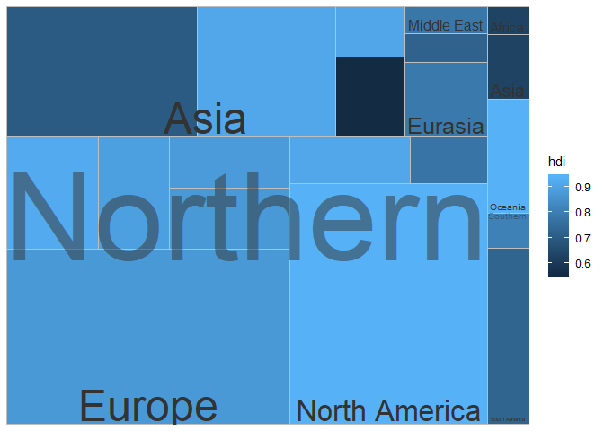<!-- -->


#### Primærhabitat vs. rødlistestatus

```r
dat2 %>%
  mutate(Status = forcats::fct_explicit_na(Status)) %>%
  count(Art, Primær, Status) %>%
  xtabs(~Primær + Status, .)
```

```
##       Status
## Primær   -  DD  NT  VU  EN  CR (Missing)
##     1b 189   0   9   5   5   0         0
##     2  116   0   1   2   0   0         0
##     3  744   0  13   6   2   1         0
##     4  976   3  17   3   3   1         0
##     5   19   0   0   0   0   0         0
```

#### Sekundærhabitat vs. rødlistestatus

```r
dat2 %>%
  mutate(Status = forcats::fct_explicit_na(Status)) %>%
  count(Art, Sekundær, Status) %>%
  xtabs(~addNA(Sekundær) + Status, .)
```

```
##                Status
## addNA(Sekundær)    -   DD   NT   VU   EN   CR (Missing)
##            A     145    0    2    0    0    0         0
##            B       1    0    0    0    0    0         0
##            F       6    0    0    0    0    0         0
##            F, A    0    0    0    1    0    0         0
##            L      41    0    0    0    0    0         0
##            M       6    0    0    0    0    0         0
##            S      24    0    0    1    0    0         0
##            V      78    0    2    0    0    0         0
##            <NA> 1743    3   36   14   10    2        22
```


## Data på lokalitetsnivå  

```r
dat_meta <- dat2 %>%
  group_by(Lokalitet, Vegetasjonssone, Engtype, Felleoppsett) %>%
  summarise(arter = n(), 
            rødlista = sum(Status %in% c("NT", "VU", "EN", "CR")),
            en_cr = sum(Status %in% c("EN", "CR")),
            prim_1og2 = sum(Primær %in% c("1a","1b","2")),
            prim_1b = sum(Primær %in% c("1a","1b")),
            prim_2 = sum(Primær %in% c("2")),
            prim_3 = sum(Primær %in% c("3")),
            prim_4 = sum(Primær %in% c("4","5")),
            rødlista_prim1og2 = sum(Status %in% c("NT", "VU", "EN", "CR") & Primær %in% c("1a","1b","2")),
            sek = sum(!is.na(Sekundær)),
            sek_prim1og2 = sum(!is.na(Sekundær) & Primær %in% c("1a","1b","2")),
            rødlista_sek_prim1og2 = sum(!is.na(Sekundær) & Primær %in% c("1a","1b","2") & 
                                          Status %in% c("NT", "VU", "EN", "CR"))
  )
```

### Tabell

```r
xtabs(~Vegetasjonssone + Engtype, dat_meta)
```

```
##                Engtype
## Vegetasjonssone Blåbær- og lågurteng Kalkeng Lågurteng
##    Nordboreal                      1       0         0
##    Mellomboreal                    0       0         1
##    Sørboreal                       1       0         3
##    Boreonemoral                    1       2         1
```

## Plott (y vs. x)  

```r
ggplot(dat_meta, aes(Engtype, arter)) +
  geom_point()
```

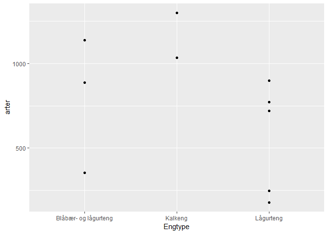<!-- -->

### Rødlistearter vs totalt antall arter

```r
cols <- RColorBrewer::brewer.pal(11, "Spectral")[c(1,3,9,11)] %>% rev()

ggplot(dat_meta, aes(arter, rødlista, color = Vegetasjonssone, shape = Engtype)) +
  geom_point(size = rel(3)) +
  scale_color_manual(values = cols) +
  labs(title = "Antall rødlistearter", y = "Antall rødlistearter", x = "Antall arter")
```

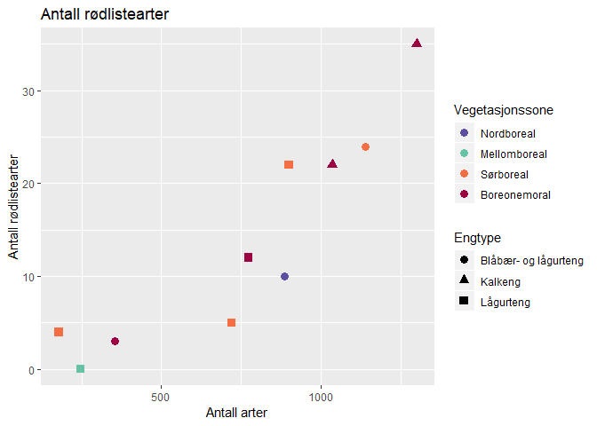<!-- -->

```r
ggplot(dat_meta, aes(arter, en_cr, color = Vegetasjonssone, shape = Engtype)) +
  geom_point(size = rel(3)) +
  scale_color_manual(values = cols) +
  labs(title = "Antall rødlistearter i kategoriene EN + CR", y = "Antall rødlistearter i kategoriene EN + CR", x = "Antall arter")
```

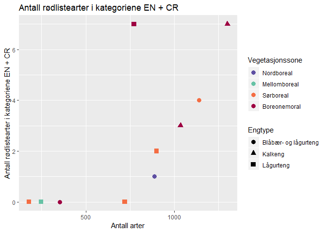<!-- -->

### Engavhengige arter vs totalt antall arter  

```r
ggplot(dat_meta, aes(arter, prim_1og2, color = Vegetasjonssone, shape = Engtype)) +
  geom_point(size = rel(3)) +
  scale_color_manual(values = cols) +
  labs(y = "Antall engavhengige arter (kat 1 + 2)", x = "Antall arter")
```

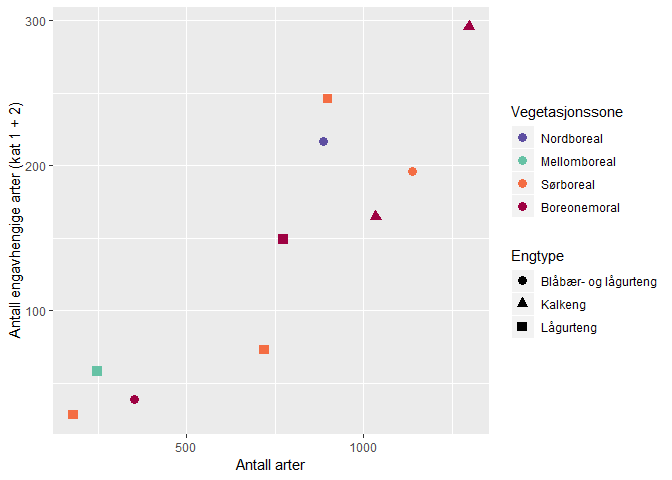<!-- -->

### Engavhengige rødlistearter vs totalt engavhengige arter  

```r
ggplot(dat_meta, aes(prim_1og2, rødlista_prim1og2, color = Vegetasjonssone, shape = Engtype)) +
  geom_point(size = rel(3)) +
  scale_color_manual(values = cols) +
  labs(y = "Antall engavhengige rødlistearter (kat 1 + 2)", x = "Antall engavhengige arter")
```

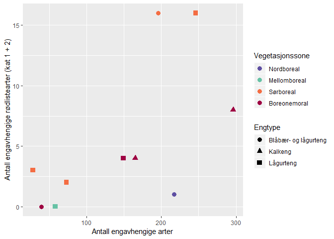<!-- -->

### Engavhengige rødlistearter vs totalt rødlistearter  

```r
ggplot(dat_meta, aes(rødlista, rødlista_prim1og2, color = Vegetasjonssone, shape = Engtype)) +
  geom_point(size = rel(3)) +
  scale_color_manual(values = cols) +
  labs(y = "Antall engavhengige rødlistearter (kat 1 + 2)", x = "Antall rødlistearter")
```

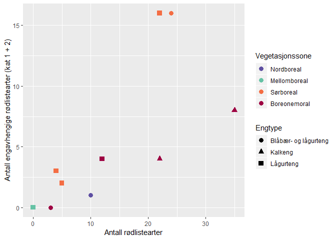<!-- -->

### Arter med sekundærkrav vs totalt antall arter  

```r
ggplot(dat_meta, aes(arter, sek, color = Vegetasjonssone, shape = Engtype)) +
  geom_point(size = rel(3)) +
  scale_color_manual(values = cols) +
  labs(y = "Antall arter med sekundærkrav", x = "Antall arter")
```

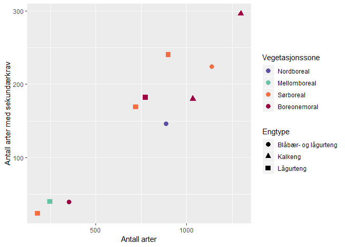<!-- -->

### Engavhengige arter med sekundærkrav vs totalt antall arter  

```r
ggplot(dat_meta, aes(prim_1og2, sek_prim1og2, color = Vegetasjonssone, shape = Engtype)) +
  geom_point(size = rel(3)) +
  scale_color_manual(values = cols) +
  labs(y = "Antall engavhengige arter (1+2) med sekundærkrav", x = "Antall engavhengige arter (1+2")
```

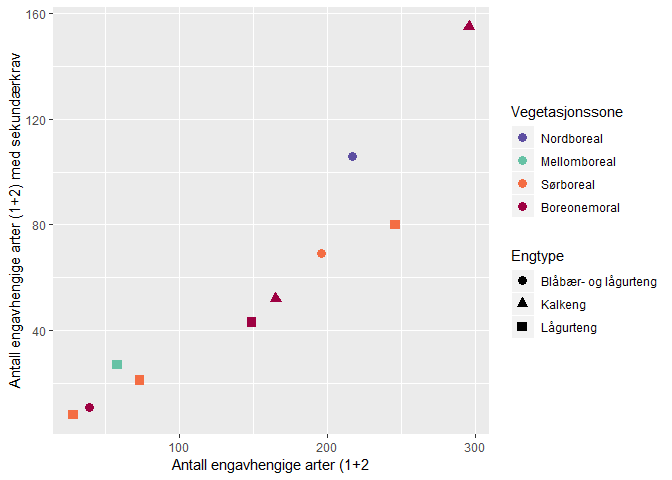<!-- -->

### Engavhengige rødlistearter med sekundærkrav vs totalt rødlistearter  

```r
ggplot(dat_meta, aes(rødlista, rødlista_sek_prim1og2, color = Vegetasjonssone, shape = Engtype)) +
  geom_point(size = rel(3)) +
  scale_color_manual(values = cols)
```

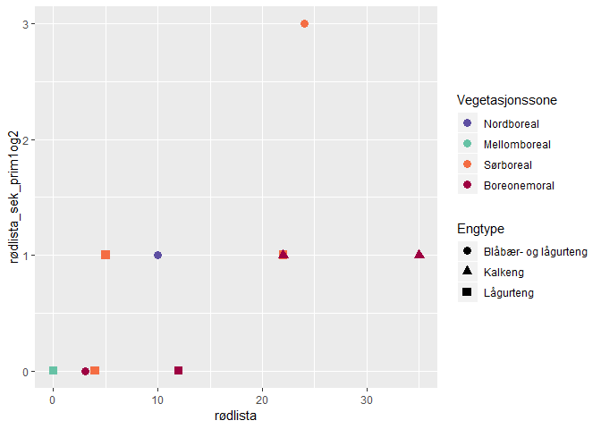<!-- -->

### Engavhengige rødlistearter med sekundærkrav vs engavhengige rødlistearter  

```r
ggplot(dat_meta, aes(rødlista_prim1og2, rødlista_sek_prim1og2, color = Vegetasjonssone, shape = Engtype)) +
  geom_point(size = rel(3)) +
  scale_color_manual(values = cols)
```

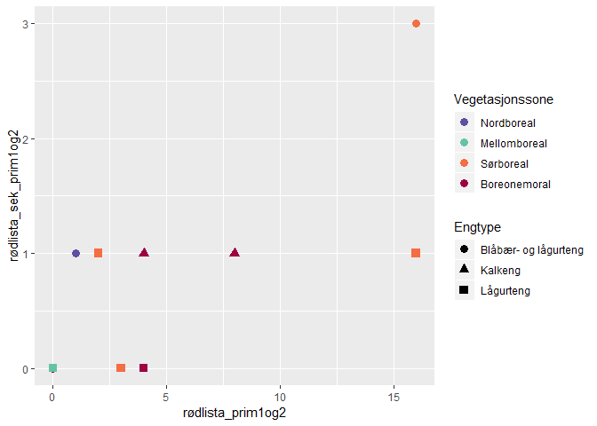<!-- -->

## Søylediagram for lokaliteter

### Data  

```r
habitat_levels <- c("Avhengig kun av eng", "Avhengig av eng og annet habitat", 
                    "Avhengig av annet habitat, men ikke eng", "Ikke avhengig av eng eller annet kjent habitat")

dat_barplot <- dat2 %>%
  mutate(Lokalitet2 = sprintf("%s\n%s (%s)", Lokalitet, Engtype, Vegetasjonssone),  # For informative x axis
         # 'Sort_order' is used later to put Lokalitet2 in a logical order (order by type first, then by zone)
         Sort_order = 
           case_when(Engtype == "Lågurteng" ~ 10,
                     Engtype == "Kalkeng" ~ 10,
                     Engtype == "Blåbær- og lågurteng" ~ 10) +
           case_when(Vegetasjonssone == "Boreonemoral" ~ 1,
                     Vegetasjonssone == "Sørboreal" ~ 2,
                     Vegetasjonssone == "Mellomboreal" ~ 3,
                     Vegetasjonssone == "Nordboreal" ~ 4),
         Habitat = factor(
           case_when(
             Primær %in% c("1a","1b","2") & is.na(Sekundær) ~ "Avhengig kun av eng",
             Primær %in% c("1a","1b","2") & !is.na(Sekundær) ~ "Avhengig av eng og annet habitat",
             Primær %in% c("3","4") & is.na(Sekundær) ~ "Ikke avhengig av eng eller annet kjent habitat",
             Primær %in% c("3","4") & !is.na(Sekundær) ~ "Avhengig av annet habitat, men ikke eng"
           ),
           levels = habitat_levels)
  ) %>%
  filter(!is.na(Habitat))

# Set levels for 'Lokalitet2':
lokalitet2_levels <- dat_barplot %>%
  count(Lokalitet2, Sort_order) %>% 
  arrange(Sort_order) %>%
  pull(Lokalitet2)

# habitat_levels <- dat_barplot %>%
#   count(Habitat) %>% dput()

dat_barplot <- dat_barplot %>%
  mutate(Lokalitet2 = factor(Lokalitet2, levels = lokalitet2_levels))
```

### Alle arter

```r
ggplot(dat_barplot, aes(x = Lokalitet2, fill = Habitat)) +
  geom_bar() +
  scale_fill_brewer(type = "qual", palette = 6) +
  theme(axis.text.x = element_text(hjust = 0, angle = -35),
        axis.title.x = element_blank()) +
  labs(y = "Antall arter")
```

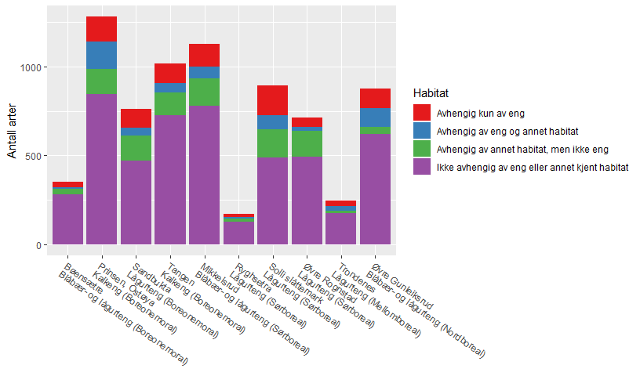<!-- -->
### Rødlistearter

```r
dat_barplot %>%
  filter(Status %in% c("NT", "VU", "EN", "CR")) %>%
  ggplot(aes(x = Lokalitet2, fill = Habitat)) +
  geom_bar() +
  scale_fill_brewer(type = "qual", palette = 6) +
  theme(axis.text.x = element_text(hjust = 0, angle = -35),
        axis.title.x = element_blank()) +
  labs(y = "Antall rødlistearter")
```

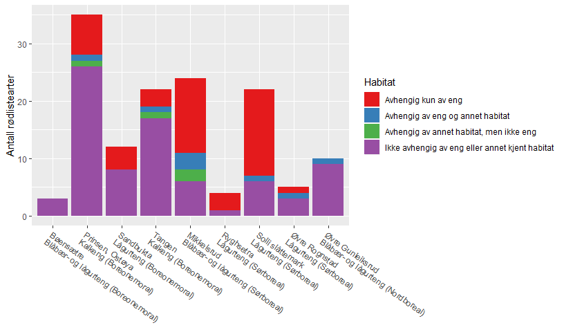<!-- -->

### Arter i rødlistekategori EN og CR

```r
dat_barplot %>%
  filter(Status %in% c("EN", "CR")) %>%
  ggplot(aes(x = Lokalitet2, fill = Habitat)) +
  geom_bar() +
  scale_fill_brewer(type = "qual", palette = 6, drop = FALSE) +
  theme(axis.text.x = element_text(hjust = 0, angle = -35),
        axis.title.x = element_blank()) +
  labs(y = "Antall truede rødlistearter")
```

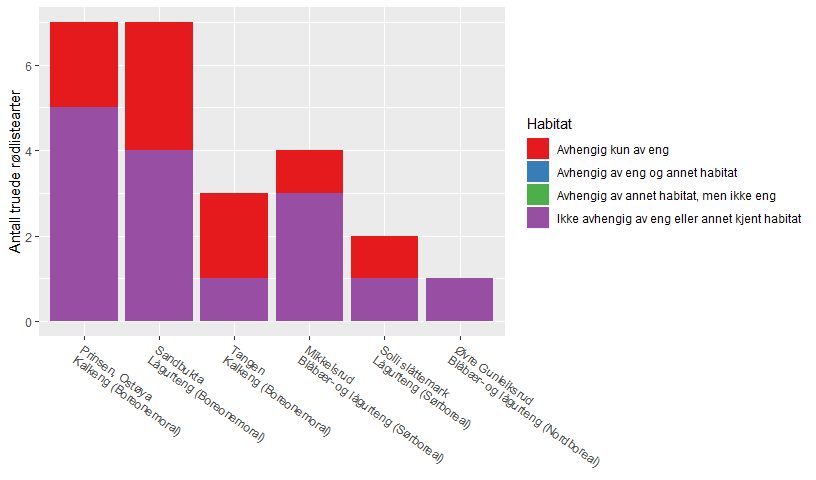<!-- -->

## Unike arter 
Antall arter unike for én lokalitet   

### Lage data    

```r
# Get number of localities per species
dat_number_loc <- dat2 %>%
  group_by(Art) %>%
  summarise(Antall_lokaliteter = length(unique(Lokalitet)))

# As dat_meta, but also groups on 'Unik_art'
dat_meta2 <- dat2 %>%
  left_join(dat_number_loc, by = "Art") %>% 
  mutate(Unikhet = 
           factor(ifelse(Antall_lokaliteter == 1, "Unik", "Ikke unik"),
                  levels = c("Ikke unik","Unik")
                  ),
         # For informative x axis:
         Lokalitet2 = sprintf("%s\n%s (%s)", Lokalitet, Engtype, Vegetasjonssone),
         # 'Sort_order' is used later to put Lokalitet2 in a logical order (order by type first, then by zone)
         Sort_order = 
           case_when(Engtype == "Lågurteng" ~ 10,
                     Engtype == "Kalkeng" ~ 10,
                     Engtype == "Blåbær- og lågurteng" ~ 10) +
           case_when(Vegetasjonssone == "Boreonemoral" ~ 1,
                     Vegetasjonssone == "Sørboreal" ~ 2,
                     Vegetasjonssone == "Mellomboreal" ~ 3,
                     Vegetasjonssone == "Nordboreal" ~ 4)
         ) %>%
  group_by(Lokalitet, Lokalitet2, Sort_order, 
           Vegetasjonssone, Engtype, Felleoppsett, Unikhet) %>%
  summarise(arter = n(), 
            rødlista = sum(Status %in% c("NT", "VU", "EN", "CR")),
            en_cr = sum(Status %in% c("EN", "CR")),
            prim_1og2 = sum(Primær %in% c("1a","1b","2")),
            prim_1b = sum(Primær %in% c("1a","1b")),
            prim_2 = sum(Primær %in% c("2")),
            prim_3 = sum(Primær %in% c("3")),
            prim_4 = sum(Primær %in% c("4","5")),
            rødlista_prim1og2 = sum(Status %in% c("NT", "VU", "EN", "CR") & Primær %in% c("1a","1b","2")),
            sek = sum(!is.na(Sekundær)),
            sek_prim1og2 = sum(!is.na(Sekundær) & Primær %in% c("1a","1b","2")),
            rødlista_sek_prim1og2 = sum(!is.na(Sekundær) & Primær %in% c("1a","1b","2") & 
                                          Status %in% c("NT", "VU", "EN", "CR"))
  ) %>%
  ungroup()

# Set levels for 'Lokalitet2':
lokalitet2_levels <- dat_meta2 %>%
  count(Lokalitet2, Sort_order) %>% 
  arrange(Sort_order) %>%
  pull(Lokalitet2)

dat_meta2 <- dat_meta2 %>%
  mutate(Lokalitet2 = factor(Lokalitet2, levels = lokalitet2_levels))
```

### Alle arter

```r
ggplot(dat_meta2, aes(Lokalitet2, arter, fill = Unikhet)) +
  geom_col() +
  scale_fill_brewer(type = "qual", palette = 3) +
  theme(axis.text.x = element_text(hjust = 0, angle = -35)) +
  labs(y = "Antall arter")
```

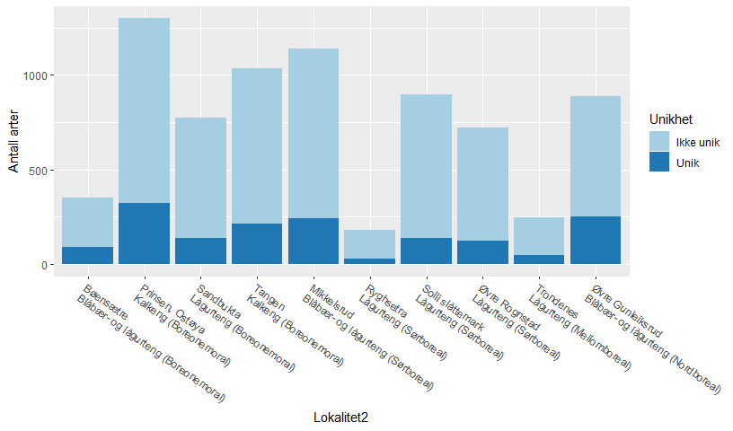<!-- -->

### Rødlistearter

```r
ggplot(dat_meta2, aes(Lokalitet2, rødlista, fill = Unikhet)) +
  geom_col() +
  scale_fill_brewer(type = "qual", palette = 3) +
  theme(axis.text.x = element_text(hjust = 0, angle = -35)) +
  labs(y = "Antall rødlistearter")
```

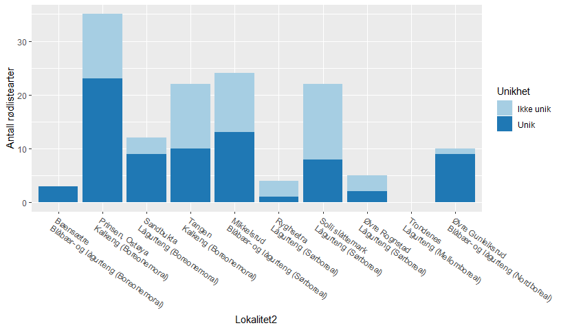<!-- -->

### Arter avhengige av eng (kategori 1b + 2)

```r
ggplot(dat_meta2, aes(Lokalitet2, prim_1og2, fill = Unikhet)) +
  geom_col() +
  scale_fill_brewer(type = "qual", palette = 3) +
  theme(axis.text.x = element_text(hjust = 0, angle = -35)) +
  labs(y = "Antall engavhengige arter")
```

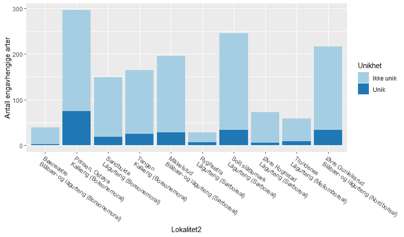<!-- -->

### Rødlistearter avhengige av eng (kategori 1b + 2)

```r
ggplot(dat_meta2, aes(Lokalitet2, rødlista_prim1og2, fill = Unikhet)) +
  geom_col() +
  scale_fill_brewer(type = "qual", palette = 3) +
  theme(axis.text.x = element_text(hjust = 0, angle = -35)) +
  labs(y = "Antall engavhengige rødlistearter")
```

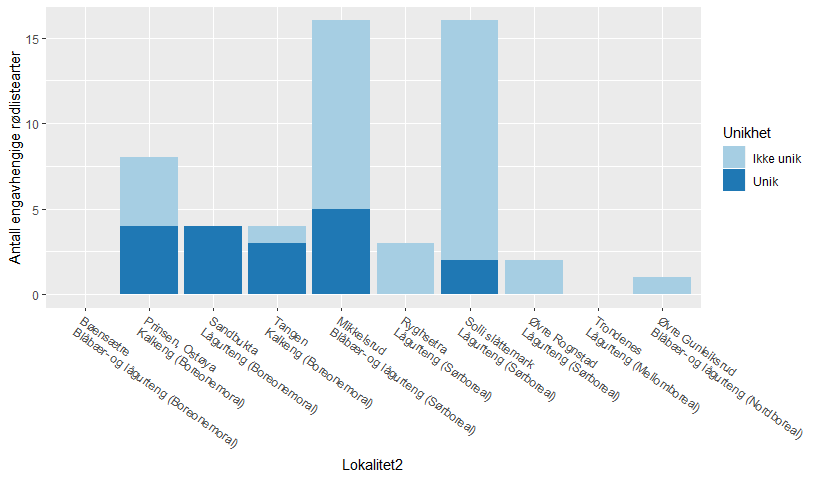<!-- -->


## Arter som finnes i 1,2,3, flere lokaliteter   
Dvs. en generalisering av forrige type plott (med arter unike for én lokalitet) 

### Lage data    

```r
# Get number of localities per species
dat_number_loc <- dat2 %>%
  group_by(Art) %>%
  summarise(Antall_lokaliteter = length(unique(Lokalitet)))

# As dat_meta, but also groups on 'Unik_art'
dat_meta3 <- dat2 %>%
  left_join(dat_number_loc, by = "Art") %>% 
  mutate(Unikhet = 
           factor(
             case_when(
               Antall_lokaliteter == 1 ~ "1 lokalitet",
               Antall_lokaliteter == 2 ~ "2 lokaliteter",
               Antall_lokaliteter == 3 ~ "3 lokaliteter",
               Antall_lokaliteter >= 4 ~ "4+ lokaliteter"),
             levels = c("4+ lokaliteter", "3 lokaliteter", "2 lokaliteter", "1 lokalitet")
                  ),
         # For informative x axis:
         Lokalitet2 = sprintf("%s\n%s (%s)", Lokalitet, Engtype, Vegetasjonssone),
         # 'Sort_order' is used later to put Lokalitet2 in a logical order (order by type first, then by zone)
         Sort_order = 
           case_when(Engtype == "Lågurteng" ~ 10,
                     Engtype == "Kalkeng" ~ 10,
                     Engtype == "Blåbær- og lågurteng" ~ 10) +
           case_when(Vegetasjonssone == "Boreonemoral" ~ 1,
                     Vegetasjonssone == "Sørboreal" ~ 2,
                     Vegetasjonssone == "Mellomboreal" ~ 3,
                     Vegetasjonssone == "Nordboreal" ~ 4)
         ) %>%
  group_by(Lokalitet, Lokalitet2, Sort_order, 
           Vegetasjonssone, Engtype, Felleoppsett, Unikhet) %>%
  summarise(arter = n(), 
            rødlista = sum(Status %in% c("NT", "VU", "EN", "CR")),
            en_cr = sum(Status %in% c("EN", "CR")),
            prim_1og2 = sum(Primær %in% c("1a","1b","2")),
            prim_1b = sum(Primær %in% c("1a","1b")),
            prim_2 = sum(Primær %in% c("2")),
            prim_3 = sum(Primær %in% c("3")),
            prim_4 = sum(Primær %in% c("4","5")),
            rødlista_prim1og2 = sum(Status %in% c("NT", "VU", "EN", "CR") & Primær %in% c("1a","1b","2")),
            sek = sum(!is.na(Sekundær)),
            sek_prim1og2 = sum(!is.na(Sekundær) & Primær %in% c("1a","1b","2")),
            rødlista_sek_prim1og2 = sum(!is.na(Sekundær) & Primær %in% c("1a","1b","2") & 
                                          Status %in% c("NT", "VU", "EN", "CR"))
  ) %>%
  ungroup()

# Set levels for 'Lokalitet2':
lokalitet2_levels <- dat_meta3 %>%
  count(Lokalitet2, Sort_order) %>% 
  arrange(Sort_order) %>%
  pull(Lokalitet2)

dat_meta3 <- dat_meta3 %>%
  mutate(Lokalitet2 = factor(Lokalitet2, levels = lokalitet2_levels))
```

### Alle arter

```r
cols_blues <- RColorBrewer::brewer.pal(5, "Blues")
  
ggplot(dat_meta3, aes(Lokalitet2, arter, fill = Unikhet)) +
  geom_col() +
  scale_fill_manual(values = tail(cols_blues,4)) +
  theme(axis.text.x = element_text(hjust = 0, angle = -35)) +
  labs(y = "Antall arter")
```

<!-- -->

### Rødlistearter

```r
ggplot(dat_meta3, aes(Lokalitet2, rødlista, fill = Unikhet)) +
  geom_col() +
  scale_fill_manual(values = tail(cols_blues,4)) +
  theme(axis.text.x = element_text(hjust = 0, angle = -35)) +
  labs(y = "Antall rødlistearter")
```

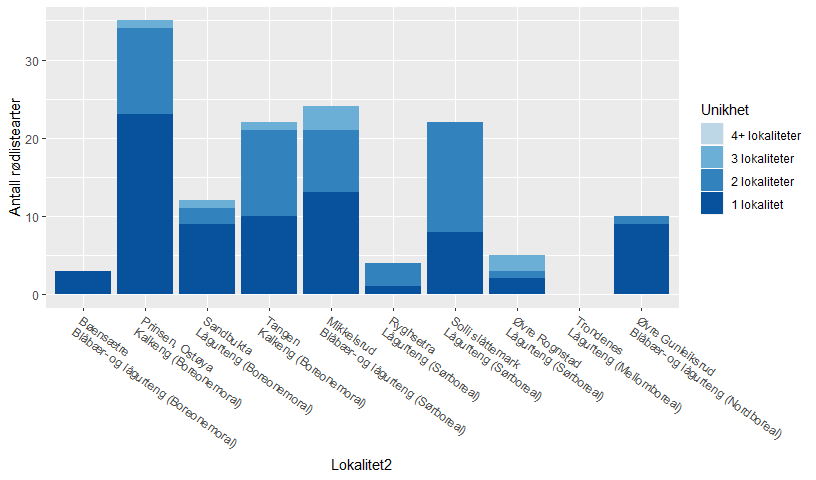<!-- -->

### Arter avhengige av eng (kategori 1b + 2)

```r
ggplot(dat_meta3, aes(Lokalitet2, prim_1og2, fill = Unikhet)) +
  geom_col() +
  scale_fill_manual(values = tail(cols_blues,4)) +
  theme(axis.text.x = element_text(hjust = 0, angle = -35)) +
  labs(y = "Antall engavhengige arter")
```

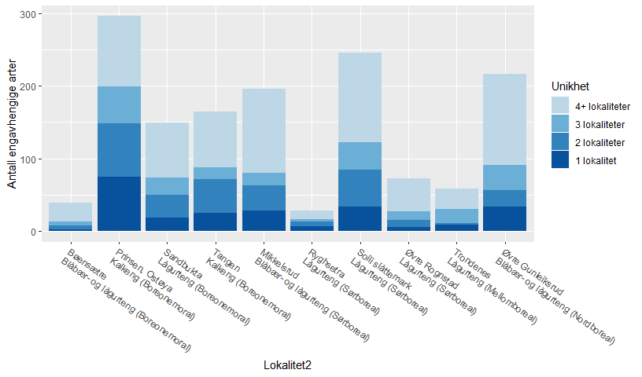<!-- -->

### Rødlistearter avhengige av eng (kategori 1b + 2)

```r
ggplot(dat_meta3, aes(Lokalitet2, rødlista_prim1og2, fill = Unikhet)) +
  geom_col() +
  scale_fill_manual(values = tail(cols_blues,4)) +
  theme(axis.text.x = element_text(hjust = 0, angle = -35)) +
  labs(y = "Antall engavhengige rødlistearter")
```

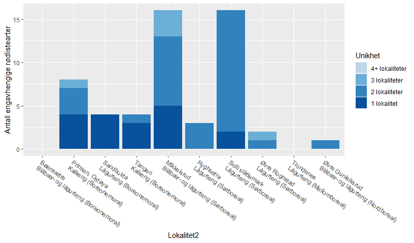<!-- -->

## Arter i 1,2,3,fler lok - for taxa

### Definere funksjon

```r
make_uniqueness_data <- function(df, type){
  
  # Get number of localities per species
  dat_number_loc <- df %>%
    group_by(Art) %>%
    summarise(Antall_lokaliteter = length(unique(Lokalitet)))
  
  # As dat_meta, but also groups on 'Unik_art'
  result <- df %>%
    left_join(dat_number_loc, by = "Art")
  if (type == 1) {
    result <- result %>% 
    mutate(Unikhet = 
             factor(
               case_when(
                 Antall_lokaliteter == 1 ~ "1 lokalitet",
                 Antall_lokaliteter == 2 ~ "2 lokaliteter",
                 Antall_lokaliteter == 3 ~ "3 lokaliteter",
                 Antall_lokaliteter >= 4 ~ "4+ lokaliteter"),
               levels = c("4+ lokaliteter", "3 lokaliteter", "2 lokaliteter", "1 lokalitet")
             )
           )
    } else if (type == 2){
      result <- result %>%
        mutate(Unikhet = factor(
               case_when(
                 Antall_lokaliteter == 1 ~ "Unik",
                 Antall_lokaliteter >= 2 ~ "Ikke unik"),
               levels = c("Ikke unik", "Unik")
             )
           )
    } else {
      stop("Type must be 1 or 2") 
    }
  result <- result %>%
    mutate(# For informative x axis:
           Lokalitet2 = sprintf("%s\n%s (%s)", Lokalitet, Engtype, Vegetasjonssone),
           # 'Sort_order' is used later to put Lokalitet2 in a logical order (order by type first, then by zone)
           Sort_order = 
             case_when(Engtype == "Lågurteng" ~ 10,
                       Engtype == "Kalkeng" ~ 10,
                       Engtype == "Blåbær- og lågurteng" ~ 10) +
             case_when(Vegetasjonssone == "Boreonemoral" ~ 1,
                       Vegetasjonssone == "Sørboreal" ~ 2,
                       Vegetasjonssone == "Mellomboreal" ~ 3,
                       Vegetasjonssone == "Nordboreal" ~ 4)
    ) %>%
    group_by(Lokalitet, Lokalitet2, Sort_order, 
             Vegetasjonssone, Engtype, Felleoppsett, Unikhet) %>%
    summarise(arter = n(), 
              rødlista = sum(Status %in% c("NT", "VU", "EN", "CR")),
              en_cr = sum(Status %in% c("EN", "CR")),
              prim_1og2 = sum(Primær %in% c("1a","1b","2")),
              prim_1b = sum(Primær %in% c("1a","1b")),
              prim_2 = sum(Primær %in% c("2")),
              prim_3 = sum(Primær %in% c("3")),
              prim_4 = sum(Primær %in% c("4","5")),
              rødlista_prim1og2 = sum(Status %in% c("NT", "VU", "EN", "CR") & Primær %in% c("1a","1b","2")),
              sek = sum(!is.na(Sekundær)),
              sek_prim1og2 = sum(!is.na(Sekundær) & Primær %in% c("1a","1b","2")),
              rødlista_sek_prim1og2 = sum(!is.na(Sekundær) & Primær %in% c("1a","1b","2") & 
                                            Status %in% c("NT", "VU", "EN", "CR"))
    ) %>%
    ungroup()
  
  # Set levels for 'Lokalitet2':
  lokalitet2_levels <- result %>%
    count(Lokalitet2, Sort_order) %>% 
    arrange(Sort_order) %>%
    pull(Lokalitet2)
  
  result <- result %>%
    mutate(Lokalitet2 = factor(Lokalitet2, levels = lokalitet2_levels))
  
  result
  
}


# Test
# make_uniqueness_data(dat2, type = 1)
# make_uniqueness_data(dat2, type = 2)
```

### Biller

```r
dat2 %>%
  filter(Order == "Coleoptera") %>%
  make_uniqueness_data(type = 1) %>%
  ggplot(aes(Lokalitet2, arter, fill = Unikhet)) +
  geom_col() +
  scale_fill_manual(values = tail(cols_blues,4)) +
  theme(axis.text.x = element_text(hjust = 0, angle = -35)) +
  labs(y = "Antall billearter")
```

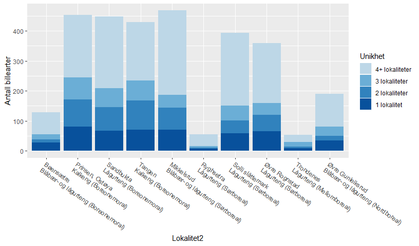<!-- -->

```r
dat2 %>%
  filter(Order == "Coleoptera") %>%
  make_uniqueness_data(type = 2) %>%
  ggplot(aes(Lokalitet2, arter, fill = Unikhet)) +
  geom_col() +
  scale_fill_brewer(type = "qual", palette = 3) +
  theme(axis.text.x = element_text(hjust = 0, angle = -35)) +
  labs(y = "Antall billearter")
```

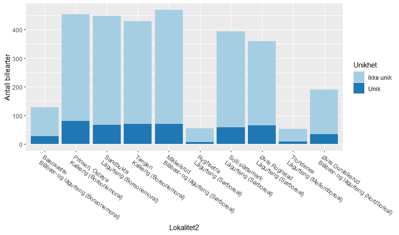<!-- -->

### Blomsterfluer

```r
dat2 %>%
  filter(Family == "Syrphidae") %>%
  make_uniqueness_data(type = 1) %>%
  ggplot(aes(Lokalitet2, arter, fill = Unikhet)) +
  geom_col() +
  scale_fill_manual(values = tail(cols_blues,4)) +
  theme(axis.text.x = element_text(hjust = 0, angle = -35)) +
  labs(y = "Antall blomsterfluearter")
```

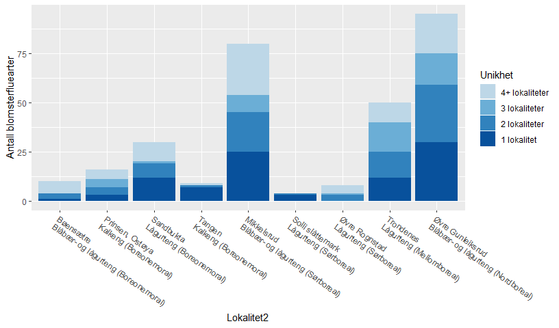<!-- -->

```r
dat2 %>%
  filter(Family == "Syrphidae") %>%
  make_uniqueness_data(type = 2) %>%
  ggplot(aes(Lokalitet2, arter, fill = Unikhet)) +
  geom_col() +
  scale_fill_brewer(type = "qual", palette = 3) +
  theme(axis.text.x = element_text(hjust = 0, angle = -35)) +
  labs(y = "Antall blomsterfluearter")
```

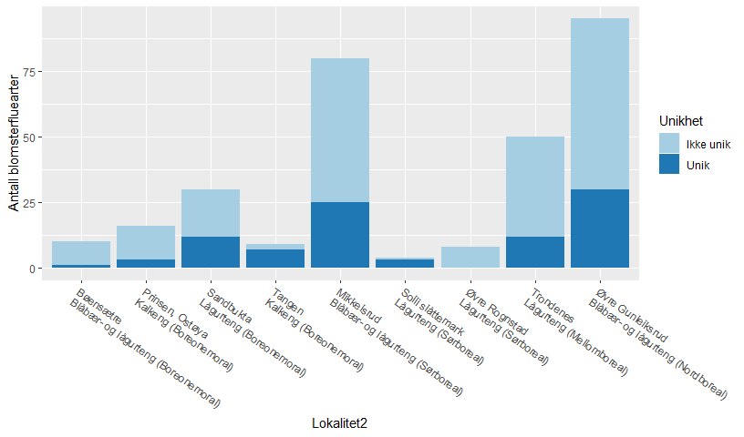<!-- -->
### Sommerfugler

```r
dat2 %>%
  filter(Order == "Lepidoptera") %>%
  make_uniqueness_data(type = 1) %>%
  ggplot(aes(Lokalitet2, arter, fill = Unikhet)) +
  geom_col() +
  scale_fill_manual(values = tail(cols_blues,4)) +
  theme(axis.text.x = element_text(hjust = 0, angle = -35)) +
  labs(y = "Antall sommerfuglarter")
```

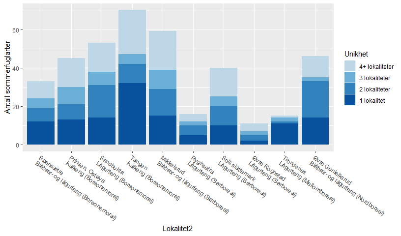<!-- -->

```r
dat2 %>%
  filter(Order == "Lepidoptera") %>%
  make_uniqueness_data(type = 2) %>%
  ggplot(aes(Lokalitet2, arter, fill = Unikhet)) +
  geom_col() +
  scale_fill_brewer(type = "qual", palette = 3) +
  theme(axis.text.x = element_text(hjust = 0, angle = -35)) +
  labs(y = "Antall sommerfuglarter")
```

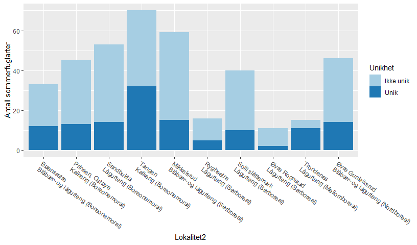<!-- -->

## Akkumuleringsskurver

### Lage data

```r
# Get locality with the highest number of _new_ species, given that 'species_included' (a vector of species names)
#   already is included
# Expects column names 'Art' and 'Lokalitet'
get_locality <- function(df, species_included = NA, localities_included = NA){
  df2 <- df %>%
    filter(!Art %in% species_included)
  # In the normal case, where not all species have been 'taken', we pick the locality which 
  #   adds most species:
  if (nrow(df2) > 0){
    result <- df2 %>%
      group_by(Lokalitet) %>%
      summarise(n = length(unique(Art))) %>%
      filter(n == max(n)) %>%
      filter(row_number() == 1)
  # In the case, that all species have been 'taken', we pick one random of the remaining localities and
  #   sets n = 0
  } else {
    result <- df %>%
      filter(!Lokalitet %in% localities_included) %>%
      count(Lokalitet) %>%
      filter(row_number() == 1) %>%
      mutate(n = 0)
  }
  result
}

# Get a vector of species names for species already found in 'localities'  (a vector of locality names)
#   already is included
# Expects column names 'Art' and 'Lokalitet'
get_species_included <- function(df, localities)
  df %>%
    filter(Lokalitet %in% localities) %>%
    count(Art) %>%
    pull(Art)
# Test
# loc <- get_locality(dat2)
# loc
# spp <- get_species_included(dat2, loc$Lokalitet)
# loc2 <- get_locality(dat2, spp)
# loc2

# Makes a data frame of how to add localities in order to maximize  
#   Expects column names 'Art' and 'Lokalitet'
#   Also depends on 'dat_meat2' being defined
get_accumulation <- function(df){
  n_localities <- length(unique(df$Lokalitet))
  result <- get_locality(df)
  while (nrow(result) < n_localities){
    species_already_included <- get_species_included(df, result$Lokalitet)
    result <- bind_rows(
      result,
      get_locality(df, 
                   species_included = species_already_included, 
                   localities_included = result$Lokalitet)
      )
  }
  # Add Lokalitet2
  result <- result %>%
    left_join(dat_meta2 %>% count(Lokalitet, Lokalitet2, Engtype, Vegetasjonssone) %>% select(-n), by = "Lokalitet")
  # Order Lokalitet2 correctly
  levels = result %>% pull(Lokalitet2)
  result %>%
    mutate(Lokalitet2 = factor(Lokalitet2, levels = levels),
           n_akk = cumsum(n)) 
}
# Test
# get_accumulation(dat2)

# Colors for Vegetasjonssone
col_zone <- RColorBrewer::brewer.pal(11, "Spectral")[c(1,3,9,11)] %>% rev()
```

### Alle arter

```r
df <- get_accumulation(dat2)

ggplot(df, aes(Lokalitet2, n_akk, fill = Vegetasjonssone)) +
  geom_col() +
  scale_fill_manual(values = col_zone) +
  # scale_fill_brewer(type = "qual", palette = 3) +
  theme(axis.text.x = element_text(hjust = 0, angle = -35)) +
  labs(y = "Antall arter (akkumulert)",
       x = "Lokalitet, sortert etter optimal rekkefølge")
```

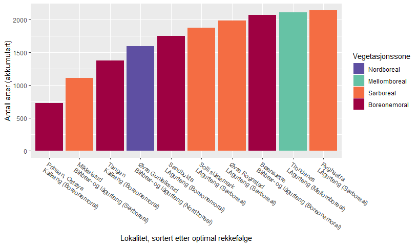<!-- -->

### Rødlistearter

```r
df <- dat2 %>%
  filter(Status %in% c("NT", "VU", "EN", "CR")) %>%
  get_accumulation()

ggplot(df, aes(Lokalitet2, n_akk, fill = Vegetasjonssone)) +
  geom_col() +
  scale_fill_manual(values = col_zone) +
  # scale_fill_brewer(type = "qual", palette = 3) +
  theme(axis.text.x = element_text(hjust = 0, angle = -35)) +
  labs(y = "Antall rødlistearter (akkumulert)",
       x = "Lokalitet, sortert etter optimal rekkefølge")
```

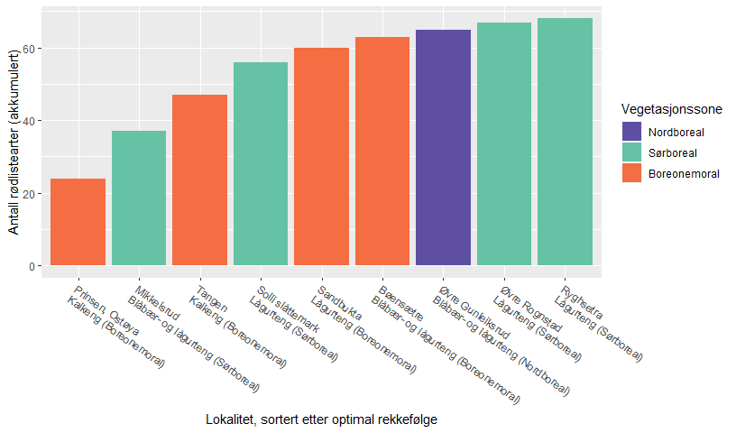<!-- -->


### Engavhengige arter

```r
df <- dat2 %>%
  filter(Primær %in% c("1a","1b","2")) %>%
  get_accumulation()

ggplot(df, aes(Lokalitet2, n_akk, fill = Vegetasjonssone)) +
  geom_col() +
  scale_fill_manual(values = col_zone) +
  # scale_fill_brewer(type = "qual", palette = 3) +
  theme(axis.text.x = element_text(hjust = 0, angle = -35)) +
  labs(y = "Antall engavhengige arter (akkumulert)",
       x = "Lokalitet, sortert etter optimal rekkefølge")
```

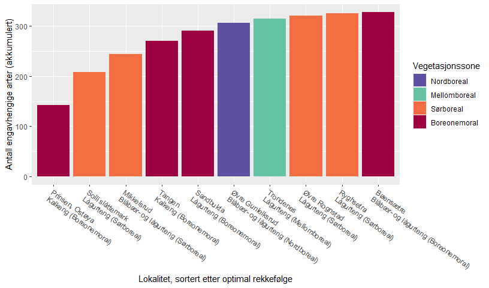<!-- -->


### Engavhengige rødlistearter

```r
# debugonce(get_accumulation)
df <- dat2 %>%
  filter(Primær %in% c("1a","1b","2") & Status %in% c("NT", "VU", "EN", "CR")) %>%
  get_accumulation()
# df

ggplot(df, aes(Lokalitet2, n_akk, fill = Vegetasjonssone)) +
  geom_col() +
  scale_fill_manual(values = col_zone) +
  theme(axis.text.x = element_text(hjust = 0, angle = -35)) +
  labs(y = "Antall engavhengige rødlistearter\n(akkumulert)",
       x = "Lokalitet, sortert etter optimal rekkefølge")
```

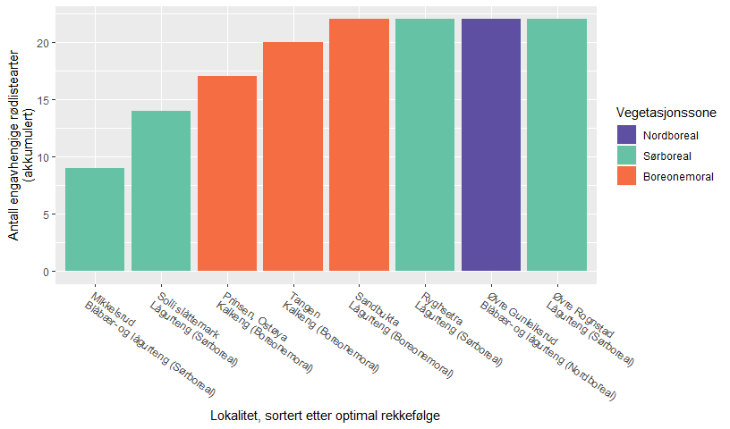<!-- -->

### Biller

```r
dat2 %>%
  filter(Order == "Coleoptera") %>%
  get_accumulation() %>%
  ggplot(aes(Lokalitet2, n_akk, fill = Vegetasjonssone)) +
  geom_col() +
  scale_fill_manual(values = col_zone) +
  theme(axis.text.x = element_text(hjust = 0, angle = -35)) +
  labs(y = "Antall biller\n(akkumulert)",
       x = "Lokalitet, sortert etter optimal rekkefølge")
```

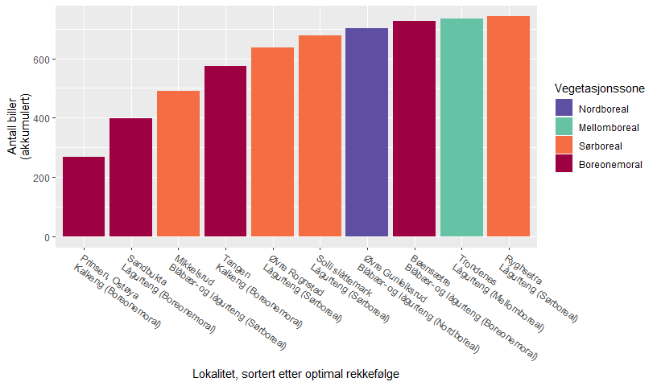<!-- -->

```r
dat2 %>%
  filter(Order == "Coleoptera" & Primær %in% c("1a","1b","2")) %>%
  get_accumulation() %>%
  ggplot(aes(Lokalitet2, n_akk, fill = Vegetasjonssone)) +
  geom_col() +
  scale_fill_manual(values = col_zone) +
  theme(axis.text.x = element_text(hjust = 0, angle = -35)) +
  labs(y = "Antall engavhengige biller\n(akkumulert)",
       x = "Lokalitet, sortert etter optimal rekkefølge")
```

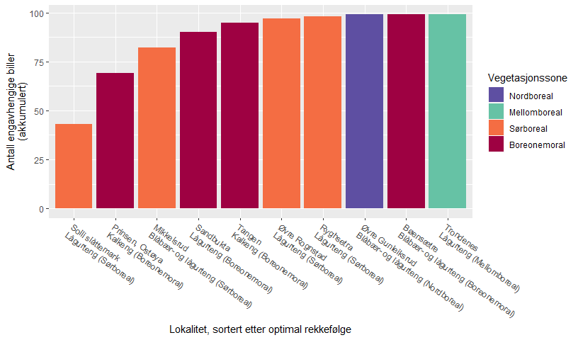<!-- -->


### Blomsterfluer

```r
dat2 %>%
  filter(Family == "Syrphidae") %>%
  get_accumulation() %>%
  ggplot(aes(Lokalitet2, n_akk, fill = Vegetasjonssone)) +
  geom_col() +
  scale_fill_manual(values = col_zone) +
  theme(axis.text.x = element_text(hjust = 0, angle = -35)) +
  labs(y = "Antall blomsterfluearter\n(akkumulert)",
       x = "Lokalitet, sortert etter optimal rekkefølge")
```

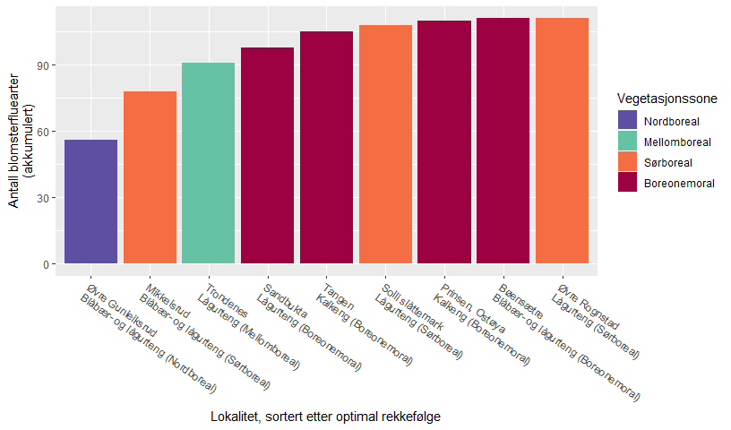<!-- -->

```r
dat2 %>%
  filter(Family == "Syrphidae" & Primær %in% c("1a","1b","2")) %>%
  get_accumulation() %>%
  ggplot(aes(Lokalitet2, n_akk, fill = Vegetasjonssone)) +
  geom_col() +
  scale_fill_manual(values = col_zone) +
  theme(axis.text.x = element_text(hjust = 0, angle = -35)) +
  labs(y = "Antall engavhengige blomsterfluearter\n(akkumulert)",
       x = "Lokalitet, sortert etter optimal rekkefølge")
```

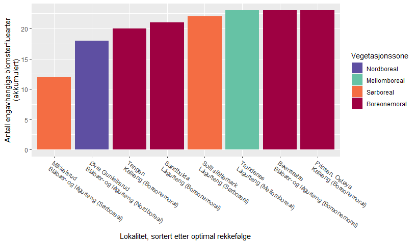<!-- -->


### Sommerfugler

```r
dat2 %>%
  filter(Order == "Lepidoptera") %>%
  get_accumulation() %>%
  ggplot(aes(Lokalitet2, n_akk, fill = Vegetasjonssone)) +
  geom_col() +
  scale_fill_manual(values = col_zone) +
  theme(axis.text.x = element_text(hjust = 0, angle = -35)) +
  labs(y = "Antall blomsterfluearter\n(akkumulert)",
       x = "Lokalitet, sortert etter optimal rekkefølge")
```

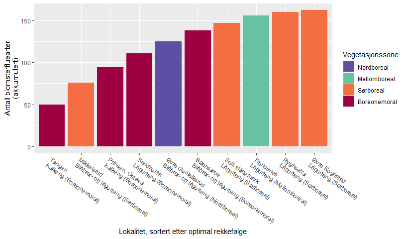<!-- -->

```r
dat2 %>%
  filter(Order == "Lepidoptera" & Primær %in% c("1a","1b","2")) %>%
  get_accumulation() %>%
  ggplot(aes(Lokalitet2, n_akk, fill = Vegetasjonssone)) +
  geom_col() +
  scale_fill_manual(values = col_zone) +
  theme(axis.text.x = element_text(hjust = 0, angle = -35)) +
  labs(y = "Antall engavhengige blomsterfluearter\n(akkumulert)",
       x = "Lokalitet, sortert etter optimal rekkefølge")
```

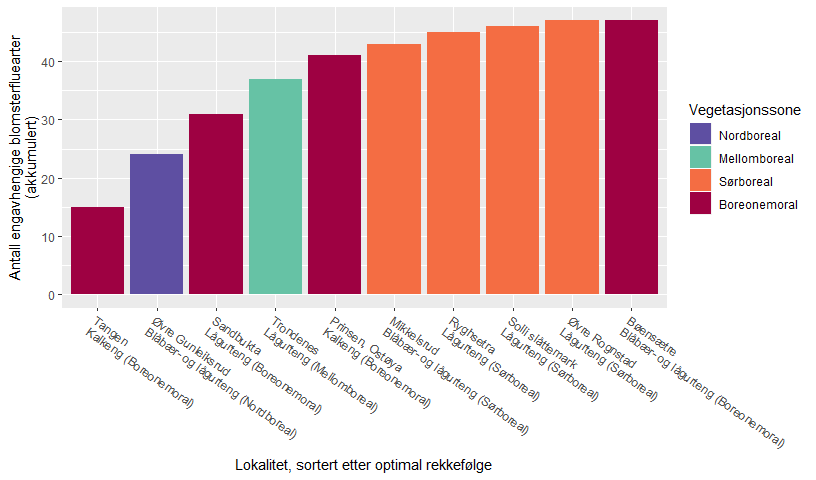<!-- -->
