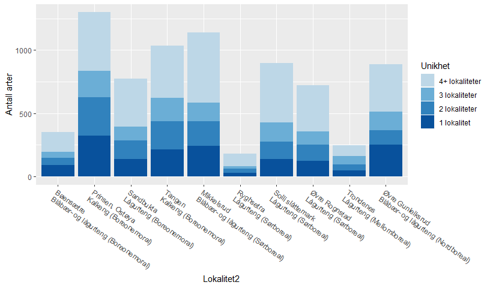

## Pakker

```r
library(readxl)
library(dplyr)
library(ggplot2)
library(scales)
library(treemapify)
```

## Data

```r
# dir("Input_data")

# Artsdata         
dat <- read_excel("Input_data/tilhørighet_insekter i slåttemark.xlsx")

dat <- dat %>%
  rename(Primær = `Tilhørighet (se kommentar)`,
         Pollinator = `Pollinator (ja (="x")/nei (tomt felt))`,
         Sekundær = `Sekundærhabitat (se kommentar)`) %>%
  mutate(Status = ifelse(is.na(Status2015), "-", Status2015),
         Status = factor(Status, levels = c("-", "DD", "NT", "VU", "EN", "CR"))
  )

# Lokalitetsdata         
dat2 <- read_excel("Input_data/Lokalitetsdata_insekter i slåttemark2.xlsx") %>% 
  mutate(Vegetasjonssone = 
           factor(Vegetasjonssone, levels = c("Nordboreal", "Mellomboreal", "Sørboreal", "Boreonemoral")))


# Should be zero:
dat %>%
  count(Art) %>%
  filter(n > 1) %>%
  nrow()
```

```
## [1] 0
```

```r
# Should be zero:
dat2 %>%
  count(Art, Lokalitet) %>%
  filter(n > 1) %>%
  nrow()
```

```
## [1] 0
```

## Artsdata  
Start på fil

```r
head(dat, 30) 
```

<div data-pagedtable="false">
  <script data-pagedtable-source type="application/json">
{"columns":[{"label":["Art"],"name":[1],"type":["chr"],"align":["left"]},{"label":["Primær"],"name":[2],"type":["chr"],"align":["left"]},{"label":["Pollinator"],"name":[3],"type":["chr"],"align":["left"]},{"label":["Sekundær"],"name":[4],"type":["chr"],"align":["left"]},{"label":["Order"],"name":[5],"type":["chr"],"align":["left"]},{"label":["Family"],"name":[6],"type":["chr"],"align":["left"]},{"label":["Gruppe"],"name":[7],"type":["chr"],"align":["left"]},{"label":["Status2015"],"name":[8],"type":["chr"],"align":["left"]},{"label":["X__1"],"name":[9],"type":["chr"],"align":["left"]},{"label":["Status"],"name":[10],"type":["fctr"],"align":["left"]}],"data":[{"1":"Abax parallelepipedus","2":"4","3":"NA","4":"NA","5":"Coleoptera","6":"Carabidae","7":"Biller","8":"NA","9":"NA","10":"-"},{"1":"Abia aenea","2":"3","3":"x","4":"NA","5":"Hymenoptera","6":"Cimbicidae","7":"Veps","8":"NA","9":"NA","10":"-"},{"1":"Abia fasciata","2":"3","3":"x","4":"NA","5":"Hymenoptera","6":"Cimbicidae","7":"Veps","8":"NA","9":"NA","10":"-"},{"1":"Abrostola tripartita","2":"3","3":"x","4":"NA","5":"Lepidoptera","6":"Noctuidae","7":"Sommerfugler","8":"NA","9":"NA","10":"-"},{"1":"Acalypta carinata","2":"3","3":"NA","4":"NA","5":"Hemiptera","6":"Tingidae","7":"Nebbmunner","8":"NA","9":"NA","10":"-"},{"1":"Acalypta parvula","2":"3","3":"NA","4":"NA","5":"Hemiptera","6":"Tingidae","7":"Nebbmunner","8":"NA","9":"NA","10":"-"},{"1":"Acanthosoma haemorrhoidale","2":"3","3":"NA","4":"NA","5":"Hemiptera","6":"Acanthosomatidae","7":"Nebbmunner","8":"NA","9":"NA","10":"-"},{"1":"Acanthothrips nodicornis","2":"3","3":"NA","4":"NA","5":"Thysanoptera","6":"Phlaeothripidae","7":"Trips","8":"NA","9":"Alle trips er ukritisk gitt kategori 3, selv om noen av dem kanskje burde hatt 1 eller 2. Avventer tilbakemelding fra Kobro, som 14.V.2019 sa han skulle ta en titt på det, men siden har jeg ikke hørt noe. Purret ham 22.VIII.2019.","10":"-"},{"1":"Acidia cognata","2":"1b","3":"x","4":"NA","5":"Diptera","6":"Tephritidae","7":"Tovinger","8":"NA","9":"NA","10":"-"},{"1":"Acidota crenata","2":"4","3":"NA","4":"NA","5":"Coleoptera","6":"Staphylinidae","7":"Biller","8":"NA","9":"NA","10":"-"},{"1":"Acinia corniculata","2":"1b","3":"x","4":"NA","5":"Diptera","6":"Tephritidae","7":"Tovinger","8":"NA","9":"NA","10":"-"},{"1":"Acleris aspersana","2":"3","3":"NA","4":"NA","5":"Lepidoptera","6":"Tortricidae","7":"Sommerfugler","8":"NA","9":"NA","10":"-"},{"1":"Acleris effractana","2":"4","3":"NA","4":"NA","5":"Lepidoptera","6":"Tortricidae","7":"Sommerfugler","8":"NA","9":"NA","10":"-"},{"1":"Acleris holmiana","2":"4","3":"NA","4":"NA","5":"Lepidoptera","6":"Tortricidae","7":"Sommerfugler","8":"NA","9":"NA","10":"-"},{"1":"Acrocera orbiculus","2":"3","3":"NA","4":"NA","5":"Diptera","6":"Acroceridae","7":"Tovinger","8":"NA","9":"NA","10":"-"},{"1":"Acronicta rumicis","2":"3","3":"NA","4":"NA","5":"Lepidoptera","6":"Noctuidae","7":"Sommerfugler","8":"NA","9":"NA","10":"-"},{"1":"Acrostiba borealis","2":"4","3":"NA","4":"NA","5":"Coleoptera","6":"Staphylinidae","7":"Biller","8":"NA","9":"NA","10":"-"},{"1":"Acrotona fungi","2":"4","3":"NA","4":"NA","5":"Coleoptera","6":"Staphylinidae","7":"Biller","8":"NA","9":"NA","10":"-"},{"1":"Acrotona sylvicola","2":"4","3":"NA","4":"NA","5":"Coleoptera","6":"Staphylinidae","7":"Biller","8":"NA","9":"NA","10":"-"},{"1":"Acrotrichis cognata","2":"4","3":"NA","4":"NA","5":"Coleoptera","6":"Ptiliidae","7":"Biller","8":"NA","9":"NA","10":"-"},{"1":"Acrotrichis dispar","2":"4","3":"NA","4":"NA","5":"Coleoptera","6":"Ptiliidae","7":"Biller","8":"NA","9":"NA","10":"-"},{"1":"Acrotrichis sitkaensis","2":"4","3":"NA","4":"NA","5":"Coleoptera","6":"Ptiliidae","7":"Biller","8":"NA","9":"NA","10":"-"},{"1":"Actinotia polyodon","2":"1b","3":"x","4":"NA","5":"Lepidoptera","6":"Noctuidae","7":"Sommerfugler","8":"NA","9":"NA","10":"-"},{"1":"Adalia bipunctata","2":"4","3":"NA","4":"NA","5":"Coleoptera","6":"Coccinellidae","7":"Biller","8":"NA","9":"NA","10":"-"},{"1":"Adalia decempunctata","2":"4","3":"NA","4":"NA","5":"Coleoptera","6":"Coccinellidae","7":"Biller","8":"NA","9":"NA","10":"-"},{"1":"Adomerus biguttatus","2":"4","3":"NA","4":"NA","5":"Hemiptera","6":"Cydnidae","7":"Nebbmunner","8":"NA","9":"NA","10":"-"},{"1":"Adscita statices","2":"1b","3":"x","4":"NA","5":"Lepidoptera","6":"Zygaenidae","7":"Sommerfugler","8":"NA","9":"NA","10":"-"},{"1":"Aelia acuminata","2":"3","3":"NA","4":"NA","5":"Hemiptera","6":"Pentatomidae","7":"Nebbmunner","8":"NA","9":"NA","10":"-"},{"1":"Aenigmatias lubbockii","2":"4","3":"x","4":"NA","5":"Diptera","6":"Phoridae","7":"Tovinger","8":"NA","9":"NA","10":"-"},{"1":"Aeolothrips ericae","2":"3","3":"NA","4":"NA","5":"Thysanoptera","6":"Aeolothripidae","7":"Trips","8":"NA","9":"Alle trips er ukritisk gitt kategori 3, selv om noen av dem kanskje burde hatt 1 eller 2. Avventer tilbakemelding fra Kobro, som 14.V.2019 sa han skulle ta en titt på det, men siden har jeg ikke hørt noe. Purret ham 22.VIII.2019.","10":"-"}],"options":{"columns":{"min":{},"max":[10]},"rows":{"min":[10],"max":[10]},"pages":{}}}
  </script>
</div>


## Lokalitetsdata


```r
# dat2
dat2 <- dat2 %>% 
  left_join(dat %>% select(Art, Primær, Sekundær, Status, Order, Family), by = "Art")
```

### Tabeller for det totale artsmangfoldet på engene  

#### Habitatkrav (primær og sekundær)  

```r
dat2 %>%
  count(Art, Primær, Sekundær) %>%
  xtabs(~Primær + addNA(Sekundær), .)
```

```
##       addNA(Sekundær)
## Primær    A    B    F F, A    L    M    S    V <NA>
##     1b    0    0    0    0    0    0    0    0  217
##     2    41    0    2    1    8    1   31   51    0
##     3   108    1    4    0   42    5    1   25  710
##     4     0    0    0    0    5    0    0   13 1109
##     5     0    0    0    0    0    0    0    0   23
```

#### Grupper 1

```r
dat2 %>%
  count(Art, Order, Family) %>%
  xtabs(~Order, .)
```

```
## Order
##     Blattodea    Coleoptera    Dermaptera       Diptera Ephemeroptera 
##             1           778             2           636             3 
##     Hemiptera   Hymenoptera   Lepidoptera     Mecoptera    Neuroptera 
##           231           396           172             4            28 
##       Odonata    Orthoptera    Plecoptera      Psocodea Raphidioptera 
##             4            11             7            39             3 
##  Siphonaptera  Strepsiptera  Thysanoptera   Trichoptera 
##             1             1            55            26
```

#### Grupper 2   
Top 30

```r
dat2 %>%
  count(Art, Order, Family) %>%
  count(Order, Family) %>%
  arrange(desc(n)) %>%
  head(30)
```

<div data-pagedtable="false">
  <script data-pagedtable-source type="application/json">
{"columns":[{"label":["Order"],"name":[1],"type":["chr"],"align":["left"]},{"label":["Family"],"name":[2],"type":["chr"],"align":["left"]},{"label":["n"],"name":[3],"type":["int"],"align":["right"]}],"data":[{"1":"Coleoptera","2":"Staphylinidae","3":"198"},{"1":"Hymenoptera","2":"Tenthredinidae","3":"156"},{"1":"Diptera","2":"Syrphidae","3":"141"},{"1":"Coleoptera","2":"Curculionidae","3":"108"},{"1":"Diptera","2":"Sciaridae","3":"108"},{"1":"Hemiptera","2":"Cicadellidae","3":"102"},{"1":"Hymenoptera","2":"Crabronidae","3":"54"},{"1":"Coleoptera","2":"Carabidae","3":"51"},{"1":"Coleoptera","2":"Chrysomelidae","3":"51"},{"1":"Diptera","2":"Limoniidae","3":"51"},{"1":"Lepidoptera","2":"Noctuidae","3":"51"},{"1":"Thysanoptera","2":"Thripidae","3":"34"},{"1":"Diptera","2":"Tipulidae","3":"33"},{"1":"Hymenoptera","2":"Apidae","3":"33"},{"1":"Diptera","2":"Hybotidae","3":"30"},{"1":"Hymenoptera","2":"Formicidae","3":"30"},{"1":"Coleoptera","2":"Cantharidae","3":"29"},{"1":"Diptera","2":"Empididae","3":"27"},{"1":"Coleoptera","2":"Cerambycidae","3":"26"},{"1":"Coleoptera","2":"Cryptophagidae","3":"25"},{"1":"Hemiptera","2":"Miridae","3":"25"},{"1":"Coleoptera","2":"Coccinellidae","3":"24"},{"1":"Diptera","2":"Mycetophilidae","3":"24"},{"1":"Coleoptera","2":"Elateridae","3":"23"},{"1":"Diptera","2":"Tephritidae","3":"22"},{"1":"NA","2":"NA","3":"22"},{"1":"Coleoptera","2":"Apionidae","3":"21"},{"1":"Coleoptera","2":"Nitidulidae","3":"21"},{"1":"Hemiptera","2":"Delphacidae","3":"20"},{"1":"Lepidoptera","2":"Nymphalidae","3":"19"}],"options":{"columns":{"min":{},"max":[10]},"rows":{"min":[10],"max":[10]},"pages":{}}}
  </script>
</div>

#### Grupper, 'treemap'  


```r
df <- dat2 %>%
  count(Art, Order, Family, Primær) %>%
  group_by(Order) %>%
  mutate(n_order = n()) %>%
  group_by(Order, Family, n_order) %>%
  summarise(n = n(), Engarter = 100*mean(Primær %in% c("1a","1b","2"))) %>%
  arrange(desc(n)) %>%
  ungroup() %>%
  mutate(
    Order2 = ifelse(n_order >= 25, Order, "Other orders"),
    Family2 = ifelse(n >= 25, Family, "Other families")
  )

gg <- ggplot(df, aes(area = n, fill = Engarter,
               subgroup = Order2, subgroup2 = Family2)) +
  geom_treemap() +
  geom_treemap_subgroup_border(size = 3, colour = "red2") +
  geom_treemap_subgroup2_text(alpha = 0.8, color = "white") +
  geom_treemap_subgroup_text(place = "centre", grow = TRUE, alpha = 0.7, color = "red2") +
  scale_fill_continuous("Engarter\n(%)")

ggsave("Treemap.png", gg, width = 7, height = 4.5)
```


```r
ggplot2::ggplot(G20, ggplot2::aes(area = gdp_mil_usd, fill = hdi,
                                  subgroup = hemisphere, subgroup2 = region)) +
  geom_treemap() +
  geom_treemap_subgroup_text(place = "centre", grow = TRUE, alpha = 0.5) +
  geom_treemap_subgroup2_text()
```

<!-- -->


#### Primærhabitat vs. rødlistestatus

```r
dat2 %>%
  mutate(Status = forcats::fct_explicit_na(Status)) %>%
  count(Art, Primær, Status) %>%
  xtabs(~Primær + Status, .)
```

```
##       Status
## Primær    -   DD   NT   VU   EN   CR (Missing)
##     1b  198    0    9    5    5    0         0
##     2   127    0    4    3    1    0         0
##     3   868    0   15    8    4    1         0
##     4  1094    3   19    5    5    1         0
##     5    22    0    0    1    0    0         0
```

#### Sekundærhabitat vs. rødlistestatus

```r
dat2 %>%
  mutate(Status = forcats::fct_explicit_na(Status)) %>%
  count(Art, Sekundær, Status) %>%
  xtabs(~addNA(Sekundær) + Status, .)
```

```
##                Status
## addNA(Sekundær)    -   DD   NT   VU   EN   CR (Missing)
##            A     146    0    3    0    0    0         0
##            B       1    0    0    0    0    0         0
##            F       6    0    0    0    0    0         0
##            F, A    0    0    0    1    0    0         0
##            L      55    0    0    0    0    0         0
##            M       6    0    0    0    0    0         0
##            S      30    0    1    1    0    0         0
##            V      82    0    3    2    2    0         0
##            <NA> 1983    3   40   18   13    2        22
```


## Data på lokalitetsnivå  

```r
dat_meta <- dat2 %>%
  group_by(Lokalitet, Vegetasjonssone, Engtype, Felleoppsett) %>%
  summarise(arter = n(), 
            rødlista = sum(Status %in% c("NT", "VU", "EN", "CR")),
            en_cr = sum(Status %in% c("EN", "CR")),
            prim_1og2 = sum(Primær %in% c("1a","1b","2")),
            prim_1b = sum(Primær %in% c("1a","1b")),
            prim_2 = sum(Primær %in% c("2")),
            prim_3 = sum(Primær %in% c("3")),
            prim_4 = sum(Primær %in% c("4","5")),
            rødlista_prim1og2 = sum(Status %in% c("NT", "VU", "EN", "CR") & Primær %in% c("1a","1b","2")),
            sek = sum(!is.na(Sekundær)),
            sek_prim1og2 = sum(!is.na(Sekundær) & Primær %in% c("1a","1b","2")),
            rødlista_sek_prim1og2 = sum(!is.na(Sekundær) & Primær %in% c("1a","1b","2") & 
                                          Status %in% c("NT", "VU", "EN", "CR"))
  )
```

### Tabell

```r
xtabs(~Vegetasjonssone + Engtype, dat_meta)
```

```
##                Engtype
## Vegetasjonssone Blåbær- og lågurteng Kalkeng Lågurteng
##    Nordboreal                      1       0         0
##    Mellomboreal                    0       0         1
##    Sørboreal                       1       0         3
##    Boreonemoral                    1       3         1
```

## Plott (y vs. x)  

```r
ggplot(dat_meta, aes(Engtype, arter)) +
  geom_point()
```

<!-- -->

### Rødlistearter vs totalt antall arter

```r
cols <- RColorBrewer::brewer.pal(11, "Spectral")[c(1,3,9,11)] %>% rev()

ggplot(dat_meta, aes(arter, rødlista, color = Vegetasjonssone, shape = Engtype)) +
  geom_point(size = rel(3)) +
  scale_color_manual(values = cols) +
  labs(title = "Antall rødlistearter", y = "Antall rødlistearter", x = "Antall arter")
```

<!-- -->

```r
ggplot(dat_meta, aes(arter, en_cr, color = Vegetasjonssone, shape = Engtype)) +
  geom_point(size = rel(3)) +
  scale_color_manual(values = cols) +
  labs(title = "Antall rødlistearter i kategoriene EN + CR", y = "Antall rødlistearter i kategoriene EN + CR", x = "Antall arter")
```

<!-- -->

### Engavhengige arter vs totalt antall arter  

```r
ggplot(dat_meta, aes(arter, prim_1og2, color = Vegetasjonssone, shape = Engtype)) +
  geom_point(size = rel(3)) +
  scale_color_manual(values = cols) +
  labs(y = "Antall engavhengige arter (kat 1 + 2)", x = "Antall arter")
```

<!-- -->

### Engavhengige rødlistearter vs totalt engavhengige arter  

```r
ggplot(dat_meta, aes(prim_1og2, rødlista_prim1og2, color = Vegetasjonssone, shape = Engtype)) +
  geom_point(size = rel(3)) +
  scale_color_manual(values = cols) +
  labs(y = "Antall engavhengige rødlistearter (kat 1 + 2)", x = "Antall engavhengige arter")
```

<!-- -->

### Engavhengige rødlistearter vs totalt rødlistearter  

```r
ggplot(dat_meta, aes(rødlista, rødlista_prim1og2, color = Vegetasjonssone, shape = Engtype)) +
  geom_point(size = rel(3)) +
  scale_color_manual(values = cols) +
  labs(y = "Antall engavhengige rødlistearter (kat 1 + 2)", x = "Antall rødlistearter")
```

<!-- -->

### Arter med sekundærkrav vs totalt antall arter  

```r
ggplot(dat_meta, aes(arter, sek, color = Vegetasjonssone, shape = Engtype)) +
  geom_point(size = rel(3)) +
  scale_color_manual(values = cols) +
  labs(y = "Antall arter med sekundærkrav", x = "Antall arter")
```

<!-- -->

### Engavhengige arter med sekundærkrav vs totalt antall arter  

```r
ggplot(dat_meta, aes(prim_1og2, sek_prim1og2, color = Vegetasjonssone, shape = Engtype)) +
  geom_point(size = rel(3)) +
  scale_color_manual(values = cols) +
  labs(y = "Antall engavhengige arter (1+2) med sekundærkrav", x = "Antall engavhengige arter (1+2")
```

<!-- -->

### Engavhengige rødlistearter med sekundærkrav vs totalt rødlistearter  

```r
ggplot(dat_meta, aes(rødlista, rødlista_sek_prim1og2, color = Vegetasjonssone, shape = Engtype)) +
  geom_point(size = rel(3)) +
  scale_color_manual(values = cols)
```

<!-- -->

### Engavhengige rødlistearter med sekundærkrav vs engavhengige rødlistearter  

```r
ggplot(dat_meta, aes(rødlista_prim1og2, rødlista_sek_prim1og2, color = Vegetasjonssone, shape = Engtype)) +
  geom_point(size = rel(3)) +
  scale_color_manual(values = cols)
```

<!-- -->

## Søylediagram for lokaliteter

### Data  

```r
habitat_levels <- c("Avhengig kun av eng", "Avhengig av eng og annet habitat", 
                    "Avhengig av annet habitat, men ikke eng", "Ikke avhengig av eng eller annet kjent habitat")

dat_barplot <- dat2 %>%
  mutate(Lokalitet2 = sprintf("%s\n%s (%s)", Lokalitet, Engtype, Vegetasjonssone),  # For informative x axis
         # 'Sort_order' is used later to put Lokalitet2 in a logical order (order by type first, then by zone)
         Sort_order = 
           case_when(Engtype == "Lågurteng" ~ 10,
                     Engtype == "Kalkeng" ~ 10,
                     Engtype == "Blåbær- og lågurteng" ~ 10) +
           case_when(Vegetasjonssone == "Boreonemoral" ~ 1,
                     Vegetasjonssone == "Sørboreal" ~ 2,
                     Vegetasjonssone == "Mellomboreal" ~ 3,
                     Vegetasjonssone == "Nordboreal" ~ 4),
         Habitat = factor(
           case_when(
             Primær %in% c("1a","1b","2") & is.na(Sekundær) ~ "Avhengig kun av eng",
             Primær %in% c("1a","1b","2") & !is.na(Sekundær) ~ "Avhengig av eng og annet habitat",
             Primær %in% c("3","4") & is.na(Sekundær) ~ "Ikke avhengig av eng eller annet kjent habitat",
             Primær %in% c("3","4") & !is.na(Sekundær) ~ "Avhengig av annet habitat, men ikke eng"
           ),
           levels = habitat_levels)
  ) %>%
  filter(!is.na(Habitat))

# Set levels for 'Lokalitet2':
lokalitet2_levels <- dat_barplot %>%
  count(Lokalitet2, Sort_order) %>% 
  arrange(Sort_order) %>%
  pull(Lokalitet2)

# habitat_levels <- dat_barplot %>%
#   count(Habitat) %>% dput()

dat_barplot <- dat_barplot %>%
  mutate(Lokalitet2 = factor(Lokalitet2, levels = lokalitet2_levels))
```

### Alle arter

```r
ggplot(dat_barplot, aes(x = Lokalitet2, fill = Habitat)) +
  geom_bar() +
  scale_fill_brewer(type = "qual", palette = 6) +
  theme(axis.text.x = element_text(hjust = 0, angle = -35),
        axis.title.x = element_blank()) +
  labs(y = "Antall arter")
```

<!-- -->
### Rødlistearter

```r
dat_barplot %>%
  filter(Status %in% c("NT", "VU", "EN", "CR")) %>%
  ggplot(aes(x = Lokalitet2, fill = Habitat)) +
  geom_bar() +
  scale_fill_brewer(type = "qual", palette = 6) +
  theme(axis.text.x = element_text(hjust = 0, angle = -35),
        axis.title.x = element_blank()) +
  labs(y = "Antall rødlistearter")
```

<!-- -->

### Arter i rødlistekategori EN og CR

```r
dat_barplot %>%
  filter(Status %in% c("EN", "CR")) %>%
  ggplot(aes(x = Lokalitet2, fill = Habitat)) +
  geom_bar() +
  scale_fill_brewer(type = "qual", palette = 6, drop = FALSE) +
  theme(axis.text.x = element_text(hjust = 0, angle = -35),
        axis.title.x = element_blank()) +
  labs(y = "Antall truede rødlistearter")
```

<!-- -->

## Unike arter 
Antall arter unike for én lokalitet   

### Lage data    

```r
# Get number of localities per species
dat_number_loc <- dat2 %>%
  group_by(Art) %>%
  summarise(Antall_lokaliteter = length(unique(Lokalitet)))

# As dat_meta, but also groups on 'Unik_art'
dat_meta2 <- dat2 %>%
  left_join(dat_number_loc, by = "Art") %>% 
  mutate(Unikhet = 
           factor(ifelse(Antall_lokaliteter == 1, "Unik", "Ikke unik"),
                  levels = c("Ikke unik","Unik")
                  ),
         # For informative x axis:
         Lokalitet2 = sprintf("%s\n%s (%s)", Lokalitet, Engtype, Vegetasjonssone),
         # 'Sort_order' is used later to put Lokalitet2 in a logical order (order by type first, then by zone)
         Sort_order = 
           case_when(Engtype == "Lågurteng" ~ 10,
                     Engtype == "Kalkeng" ~ 10,
                     Engtype == "Blåbær- og lågurteng" ~ 10) +
           case_when(Vegetasjonssone == "Boreonemoral" ~ 1,
                     Vegetasjonssone == "Sørboreal" ~ 2,
                     Vegetasjonssone == "Mellomboreal" ~ 3,
                     Vegetasjonssone == "Nordboreal" ~ 4)
         ) %>%
  group_by(Lokalitet, Lokalitet2, Sort_order, 
           Vegetasjonssone, Engtype, Felleoppsett, Unikhet) %>%
  summarise(arter = n(), 
            rødlista = sum(Status %in% c("NT", "VU", "EN", "CR")),
            en_cr = sum(Status %in% c("EN", "CR")),
            prim_1og2 = sum(Primær %in% c("1a","1b","2")),
            prim_1b = sum(Primær %in% c("1a","1b")),
            prim_2 = sum(Primær %in% c("2")),
            prim_3 = sum(Primær %in% c("3")),
            prim_4 = sum(Primær %in% c("4","5")),
            rødlista_prim1og2 = sum(Status %in% c("NT", "VU", "EN", "CR") & Primær %in% c("1a","1b","2")),
            sek = sum(!is.na(Sekundær)),
            sek_prim1og2 = sum(!is.na(Sekundær) & Primær %in% c("1a","1b","2")),
            rødlista_sek_prim1og2 = sum(!is.na(Sekundær) & Primær %in% c("1a","1b","2") & 
                                          Status %in% c("NT", "VU", "EN", "CR"))
  ) %>%
  ungroup()

# Set levels for 'Lokalitet2':
lokalitet2_levels <- dat_meta2 %>%
  count(Lokalitet2, Sort_order) %>% 
  arrange(Sort_order) %>%
  pull(Lokalitet2)

dat_meta2 <- dat_meta2 %>%
  mutate(Lokalitet2 = factor(Lokalitet2, levels = lokalitet2_levels))
```

### Alle arter

```r
ggplot(dat_meta2, aes(Lokalitet2, arter, fill = Unikhet)) +
  geom_col() +
  scale_fill_brewer(type = "qual", palette = 3) +
  theme(axis.text.x = element_text(hjust = 0, angle = -35)) +
  labs(y = "Antall arter")
```

<!-- -->

### Rødlistearter

```r
ggplot(dat_meta2, aes(Lokalitet2, rødlista, fill = Unikhet)) +
  geom_col() +
  scale_fill_brewer(type = "qual", palette = 3) +
  theme(axis.text.x = element_text(hjust = 0, angle = -35)) +
  labs(y = "Antall rødlistearter")
```

<!-- -->

### Arter avhengige av eng (kategori 1b + 2)

```r
ggplot(dat_meta2, aes(Lokalitet2, prim_1og2, fill = Unikhet)) +
  geom_col() +
  scale_fill_brewer(type = "qual", palette = 3) +
  theme(axis.text.x = element_text(hjust = 0, angle = -35)) +
  labs(y = "Antall engavhengige arter")
```

<!-- -->

### Rødlistearter avhengige av eng (kategori 1b + 2)

```r
ggplot(dat_meta2, aes(Lokalitet2, rødlista_prim1og2, fill = Unikhet)) +
  geom_col() +
  scale_fill_brewer(type = "qual", palette = 3) +
  theme(axis.text.x = element_text(hjust = 0, angle = -35)) +
  labs(y = "Antall engavhengige rødlistearter")
```

<!-- -->


## Arter som finnes i 1,2,3, flere lokaliteter   
Dvs. en generalisering av forrige type plott (med arter unike for én lokalitet) 

### Lage data    

```r
# Get number of localities per species
dat_number_loc <- dat2 %>%
  group_by(Art) %>%
  summarise(Antall_lokaliteter = length(unique(Lokalitet)))

# As dat_meta, but also groups on 'Unik_art'
dat_meta3 <- dat2 %>%
  left_join(dat_number_loc, by = "Art") %>% 
  mutate(Unikhet = 
           factor(
             case_when(
               Antall_lokaliteter == 1 ~ "1 lokalitet",
               Antall_lokaliteter == 2 ~ "2 lokaliteter",
               Antall_lokaliteter == 3 ~ "3 lokaliteter",
               Antall_lokaliteter >= 4 ~ "4+ lokaliteter"),
             levels = c("4+ lokaliteter", "3 lokaliteter", "2 lokaliteter", "1 lokalitet")
                  ),
         # For informative x axis:
         Lokalitet2 = sprintf("%s\n%s (%s)", Lokalitet, Engtype, Vegetasjonssone),
         # 'Sort_order' is used later to put Lokalitet2 in a logical order (order by type first, then by zone)
         Sort_order = 
           case_when(Engtype == "Lågurteng" ~ 10,
                     Engtype == "Kalkeng" ~ 10,
                     Engtype == "Blåbær- og lågurteng" ~ 10) +
           case_when(Vegetasjonssone == "Boreonemoral" ~ 1,
                     Vegetasjonssone == "Sørboreal" ~ 2,
                     Vegetasjonssone == "Mellomboreal" ~ 3,
                     Vegetasjonssone == "Nordboreal" ~ 4)
         ) %>%
  group_by(Lokalitet, Lokalitet2, Sort_order, 
           Vegetasjonssone, Engtype, Felleoppsett, Unikhet) %>%
  summarise(arter = n(), 
            rødlista = sum(Status %in% c("NT", "VU", "EN", "CR")),
            en_cr = sum(Status %in% c("EN", "CR")),
            prim_1og2 = sum(Primær %in% c("1a","1b","2")),
            prim_1b = sum(Primær %in% c("1a","1b")),
            prim_2 = sum(Primær %in% c("2")),
            prim_3 = sum(Primær %in% c("3")),
            prim_4 = sum(Primær %in% c("4","5")),
            rødlista_prim1og2 = sum(Status %in% c("NT", "VU", "EN", "CR") & Primær %in% c("1a","1b","2")),
            sek = sum(!is.na(Sekundær)),
            sek_prim1og2 = sum(!is.na(Sekundær) & Primær %in% c("1a","1b","2")),
            rødlista_sek_prim1og2 = sum(!is.na(Sekundær) & Primær %in% c("1a","1b","2") & 
                                          Status %in% c("NT", "VU", "EN", "CR"))
  ) %>%
  ungroup()

# Set levels for 'Lokalitet2':
lokalitet2_levels <- dat_meta3 %>%
  count(Lokalitet2, Sort_order) %>% 
  arrange(Sort_order) %>%
  pull(Lokalitet2)

dat_meta3 <- dat_meta3 %>%
  mutate(Lokalitet2 = factor(Lokalitet2, levels = lokalitet2_levels))
```

### Alle arter

```r
cols_blues <- RColorBrewer::brewer.pal(5, "Blues")
  
ggplot(dat_meta3, aes(Lokalitet2, arter, fill = Unikhet)) +
  geom_col() +
  scale_fill_manual(values = tail(cols_blues,4)) +
  theme(axis.text.x = element_text(hjust = 0, angle = -35)) +
  labs(y = "Antall arter")
```

<!-- -->

### Rødlistearter

```r
ggplot(dat_meta3, aes(Lokalitet2, rødlista, fill = Unikhet)) +
  geom_col() +
  scale_fill_manual(values = tail(cols_blues,4)) +
  theme(axis.text.x = element_text(hjust = 0, angle = -35)) +
  labs(y = "Antall rødlistearter")
```

<!-- -->

### Arter avhengige av eng (kategori 1b + 2)

```r
ggplot(dat_meta3, aes(Lokalitet2, prim_1og2, fill = Unikhet)) +
  geom_col() +
  scale_fill_manual(values = tail(cols_blues,4)) +
  theme(axis.text.x = element_text(hjust = 0, angle = -35)) +
  labs(y = "Antall engavhengige arter")
```

<!-- -->

### Rødlistearter avhengige av eng (kategori 1b + 2)

```r
ggplot(dat_meta3, aes(Lokalitet2, rødlista_prim1og2, fill = Unikhet)) +
  geom_col() +
  scale_fill_manual(values = tail(cols_blues,4)) +
  theme(axis.text.x = element_text(hjust = 0, angle = -35)) +
  labs(y = "Antall engavhengige rødlistearter")
```

<!-- -->

## Arter i 1,2,3,fler lok - for taxa

### Definere funksjon

```r
make_uniqueness_data <- function(df, type){
  
  # Get number of localities per species
  dat_number_loc <- df %>%
    group_by(Art) %>%
    summarise(Antall_lokaliteter = length(unique(Lokalitet)))
  
  # As dat_meta, but also groups on 'Unik_art'
  result <- df %>%
    left_join(dat_number_loc, by = "Art")
  if (type == 1) {
    result <- result %>% 
    mutate(Unikhet = 
             factor(
               case_when(
                 Antall_lokaliteter == 1 ~ "1 lokalitet",
                 Antall_lokaliteter == 2 ~ "2 lokaliteter",
                 Antall_lokaliteter == 3 ~ "3 lokaliteter",
                 Antall_lokaliteter >= 4 ~ "4+ lokaliteter"),
               levels = c("4+ lokaliteter", "3 lokaliteter", "2 lokaliteter", "1 lokalitet")
             )
           )
    } else if (type == 2){
      result <- result %>%
        mutate(Unikhet = factor(
               case_when(
                 Antall_lokaliteter == 1 ~ "Unik",
                 Antall_lokaliteter >= 2 ~ "Ikke unik"),
               levels = c("Ikke unik", "Unik")
             )
           )
    } else {
      stop("Type must be 1 or 2") 
    }
  result <- result %>%
    mutate(# For informative x axis:
           Lokalitet2 = sprintf("%s\n%s (%s)", Lokalitet, Engtype, Vegetasjonssone),
           # 'Sort_order' is used later to put Lokalitet2 in a logical order (order by type first, then by zone)
           Sort_order = 
             case_when(Engtype == "Lågurteng" ~ 10,
                       Engtype == "Kalkeng" ~ 10,
                       Engtype == "Blåbær- og lågurteng" ~ 10) +
             case_when(Vegetasjonssone == "Boreonemoral" ~ 1,
                       Vegetasjonssone == "Sørboreal" ~ 2,
                       Vegetasjonssone == "Mellomboreal" ~ 3,
                       Vegetasjonssone == "Nordboreal" ~ 4)
    ) %>%
    group_by(Lokalitet, Lokalitet2, Sort_order, 
             Vegetasjonssone, Engtype, Felleoppsett, Unikhet) %>%
    summarise(arter = n(), 
              rødlista = sum(Status %in% c("NT", "VU", "EN", "CR")),
              en_cr = sum(Status %in% c("EN", "CR")),
              prim_1og2 = sum(Primær %in% c("1a","1b","2")),
              prim_1b = sum(Primær %in% c("1a","1b")),
              prim_2 = sum(Primær %in% c("2")),
              prim_3 = sum(Primær %in% c("3")),
              prim_4 = sum(Primær %in% c("4","5")),
              rødlista_prim1og2 = sum(Status %in% c("NT", "VU", "EN", "CR") & Primær %in% c("1a","1b","2")),
              sek = sum(!is.na(Sekundær)),
              sek_prim1og2 = sum(!is.na(Sekundær) & Primær %in% c("1a","1b","2")),
              rødlista_sek_prim1og2 = sum(!is.na(Sekundær) & Primær %in% c("1a","1b","2") & 
                                            Status %in% c("NT", "VU", "EN", "CR"))
    ) %>%
    ungroup()
  
  # Set levels for 'Lokalitet2':
  lokalitet2_levels <- result %>%
    count(Lokalitet2, Sort_order) %>% 
    arrange(Sort_order) %>%
    pull(Lokalitet2)
  
  result <- result %>%
    mutate(Lokalitet2 = factor(Lokalitet2, levels = lokalitet2_levels))
  
  result
  
}


# Test
# make_uniqueness_data(dat2, type = 1)
# make_uniqueness_data(dat2, type = 2)
```

### Biller

```r
dat2 %>%
  filter(Order == "Coleoptera") %>%
  make_uniqueness_data(type = 1) %>%
  ggplot(aes(Lokalitet2, arter, fill = Unikhet)) +
  geom_col() +
  scale_fill_manual(values = tail(cols_blues,4)) +
  theme(axis.text.x = element_text(hjust = 0, angle = -35)) +
  labs(y = "Antall billearter")
```

<!-- -->

```r
dat2 %>%
  filter(Order == "Coleoptera") %>%
  make_uniqueness_data(type = 2) %>%
  ggplot(aes(Lokalitet2, arter, fill = Unikhet)) +
  geom_col() +
  scale_fill_brewer(type = "qual", palette = 3) +
  theme(axis.text.x = element_text(hjust = 0, angle = -35)) +
  labs(y = "Antall billearter")
```

<!-- -->

### Blomsterfluer

```r
dat2 %>%
  filter(Family == "Syrphidae") %>%
  make_uniqueness_data(type = 1) %>%
  ggplot(aes(Lokalitet2, arter, fill = Unikhet)) +
  geom_col() +
  scale_fill_manual(values = tail(cols_blues,4)) +
  theme(axis.text.x = element_text(hjust = 0, angle = -35)) +
  labs(y = "Antall blomsterfluearter")
```

<!-- -->

```r
dat2 %>%
  filter(Family == "Syrphidae") %>%
  make_uniqueness_data(type = 2) %>%
  ggplot(aes(Lokalitet2, arter, fill = Unikhet)) +
  geom_col() +
  scale_fill_brewer(type = "qual", palette = 3) +
  theme(axis.text.x = element_text(hjust = 0, angle = -35)) +
  labs(y = "Antall blomsterfluearter")
```

<!-- -->
### Sommerfugler

```r
dat2 %>%
  filter(Order == "Lepidoptera") %>%
  make_uniqueness_data(type = 1) %>%
  ggplot(aes(Lokalitet2, arter, fill = Unikhet)) +
  geom_col() +
  scale_fill_manual(values = tail(cols_blues,4)) +
  theme(axis.text.x = element_text(hjust = 0, angle = -35)) +
  labs(y = "Antall sommerfuglarter")
```

<!-- -->

```r
dat2 %>%
  filter(Order == "Lepidoptera") %>%
  make_uniqueness_data(type = 2) %>%
  ggplot(aes(Lokalitet2, arter, fill = Unikhet)) +
  geom_col() +
  scale_fill_brewer(type = "qual", palette = 3) +
  theme(axis.text.x = element_text(hjust = 0, angle = -35)) +
  labs(y = "Antall sommerfuglarter")
```

<!-- -->

## Akkumuleringsskurver

### Lage data

```r
# Get locality with the highest number of _new_ species, given that 'species_included' (a vector of species names)
#   already is included
# Expects column names 'Art' and 'Lokalitet'
get_locality <- function(df, species_included = NA, localities_included = NA){
  df2 <- df %>%
    filter(!Art %in% species_included)
  # In the normal case, where not all species have been 'taken', we pick the locality which 
  #   adds most species:
  if (nrow(df2) > 0){
    result <- df2 %>%
      group_by(Lokalitet) %>%
      summarise(n = length(unique(Art))) %>%
      filter(n == max(n)) %>%
      filter(row_number() == 1)
  # In the case, that all species have been 'taken', we pick one random of the remaining localities and
  #   sets n = 0
  } else {
    result <- df %>%
      filter(!Lokalitet %in% localities_included) %>%
      count(Lokalitet) %>%
      filter(row_number() == 1) %>%
      mutate(n = 0)
  }
  result
}

# Get a vector of species names for species already found in 'localities'  (a vector of locality names)
#   already is included
# Expects column names 'Art' and 'Lokalitet'
get_species_included <- function(df, localities)
  df %>%
    filter(Lokalitet %in% localities) %>%
    count(Art) %>%
    pull(Art)
# Test
# loc <- get_locality(dat2)
# loc
# spp <- get_species_included(dat2, loc$Lokalitet)
# loc2 <- get_locality(dat2, spp)
# loc2

# Makes a data frame of how to add localities in order to maximize  
#   Expects column names 'Art' and 'Lokalitet'
#   Also depends on 'dat_meat2' being defined
get_accumulation <- function(df){
  n_localities <- length(unique(df$Lokalitet))
  result <- get_locality(df)
  while (nrow(result) < n_localities){
    species_already_included <- get_species_included(df, result$Lokalitet)
    result <- bind_rows(
      result,
      get_locality(df, 
                   species_included = species_already_included, 
                   localities_included = result$Lokalitet)
      )
  }
  # Add Lokalitet2
  result <- result %>%
    left_join(dat_meta2 %>% count(Lokalitet, Lokalitet2, Engtype, Vegetasjonssone) %>% select(-n), by = "Lokalitet")
  # Order Lokalitet2 correctly
  levels = result %>% pull(Lokalitet2)
  result %>%
    mutate(Lokalitet2 = factor(Lokalitet2, levels = levels),
           n_akk = cumsum(n)) 
}
# Test
# get_accumulation(dat2)

# Colors for Vegetasjonssone
col_zone <- RColorBrewer::brewer.pal(11, "Spectral")[c(1,3,9,11)] %>% rev()
```

### Alle arter

```r
df <- get_accumulation(dat2)

ggplot(df, aes(Lokalitet2, n_akk, fill = Vegetasjonssone)) +
  geom_col() +
  scale_fill_manual(values = col_zone) +
  # scale_fill_brewer(type = "qual", palette = 3) +
  theme(axis.text.x = element_text(hjust = 0, angle = -35)) +
  labs(y = "Antall arter (akkumulert)",
       x = "Lokalitet, sortert etter optimal rekkefølge")
```

<!-- -->

### Rødlistearter

```r
df <- dat2 %>%
  filter(Status %in% c("NT", "VU", "EN", "CR")) %>%
  get_accumulation()

ggplot(df, aes(Lokalitet2, n_akk, fill = Vegetasjonssone)) +
  geom_col() +
  scale_fill_manual(values = col_zone) +
  # scale_fill_brewer(type = "qual", palette = 3) +
  theme(axis.text.x = element_text(hjust = 0, angle = -35)) +
  labs(y = "Antall rødlistearter (akkumulert)",
       x = "Lokalitet, sortert etter optimal rekkefølge")
```

<!-- -->


### Engavhengige arter

```r
df <- dat2 %>%
  filter(Primær %in% c("1a","1b","2")) %>%
  get_accumulation()

ggplot(df, aes(Lokalitet2, n_akk, fill = Vegetasjonssone)) +
  geom_col() +
  scale_fill_manual(values = col_zone) +
  # scale_fill_brewer(type = "qual", palette = 3) +
  theme(axis.text.x = element_text(hjust = 0, angle = -35)) +
  labs(y = "Antall engavhengige arter (akkumulert)",
       x = "Lokalitet, sortert etter optimal rekkefølge")
```

<!-- -->


### Engavhengige rødlistearter

```r
# debugonce(get_accumulation)
df <- dat2 %>%
  filter(Primær %in% c("1a","1b","2") & Status %in% c("NT", "VU", "EN", "CR")) %>%
  get_accumulation()
# df

ggplot(df, aes(Lokalitet2, n_akk, fill = Vegetasjonssone)) +
  geom_col() +
  scale_fill_manual(values = col_zone) +
  theme(axis.text.x = element_text(hjust = 0, angle = -35)) +
  labs(y = "Antall engavhengige rødlistearter\n(akkumulert)",
       x = "Lokalitet, sortert etter optimal rekkefølge")
```

<!-- -->

### Biller

```r
dat2 %>%
  filter(Order == "Coleoptera") %>%
  get_accumulation() %>%
  ggplot(aes(Lokalitet2, n_akk, fill = Vegetasjonssone)) +
  geom_col() +
  scale_fill_manual(values = col_zone) +
  theme(axis.text.x = element_text(hjust = 0, angle = -35)) +
  labs(y = "Antall biller\n(akkumulert)",
       x = "Lokalitet, sortert etter optimal rekkefølge")
```

<!-- -->

```r
dat2 %>%
  filter(Order == "Coleoptera" & Primær %in% c("1a","1b","2")) %>%
  get_accumulation() %>%
  ggplot(aes(Lokalitet2, n_akk, fill = Vegetasjonssone)) +
  geom_col() +
  scale_fill_manual(values = col_zone) +
  theme(axis.text.x = element_text(hjust = 0, angle = -35)) +
  labs(y = "Antall engavhengige biller\n(akkumulert)",
       x = "Lokalitet, sortert etter optimal rekkefølge")
```

<!-- -->


### Blomsterfluer

```r
dat2 %>%
  filter(Family == "Syrphidae") %>%
  get_accumulation() %>%
  ggplot(aes(Lokalitet2, n_akk, fill = Vegetasjonssone)) +
  geom_col() +
  scale_fill_manual(values = col_zone) +
  theme(axis.text.x = element_text(hjust = 0, angle = -35)) +
  labs(y = "Antall blomsterfluearter\n(akkumulert)",
       x = "Lokalitet, sortert etter optimal rekkefølge")
```

<!-- -->

```r
dat2 %>%
  filter(Family == "Syrphidae" & Primær %in% c("1a","1b","2")) %>%
  get_accumulation() %>%
  ggplot(aes(Lokalitet2, n_akk, fill = Vegetasjonssone)) +
  geom_col() +
  scale_fill_manual(values = col_zone) +
  theme(axis.text.x = element_text(hjust = 0, angle = -35)) +
  labs(y = "Antall engavhengige blomsterfluearter\n(akkumulert)",
       x = "Lokalitet, sortert etter optimal rekkefølge")
```

<!-- -->


### Sommerfugler

```r
dat2 %>%
  filter(Order == "Lepidoptera") %>%
  get_accumulation() %>%
  ggplot(aes(Lokalitet2, n_akk, fill = Vegetasjonssone)) +
  geom_col() +
  scale_fill_manual(values = col_zone) +
  theme(axis.text.x = element_text(hjust = 0, angle = -35)) +
  labs(y = "Antall blomsterfluearter\n(akkumulert)",
       x = "Lokalitet, sortert etter optimal rekkefølge")
```

<!-- -->

```r
dat2 %>%
  filter(Order == "Lepidoptera" & Primær %in% c("1a","1b","2")) %>%
  get_accumulation() %>%
  ggplot(aes(Lokalitet2, n_akk, fill = Vegetasjonssone)) +
  geom_col() +
  scale_fill_manual(values = col_zone) +
  theme(axis.text.x = element_text(hjust = 0, angle = -35)) +
  labs(y = "Antall engavhengige blomsterfluearter\n(akkumulert)",
       x = "Lokalitet, sortert etter optimal rekkefølge")
```

<!-- -->
